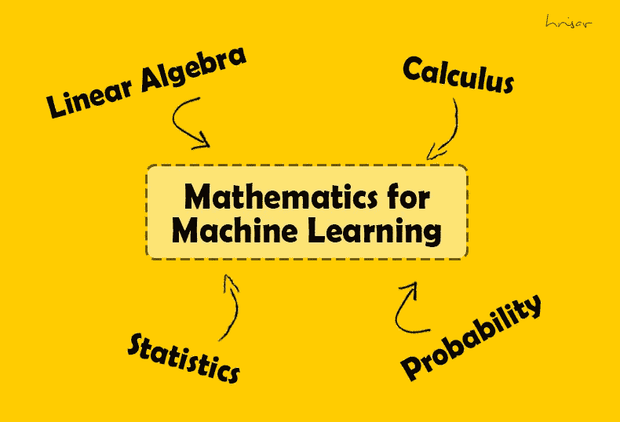

# 机器学习的数学路线图

> 原文：<https://medium.com/analytics-vidhya/roadmap-of-mathematics-for-machine-learning-48f23baa57?source=collection_archive---------0----------------------->

机器学习的数学涵盖了统计学、概率、多变量微积分、线性代数、离散数学、最优化等领域。这些是给任何初学者一个 kickstart 需要的主要问题。

我在研究生数据科学课程中遵循了这个路线图，它让我在准备 ML 面试时受益匪浅。

# 统计路线图

**1。统计基础知识**

*   数据类型:名义数据、顺序数据、离散数据、连续数据
*   描述性统计与推断性统计
*   朋友圈
*   平均值、中间值、众数
*   歪斜
*   峭度
*   IQR 山脉
*   百分位数，四分位数
*   平均偏差
*   标准偏差
*   差异
*   四分位偏差
*   标准误差

**2。图表**

*   频数分布表
*   折线图
*   条形图
*   柱状图
*   频数多边形
*   圆形分格统计图表
*   Ogives

**3。概率分布函数**

*   随机变量
*   多元随机变量
*   离散随机变量
*   连续随机变量
*   大数定律
*   预期
*   PMF——概率质量函数
*   概率密度函数
*   累积密度函数
*   二项分布
*   二项分布
*   几何分布
*   泊松分布
*   指数分布
*   均匀分布
*   高斯/正态分布
*   卡方分布
*   幂律分布
*   帕累托分布
*   博克斯-考克斯变换
*   对数正态分布
*   核密度估计
*   Q-Q 图

**4。概率**

*   基本概率
*   联合概率
*   条件概率
*   独立事件
*   互斥事件
*   贝叶斯定理

**5。测试/取样/总体**

*   抽样、样本均值和分布
*   中心极限定理
*   点估计，区间估计
*   置信区间
*   人口、人口平均数和分布
*   假设检验
*   p 值
*   人口比例
*   临界值
*   显著性水平
*   拒绝区域
*   第一类与第二类误差
*   一条尾巴对两条尾巴
*   z 检验
*   t 检验
*   方差分析
*   f 检验
*   卡方检验
*   蒙特 卡罗模拟
*   A/B 测试

**6。关系/回归**

*   因果关系
*   协方差
*   协方差矩阵
*   相互关系
*   散点图
*   皮尔逊相关系数
*   等级/ Spearman 相关系数
*   R2 分数
*   线性回归
*   内源性阿片样物质
*   要素分析
*   逻辑回归

# 线性代数路线图

**1。线性方程**

*   线性方程组
*   高斯消去法
*   梯形
*   线性组合
*   跨度
*   齐次线性系统
*   线性独立性
*   子空间
*   基础
*   仿射空间
*   线性转换

**2。矩阵**

*   矩阵变换
*   矩阵乘法
*   逆矩阵
*   矩阵的转置
*   矩阵的秩
*   对称矩阵
*   正交矩阵
*   伴随矩阵
*   退化阵
*   矩阵的行列式
*   矩阵的迹

**3。向量**

*   向量的分量
*   向量空间
*   向量的范数
*   长度和距离
*   欧几里得范数
*   曼哈顿标准
*   闵可夫斯基距离
*   纯量乘法
*   点积
*   内积
*   交叉乘积
*   正交性
*   标准正交的
*   旋转

**4。因式分解**

*   矩阵分解
*   卢分解
*   QR 分解
*   乔莱斯基分解
*   特征分解
*   特征值
*   特征向量
*   奇异值分解
*   主成分分析

# 微积分路线图

**1。微积分基础**

*   功能
*   派生物
*   最大最小值
*   产品和链规则差异
*   复合函数
*   偏导数
*   高阶导数
*   积分
*   限制
*   无穷级数求和

**2。优化器**

*   梯度下降
*   优化者
*   损失函数
*   泰勒级数
*   约束优化(拉格朗日乘数)
*   最优化中的牛顿法
*   凸规划

# **免费的 YouTube 资源:**

感谢 3Blue1Brown、可汗学院和 Josh Starmer 的 StatQuest。

感谢您阅读文章！如果你喜欢我的文章吗👏。我错过了什么重要的话题吗？请在评论中告诉我。我来更新！

请在[链接的](https://www.linkedin.com/in/hrisav/)上与我联系，以获取更多更新或与如何推进上述主题相关的任何帮助。