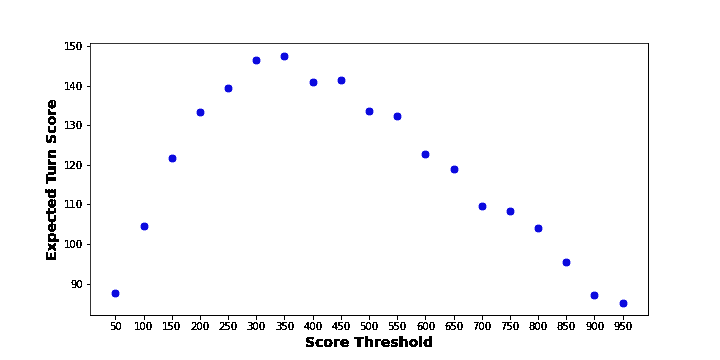
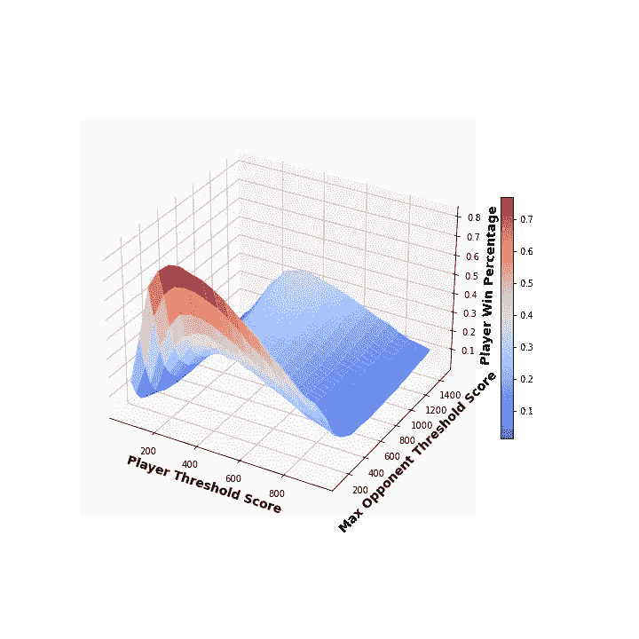

# 通过计算毁掉我朋友的游戏

> 原文：<https://medium.com/analytics-vidhya/ruining-my-friends-game-through-computation-c739d69f9237?source=collection_archive---------17----------------------->

# 介绍

不久前，我和一些家人和朋友出去玩，一个朋友建议我们玩他们所谓的“骰子”。

我是桌子上唯一一个从来没有玩过这个游戏的人，但是在一些快速的解释之后，我们开始玩，玩得很开心。

那天晚上我没有赢得任何比赛，但我确实花了一些时间试图制定一个获胜的策略。

第二天，我认为这个游戏足够简单，我可以毫不费力地编写它的主要功能。有了游戏的工作模型，我就可以运行一些模拟来尝试和确定是否存在获胜策略。

在这篇文章中，我将带你了解这个游戏是如何运作的，以及我是如何试图找到赢得游戏的策略的。

首先，规则如下:

## 得分

*   为了得分，你一次掷出三个骰子。我们称之为“滚动”。
*   1 值 100 分，5 值 50 分。
*   掷出三个一类的骰子面值的 100 倍。例如滚动三个 4 = 400 分。
*   掷三个一给 1000 分。

## 游戏性——融入游戏

*   每个人都开始“退出”游戏。
*   当你“退出”游戏时，你掷 3 次，例如掷 3 个骰子，3 次。
*   如果您在三次掷骰中得分超过 300 分，您将保留您的分数，并且您现在“参与”游戏。
*   如果你没有达到 300 分，你没有保留你的分数，你仍然是“出局”。
*   你试着在下一次转弯时进入。

## 游戏性——在游戏中

*   一旦你“进入”游戏，你就可以随心所欲地多掷或少掷。
*   你必须在每一次掷骰子时得分，例如掷出 1、5 或三个相同的点数，否则你的回合得分为零，你的回合结束。
*   在你的回合结束时，你把每一次掷骰的分数加起来，并把它加到你的总数中。

## 获胜的

*   要赢得比赛，你必须达到或超过设定的分数，例如 5000 分。
*   一旦一个玩家达到设定的分数，其他玩家还有一次机会来匹配第一个达到设定分数的玩家的分数。
*   如果一名或多名其他玩家达到客观分数，将进行一轮淘汰赛以确定获胜者。

## 最终注释

*   轮流按顺序进行。
*   如果你“出局”了，并且在一次掷骰子中没有得到任何分数，那么你的回合没有结束，你要继续掷骰子，直到你掷出三次。

## 示例游戏

玩家 X“出局”，掷出(1，2，4)，(5，5，3)和(6，4，3)。在这一轮，他们得到 200 分，(100 * 1 + 50*2)，但没有达到 300 分的门槛。他们这一轮得了 0 分，他们的回合结束了。

下一回合，玩家 Y“出局”，掷出(3，1，6)，(5，4，5)和(2，2，2)。在这一轮，他们得了 400 分，(100 * 1 + 50*2 + 2*100)。他们已经达到了 300 分的门槛，现在他们的总分是 400 分。他们的回合结束了。

下一回合，玩家 X 掷出(5，5，5)，(4，3，3)和(4，6，3)。在这一轮，他们得到 500 分(5*100)。他们已经达到了 300 分的门槛，现在他们的总分是 500 分。他们的回合结束了。

下一回合，玩家 Y 掷骰子(1，1，3)，决定结束他们的回合。他们在转牌圈得了 200 分(100*2)。他们将这 200 分加到他们当前的分数(400)上，现在总分是 600 分。

下一轮，玩家 X 掷骰子(3，3，3)，决定再掷一次。在下一次掷骰子时，他们掷出(6，3，4)。因为他们没有掷出任何得分组合，所以他们的回合得分为 0。他们将 0 分加到当前分数(500)上，总分数仍然是 500。他们的回合结束了。

# 密码

这里 可以找到代码所在的 Github 库 [**。在本文**中，我不会深入探究代码是如何工作的，除非**理解它如何影响最终结果很重要。**](https://github.com/calicorob/DiceGame)

# 分析

为了开始思考一个获胜的策略，我认为在每一个回合中可能有一个点，一旦你达到了某个回合分数或其他启发，你应该停止滚动并结束你的回合，以最大化你获胜的机会。

## 预期回合得分

首先，我探索了根据你每次尝试和目标的分数来看一个回合的期望分数。基本上，如果你继续掷骰子直到你得到 100、150、200 的回合分数，你的期望分数是多少？

对于每个分数阈值，我模拟了 10000 次转弯，取平均结果以得到预期的转弯分数。

图 1 显示了预期的回合得分结果:

图 1:不同转弯得分阈值的预期转弯得分

图 1 显示，当玩家继续滚动到 300 或 350 时，一个回合的期望得分最大。

## 模拟游戏

着眼于最大化一个回合的期望得分是一个很好的起点，我们可以测试这个策略在实际游戏中的表现。

为了做到这一点，我们将运行游戏模拟，改变玩家在每一回合掷出的阈值分数以及玩家对手的最大可能阈值分数。

以下是一些其他重要的参数和注意事项:

*   对于每个玩家的阈值分数，模拟了 10000 个游戏。
*   每场比赛有 6 名球员。
*   每个对手的阈值分数是随机选择的，介于 50 和最大可能阈值之间。例如，如果最大对手阈值分数是 200，则对手可能具有 50、100、150 或 200 的阈值分数。
*   每场比赛的客观分数是 5000。

图 2 示出了该玩家的对手的不同阈值分数和最大可能阈值分数的胜率:

查看图 2 可以发现，玩家在不同对手最大阈值分数下的胜率仍然在 300-350 之间。

随着对手的最大可能阈值分数降低，一直滚到 300 或 350 的玩家的胜率可以高于 70%！

# 讨论

我从观察我的朋友玩游戏中观察到，大多数人在结束他们的回合之前会掷出 150-300。这意味着一个精明的玩家可能会通过使用每回合 300/350 的滚动策略来最大化他们赢得的游戏。

关于代码，我要注意的一点是，我遗漏了一个关键的最终游戏功能。在我写的代码中，当玩家达到客观分数时，游戏立即结束，该玩家被宣布为赢家。在实际游戏中，其他玩家还有一次机会来匹配达到目标分数的玩家的分数。

我没有写这个，因为这会使代码有点复杂，而且我不相信它会对结果产生重大影响。一旦一个玩家达到目标分数，其他玩家的策略就被抛到了九霄云外，因为他们必须掷骰子，直到他们的分数与达到目标分数的玩家的分数相同。

# 结论

现在你明白了，似乎赢得我朋友的“掷骰子”游戏的最好方法是每轮都掷出 300 或 350 分。

对于我的下一篇文章，我正在考虑尝试训练一个人工智能来玩这个游戏，并观察它能想出什么策略。

感谢阅读！