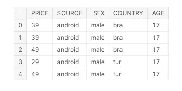
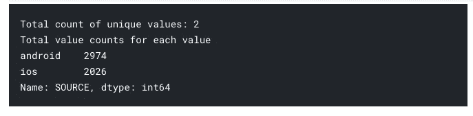

# 基于规则的无 ML 客户细分

> 原文：<https://medium.com/analytics-vidhya/rule-based-customer-segmentation-without-ml-6d194648813d?source=collection_archive---------3----------------------->

你好。如今我很兴奋。我加入了一个超级数据科学和机器学习[训练营](https://bootcamp.veribilimiokulu.com/egitim/veri-bilimci-yetistirme-programi/)，学到了很多新技术。我想和你分享我学到的东西。老实说，我们将在这个故事中涉及的例子不是我自己的，但我想向你解释“我们如何能没有 ml ”,因为我们知道下面的规则。

> 如果你想掌握某样东西，那就去教它。一个很好的学习方法是教书。
> 
> ——理查德·费曼。

在这个故事中，我将尝试解释我们如何在不使用任何机器学习技术的情况下进行客户细分。那么，我们该怎么做呢？我们将为每个客户群创建一个角色。创建他们的角色后，我们将预测目标角色的平均预期利润。


[斯科特·格雷厄姆](https://unsplash.com/@homajob?utm_source=unsplash&utm_medium=referral&utm_content=creditCopyText)在 [Unsplash](https://unsplash.com/s/photos/data-analysis?utm_source=unsplash&utm_medium=referral&utm_content=creditCopyText) 上拍照

# 介绍

在这个故事中，我们将使用[这个](https://www.kaggle.com/merate/persona-data)数据集。我已经为这个故事创建了一个 Kaggle 笔记本，但我没有在笔记本上解释我们做了什么。因为我更喜欢在媒体上解释我们做了什么。你可以从[这里](https://www.kaggle.com/enesbaysan/rule-based-customer-segmentation-without-ml)进入笔记本。

# 让我们从探索数据开始

在 Kaggle 中，我已经加载了数据集。我在下面编写并执行了将数据加载到变量的代码。

```
import pandas as pddf = pd.read_csv('../input/persona-data/persona.csv')df.head()
```



我将在`df`数据帧上使用`info`方法。它将返回数据框的列类型和条目数。

```
df.info()
```


此时，我们需要了解什么是列。它们的含义是什么？

*   价格=客户支付的金额
*   来源=客户设备类型
*   性别=客户性别
*   国家=客户国家
*   年龄=客户年龄

在我们进行细分之前，我将回答一些问题，以便进行分析思考。为此，我将定义一个函数来帮助我描述列。

```
def get_col_summary(df, col):
    print(f"Total count of unique values: **{**df[col].nunique()**}**")
    print(f"Total value counts for each value**\n{**df[col].value_counts()**}**")
```

上面的函数将给出该列唯一值的总计数，以及每个唯一值的计数。

这里是第一个问题，*有多少个唯一价格，每个唯一价格有多少笔交易？*

```
get_col_summary(df,'PRICE')
```


*有多少个唯一来源及其唯一交易计数？*

```
get_col_summary(df,'SOURCE')
```



*有多少个唯一的国家及其唯一的交易计数？*

```
get_col_summary(df,'COUNTRY')
```


*每个国家总交易的平均价格是多少？*

```
df.groupby('COUNTRY').agg({'PRICE':[('mean per country','mean')]})
```


如果我们愿意，我们可以加强问题。我想现在够了。

# 逐步创建人物角色

我将根据客户的所有特征对他们进行分组，并将他们分配给`agg_df`变量。

```
agg_df = df.groupby(['COUNTRY', 'SOURCE', 'SEX', 'AGE'],as_index=False).agg({'PRICE':'mean'}).sort_values('PRICE', ascending=False)agg_df.head()
```

在这种情况下，我得到了每个类别的平均利润。


# 创建年龄类别

我们将创建年龄类别作为细分的第一步。我会把顾客分成不同的年龄段。为此，我将使用`cut`函数。你可以从[这里](https://www.geeksforgeeks.org/pandas-cut-method-in-python/#:~:text=Pandas%20cut()%20function%20is,statistical%20analysis%20on%20scalar%20data.&text=Parameters%3A,input%20array%20to%20be%20binned.)获得更多关于使用该功能的信息。

```
agg_df.loc[:, 'AGE_CAT'] = pd.cut(agg_df['AGE'], [0, 18, 23, 30, 41, 70], labels=['0_18', '19_23', '24_30', '31_40', '41_70'])agg_df.head()
```

我在上面为每个顾客设置了年龄类别。为此，我使用了 0-18 岁、19-23 岁等年龄范围。有一点很重要。正如我们在第 167 索引上看到的，`cut`函数包括左极限但不包括右极限。例如，24 介于 23 和 30 之间，但类别从 24 开始，最大值为 29。


# 创建人物角色

现在，我们将为每个用户创建角色。为此，我们将使用来自`agg_df`的所有分类特征。我们将以下所有分类特征串联起来。为此我使用了`apply`函数。

```
agg_df.loc[:, 'customers_level_based'] = agg_df.apply(
    lambda x: f"**{**x['COUNTRY'].upper()**}**_**{**x['SOURCE'].upper()**}**_**{**x['SEX'].upper()**}**_**{**x['AGE_CAT'].upper()**}**", axis=1)agg_df.head()
```


现在我需要计算每个角色的平均利润。因为我们可能有重复的角色。比如说；33 岁的巴西男性 android 用户客户和 38 岁的巴西男性 android 用户客户将拥有相同的角色。在这种情况下，我们需要计算`BRA_ANDROID_MALE_31_40`人物角色的平均利润。

如果我使用`customers_level_based`特征对数据帧进行分组并计算平均值，我可以得到我们想要的。

```
level_df = agg_df[['customers_level_based', 'PRICE']].groupby('customers_level_based',as_index=False).mean()
```

我计算了新的数据帧，并将其赋给了`level_df`变量。

```
level_df.head()
```


# 为人物角色创建细分市场

现在，我将为每个角色创建细分市场。为此，我将使用`qcut`功能。你可以从[这里](https://www.geeksforgeeks.org/how-to-use-pandas-cut-and-qcut/)获得关于该功能的更多信息。作为一个简单的解释，它对数据进行排序，然后通过使用`q` arg 计算分位数，并在`labels` arg 之后给出标签。还有很重要的一点。我们应该按降序排列标签。

```
level_df.loc[:, 'SEGMENT'] = pd.qcut(level_df['PRICE'], 4, labels=['D', 'C', 'B', 'A'])level_df.head()
```


我们为每个客户角色设定了细分市场。

# 通过使用人物角色，新用户的预期利润

我将创建两个新角色。在这种情况下，我没有创造一个真正的新角色。我想象我有两个新客户，他们的角色是这样的。

```
new_user = 'TUR_ANDROID_FEMALE_31_40'new_user2 = 'FRA_IOS_FEMALE_31_40'
```

如果我使用带有这些变量的`customers_level_based`列来过滤数据框架，我可以得到它们的预期利润。


您可以访问下面的笔记本。

[](https://www.kaggle.com/enesbaysan/rule-based-customer-segmentation-without-ml) [## 基于规则的无 ML 客户细分

### 使用 Kaggle 笔记本探索和运行机器学习代码|使用来自角色数据的数据

www.kaggle.com](https://www.kaggle.com/enesbaysan/rule-based-customer-segmentation-without-ml) 

希望你喜欢这个。

亲切的问候。