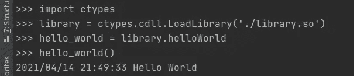
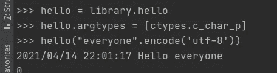
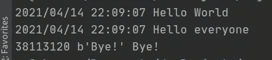
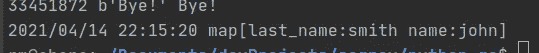

# 从 Python 运行 Go 代码

> 原文：<https://medium.com/analytics-vidhya/running-go-code-from-python-a65b3ae34a2d?source=collection_archive---------0----------------------->

Python 是一种伟大的语言，可以被新开发人员轻松掌握，并在很短的时间内变得富有成效，它的设计是干净的代码，它有一百万个可用的库，可悲的是，所有这些好处都是以所谓的“速度”为代价的，python 很慢，非常慢；pypy 或 stackless 有时有助于提高性能，但有时它们会破坏其他不兼容的库，或者在我们的特定用例中没有任何改进。

您总是可以选择用 C 语言构建一个库并导入它，但是对于某些人来说，C 语言最终可能会成为一种非常复杂的语言，或者用 C 语言构建某些东西所需的时间可能会抵消移植代码的好处。

幸运的是，有一个中间地带我们可以使用:Go，比 C 更容易(如果你做并行的话会更好)但比 Python 更快，它也有很多可用的库，这些库将为我们提供很多 C 中可能没有的特性。

GO 有一个名为 CGO([https://golang.org/cmd/cgo/](https://golang.org/cmd/cgo/))的包，它允许我们连接 Go 和 C 语言，反之亦然，因为 Python 可以导入 C 语言的库，我们可以导出某些 Go 函数供 Python 使用，就好像它们是 C 语言的库一样。

让我们首先创建一个*库. go* 文件，并添加以下内容:

```
package main

import (
   "C"
   "log"
)

//***export*** helloWorld
func helloWorld(){
   log.Println("Hello World")
}

func main(){

}
```

CGO 添加了“C”导入，这将为我们提供某些实用函数，它将使编译器将某些注释视为特殊操作，第一个是“导出”注释，它将告诉编译器哪些函数将被导出以从 Python 调用，然后我们像往常一样创建我们的函数，然后为了能够编译，我们将在最后添加一个空的 main 函数。

给**额外的**注意*导出*就在注释的旁边，如果你在中间添加一个空格，它不会被认为是一个导出的符号，python 也不会找到它。

在 CLI 上，我们现在将通过运行以下命令来执行编译:

```
go build -buildmode=c-shared -o library.so library.go
```

这里要注意的关键是构建模式，我们将指定它是一个 C 共享对象，然后输出扩展将是一个库。so =我的共享对象，因为我正在使用 Linux)，一旦我们编译了库，我们将继续用 python 构建客户端，为此我创建了一个“app.py ”,如下所示:

```
import ctypes
library = ctypes.cdll.LoadLibrary('./library.so')
hello_world = library.helloWorld
hello_world()
```

我们导入 *ctypes* 模块，然后在我们编译的库上执行 *LoadLibrary* ，第三行将有一个 *hello_world* ，它是 python 对象，将引用库的 *helloWorld* 函数，在这种情况下，命名约定将提示我们哪个是 Go 版本，哪个是 Python 的，最后在第 4 行，我们将调用该函数并接收类似于以下的输出:



Go 的日志格式用来打招呼

如果我们想从 Python 发送一个参数，我们需要做一些调整，为此我们将在 library.go 文件上创建一个新函数:

```
//***export*** hello
func hello(namePtr *C.char){
   name := C.GoString(namePtr)
   log.Println("Hello", name)
}
```

你会注意到的第一件事是参数，这是一个指向 C 字符的指针，这意味着我们将接收一个“字符串”作为参数，因为 C 处理字符串(字符数组)的方式，我们需要做一个微小的调整，然后才能在我们期望的时候使用它，因为我们有一个方便的方法叫 C.GoString，它将接收指向 C.char 的指针并返回字符串的值。

一旦我们有了这些，我们将切换到 python 并为此函数创建一个新的符号:

```
hello = library.hello
hello.argtypes = [ctypes.c_char_p]
hello("everyone".encode('utf-8'))
```

第一行将只是对 Go 函数的引用，然后我们将指定我们将发送的“参数”的类型，在本例中:c 字符指针的列表，最后我们将发送一个编码为 utf-8 的字符串，以便类型匹配。



到目前为止，我们可以从 Python 进行调用并从 Python 发送数据，我们还需要一件额外的事情，那就是将数据从 Go 发送回 Python。

为此，我们将创建一个新的 Go 函数:

```
//***export*** farewell
func farewell() *C.char{
   return C.CString("Bye!")
}
```

这次我们将返回一个指向 C.char 的指针，字符串需要通过 C 包从 string 转换成 CString。

从 python 的角度看:

```
farewell = library.farewell
farewell.restype = ctypes.c_void_p

# this is a pointer to our string
farewell_output = farewell()

# we dereference the pointer to a byte array
farewell_bytes = ctypes.string_at(farewell_output)

# convert our byte array to a string
farewell_string = farewell_bytes.decode('utf-8')  

print(farewell_output, farewell_bytes, farewell_string)
```

这将给我们带来这样的东西:



前两行是通过 Go，最后一行是通过 Python

然后我们可以扩展到更复杂的东西，使用 JSON 作为我们在两个世界之间发送数据的方式，在 library.go 上我们添加了另一个函数:

```
//***export*** fromJSON
func fromJSON(documentPtr *C.char){
   documentString := C.GoString(documentPtr)
   var jsonDocument map[string]interface{}
   err := json.Unmarshal([]byte(documentString), &jsonDocument)
   if err != nil{
      log.Fatal(err)
   }
   log.Println(jsonDocument)
}
```

这一个将以和以前一样的方式接收一个字符串，但是我们将把它当作一个 JSON 字符串，并把它加载到一个 string-interface 的映射中(实际上可以是任何东西……)。

然后在 python 上:

```
import json
from_json = library.fromJSON
from_json.argtypes = [ctypes.c_char_p]
document = {
    "name": "john",
    "last_name": "smith"
}
from_json(json.dumps(document).encode('utf-8'))
```

我们将一个字典转储到一个 JSON 字符串，并将其发送给我们的新函数，其输出将是:



现在，您可以开始从 Python 移植您的缓慢/瓶颈代码，以获得两个世界的最佳效果，并获得 Pythonical Gopherista 的称号。

如果在复制/粘贴示例的过程中丢失了一些东西，完整的 library.go 文件:

```
package main

import (
   "C"
   "encoding/json"
   "log"
)

//***export*** helloWorld
func helloWorld(){
   log.Println("Hello World")
}

//***export*** hello
func hello(namePtr *C.char){
   name := C.GoString(namePtr)
   log.Println("Hello", name)
}

//***export*** farewell
func farewell() *C.char{
   return C.CString("Bye!")
}

//***export*** fromJSON
func fromJSON(documentPtr *C.char){
   documentString := C.GoString(documentPtr)
   var jsonDocument map[string]interface{}
   err := json.Unmarshal([]byte(documentString), &jsonDocument)
   if err != nil{
      log.Fatal(err)
   }
   log.Println(jsonDocument)
}

func main(){

}
```

app.py 文件:

```
import ctypes
library = ctypes.cdll.LoadLibrary('./library.so')
hello_world = library.helloWorld
hello_world()

hello = library.hello
hello.argtypes = [ctypes.c_char_p]
hello("everyone".encode('utf-8'))

farewell = library.farewell
farewell.restype = ctypes.c_void_p

# this is a pointer to our string
farewell_output = farewell()

# we dereference the pointer to a byte array
farewell_bytes = ctypes.string_at(farewell_output)

# convert our byte array to a string
farewell_string = farewell_bytes.decode('utf-8')
print(farewell_output, farewell_bytes, farewell_string)

import json
from_json = library.fromJSON
from_json.argtypes = [ctypes.c_char_p]
document = {
    "name": "john",
    "last_name": "smith"
}
from_json(json.dumps(document).encode('utf-8'))
```

和我的 Makefile:

```
build:
   go build -buildmode=c-shared -o library.so library.go
```

🐸