# 在亚马逊 EC2 上运行 Spark、Jupyter 笔记本

> 原文：<https://medium.com/analytics-vidhya/running-spark-jupyter-notebook-on-amazon-ec2-c6b5efe0a4e9?source=collection_archive---------3----------------------->

人们经常面临使用 Amazon Web Services 创建 Amazon EC2 实例并将其用于数据科学领域的困难。
本文将一步步讲述如何在亚马逊 EC2 上安装 Spark 并运行 Jupyter Notebook。

1.  **创建亚马逊 EC2 实例**

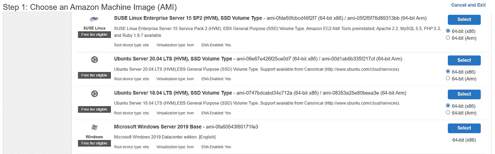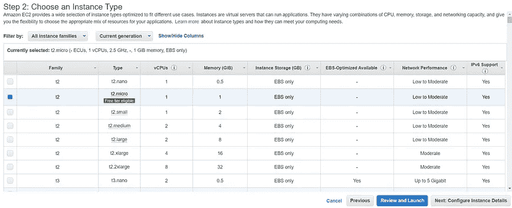

AWS 屏幕截图(步骤 1、2)(默认配置)

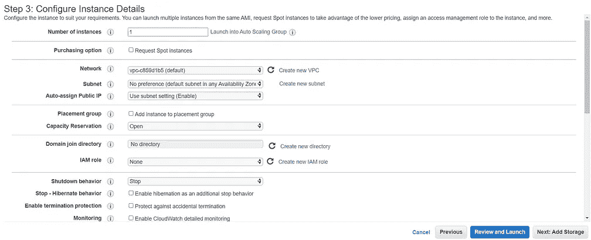

AWS 屏幕截图(步骤 3、4)(默认配置)

在步骤 5 中，我们需要添加一个标签。标签使我们能够对 AWS 资源进行不同的分类，例如，根据目的、所有者等。当我们有许多相同类型的资源时，添加标签是很有用的，然后我们可以根据我们分配的标签快速识别特定的资源。

我们可以在标签中提供任何键和值。在这里，我给出了 Key = " *spark* 和 value = " *sparkmachine* 。

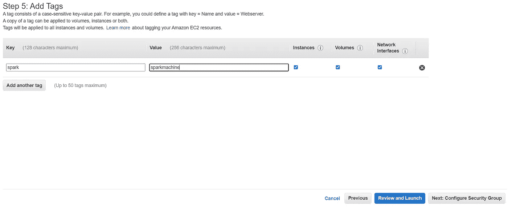

AWS 屏幕截图(步骤 5)(添加标签)

在步骤 6 中，我们需要配置安全组。
我们可以将此安全类型更改为“*所有流量*”，使我们能够允许来自 TCP、SSH、UDP 等所有协议的所有流量。
它的安全性很低，但是因为我们只使用这个实例，所以它完全没问题！

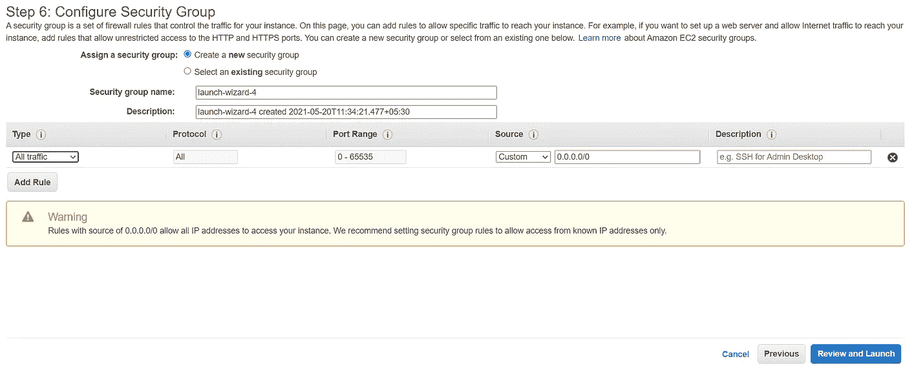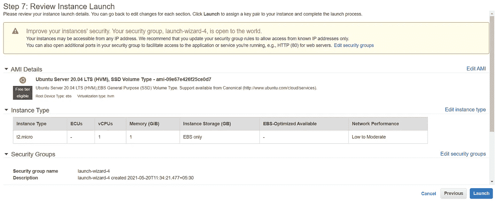

AWS 屏幕截图(步骤 7)(查看实例启动)

只要我们单击 launch，就会有一个对话框告诉我们创建一个密钥对。点击下拉菜单，选择“*创建新的密钥对*，并提供密钥对名称，点击“*下载密钥对*”。
答*。pem* "扩展文件将被下载。我们需要安全地保存它，因为这个密钥对文件将用于身份验证，然后使用 SSH 帮助连接到 Amazon EC2 实例。

点击“*启动实例*”，实例将被创建。

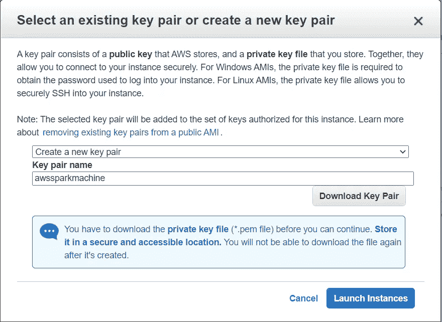

在这里，我们可以看到有一个实例正在运行。单击它可以获得公共 IP、公共 DNS 以及关于我们创建的 Amazon EC2 实例的更多详细信息。

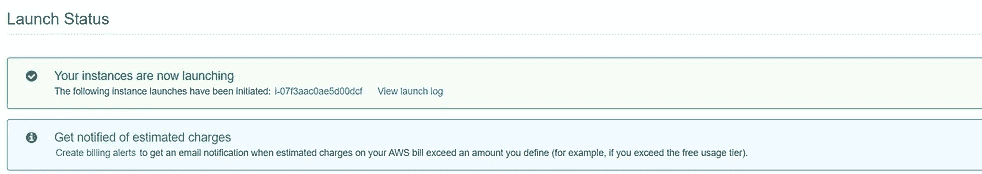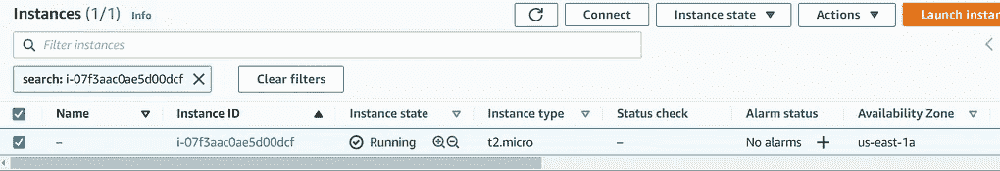

因此，我们已经成功地创建了 Amazon EC2 实例！

2.**使用 SSH 连接到 Amazon EC2**

在 windows 中，我们需要下载并安装 [Putty](https://www.putty.org/) 软件来建立与 Unix 机器的 SSH 连接。

**Putty** 需要一个扩展名为“*的私钥。ppk* "但是从亚马逊 EC2 实例，我们下载了"*。pem* 扩展文件。要转换成 Putty 所需的格式，我们将使用预装 Putty 的 **Puttygen** 软件来完成。

要执行转换，加载“*”。pem* "创建 EC2 实例时下载的扩展文件。该文件将被加载到 Putty Key Generator 中，点击“*保存私有 ke* y”选项，该文件将被保存在“*中。ppk* 扩展名。

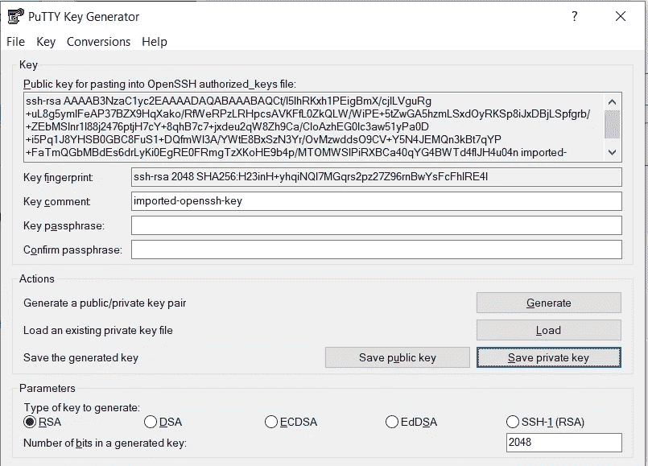

现在打开 Putty，让我们连接到 Amazon EC2 实例。

在“*会话*选项下的“*主机名(或 IP 地址)*”文本框中，传递值为 **ubuntu@【公共 DNS】**。
这里的“ *ubuntu* ”是 Amazon EC2 实例的默认用户名，后跟@然后从我们正在运行的 Amazon EC2 实例复制公共 DNS 并粘贴到这里。

接下来，转到左侧窗格中的“ *SSH* ”选项，并为“ *Auth* ”选项打开它。Auth 选项需要一个私钥进行身份验证。单击 browse 并搜索 Putty 生成的私钥文件(。ppk ),我们刚刚使用 Putty 密钥生成器转换了它。

最后，单击 Open，它将开始连接到 Amazon EC2 实例。会出现一个对话框，点击“*接受*，我们就会连接到 Amazon EC2 实例。

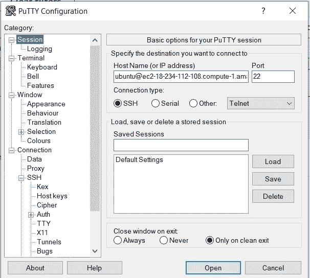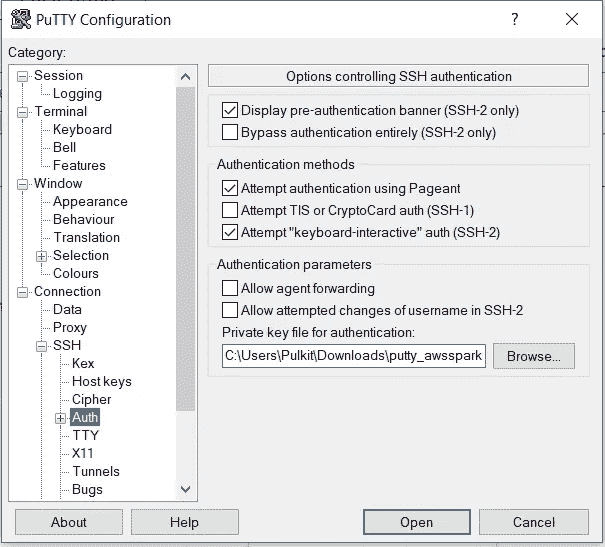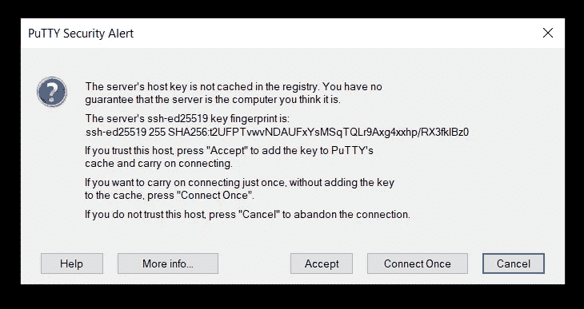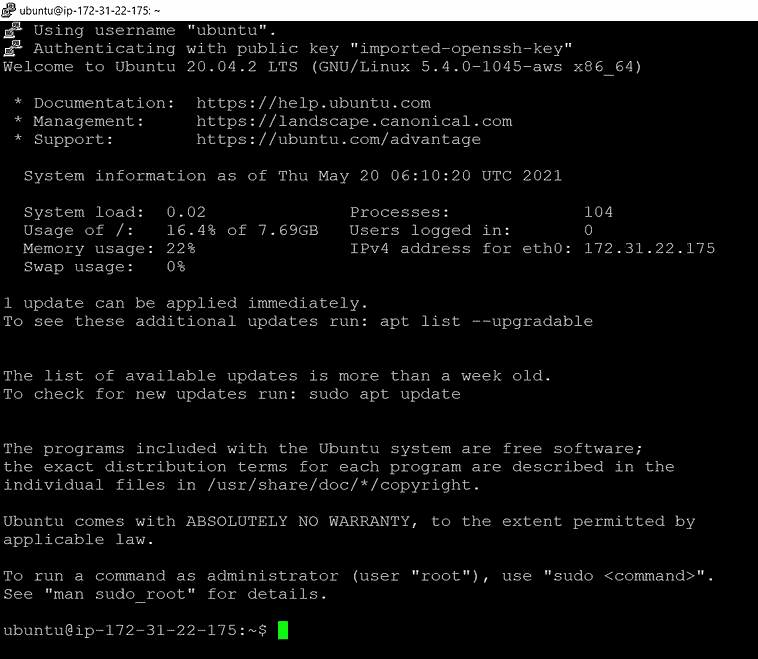

Putty 截图

3.**设置 Amazon EC2 运行 Jupyter Notebook**

要运行 jupyter 笔记本，我们首先需要在 EC2 机器上安装 Anaconda 平台。我们可以从他们的[库](https://repo.anaconda.com/archive/)下载 Anaconda。

要在 Linux 上下载该文件，使用" *wget* "命令，然后传递我们想要下载的 Anaconda 存储库文件的链接。

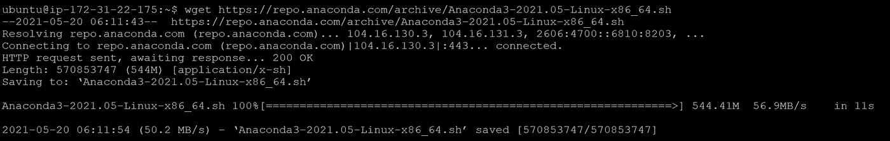

要安装 Anaconda，使用“ *bash* ”命令，后跟文件名。按 enter，安装过程会在需要再次按继续的地方开始，然后会打开一个协议；按回车键直到协议结束。键入“ *yes* 接受协议，并再次按 enter 键确认在默认位置安装 Anaconda 的位置。

在这整个过程之后，Anaconda 平台将被安装。

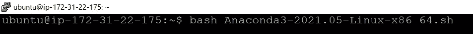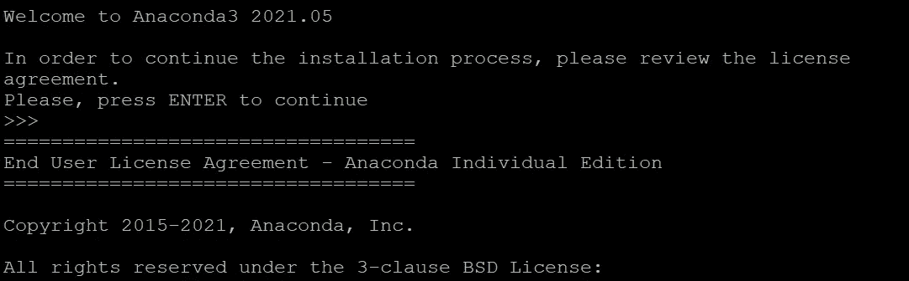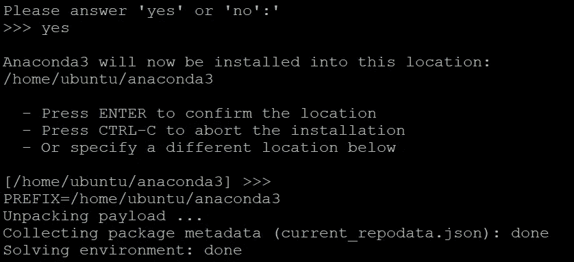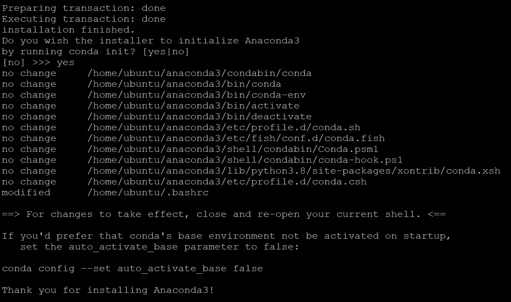

现在我们需要运行 Python 或 Anaconda 软件，而不是预装的 ubuntu OS。为此，请键入" *source。bashrc* ，它将告诉 Python 从 Anaconda 工作。
我们可以使用“*哪个 python* ”命令来检查它，让我们知道系统正在使用哪个 python。

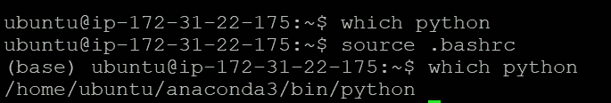

现在我们需要为我们的连接创建 SSL 证书。为此，创建一个任意名称的目录。在这里，我取得了*证书*，然后将目录更改为新创建的目录。
使用下面的命令，将创建一个 SSL 证书，该证书的名称为“ *cert.pem* ”。如果需要，我们可以更改证书名称。

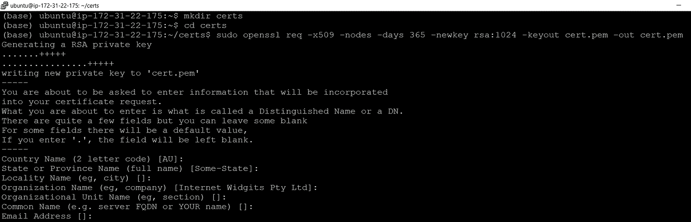

在此之后，我们将把证书的权限(所有者)更改为与我们合作的用户，以避免权限问题。

接下来，我们需要创建 **Jupyter 笔记本配置文件**。我们将使用 nano 文本编辑器编辑它，对 Jupyter 笔记本配置文件进行一些更改，以便直接从全球任何 web 浏览器运行。

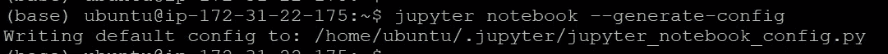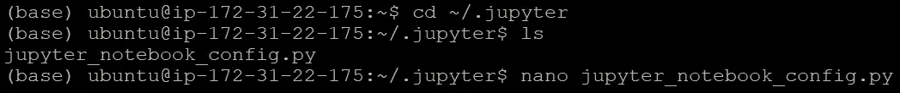

仅在开始时传递 Jupyter 笔记本配置文件中的以下行。

**c=get_config() —** 帮助我们为配置创建一个对象。

**c = notebook app . certfile = u '/home/Ubuntu/certs/cert . PEM '**—这里我们传递 SSL 证书。它将证书路径作为参数的值。

**c = NotebookApp.ip = '*'** —它以*为 ip，意思是我们可以使用任何 IP 地址访问笔记本

**c . Notebook app . open _ browser = False**—它告诉 Jupyter notebook 在运行 Jupyter Notebook 命令后不要打开浏览器。我们将在本地机器上打开它，而不是在 AWS EC2 机器上。

c . Notebook app . port = 8888—Jupyter 笔记本将在 8888 端口上运行

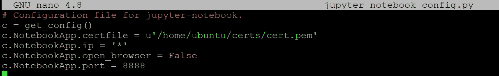

保存并退出文件。现在我们可以运行朱庇特笔记本了。
为此，在终端中键入“ *jupyter notebook* ”，jupyter notebook 将开始运行。

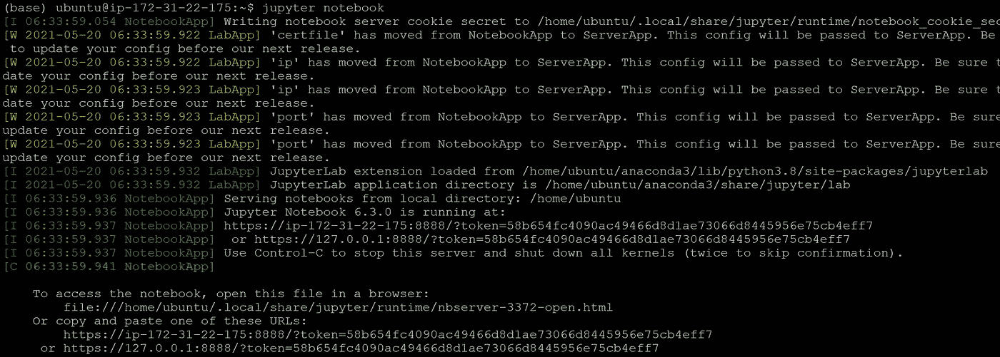

复制 IP 地址和令牌，并将其粘贴到本地机器的 web 浏览器中。

不要用[**https://【ip】:8888**](https://[ip]:8888)，把这个【IP】改成我们从亚马逊 EC2 机器上得到的公共 DNS。

按回车键，Jupyter 笔记本就会打开。

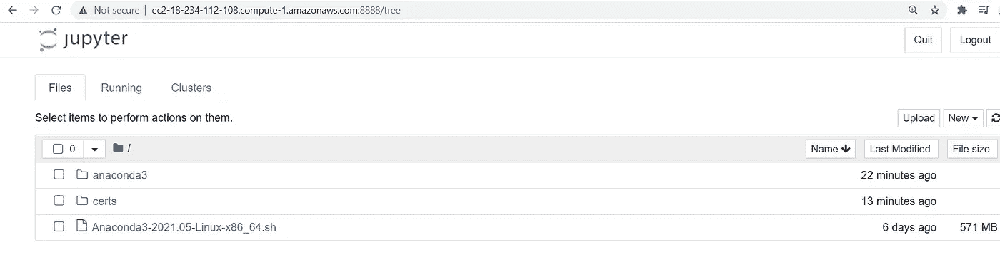

祝贺您，我们已经成功地开始直接从我们的亚马逊 EC2 机器上运行 Jupyter 笔记本！

**4。设置 Amazon EC2 运行 Spark**

在我们开始之前，让我们用新的软件包来更新我们的软件包列表。要做到这一点，运行“ *sudo apt update* ”，它会让我们的操作系统用 ubuntu 库的包列表更新它的包列表

**我们知道 Spark 运行在 Scala 上，Scala 运行在 Java 之上。**

所以首先，我们将安装 **Java** ，然后使用下面的命令安装 **Scala** 。

Java 语言（一种计算机语言，尤用于创建网站）

斯卡拉

现在我们将安装 **py4j** ，它有助于将 Python 连接到 Java。但是在那之前，我们需要告诉 pip 为 Anaconda 工作，而不是默认的 ubuntu。为了做到这一点，我们需要设置到 Anaconda 的路径，然后使用 conda 安装 pip。

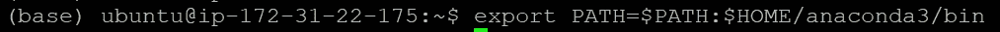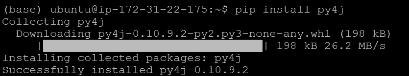

安装 py4j

现在所有需要的东西都安装好了，我们将从他们的存储库中下载 Spark 并安装它。我们可以从他们的官方[库](https://archive.apache.org/dist/spark/)下载 Spark。

根据需要选择版本。在这里我安装的是最新版本， **Spark 3.1.1** (文章发表时间)，带 **Hadoop 版本 3.2**

使用“ *wget* ”命令下载文件，命令后接资源库的链接。

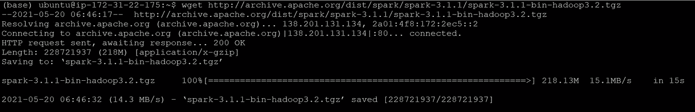

使用下面截图中给出的 tar 命令提取压缩文件。Spark 目录将被提取并准备好使用。

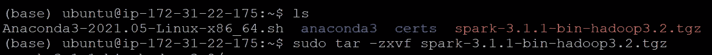

除了这些包，我们还将使用 pip 安装 **findspark** 包。
**Findspark** 免去了为 spark 在 Jupyter 笔记本上运行创建环境变量的麻烦

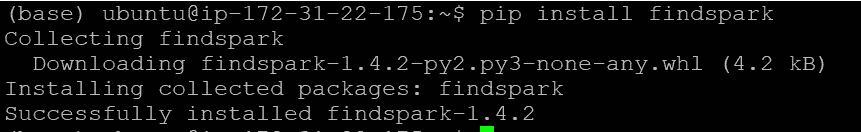

现在我们准备在 Amazon EC2 中使用 Spark。

要运行 spark，首先导入 Findspark 并用提取的 Spark 目录的路径初始化它。
之后，我们只需要**导入 Pyspark** ，恭喜你，我们已经在我们的亚马逊 EC2 机器上成功运行 spark 了。

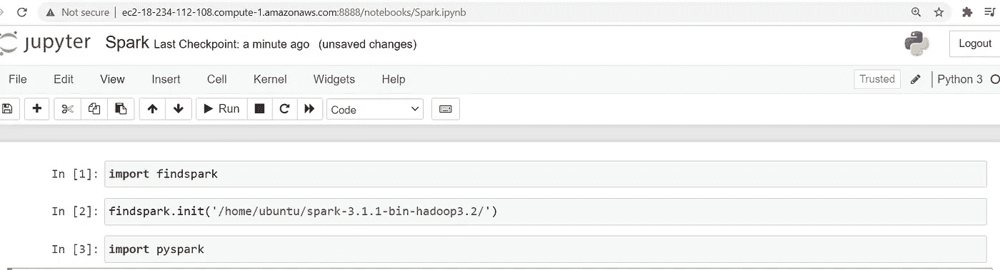

我们在帖子的最后来了，我希望你明白如何在亚马逊 EC2 上安装 Spark 和运行 Jupyter Notebook。

快乐学习！