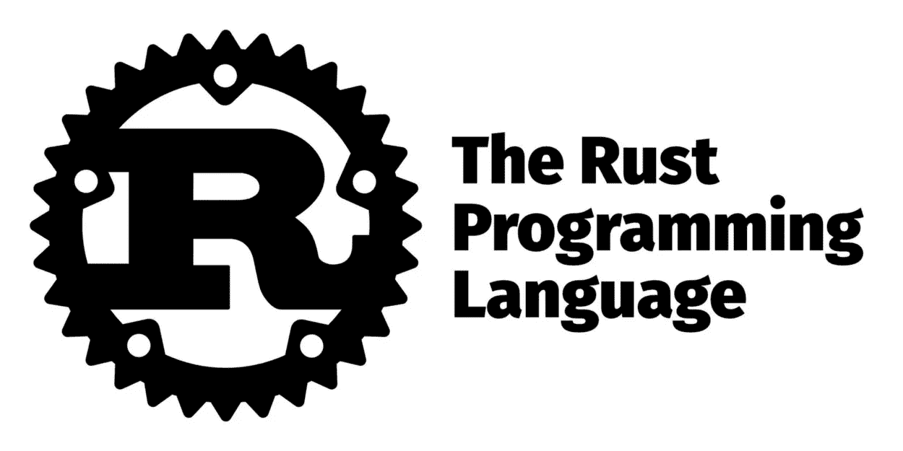

# Rust Adventures:系列介绍— String

> 原文：<https://medium.com/analytics-vidhya/rust-adventures-introduction-to-collections-string-7d8c6a7ab88f?source=collection_archive---------6----------------------->

嗨，伙计们！

我们回到了系列的最后一部分，这一次我们谈论的是字符串！

是的，你没看错。在 Rust 中，字符串是集合家族的一部分。

让我们开始吧。

## 什么是字符串？