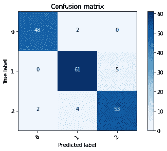

# 锈病:非洲小麦植株中的锈病鉴定

> 原文：<https://medium.com/analytics-vidhya/rustid-rust-identification-in-african-wheat-plants-7243936e1129?source=collection_archive---------21----------------------->

小麦叶锈病是一种毁灭性的疾病，影响着数百万非洲农民的农作物。及早发现这种植物疾病每年可以节省数吨农产品。这不仅有利于减少饥饿人口，也有利于农民，确保他们获得应得的收成。我的好朋友 Rohan Rajpal、T2、Tejas Oberoi 和我致力于解决这个问题，并参加了 ICLR 研讨会挑战 1:CGIAR 2020 年农作物疾病计算机视觉。**我们在 847 个参与团队中排名第 39 位，我们的模型实现了 0.265 的竞争对数损失。**

为了应对这一挑战，我们提出了一种深度学习算法，该算法给定植物的图像，对植物是否健康、是否患有茎锈病或是否患有叶锈病进行分类。我们探索了各种最先进的模型，并提出了我们自己的改进的 DenseNet 模型。我们的实验探索了我们的模型在各种烧蚀下的性能。

完整报告可在此处获得—[https://drive . Google . com/file/d/1 xbdbyw 164 tbqa 0 GD 8 RF vv1 zgshezib7q/view](https://drive.google.com/file/d/1xbDBYw164tbQa0gD8RFvv1zGshEzIb7q/view)

# **问题陈述**

该挑战的目标是建立一个深度学习算法，以正确分类小麦植物是健康的、有茎锈病还是有叶锈病。可能是这样的情况，一些图像既有茎锈病又有叶锈病。目标是根据图像中小麦锈病的主要类型对图像进行分类。在图 1 中可以看到这三个类别的样本图像。

描述(I)茎锈病感染的(ii)叶锈病感染的(iii)健康小麦植物的样本图像

# 资料组

**分配**

训练集中有 876 个图像，测试集中有 610 个图像。我们对原始训练集进行了分层随机采样，训练值分割为 80:20，以获得由 700 幅图像组成的新训练集和由 176 幅图像组成的验证集。

**分析**

通道值的分布

分析了图像的 RGB 通道值(参见上图)。发现通道值具有以 106 为中心的大致正态分布。最大通道激活为 255。这意味着平均通道值小于最大值的一半，这表明大多数时间通道的激活程度很低。

平均值与颜色通道图

上图显示了平均值与颜色通道的统计数据。方框下端表示 q1，中间线表示中位数，方框上端表示 q3。Q1 是数据下半部分的中间值，Q3 是数据上半部分的中间值。绿色是最明显的通道，中值为 122，其次是红色，中值为 114.5，蓝色为 81.5。

# 方法学

**设计选择**

因为我们为训练集提供了正确的标签，所以我们把这个问题作为一个监督学习问题来处理。我们的目标是构建一个端到端的深度学习模型，该模型提供小麦植株在其茎或叶上生锈的概率。我们通过
1 来处理
这个问题。我们在整个 DL 课程中学到的培训架构，如 ResNet、DenseNet 等。通用培训范例。
2。探索不在我们课程材料中的艺术状态(EfficentNet)。
3。用不同的训练范例探索不同的架构。

模型选择策略如下进行。首先，使用一组默认范例，我们训练了 3.3.4 节中提到的模型。根据我们为其训练模型的训练范例，我们从中选择了最佳模型。
2。接下来，在选定的模型上进行各种消融。

我们做了以下实验-

架构— ResNet、SE-ResNeXt、DenseNet、EfficientNet

增强——垂直和水平翻转(随机图像在数据集中被
垂直和水平翻转)、Augmix、mix、Cutmix。

优化者—亚当、R-亚当、护林员

**测试时间增加**

我们还采用了测试时间增强(TTA)，其目的是对测试图像进行随机修改。我们将多次向模型显示增强图像，而不是只向训练过的模型显示一次常规的“干净”图像。我们将平均所有相应预测的预测，然后平均每个 cor-
响应图像的预测，并将其作为我们的最终猜测。

**评估**

**训练程序**
首先，为了准备验证集，我们分层分割训练集并执行 5 重交叉验证。接下来，在我们的模型管道中，图像被随机地垂直、水平或 90 度翻转。我们还通过使用余弦退火来改变我们的学习速率。在余弦退火中，最初学习速率保持较高。当模型接近局部最小值时，学习率相应地降低。对于所有模型，我们使用预训练的权重(在 ImageNet 上训练)初始化模型。我们使用的最大学习率为 0.001，最小学习率为 0.00002。

# 结果

**最佳模特**

DenseNet-201 的体系结构在 CGIAR 数据集上提供了最佳性能。在典型的 DenseNet-201 架构中，我们添加了批量标准化层和一个丢弃层。

DenseNet-201 架构产生了最佳性能。修改包括在每个卷积层块后增加一个批量归一化层和一个 0.5 的丢弃层[参见图 5]。其次，我们用 0.001 的最大学习率训练前三个块，用 0.00002 的学习率训练后两个块。我们这样做的理由是，对于我们的数据集来说，较低级别的特征更加精细，这种变化可能会反映在较高级别的特征本身中。因此，需要较低的学习速率来微调较高级的特征。我们试验了上面提到的增强和优化。我们观察到，在β1 = 0.999 和β2 = 0.9 的默认设置下，Adam 优化器的性能优于 R-Adam。最好的改性 DenseNet-201 在 0.265 处产生对数损失(参见下表)。表 2 列出了与其他基线一起获得的最终结果。我们使用改进的 DenseNet-201 架构击败了最先进的 efficient net-B6。尽管需要注意的是，EfficientNet 并不是为这一特定任务而设计的。

改良 DenseNet-201 的损失图，验证损失在 20 个时期后趋于稳定。

所有基准测试集和修改后的 DenseNet-201 模型的综合性能。

**分类分离**

验证样本特征的 TSNE 可视化，描述验证样本的可分离性。红色、蓝色和绿色分别代表健康的小麦、叶锈病和茎锈病。

我们还在验证集上可视化了我们的模型所获得的特征，如上图所示。我们的结论是，我们的模型可以有效地将样本分为上述类别。

**班级表现**

我们检验了类的 wise 性能，发现健康小麦类是最好的分类类，其次是叶锈病和茎锈病。我们在验证集上获得了 92.57%的总体准确率。

不同班级的表现。(精确度以百分比表示)

最终改进的 DenseNet-201 架构的混淆矩阵。0、1 和 2 分别代表健康小麦、叶锈病和茎锈病类别。该模型最好地识别健康的植物。

# **消融**

1.  **分层分割增加了损失:**在应用分层分割制作验证集时，我们观察到测试集的对数损失增加了 0.23。这可能是因为测试集本身是不平衡的。或者，我们的模型可能更擅长学习一个类。
2.  **过采样增加了损失:**过采样健康小麦类极大地增加了测试和验证集的对数损失，尽管它减少了训练损失，这表明向
    模型添加许多副本可能会导致过拟合。
3.  **余弦退火的效果:**余弦退火略微提高了性能，降低了 0.07 的损耗。
4.  **垂直翻转实际上减少了对数损失:**最初，由于上图中的图像清楚地区分了天空和草地，我们预计垂直翻转图像可能会增加损失。然而，相反的情况发生了，我们注意到损失实际上减少了。这可能是因为像这样的图像可能会添加非常需要的噪声，从而改进模型。
5.  **混合增强表现最好:**在提到的增强中，混合增强表现最好。这可能是因为，使用 Cutmix 可能会导致 im-
    ages 的错误随机补丁被打乱(例如，生锈的茎可能会替换另一个图像中的健康茎。)
6.  **试验时间增加(TTA)改善了试验对数损失:**利用试验时间增加将改良 DenseNet-201 的试验损失降低了 0.17。测试集上使用的扩充与训练和验证集上使用的扩充完全相同。

