# 销售分析:使用 PySpark 进行流失分析和预测

> 原文：<https://medium.com/analytics-vidhya/sales-analytics-churn-analysis-and-prediction-with-pyspark-98fffc169f36?source=collection_archive---------5----------------------->

## 最后用保存的模型和管道进行基础数据可视化和预测


约翰·莱德曼在 [Unsplash](https://unsplash.com/@johenredman?utm_source=unsplash&utm_medium=referral&utm_content=creditCopyText) 上的照片

客户流失是销售和市场营销的一个重要话题。这对于提供订阅服务的公司尤其重要，比如 Apple Music 或 Amazon Prime，以及提供长期服务的公司，比如银行的储蓄账户或投资服务。

然而，什么是流失分析呢？为什么它如此重要？我们如何利用 Python 和大数据做到这一点？

# 客户流失分析

客户流失分析的目的是为了更好地了解客户流失的深层原因，从而减少客户流失，提高销售额。通过分析，一般来说，我们会发现是什么原因导致了客户的离开，谁可能会离开，以及我们可以做些什么来留住客户。正如您可能已经看到的，最重要的部分是分析的可操作的见解，通常您公司的 CRM 团队可能需要这些来改进他们当前的计划。

如今有了大数据和数据科学，我们甚至可以预测谁会流失，因此公司可以启动 CRM 计划来减少流失。有些人甚至会将 LTV(客户终身价值)分析纳入模型构建中，以使其预测更加准确。虽然一些研究表明**获得新客户的成本** (CAC)比留住现有客户的成本高 **5 倍，但流失分析是你应该添加到你的武器库中的秘密武器，以提高你的销售并降低成本。**


照片由 [Hitesh Choudhary](https://unsplash.com/@hiteshchoudhary?utm_source=unsplash&utm_medium=referral&utm_content=creditCopyText) 在 [Unsplash](https://unsplash.com/s/photos/python?utm_source=unsplash&utm_medium=referral&utm_content=creditCopyText) 上拍摄

# 使用 PySpark 进行客户流失分析和预测

在本教程中，我们将建立一个机器学习模型来预测哪个客户端正在搅动。除了构建模型，我们还将为那些渴望了解更多信息的人演示一些基本的 EDA 技术。

用于分析的数据和 Jupyter 笔记本可在此处找到。

# 关于数据

数据集是人工的，因此不会有任何侵犯或泄露隐私的问题。数据文件命名为 Sales_new.csv，可以在这里下载。

以下是字段及其定义:

1.  名称:客户名称
2.  年龄:客户年龄
3.  Total_Purchase:采购金额
4.  account _ Manager:Binary 0 =无经理，1=由客户经理跟进
5.  年数:作为客户的总年数
6.  Num_sites:使用公司服务的客户网站的数量。可以把它看作是一种 AWS 服务。
7.  Onboard_date:成为公司客户的年份
8.  地点:客户地址
9.  公司:客户公司的名称

好了，开始编码吧！

# 系统设置

首先，在使用 PySpark 之前，我们已经设置了系统。大多数数据分析师在第一次使用 PySpark 时都会遇到问题，因为他们没有设置好 JAVA_HOME 和 SPARK_HOME。如果你运气不好，也遇到了这个错误，请不要担心，你可以试试这个[帖子](https://stackoverflow.com/questions/48260412/environment-variables-pyspark-python-and-pyspark-driver-python)看看是否能解决你的问题。

请记住 Python 的版本也很重要，因为通常最新版本的 Python 与最新版本的 Java 不兼容。经过漫长的研究，我发现我的 MacBook Pro 2015 版本最稳定的版本是 Java 版本 8。所以，我最后的设置是:

```
spark-2.4.8-bin-hadoop2.7Python 3.7.10
```

设置好环境后，我们将加载必要的库。

```
import findspark
findspark.init()from pyspark import SparkContext
sc = SparkContext.getOrCreate()import pyspark
from pyspark.sql import SparkSessionspark = SparkSession.builder.appName(‘lorentzyeung-logistic-regression-churn’).getOrCreate()spark
```

# 加载数据

然后我们用 *spark.read.csv* 函数加载数据。我们将告诉 spark 我们的数据集有头，并让它为我们推断模式。然后我们将检查 dataframe 的前 5 行，并设置 *truncate=True* ，这意味着我们不希望内容在显示时被截断。

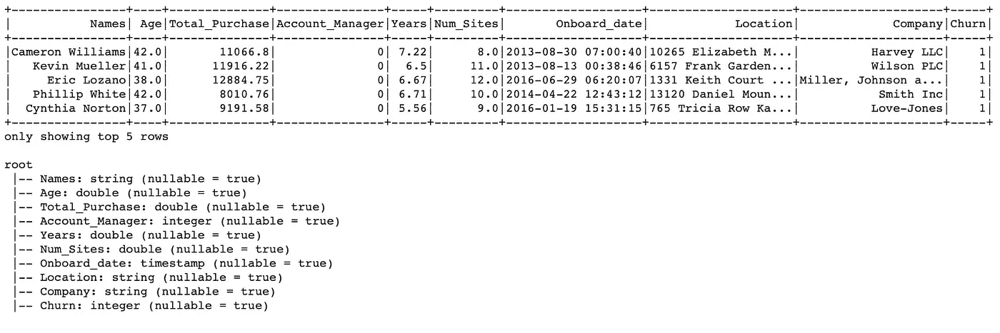

导入的数据帧将如下所示，模式显示在数据帧下方。

在数据模式中，我们可以看到有 10 列数据及其类型。用于监督机器学习的列/标签在最后，并命名为“搅动”。

# 数据探索

首先，我们将运行*描述()。show()* ，用于查看数据帧的基本统计细节，如**平均值、标准差、最大值、最小值和计数**。当这个方法应用于一系列字符串时，它返回一个没有平均值和标准差的输出..

然后，我们使用一个非常有用的 for 循环语法来只返回数字列。这里看起来没有必要，但是当你有一个巨大的数据集时，这是非常必要的。

```
numeric_col = [i[0] for i in data.dtypes if i[1] == “int”]data.select(numeric_col).describe().toPandas().transpose() # row to col
```

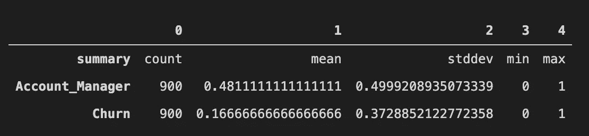

然后我们将可视化客户流失的分布，以及 Account_Manager 的分布。Account_Manager 几乎一半一半平均分布。但是我们在流失方面存在阶级不平衡，这将影响模型。通常，我们会采用其他一些方法，如 K-fold 交叉验证来解决这个问题。但是我们将在本教程中保持我们的工作简单，我们现在将跳过它。

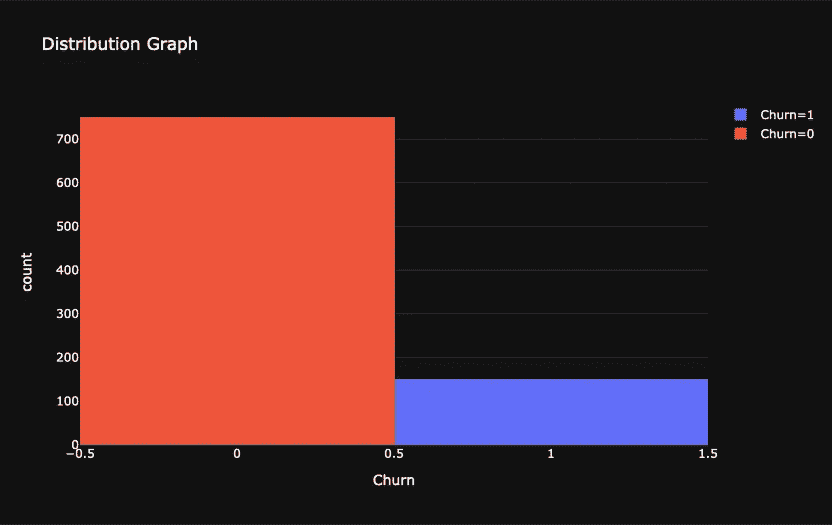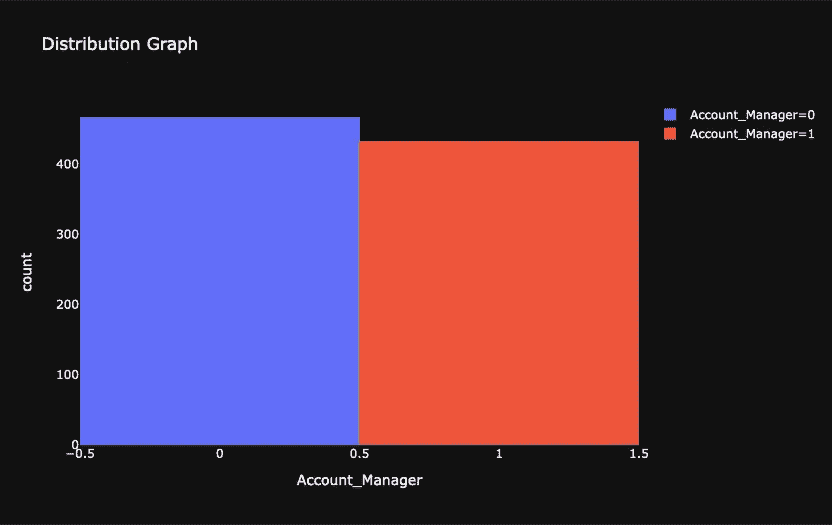

数据可视化

# 检查不适用值

每当我们看到一个新的数据集，我们需要检查空值。虽然 Spark 数据帧不同于 pandas 数据帧，seaborn 只接受 Pandas 数据帧，但是我们需要使用 *toPandas()* 函数来转换我们的数据帧，以便被 heatmap 函数接受。

```
import seaborn as sns
import matplotlib.pyplot as pltplt.figure(figsize=(12,6))sns.heatmap(data.toPandas().isnull(),cbar=False)
```

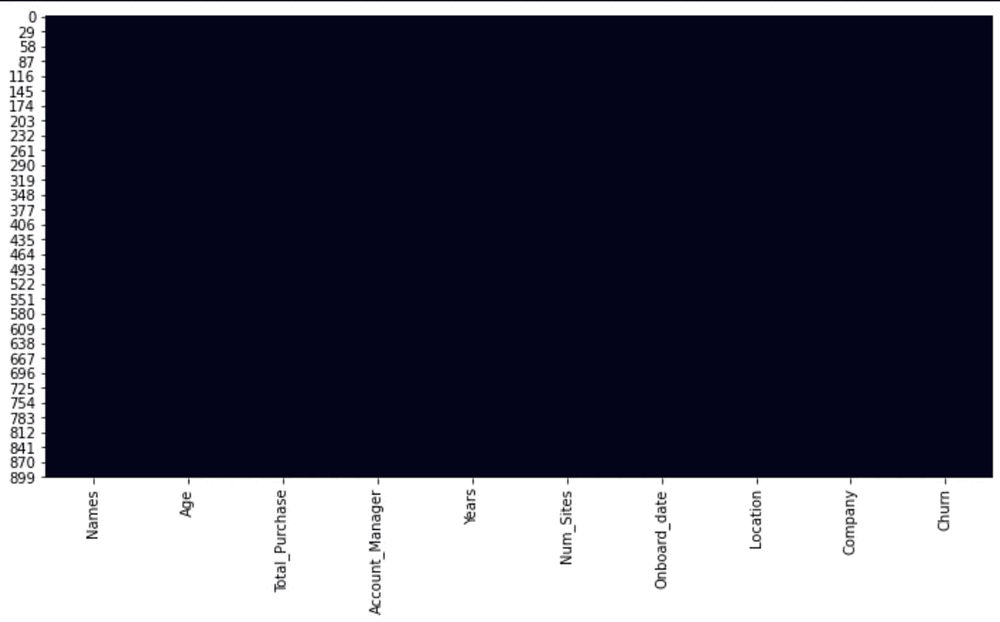

我们没有空值。

很好，我们不需要处理任何空值。

# **基础 EDA**

探索性数据分析通常是用可视化的方法对数据集进行分析或总结。让我们在这里做一些简单的 EDA。首先，我们将看看在有和没有任何客户经理照顾客户的情况下，我们的流失率如何。

```
data.groupby(“Account_Manager”).avg(“Churn”).show()
```

结果很有趣。一般来说，有了客户经理，客户应该更忠诚，不太可能流失。但在我们的情况下却完全相反。与没有客户经理的客户流失率相比，有客户经理的客户流失率更高。我们形象地总结一下。

```
group_by_am = data.groupby(“Account_Manager”).avg(“Churn”).toPandas()figure = px.bar(group_by_am, x=”Account_Manager”, y=”avg(Churn)”, template=”plotly_dark”, title=”Chrun Rate if Account Manager is Assigned Graph”, color=”Account_Manager”)figure.show()
```

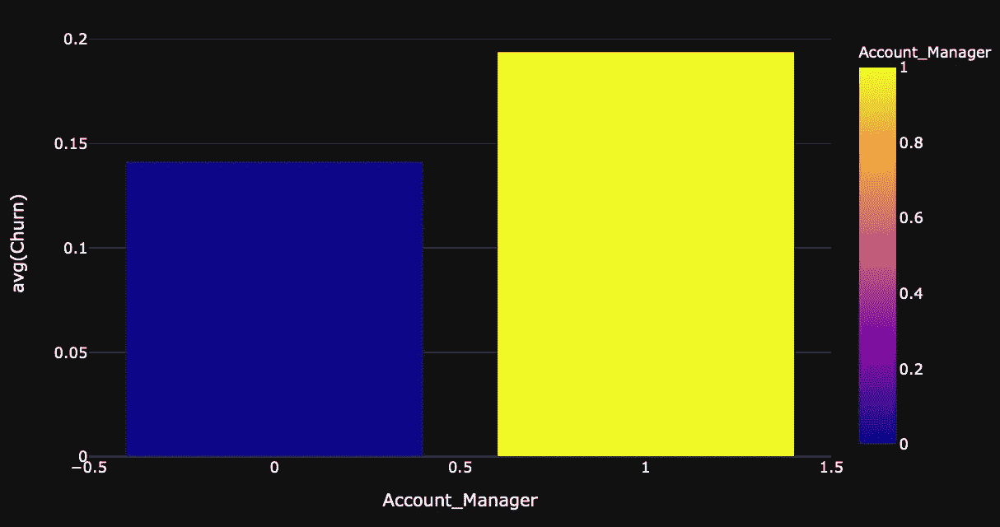

这使我们在结论中分享一些有价值的见解。

然后，我们将可视化我们的预测者的相关性。多重共线性是一个必须解决的问题，如果有的话。但是，如果变量之间不幸存在多重共线性，我们可以不处理它吗？是的，因为多重共线性只会影响系数和 p 值，但不会对模型预测因变量的能力产生太大影响。

幸运的是，我们这次没有任何多重共线性要处理。

```
from pyspark.mllib.stat import Statistics
import pandas as pddef compute_correlation_matrix(df, method=’pearson’): features = df.rdd.map(lambda row: row[0:])
    corr_mat = Statistics.corr(features, method=method)
    corr_mat_df = pd.DataFrame(corr_mat,
    columns=df.columns,
    index=df.columns) return corr_mat_dfcompute_correlation_matrix(data[“Age”, “Total_Purchase”, “Account_Manager”, “Years”, “Num_Sites”, “Churn”])plt.figure(figsize=(12,12))sns.heatmap(compute_correlation_matrix(data[“Age”, “Total_Purchase”, “Account_Manager”, “Years”, “Num_Sites”, “Churn”]));
```

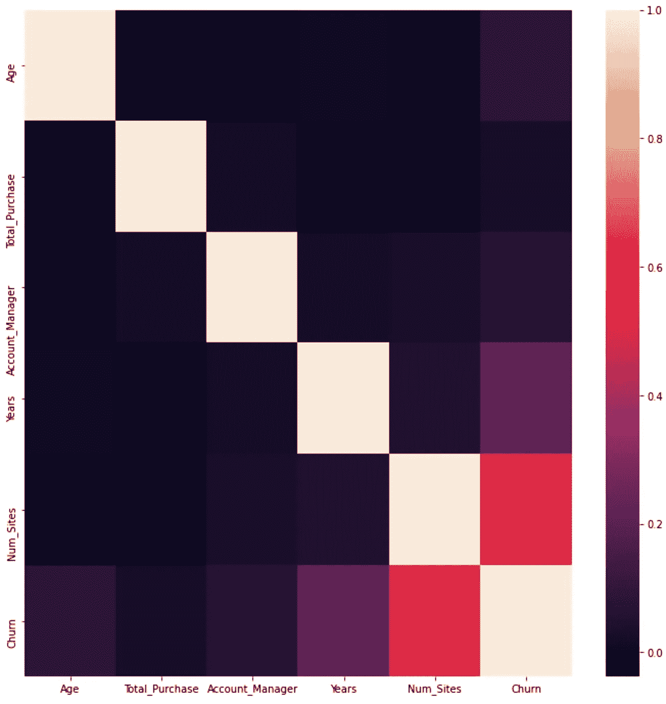

使用的方法是皮尔逊。

# 我们的最终数据

```
final = data.select([‘Age’, ‘Total_Purchase’, ‘Account_Manager’, ‘Years’, ‘Num_Sites’]) 
```

然后我们把它分为训练集和测试集。原始数据的 70%将是我们的训练数据，而 30%将是我们的测试数据。

```
train,test = final_data.randomSplit([0.7,0.3])
```

# 训练我们的模型

现在让我们用 LogisticRegression 函数来训练我们的模型。

```
from pyspark.ml.classification import LogisticRegressionlr_churn = LogisticRegression(featuresCol=”features”, labelCol=’churn’)lr_churn = lr_churn.fit(train) # train with the train data settraining_sum = lr_churn.summarytraining_sum.predictions.show()
```

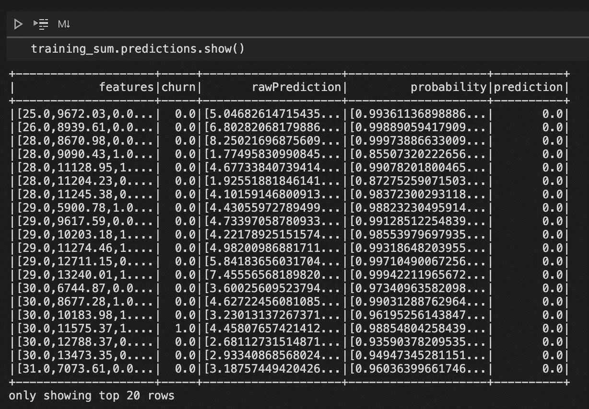

显示预测的摘要表。

# 估价

让我们用测试数据集来评估结果。

```
from pyspark.ml.evaluation import BinaryClassificationEvaluatorpred_and_labels = lr_churn.evaluate(test)pred_and_labels.predictions.show(3)
```

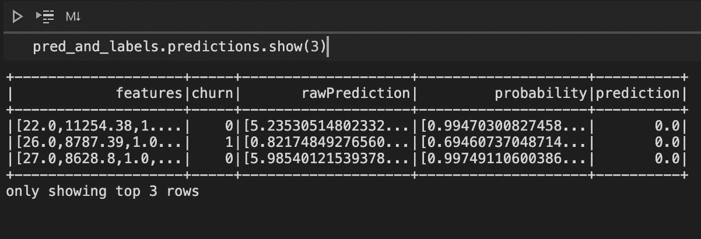

第二个不正确，但是第一个和第三个是正确的，还不错。

然后用 AUC 对模型进行评价。AUC 代表“ROC 曲线下的面积”它告诉我们这个模型在多大程度上能够区分不同的类。该区域始终表示为 0 到 1 之间的值。1 表示模型是完美的，没有任何错误。值 0.5 表示模型一般，只是胡乱猜测。因此，我们的目标是最大化这个价值。越大越好。但我们很可能不想要 1，因为这意味着存在过度拟合。

```
churn_eval = BinaryClassificationEvaluator(rawPredictionCol=’prediction’, labelCol=’churn’)auc = churn_eval.evaluate(pred_and_labels.predictions)
```

我们的 AUC 值是 0.76。所以，我们的模型做得不错，不会有什么过拟合的问题。

# 在一个全新的数据集上预测

我们准备了另一个数据集，名为 *Sales_new.csv* 。首先，我们必须将数据加载到系统中。然后我们需要使用 VectorAssembler 再次转换我们的数据。将转换后的数据拟合到训练好的模型中，然后我们检查结果。

```
new_customers = spark.read.csv(‘Sales_new.csv’,inferSchema=True, header=True)test_new_customers = assembler.transform(new_customers)final_results = lr_churn.transform(test_new_customers)final_results.select(‘Company’,’prediction’).show()
```

太棒了。你做到了！下图显示了对每家公司是否会流失的预测。

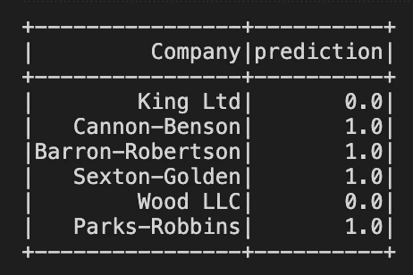

坎农-本森、巴伦-罗伯逊、塞克斯顿-戈尔登和帕克斯-罗宾斯已经准备好了。CRM 部门的新 CRM 项目需要这个结果。

# **管道创建**

现在我们继续建设管道。通常，您不必将数据分为训练和测试。在这里分割数据，因为我们想向您展示它将实现相同的预测结果。

```
from pyspark.ml import Pipeline
from pyspark.ml.classification import LogisticRegressionlr_churn = LogisticRegression(featuresCol="features", labelCol='Churn')pipeline = Pipeline(stages=[assembler, lr_churn])model = pipeline.fit(train_churn)model.save("saved_model.model")
```

# 加载并应用保存的管道

```
from pyspark.ml import PipelineModelmodel_loaded = PipelineModel.load(“saved_model.model”)prediction = model_loaded.transform(test_churn)results.select('Company','prediction').show()
```

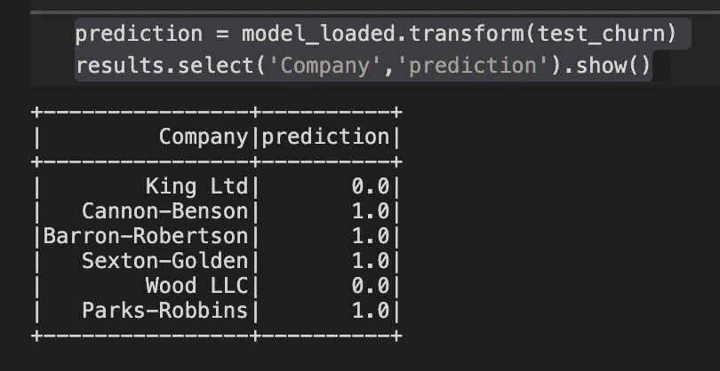

看，预测和上面一样。

# 结论

我们已经建立了一个机器学习模型来预测客户的流失。虽然它是在一个虚假的数据集上训练的，但本教程的目的是向观众展示通常需要的过程和常见的解释性分析。正如我们已经提到的，最重要的部分是分析的可操作的见解。在 EDA 课程中，我们发现客户经理的流失率稍高。那么作为一名数据科学家，我们应该用假设检验等其他方法来交叉检查。在进一步调查后，如果结果是显著的，那么我们可以得出结论，我们的客户经理可能出了问题，可能需要通知部门主管。在与部门主管的讨论中，可能会发现一些绩效差距和劳动力差距。太棒了。

虽然预测客户流失率表是钱，但它应该与 CRM 或客户经理部门共享。让这些部门知道谁会流失可以节省数千美元的促销费用，并可以提高销售额。这也可以减轻销售部门完成目标的压力。

他们可以推出一些特殊的套餐来留住这些客户。也可能有一个新的电子邮件营销活动，特别是针对这些客户。这些电子邮件中包含的物品可以是优惠券、礼品、实体活动邀请卡等。

你可能也会对这篇文章感兴趣:[基础营销分析](https://towardsdatascience.com/fundamental-marketing-analytics-f875018391d5?source=your_stories_page-------------------------------------)，和熊猫[数据争论小抄](https://towardsdatascience.com/pandas-data-wrangling-cheat-sheet-2021-cf70f577bcdd)。

非常感谢您阅读我的文章，我一直在为数字营销、数据分析、分析和 Python 写作。请点击下面的链接来看看。

[数字营销](https://elartedm.com/marketing-blog/):[https://elartedm.com/marketing-blog/](https://elartedm.com/marketing-blog/)

[另一个数字营销和机器学习](https://positivehk.com/category/%E5%B0%88%E6%AC%84/digital-marketing-blog/):【https://positivehk.com/category/%E5%B...】T2

数据科学:【https://lorenzoyeung-io.medium.com/ 