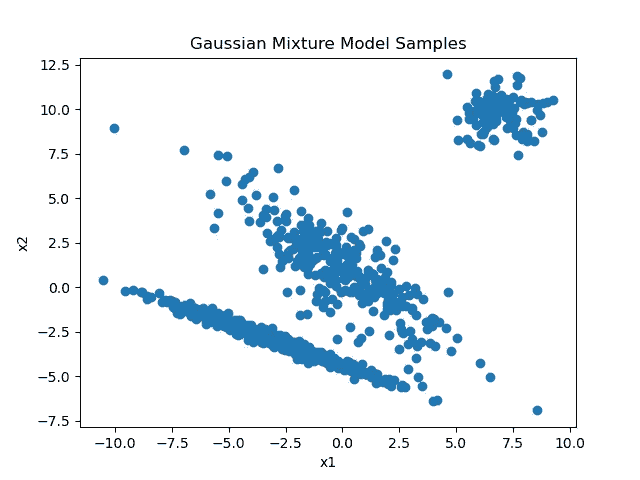

# 高斯混合模型抽样

> 原文：<https://medium.com/analytics-vidhya/sampling-from-gaussian-mixture-models-f1ab9cac2721?source=collection_archive---------2----------------------->

在开发聚类分析算法时，您可能需要在不想使用实际数据的情况下快速测试算法。在这种情况下，能够从高斯混合模型中进行采样是非常有帮助的，因为这允许您快速生成简单的聚类数据集。

在本文中，我们将介绍并实现高斯混合模型的采样。首先，我们将从正态分布的抽样开始。然后，我们将从具有非对角协方差矩阵的多元高斯分布中采样，最后，我们将使用所有这些从高斯混合模型中采样。

我不会解释如何用随机数发生器对均匀随机变量进行采样，因为已经有很多很好的文章讨论过这个问题[1]。

高斯混合模型

在我们开始实现之前，让我们快速介绍一下什么是高斯混合模型。高斯混合模型是多个高斯分布相加后的组合。为了确保结果保持有效分布，例如积分为 1，对每个高斯进行加权:


使用:


如果我们明确表达高斯分布，我们得到:


高斯混合模型是常用的，因为它们可以很好地近似任意随机分布。


高斯混合模型示例

# 正态分布抽样

所有计算机都有能力用随机数发生器从均匀分布中取样。但是我们如何利用均匀分布的样本得到正态分布呢？从随机分布中取样的最著名的方法之一叫做蒙特卡罗模拟(MC)。在 MC 模拟中，我们从均匀分布中提取 x 值，然后从 0 和 1 之间的均匀分布中提取 y 值。如果绘制的 y 值小于或等于 x 点的分布密度，我们保留样本，否则继续采样[4]。

这非常强大，但是正态分布的问题是 x 值可以是任何实数。我们不可能从一个无限大的区域均匀地取样。

我们可以使用非线性函数，如反 sigmoid 函数或反 Gaussian 累积分布函数，将 0 和 1 之间的均匀样本映射到实数。这种方法的问题是，绘制这种地图不会导致均匀的分布。


均匀样本的直方图(btw。0 和 1)用 sigmoid 函数映射

在图像中，您可以看到上面讨论的反 s 形图的直方图。显然，直方图非常类似于正态分布。我们可以使用该图来生成用于蒙特卡洛采样的点，这将导致以下分布:


具有 sigmoid 映射的高斯分布的蒙特卡罗采样近似

上述问题导致采样分布的最大值比正态分布的最大值高且薄。这可以通过校正方差来改变，但即使没有校正，误差也不会太大。

有没有可能获得更好的结果？为此，我们将使用中心极限定理。这个定理表明，每个随机变量的抽样均值趋于正态分布。


通过计算用 sigmoid 函数映射的三个均匀分布样本的平均值进行采样

在这里，我们使用 0 和 1 之间的均匀分布的采样平均值映射到具有 sigmoid 的有理数。这个结果并不比蒙特卡洛的结果好多少。然而，所需的采样次数要少得多。对于蒙特卡洛，我们使用了 20k 个样本，而这里只有 6k 个。因为在蒙特卡洛，很大一部分样本从未使用过，所以我们需要更多的样本。

虽然给定样本量的结果差别不大，但我们的蒙特卡罗方法永远不会正确地逼近正态分布，因为我们使用的是 sigmoid 图，而不是均匀采样。这可以通过显著增加样本数量来实现。


具有大量样本的中心极限与蒙特卡罗抽样策略的比较

在左边，使用了中心极限定理，在右边使用了蒙特卡罗抽样。显而易见，中心极限定理几乎完美地逼近正态分布，但蒙特卡罗方法则不然。

借助 numpy 可以很容易地实现中心极限定理。

```
*import* numpy *as* np*def* inv_sigmoid(*values*): *return* np.log(*values*/(1-*values*)) number_of_samples = 2000y_s = np.random.uniform(0, 1, size=(number_of_samples, 3))x_s = np.mean(inv_sigmoid(y_s), axis=1)
```

# 多元正态分布的抽样

现在，我们能够从均值为 0、方差为 1 的正态分布中取样。要从具有任意均值和方差的分布中取样，我们可以根据方差来缩放样本，然后加上均值。


非正态高斯的中心极限采样

我们仍然不能从具有非对角协方差矩阵的多元高斯样本中进行采样，例如并非所有特征都是独立的高斯样本。

协方差矩阵有一个很好的特性，即它们是对称的，这意味着我们可以使用特征向量分解来对角化它。


中间的λ矩阵是以特征值为元素的对角矩阵，两个γ矩阵是标准正交特征向量矩阵。特征向量也称为主分量，可用于将数据转换到具有对角协方差矩阵的空间。我们可以利用特征向量矩阵的这一良好特性，利用正态分布样本从任意多元分布中获取样本。首先，我们从均值为 0 且方差等于相应特征值的正态分布中对每个维度进行采样。这种样本的协方差是λ矩阵。给定一组样本，根据前面提到的策略采样，堆叠到一个矩阵 X 中，我们可以通过将其乘以转置伽马矩阵，将样本转换回原始多元空间:


这个矩阵的协方差可以用下面的公式计算:


我们可以这样做的原因是因为均值为零，X 的协方差是λ矩阵。如您所见，通过从正态分布中采样并用协方差矩阵的特征值转换样本，我们可以从任意多元高斯分布中采样。最后，我们可以简单地添加平均值，我们就完成了。

```
# eigenvalue decompositionlambda_, gamma_ = np.linalg.eig(np.array([[1, 2], [2, 1]]))dimensions = len(lambda_)# sampling from normal distributiony_s = np.random.uniform(0, 1, size=(dimensions*1000, 3))x_normal = np.mean(inv_sigmoid(y_s), axis=1).reshape((-1, dimensions))# transforming into multivariate distributionx_multi = (x_normal*lambda_) @ gamma_ + mean
```

# 从高斯混合模型中采样

还记得在开始的时候，我将高斯混合模型描述为多个多元高斯分布的组合。对于最后的采样步骤，我们也将从这个角度来看高斯混合模型。

记住高斯混合模型的密度函数:


圆周率可以被视为相应高斯函数的强度。

我们首先采样一个介于 0 和 1 之间的值，并相应地选取正态分布:

```
mus = [np.array([0, 1]), np.array([7, 1]), np.array([-3, 3])]covs = [np.array([[1, 2], [2, 1]]), np.array([[1, 0], [0, 1]]), np.array([[10, 1], [1, 0.3]])]pis = np.array([0.3, 0.1, 0.6])acc_pis = [np.sum(pis[:i]) *for* i *in* range(1, len(pis)+1)]*assert* np.isclose(acc_pis[-1], 1)# sample uniformr = np.random.uniform(0, 1)# select Gaussiank = 0*for* i, threshold *in* enumerate(acc_pis): *if* r < threshold: k = i *break*selected_mu = mus[k]selected_cov = covs[k]
```

通过选择均值和协方差，我们可以从高斯分布中进行采样。

```
# sample from selected Gaussianlambda_, gamma_ = np.linalg.eig(selected_cov)dimensions = len(lambda_)# sampling from normal distributiony_s = np.random.uniform(0, 1, size=(dimensions*1, 3))x_normal = np.mean(inv_sigmoid(y_s), axis=1).reshape((-1, dimensions))# transforming into multivariate distributionx_multi = (x_normal*lambda_) @ gamma_ + selected_mu
```

结果是高斯混合模型的样本。现在，上述步骤可以重复多次，我们就完成了。



从具有三个高斯分布的高斯混合中采样

为了检查我们是否真的在采样高斯混合模型，我们可以检查一个 1D 的例子。


具有 2 个高斯分布的采样 GMM 直方图

正如你所看到的，我们的采样算法工作得非常好。

# 结论

在本文中，我们一步一步地介绍了从高斯混合模型中进行采样的过程。如果你想查看我用来绘制所有图片的代码，请查看[和](https://github.com/Matze99/SamplingGMM)。

[1][https://reference . wolfram . com/language/tutorial/randomnumbergeneration . html](https://reference.wolfram.com/language/tutorial/RandomNumberGeneration.html)

【2】[https://www . oreilly . com/library/view/hands-on-unsupervised-learning/9781789348279/？ar](https://www.oreilly.com/library/view/hands-on-unsupervised-learning/9781789348279/?ar)

[3][https://www.springer.com/gp/book/9780387310732](https://www.springer.com/gp/book/9780387310732)

[4]https://de.wikipedia.org/wiki/Monte-Carlo-Simulation

[5]https://en.wikipedia.org/wiki/Central_limit_theorem

[6][https://en.wikipedia.org/wiki/Covariance_matrix](https://en.wikipedia.org/wiki/Covariance_matrix)