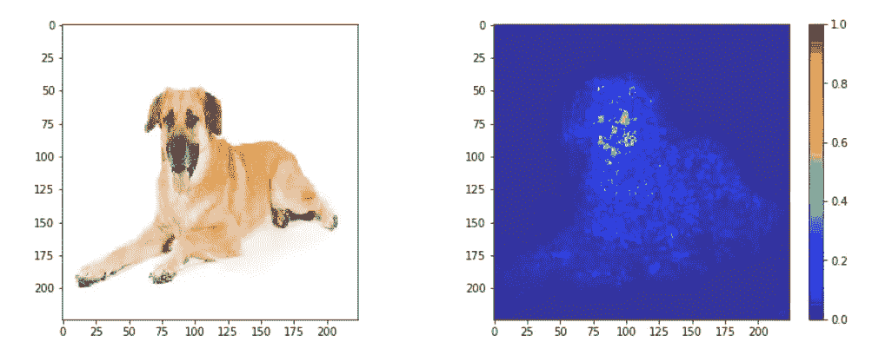
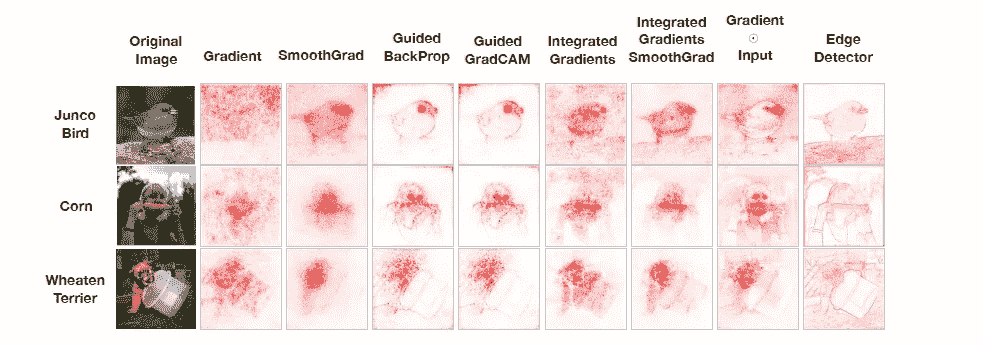
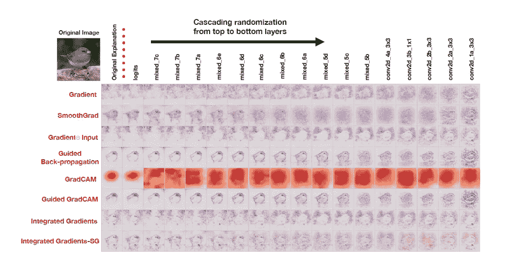
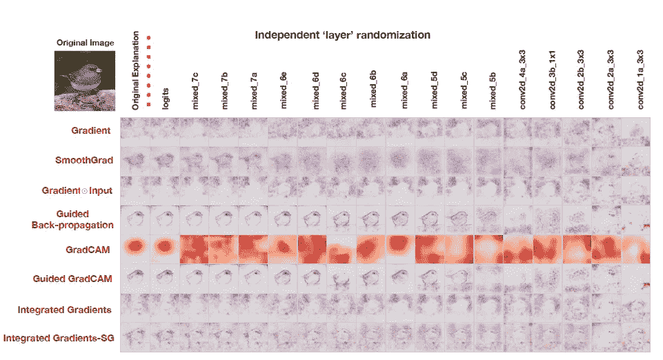
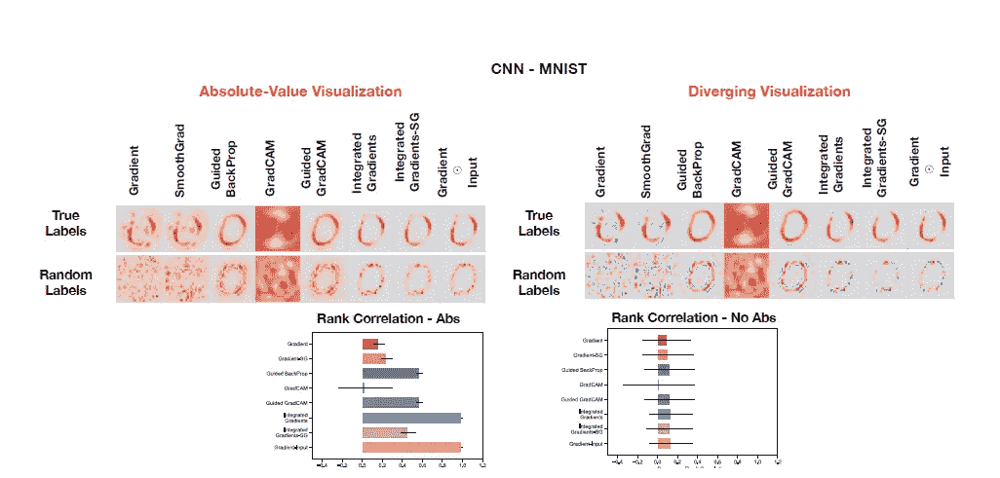

# 显著图的健全性检查:分解

> 原文：<https://medium.com/analytics-vidhya/sanity-checks-for-saliency-maps-breakdown-2aa6338074c6?source=collection_archive---------5----------------------->

这篇文章试图阐明论文的要点。

首先让我们弄清楚一件事-

***什么是显著图？***

基本上，如果我们试图对这张图片进行分类，它会告诉我们图片中的哪些像素信息最丰富。

例如，请注意右边变亮的像素。

狗图片的显著图

现在，有各种各样的方法来创建显著性图，正如本文展示的下面的例子-

与边缘检测器相比，使用不同方法的显著图

然而，这张图片是为了显示显著图和简单的边缘检测器之间的比较。

> 所以，基本上，看到我的模型聚焦在正确的特性上，并且它是有效的，这让我很欣慰。:-D

***问题-***

那么，可能是什么问题呢？

这篇论文要求我们有一个批判的观点，并说这可能好得不像是真的？

> “解释机器学习模型的宝贵努力面临着一个方法论挑战:评估模型解释的范围和质量的难度。”

如上图所示，如果我们将边缘检测器(不依赖于数据/模型参数)的结果与一些显著性方法进行比较，结果看起来几乎相同。

所以可能显著性方法尽管显示了这些像素，但实际上并不能真正解释模型中的情况？

因此，他们建议用统计方法来确定情况是否如此。

**提案-**

1.  模型参数随机化检验

2.数据随机化检验

***一个模型参数随机化测试***

目的-检查显著性方法是否独立于模型，即模型参数。

a)训练模型+显著性方法=输出 1

b)未训练模型+随机初始化参数+显著性方法= outP2

如果 outP1 = outP2 →显著图对调试没有用，因为在 outP2 中甚至没有学习模型。

预期→输出 1 <>输出 2

*如何随机初始化参数？*

a)从上到下以级联方式完全随机初始化所有层中的所有权重

Inception v3 上的级联随机化(ImageNet)。

如图所示，梯度法显示了灵敏度，但 GradCAM 并不关心模型参数。

b)随机确定每层的权重，保持所有其他层的权重不变

关于 Inception v3 的独立随机化(ImageNet)。

***一次数据随机化检验***

目的-检验显著性方法是否独立于数据

a)训练模型+标记数据集+显著性方法= outD1

b)训练模型+具有随机排列标签的数据集+显著性方法= outD2

如果 outD1 = outD2 →显著图不依赖于标签/数据

预期→输出 1 <>输出 2

对真实模型与随机标签上训练的模型的解释。

**结论-**

基于梯度的显著性方法对模型和数据敏感。

只有目视检查会产生误导。

对方法的健全性检查有助于识别缺陷。

**参考文献-**

 [## Tensorflow 2.0 中的显著图

### 显著图是一种根据图像中像素对最终得分的贡献来对像素进行排序的技术

usmanr149.github.io](https://usmanr149.github.io/urmlblog/cnn/2020/05/01/Salincy-Maps.html)  [## 显著图的健全性检查

### 显著性方法已经成为一种流行的工具，用来突出输入中被认为与预测…相关的特征

arxiv.org](https://arxiv.org/abs/1810.03292)