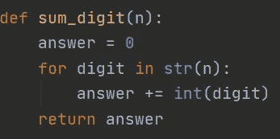
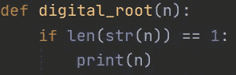
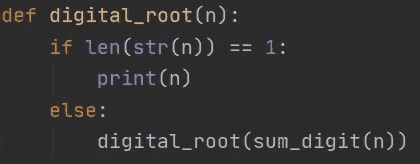

# 满意

> 原文：<https://medium.com/analytics-vidhya/satisfaction-d36ec14a8e57?source=collection_archive---------24----------------------->


# 背景

暑假一个月后，我已经掌握了各种编程技能，比如递归，并学习了不同的数据结构，比如链表和堆。这都是为明年的惠普代码大战做准备，因为我想在这方面做得更好。不幸的是，自学和保持学习所有这些材料的动力对我来说很难。令人欣慰的是，几天前，我获得了一股信心，因为我能够实际应用我在过去一个月中学到的东西。

所以我的朋友给我发了一个他一直困扰的问题，我第一眼看到这个问题时非常惊讶。问题陈述，“[数字根](https://en.wikipedia.org/wiki/Digital_root)是一个数中所有数字的*递归和。*给定 n，取 n 的数字之和。如果该值有一位以上的数字，继续以这种方式减少，直到产生一位数字。

我的朋友在编程方面很没有经验，所以我很惊讶他会给我一个如此困难的问题。我仍然能够用我几个月的经验和我最近学到的东西来帮助他。

# 示范

对我解决这个问题帮助最大的是提示第一行的“递归”二字。我知道这个问题会涉及到一些基于此的递归。经过一点思考，我知道我必须创建一个函数，将一个数字的数字相加，因为我必须以一个一位数结束。



数字求和功能

创建这个函数后，我考虑了如何做这个问题的递归部分。我知道终止的情况是当数字的和是一个一位数时，所以我相应地输入。



终止案例

不久之后，我通过函数调用本身完成了程序。



递归函数

以下是您可以复制和粘贴的最终代码:

```
def digital_root(n):
    if len(str(n)) == 1:
        print(n)
    else:
        digital_root(sum_digit(n))

def sum_digit(n):
    answer = 0
    for digit in str(n):
        answer += int(digit)
    return answer
```

# 思想

这个问题迫使我使用到目前为止我所学的所有东西。我对自己能够应用像递归这样的概念印象深刻，这对我来说相对较新。能够做到这一点让我感到非常满足，所以我将继续编程并写下我的收获！

# 来源

问题链接:[https://www . codewars . com/kata/541 c 8630095125 ABA 6000 c 00/train/python](https://www.codewars.com/kata/541c8630095125aba6000c00/train/python)