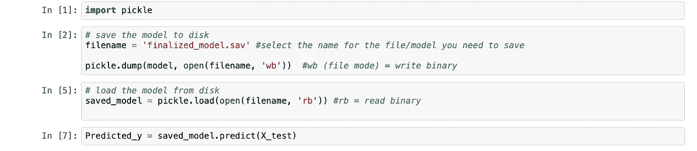
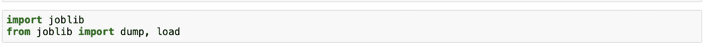
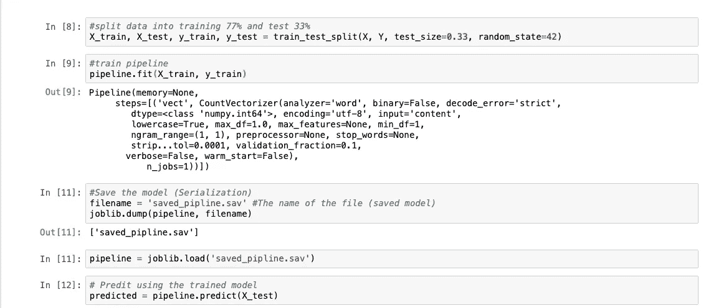
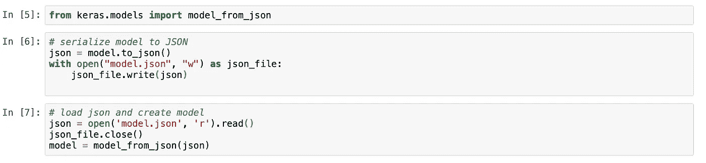

# 保存机器学习和深度学习模型

> 原文：<https://medium.com/analytics-vidhya/save-machine-learning-and-deep-learning-models-3b27f1ea550?source=collection_archive---------14----------------------->

## 保存并加载 SK-Learn 和 Keras ML/DL 模型

保存机器学习(ML)和深度学习(DL)模型是构建 ML/DL 模型以保存对象状态的不可避免的步骤，无论是用于进行预测还是在需要时将其重新用于其他目的。

**序列化**(保存)是将数据结构或对象翻译成可以在数据库或文件中传输/存储的格式的过程，而**反序列化**(加载)是从数据库或文件中加载存储对象的逆向过程。

在本文中，您将了解如何使用 SK-Learn 和 Keras 使用 python 库保存您的模型。

# 1.SK-Learn:

在 SK-Learn 中，我们可以在训练后保存模型，以便再次使用它，而不必重新训练它。

## [1.1 泡菜库](https://docs.python.org/3/library/pickle.html)

Pickle API 是序列化和反序列化 Python 对象结构的标准方法。

**训练后保存并加载模型..**

## [**2.2 Joblib 库**](https://joblib.readthedocs.io/en/latest/index.html)

Joblib API 的主要用途是管道化 python 作业，但它也提供保存/加载 python 对象的方法。该 API 对于需要大量参数或存储原始数据集(如 K-最近邻)的 ML 算法非常有用。

# 2.Keras:

Keras 是一个 Python DL 库。DL 模型可能需要很长时间的训练，因此保存 Keras 模型非常重要。

根据 [OWASP](https://owasp.org) 的说法，序列化数据最流行的数据格式是 JSON。因此，我们将了解如何将 Keras 模型保存到 JSON 文件中，以及如何从 JSON 文件中加载 Keras 模型。

# 3.其他方式:

另一个允许你处理 Python 对象和/或将它存储到文件中的库是 [dill](https://dill.readthedocs.io/en/latest/dill.html#module-dill._dill) 库。Dill 扩展了用于序列化/反序列化的 Pickle API。它还保存解释器会话的状态。

# 进一步阅读

1.  [Keras 模型保存&序列化 API](https://keras.io/api/models/model_saving_apis/)
2.  [莳萝文件](https://dill.readthedocs.io/en/latest/dill.html#module-dill._dill)
3.  [SK-学习模型存在](https://scikit-learn.org/stable/modules/model_persistence.html)

# 结论

在这篇文章中，我们发现了几种保存我们的机器/深度学习模型并在需要时加载它以供使用的方法。

快乐学习！