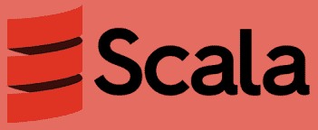

# Scala，又一种编程语言？

> 原文：<https://medium.com/analytics-vidhya/scala-yet-another-programming-language-aa99a9015661?source=collection_archive---------10----------------------->



Scala 并不是一个新东西，但是在最近几年里，它已经引起了开发者的极大兴趣。它在大数据生态系统中的广泛采用无疑凸显了它的存在，并使它成为一件著名的事情，并在少数最著名的程序员中获得一席之地。理解这一点很重要，不是 scala 公开的特性是新的，也不是其他替代方案提供的，而是 scala 让你在代码中执行这些事情的方式。

进化是不可避免的，这在编程语言的世界中没有什么不同。对编程语言的标准最低期望不再与我们在第三代编程语言的圣经中读到的一样。互操作性和可重用性等方面已经变得不同于我们之前对它们的理解，这是有原因的。冗长实际上不再是代码可读性的折衷。我们多年的朋友，Java 因过于冗长而臭名昭著。

# 里面有什么功能？

最近，我们经常听说所有的现代编程语言都在向函数式范式发展。这实际上意味着什么？这是一种用纯函数创建代码的方式，它让你不用共享状态和可变数据，而在面向对象的世界里，我们一直在处理这些数据。重点是结果是什么，而不是实现的过程。一切都是它的功能。理论是让一切都像数学表达式一样使用条件表达式，以便计算并达到一个状态。

## 反编译，在 JVM 中

Scala 已经在非常有名的 Java 虚拟机上实现了。是的，你猜对了，Scala 编译成 Java 字节码。Scala 的源代码由编译器解释以产生高效的 JVM 字节码。这是它取得巨大成功的主要原因之一。将通常的编译分解成三层——前端构建 AST 树并增强它。中间端做一些平台无关的优化，称为*尾调用*，后端为 CPU 做优化并生成汇编文件。另一方面，Scala 编译器的组织方式几乎没有什么不同，例如 CPU 特定的优化被委托给 JVM。

> 一棵**抽象语法树**——也称为 AST——是编译器如何解释代码的表示。它由解析器和词法分析器(一些常见的编译器组件)的编译阶段创建。AST 保留代码中的所有操作和值。

# 编译和构建块的阶段


> Scala 总共有 25 个编译阶段，让我们来谈谈最重要的几个

**解析** —第一阶段，使用解析器和扫描器创建非类型化 AST。这是抛出语法错误的地方。

**类型检查器** —推断类型，检查类型是否匹配，类型检查引用和违规。

**擦除** —这种类型擦除是一种 JVM 特性，它是用 Java 5 的泛型创建的，以实现向后兼容性。当使用泛型或者在代码中创建值类时，它们在这个阶段会被删除。

**隐式转换** —这是一组在引用错误类型的对象时应用的方法。它允许编译器自动从一种类型转换到另一种类型。

在两种情况下需要隐式转换:

*   如果 A 和 S 类型的表达式与预期的 b 类型的表达式不匹配。
*   在类型 A 的表达式 e 的选择 e. m 中，如果选择器 m 不表示 A 的成员。

对 List[Int]类型的两个列表 xa 和 ya 的操作是合法的

```
xa = ya
```

给定的隐式方法 listorder 和 intorder 在作用域中定义如下:

> 隐式 def listorder[A](x: List[A])
> (隐式 elemorder: A = >有序[A]):有序[List[A]] =
> 新有序[List[A]] { /*..*/}
> implicit def into order(x:Int):Ordered[Int]=
> new Ordered[Int]{/*..*/ }

**模式匹配** —模式匹配是一种检查给定令牌序列是否存在特定模式的方法。这是 Scala 中使用最广泛的特性。

" **match** "关键字被用来代替 switch 语句。“匹配”是在 Scala 的根类中定义的，以使其对所有对象可用。这可以包含一系列的选择。每个备选项将从 **case** 关键字开始。每个 case 语句都包括一个模式和一个或多个表达式，如果指定的模式匹配，就会计算这些表达式。为了将模式与表达式分开，使用了**箭头符号(= > )**

> `**object**` `Pattern {`
> 
> 【T2`main(args**:**``Array[String]) {`
> 
> `println(print(1));`
> 
> `}`
> 
> `**def**` `print(x**:**Int)**:**` `String **=**` `x **match**` `{`
> 
> `// if value of x is 0,`
> 
> `// this case will be executed`
> 
> `**case**``0``**=>**`
> 
> `// if value of x is 1,`
> 
> `// this case will be executed`
> 
> `**case**` `1` `**=>**` `"Hello again"`
> 
> `// if x doesnt match any sequence,`
> 
> `// then this case will be executed`
> 
> `**case**`T13`**=>**`
> 
> `}`
> 
> `}`

输出—再次问候

**优化阶段和尾部调用**—*尾部调用*阶段优化了尾部递归:在字节码中，它被替换为跳转调用，因此在字节码中，它看起来像一个普通的 for 循环。在 Scala 中，只优化对当前函数的直接递归调用。这个概念有时优于头递归，以避免深度递归时的堆栈溢出错误。*示例 JVM 将所有调用保存在其内部堆栈中。内部堆栈的内存有限。所以如果我们试着求阶乘的值(10000)。这将导致堆栈溢出错误，因为递归深度太深，JVM 无法处理。*

> Scala 编译器在优化代码方面做得很好，当实现不是尾递归时，它会警告我们。
> 
> 为什么编译 Scala 代码需要这么长时间——嗯，最长的阶段是 typer 阶段——类型检查。Scala 有一个丰富复杂的类型系统，需要大量的时间来处理。此外，像 Shapeless 这样的库是基于隐式和宏的，非常耗时。

## λ表达式

**λ表达式**是使用 [**匿名函数**](https://www.geeksforgeeks.org/anonymous-functions-in-scala/) 代替变量或值的表达式。它们在 Scala 中也被称为***curry***。当我们在某个地方使用一个简单的函数时，Lambda 表达式是很方便的。这些表达式比定义一个完整的函数更快，表达能力更强，这增强了函数的可读性。Lambda 表达式可以在任何类型的转换中重用。它可以迭代对象集合，并对它们执行某种转换。

val name =(名称变量:类型)=>Todo_Expression

val 输出= (x:Int) => x+ 100

> object get cube {
> val cube =(x:Int)=>x * x * x
> 
> def main(args:Array[String]){
> var x = 2；
> printf("的立方"+ x +"是"+ cube(x))
> }
> }

输出-2 的立方是 8

Scala 还支持 ***部分函数—*** 当一个函数不能为提供给它的每个变量输入数据产生一个返回时，那么这个函数就被称为**部分函数**。它只能确定某些实际输入的子集的输出。它只能部分应用于指定的输入。

> 部分功能是一个特征，需要两种方法来实现，即**在**中定义和**在**中应用。它可以通过使用 case 语句来解释。

## Scala 中的并发性

Scala 并发是建立在 Java 并发模型之上的。在 JVM 上，通过 IO 密集型负载，我们可以在一台机器上运行数千个线程。

一个线程接受一个可运行的。你必须在一个线程上调用`start`来运行 Runnable。

```
scala> val x = new Thread(new Runnable {
  def run() {
    println("Scala")
  }
})
x: java.lang.Thread = Thread[Thread-3,5,main]

scala> x.start
Scala
```

**期货** — A `Future`是异步计算。你可以在将来包装你的计算，当你需要结果的时候，你可以简单地调用一个阻塞的`Await.result()`方法。一个`Executor`返回一个`Future`。

一个`FutureTask`是可运行的，并且被设计成由一个`Executor.` 来运行，Futures 是一个以高效和无阻塞的方式运行并行程序的好方法

```
val future = new FutureTask[String](new Callable[String]() {
  def call(): String = {
    searcher.search(something);
}})
executor.execute(future) }//
val blockingOutput = Await.result(future)
```

> 在 scala 中安全处理线程类似于 java，有同步、可变、原子引用、读写锁、倒计时锁和原子数据类型等选项。

期货允许我们在主线程之外运行值，并通过回调映射来处理正在后台运行或尚未执行的值。

如果你来自 Java 背景，你可能会意识到`java.util.concurrent.Future`。使用它有几个挑战:

*   线程在访问值时总是被阻塞。
*   等待，直到计算完成。
*   `GET`是检索值的唯一方法。

这不是编写并发代码的好方法。Scala 通过`Scala.concurrent.Future`提供了更好的特性。借助 Scala Futures，我们可以实现:

1.  实时无阻塞计算。
2.  对`onComplete`(成功或失败)的回调，将来的值是 Try 子句的实例。
3.  多重未来的映射。

期货本质上是不可变的，并且被内部缓存。一旦一个值或异常被赋值，未来就不能被修改/覆盖(很难实现参照透明性)。

***执行上下文*** ，有了期货无论回调到什么点都要执行，这是要确定在哪个线程上从池中得到执行。执行上下文决定了这一点。默认的是 ExecutionContext.global，它使用全局池中的线程，线程的数量取决于有多少个 CPU 内核。这使用线程池中的默认 fork join 在后台运行线程。

## **懒评**

编译器不会立即评估一个*惰性值*的绑定表达式。它只在第一次访问时计算变量。
初始访问时，编译器评估表达式，并将结果存储在*惰性值*中。每当我们在后面的阶段访问这个 *val* 时，没有执行发生，编译器返回结果。

> 惰性求值或按需调用是一种求值策略，其中表达式直到第一次使用时才求值，即推迟求值直到需要时。

在急切计算时，我们可能会浪费我们的操作(CPU 计算),当我们编写更复杂和更大的代码时，这可能是非常昂贵的。在这里，惰性求值帮助我们优化过程，只在需要的时候求值，避免不必要的开销。

> 然而，这并不总是好的——因为程序员无法控制程序的执行，所以发现 bug 可能很棘手。

## 结论

很明显，Scala 并不是一种新的做事方式，而是一种稍微不同的或功能性的做事方式，这是我们在 Java 中一直在做的事情。它与 JVM 无缝交互，这有助于发挥其最大优势。像类型检查器这样的状态可能有时会让人觉得编译时间是痛苦的，但是像避免冷编译、hydra GC 检查以及宏和隐式可以节省在键入阶段花费的大量时间。