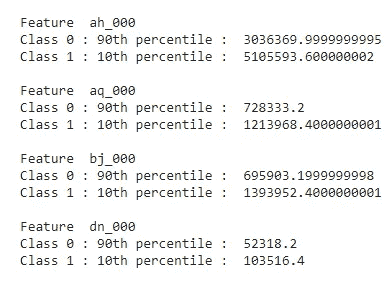

# 斯堪尼亚卡车气压系统故障预测

> 原文：<https://medium.com/analytics-vidhya/scania-trucks-air-pressure-system-failure-prediction-ad6c43539d38?source=collection_archive---------2----------------------->

*使用机器学习解决预防性维护的初学者指南*

> **描述:**本博客总结了在重型斯堪尼亚卡车上使用机器学习预测气压系统故障的案例研究的方法和结果。

图片来自斯堪尼亚网站。[https://www . Scania . com/group/en/home/products-and-services/trucks . html](https://www.scania.com/group/en/home/products-and-services/trucks.html)

# 介绍

**重型车辆**作为道路运输的主要媒介，在工业领域发挥着巨大的作用。它们是最灵活、最经济的运输方式，每天都在各行各业运行。

良好的维护是避免任何意外故障的关键，从而节省金钱和时间。在这种情况下，对所有车辆部件进行定期维护至关重要。

其中一个重要部件是**气压系统(APS)** 。APS 产生压缩空气，用于 different 任务，如制动、换档等。，使其成为一个非常重要的维护主题。

# 内容

1.  商业问题
2.  为什么是机器学习？
3.  业务限制
4.  数据集概述
5.  绩效指标
6.  现有方法
7.  探索性数据分析
8.  缺失值插补
9.  首次切割方法
10.  使用自动编码器的特征工程
11.  使用 SMOTE 进行过采样
12.  尝试机器学习模型
13.  使用简化共享进行部署
14.  结论
15.  潜在的改进
16.  链接到 Github 和 LinkedIn
17.  参考

# 商业问题

**气压系统故障**在重型车辆中很常见，这种故障的维修和保养费用很高。因此，当前的任务是开发一种解决方案，帮助预测卡车中的这种故障，从而防止或降低维护成本。

该问题的数据集由斯堪尼亚为 IDA 2016[【1】](https://ida2016.blogs.dsv.su.se/?page_id=1387)工业挑战赛提供。

# 为什么是机器学习？

在试图解决这种预防性维护问题之前，人们需要问，“为什么要使用机器学习来解决这个问题？机器学习如何比现有的方法更好地解决这个问题。”要回答这个问题，让我们首先了解什么是预防性维护。

> **什么是预防性维护？**在预防性维护场景中，随着时间的推移收集数据以监控设备的状态。目标是找到有助于预测并最终防止失败的模式。

在工业中，这种预防性维护通常由某些设施管理者在 SCADA 系统*(SCADA:**A***计算机系统用于收集和分析实时数据)的帮助下完成。*然而，机器学习方法的优势在于它消除了大部分猜测，并帮助设施经理专注于其他重要任务。此外，与 SCADA 系统不同，使用机器学习可以完全自动化这种预防性维护技术，并且还可以获得反映数据中所有特征的详细预测。*

# *业务限制*

*这个问题的主要约束是最小化做出错误预测的总成本，解释如下。*

***总成本=成本 1 *误报+成本 2 *漏报***

**成本 1:由技工进行的不必要的检查(10 美元)**

**成本 2:丢失一辆有故障的卡车，这可能会导致未来的故障(500 美元)**

*目标是最小化总成本，人们可以注意到成本 2 远远超过成本 1。这意味着我们的 ML 模型应该能够尽可能多地减少假阴性。*

*另一个限制是模型应该能够**在几秒钟内预测 APS 的故障。***

# *数据集概述*

*该数据集包括从日常使用的重型斯堪尼亚卡车上收集的数据。数据集的正类由 APS 的特定组件的组件故障组成。负类包括与 APS 无关的部件出现故障的卡车。*

***数据集链接:***

1.  *[https://ida2016.blogs.dsv.su.se/?page_id=1387【1】](https://ida2016.blogs.dsv.su.se/?page_id=1387)*
2.  *[https://www . ka ggle . com/UC IML/APS-failure-at-Scania-trucks-data-set[2]](https://www.kaggle.com/uciml/aps-failure-at-scania-trucks-data-set)*

*数据集中有两组文件:*

1.  *包含 60，000 个样本的训练集，其中 59，000 个属于负类，1，000 个属于正类。*
2.  *总共包含 16，000 个示例的测试集，其中 15，625 个属于负类，375 个属于正类。*

*这两个训练集和测试集都是从相同的源采样的，具有关于类的分层。因此，它们应该包含大致相同的故障和非故障组件分布。*

*出于专有原因，数据的属性名称已被匿名化。它由单个数字计数器和直方图组成，直方图由不同条件的仓组成。*

*数据集总共有 171 个要素，包括类标签，缺失值用“na”表示。在这 171 个特征中，70 个特征是 7 个直方图的直方图特征，每个直方图具有 10 个 bin 值。*

# *绩效指标*

*我们将使用**宏 F1 分数**作为性能指标。宏 F1 分数 [[3]](https://peltarion.com/knowledge-center/documentation/evaluation-view/classification-loss-metrics/macro-f1-score) 分别考虑每个班级的 F1 分数，并计算其平均值。这种方法适用于像我们这样不平衡的数据集。*

**

*宏观 F1 分数*

*由于这个问题的误分类成本很高，所以我们的模型应该有很高的精度和召回率。F1 分数是一个很好的指标，它结合了精确度和召回率。*

# *现有最佳方法*

> *[卡蜜拉·费雷拉·科斯塔和马里奥·纳西门托。***“IDA 2016 工业挑战:使用机器学习预测故障。”*** 智能数据分析国际研讨会。施普林格，2016 [4]。](https://link.springer.com/chapter/10.1007/978-3-319-46349-0_33)*

1.  *以上是这个问题的赢家解决方案。作者尝试了不同的算法，即*逻辑回归、K-NN、SVM、决策树和随机森林*。*
2.  *作为预处理步骤，作者通过实现软估算算法来处理缺失数据。软估算[【5】](https://web.stanford.edu/~hastie/Papers/mazumder10a.pdf)是一种用于大规模矩阵补全的 efficient 算法。它用猜测代替缺失值，然后使用软阈值奇异值分解(SVD)在完整矩阵上解决优化问题，即核范数正则化最小二乘问题。*
3.  *类别不平衡是通过给负面和正面实例不同的类别权重来处理的。每个类别的权重被设置为与相应类别的病例分数成反比。此外，增加了对数据点进行分类的概率阈值。这意味着一个实例只有在非常确定的情况下才会被归类为阴性。*
4.  *结果[【6】](https://archive.ics.uci.edu/ml/datasets/APS+Failure+at+Scania+Trucks)显示随机森林模型表现最佳，给出了 9920 美元的**分数，有 542 个假阳性和 9 个假阴性。***

> *克里斯托弗·冈德克、丹尼尔·哈夫纳和奥利弗·r·桑普森。 ***“使用随机森林和特征工程预测斯堪尼亚卡车气压系统的故障。”*** 智能数据分析国际研讨会。施普林格，2016 [7]。*

1.  *这是这个问题的第二个最好的解决方案。作者在直方图特征上使用随机森林模型和特征工程。*
2.  *中位数插补用于处理缺失值，即缺失值用每个特征的中位数替换。*
3.  *作为特征工程步骤，为每个直方图计算 16 个新的 different 特征。这些新要素是使用两个 different 距离函数得出的与数据中现有要素的距离。*
4.  *给定和计算的特征组合在一起产生 282 个维度，不包括类列。因此，使用特征选择技术，并且使用随机森林仅取顶部特征进行训练。*
5.  *通过从默认值 0.5 增加概率阈值来处理类别不平衡问题。每当预测概率低于或等于阈值时，预测类别被设置为“pos”*
6.  *在超参数调整之后，当使用 210 个顶部特征且概率阈值为 0.95 时，找到最佳可能预测。结果[【6】](https://archive.ics.uci.edu/ml/datasets/APS+Failure+at+Scania+Trucks)显示该模型给出了 10，900 美元的**分数，其中有 490 个假阳性和 12 个假阴性。***

# *探索性数据分析*

*对数据集进行全面的 EDA 将使我们更好地理解数据集的功能以及它们之间的关系。它也有助于得出结论和获得特征工程的想法。*

*数据集中总共有 170 个要素(不包括类别标注),出于专有原因，所有要素都被匿名化。首先，我们将做一些基本的数据清理，如将类标签从“pos”和“neg”替换为 0 和 1，用“NaN”替换丢失的值。*

## *检查数据不平衡*

**

*我们有一个高度不平衡的数据集，其中 59，000 个数据点属于负类，1，000 个数据点属于正类。*

## *移除零方差要素*

*由于总共有 170 个特征，我们必须检查任何具有零方差的特征(所有数据点具有相同的值)并删除它们。*

*我们观察到特征“cd_000”具有零方差，并将其移除。*

## *删除重复的数据点*

*此外，我们还必须删除数据中的任何重复项。在总共 60，000 个数据点中，只有一个数据点被发现是重复的并被删除。现在，数据点的总数是 59，999。*

## *分离直方图和数字特征*

*在数据集描述中，已经给出了在 170 个特征中，一些是由具有不同
条件的仓组成的直方图特征。让我们将这些特征分离为直方图特征，并将剩余的特征分离为数字特征。*

*数据集中的每个要素都使用术语“Identifier_Bin”来命名。(例如:- 'ah_000 '，' ag_001 ')。只有直方图要素的条柱值大于 0。对于数字特征，此 bin 值始终为“000”。因此，使用 bin 值，我们可以识别直方图特征。*

*总共有 70 个直方图特征，具有 7 个不同的标识符。换句话说，有 **7 个直方图被分成 10 个仓，每个仓有**。这 7 个标识符是[ag，ay，az，ba，cn，cs，ee]。对于每个标识符，我们有从 0 到 9 的 bin 值。标识符“ag”的示例，特征为“ag_000”、“ag_001”、“ag_002”、“ag_003”、“ag_004”、“ag_005”、“ag_006”、“ag_007”、“ag_008”、“ag_009”。*

*既然我们已经分离了直方图和数字特征，我们将从中提取 10 个最重要的特征，并对它们执行 EDA。我们将使用****递归特征消除技术来获取重要特征。RFE 是一种包装类型的向后特征选择算法。这意味着在该方法的核心中给出并使用不同的机器学习算法，该算法由帮助选择特征的 RFE 包装。*****

## *****数值和直方图特征分析*****

*****我们从递归特征消除中获得的前 10 个直方图特征是: **['ag_001 '，' ag_002 '，' ag_003 '，' ay_005 '，' ba_004 '，' cn_004 '，' cs_002 '，' ee_005 '，' ba _ 000 ']*******

*****并且前 10 位的数值特征是: **['ah_000 '，' ai_000 '，' al_000 '，' am_0 '，' aq_000 '，' bj_000 '，' bk_000 '，' cj_000 '，' df_000 '，' dn_000']。*******

*****现在，我们将对这些特征执行**单变量分析**，方法是将数据与 r.t 类标签可视化。*****

**********

*****直方图特征上的小提琴图*****

**********

*****数字特征上的小提琴图*****

1.  *****从我们在 violin 图中看到的 pdf 来看，与正数据点的值相比，大多数负数据点的值较小。随着特征值的增加，数据点属于正类的概率也增加。*****
2.  *****让我们考虑直方图特征[ 'ba_004 '，' cn_004 '，' cs_002 '，' ee_005 '，' ba_000' ]和数值特征[ 'ah_000 '，' aq_000 '，' bj_000 '，' dn_000' ]。对于负数据点，四分位间距(IQR)非常小，几乎看不见。与正数据点相比，它需要非常小的值。对于正数据点，IQR 相当宽，其第 25 百分位远高于负数据点的 IQR。这意味着我们可以使用这些特征很好地对数据点进行分类。*****
3.  *****直方图特征[ 'ag_001 '，' ag_002 '，' ag_003 '，' ay_005 '，' cn_000' ]和数字特征[ 'ai_000 '，' al_000 '，' am_0 '，' cj_000 '，' df_000' ]对大多数负数据点取接近 0 的值。因此，如果这些特性的值接近于 0，则 APS 中没有故障的可能性很高。但是随着这些特征值的增加，APS 中出现故障的可能性变高。*****
4.  *****对于数字特征‘bk _ 000’，正负数据点之间有明显的重叠。大多数负数据点的值小于 0.5 倍 10⁶.此外，正数据点的第 75 百分位具有接近 0.5 倍 10⁶的值，这意味着大约 25%的正数据点具有大于 0.5 倍 10⁶.的值也就是说，如果特征值大于 0.5 x 10⁶，那么 APS 很有可能出现故障。*****
5.  *****从 violin 图中，我们看到直方图特征 **[ 'ba_004 '，' cn_004 '，' cs_002 '，' ee_005 '，' ba_000' ]** 和数值特征 **[ 'ah_000 '，' aq_000 '，' bj_000 '，' dn_000' ]** 对于数据点的分类相当好。让我们看看这些特征相对于目标变量的**百分位值*******

**********

*****顶部直方图特征的百分位值*****

*****可以看出，对于每个特征，负数据点的第 90 个百分点小于正数据点的第 25 个百分点。因此，使用这些直方图特征，75%的数据点可以被正确分类，误差因子为 10%。*****

**********

*****顶级数字特征的百分位值*****

*****在这种情况下，可以注意到对于每个特征，负数据点的第 90 个百分点小于正数据点的第 10 个百分点。因此，once 可以得出结论，大约 90%的数据点可以使用这些数字特征以 10%的误差因子进行正确分类。*****

*****现在，让我们研究这些特征的**CDF**，以获得每个特征在数据集分类中的大致范围。*****

**********

*****直方图特征上的 CDF 图*****

**********

*****数字特征上的 CDF 图*****

1.  *****对于直方图特征[ 'cn_004 '，' ba_000' ]和[ 'ba_004 '，' cs_002 '，' ee_005' ]，超过 95%的负数据点的特征值分别小于 0.1 倍 10⁸和 0.1 倍 10⁷，而超过 40%的正数据点的特征值大于 0.1 倍 10⁸和 0.1 倍 10⁷.这意味着大约 60%的数据点可以使用这些直方图特征进行正确分类，误差为 5%。*****
2.  *****在数值特征['dn_000']和[ 'ah_000 '，' aq_000 '，' bj_000' ]的情况下，超过 95%的负数据点分别取小于 0.1 倍 10⁶和 0.1 倍 10⁷的特征值，而超过 90%的正数据点取大于 0.1 倍 10⁶和 0.1 倍 10⁷.的特征值因此，人们可以得出结论，使用这些数字特征，几乎 95%的数据点可以被正确分类，误差为 5%。*****

*****现在让我们对前 5 个直方图和数字特征执行**双变量分析**。*****

**********

*****对前 5 个直方图特征进行配对绘图。*****

1.  *****如果特征‘ag _ 001’的值大于 0.1 倍 10⁶，并且特征‘ag _ 002’的值大于 0.1 倍 10⁷，那么这些数据点将属于正类。即 AP 中出现故障的可能性很高。这些特征与其他特征高度不相关['ba_000 '，' ee_005 '，' cs_002' ]。*****
2.  *****从特征‘ee _ 005’与‘ba _ 000’以及‘ee _ 005’与‘cs _ 002’之间的关系图来看，如果特征‘ee _ 005’的值大于 1x10⁷，那么很可能是 APS 出现故障。*****
3.  *****所有其他图都有明显的重叠，无法得出明确的结论。*****

**********

*****前 5 个数字特征的配对图*****

1.  *****如果特征‘am _ 0’和‘al _ 000’的值大约大于 0.2 x 10⁷，那么 APS 很可能出现故障。此外，这两个特性与其他特性高度不相关。*****
2.  *****所有剩余的图都有明显的重叠，不能从中得出明确的结论。*****

## *****总结探索性数据分析得出的结论*****

1.  *****数据高度不平衡，几乎 98%的数据点属于负类。*****
2.  *****与正数据点相比，负数据点的大部分特征值较小，这意味着当特征值较高时，APS 出现故障的可能性较高。*****
3.  *****使用顶部直方图特征['ba_004 '，' cn_004 '，' cs_002 '，' ee_005 '，' ba_000']，大约 60%的数据点可以被正确分类。*****
4.  *****使用顶部数字特征[ 'ah_000 '，' aq_000 '，' bj_000 '，' dn_000' ]，大约 90%的数据点可以被正确分类。*****
5.  *****发现与直方图特征相比，数字特征在分类数据点方面更好。*****
6.  *****要素之间存在大量多重共线性。*****
7.  *****存在一些具有高特征值的负数据点，使得难以在正数据点之间进行分类。*****

# *****缺失值插补*****

*****首先，让我们找出数据集中每个要素缺失值的百分比。*****

**********

*****要素缺失值的百分比。*****

*****从上面的情节我们看到，*****

*   *****8 个特征的缺失值超过 60%，*****
*   *****16 个特性的缺失值在 20%-60%之间，并且*****
*   *****其余特征的缺失值小于 20%。*****

*****我们遵循的估算策略是:*****

1.  *****我们将消除缺失值大于 60%的要素。*****
2.  *****我们将对缺失值小于 20%的特征进行中值插补*****
3.  *****对于 20%-60%缺失值之间的特征，我们将执行基于模型的插补，称为 MICE 插补[【9】](https://stats.stackexchange.com/questions/421545/multiple-imputation-by-chained-equations-mice-explained)。*****

*****MICE 使用分而治之的方法，即一次只关注一个变量，来估算数据集变量中的缺失值。一旦将焦点放在一个变量上，MICE 就会使用数据集中的所有其他变量(或这些变量中明智选择的子集)来预测该变量中缺少的值。预测基于回归模型，模型的形式取决于焦点变量的性质(例如，年龄和收入将需要线性回归模型来预测其缺失值，但性别将需要逻辑回归模型)。*****

> *******在进行插补之前，我们将把数据集分成训练和 CV。我们不必拆分测试数据集，因为它已经可用。*******

*****由于 MICE 是基于模型的插补，我们将在进行插补之前**标准化**数据集。*****

*****对于中位数和 MICE 插补，**插补模型仅适用于训练数据**，然后使用该模型我们将转换 CV 和测试数据。*****

# *****首次切割方法*****

*****既然我们已经为建模准备好了预处理和估算数据集，我将简要介绍我解决这个问题的方法。预处理后的数据有 161 个特征，不包括类别标签。根据这些数据，执行以下步骤。*****

1.  *******使用自动编码器的特征工程:**自动编码器是一种神经网络，可用于学习原始数据的压缩表示。使用自动编码器，数据被压缩成 50 个维度，并与现有数据相结合，然后用于建模。*****
2.  *******使用 SMOTE 的上采样:**SMOTE[【10】](https://machinelearningmastery.com/smote-oversampling-for-imbalanced-classification/)是一种过采样技术，从少数类生成合成**样本**。使用这种思想解决了数据不平衡的问题。*****
3.  *****在执行上述两个特征工程技术之后，创建随机模型(哑模型),其将所有数据点分类为属于多数类(负)。使用此模型，可以获得成本指标的最差值。使用这个分数，检查其他传统模型的性能。*****
4.  *****现在，数据集在传统模型上进行训练，如逻辑回归、线性 SVM、决策树、随机森林、XGBoost 和 AdaBoost。此外，数据集是在一个定制的集合模型上训练的。*****
5.  *****使用 GridSearchCV 和 RandomizedSearchCV 对上述所有模型执行超参数调整。然后，根据我们从超参数调整中获得的最佳参数值重新训练模型。之后，对所有这些模型的训练、CV 和测试数据计算宏观 F1 分数。*****
6.  *****在我们的问题中，假阴性(FN)的成本高于假阳性(FP)的成本。这就要求召回比精确更重要。因此，概率阈值必须从默认值 0.5 改变。*****
7.  *****问题中提到的代价度量是
    Cost = (10 x FP) + (500 x FN)。正确的概率阈值是给出最小成本的阈值。*****
8.  *****Sklearn 的精确召回曲线用于获取阈值。精确召回曲线计算不同概率阈值的精确召回对。*****
9.  *****使用这些概率阈值，计算成本，并取给出最小成本的概率值。**交叉验证数据集用于**寻找该概率阈值。*****
10.  *****使用该概率阈值，预测训练、CV 和测试数据的类别标签，并且计算所有模型的训练、CV 和测试成本。给出最小测试成本的模型被认为是最佳模型。*****

# *****使用自动编码器的特征工程*****

*****自动编码器[【11】](https://machinelearningmastery.com/autoencoder-for-classification/)是一种神经网络，可以用来学习原始数据的压缩表示。*****

*****自动编码器由编码器和解码器子模型组成。编码器压缩输入，解码器试图从编码器提供的压缩版本中重建输入。训练后，保存编码器模型，丢弃解码器。*****

*****然后，编码器可以用作数据准备技术，以对原始数据执行特征提取，该原始数据可以用于训练不同的机器学习模型。*****

## *****定义编码器解码器模型*****

1.  *****我们将编码器定义为具有两个隐藏层，第一个具有两倍的输入数量(这里是 161 x 2 = 322)，第二个具有相同的输入数量(这里是 161)，后面是大小为 50 的瓶颈层。也就是说，我们将数据从 161 维压缩到 50 维。*****
2.  *****为了确保模型学习良好，我们将使用批量规范化和泄漏 ReLU 激活。*****
3.  *****解码器将以类似的结构来定义，尽管是相反的。它有两个隐藏层，第一个具有数据集中的输入数(此处为 361)，第二个具有两倍的输入数(此处为 361 x 2 = 322)。输出图层的节点数与输入数据中的列数相同，并使用线性激活函数输出数值。*****
4.  *****使用 Adam optimizer 拟合该模型，并尝试最小化均方误差。*****

**********

*****MSE 与 Epoch*****

*****在训练编码器解码器模型 50 个时期之后，可以看到均方误差(MSE)非常低。使用模型的编码器部分，我们将训练、CV 和测试数据编码为 50 维。我们将使用这 50 维特征作为现有数据的附加特征，从而总共得到 161+50 = 211 个特征。*****

# *****使用 SMOTE 进行过采样*****

*****由于数据极不平衡，模型可能无法有效地学习决策边界。SMOTE[【10】](https://machinelearningmastery.com/smote-oversampling-for-imbalanced-classification/)能够平衡数据的分类分布，从而更好地概括分类器。为此，可以采用以下步骤:*****

1.  *****按多数类的 50%对少数类进行过采样。*****
2.  *****然后，对多数类进行欠采样，将多数类中的样本数量减少到比少数类多 60%左右。*****

*****关于 SMOTE[【12】](https://arxiv.org/pdf/1106.1813.pdf)和各种实验的原始论文表明，过采样和欠采样的组合比单独使用少数类的过采样更有效。*****

*****采样后，我们得到 34，415 个负数据点和 20，649 个正数据点。每个数据点的特征总数为 211。*****

# *****尝试机器学习模型*****

*****既然我们已经有了预处理和特征工程数据集，我们就可以开始建模了。我们将在传统的机器学习模型上训练数据集，并使用宏 F1 分数作为度量来执行超参数调整。然后我们将在最佳超参数上重新训练模型。我们将尝试的不同模型是**逻辑回归、线性 SVM、决策树、随机森林、XGBoost、AdaBoost 和定制集成。*******

*****因为与假阳性相比，假阴性的误分类成本较高，所以我们应该改变概率阈值的默认值 0.5。为此，我们将使用 **sklearn 的精确召回曲线。**精确召回曲线计算**交叉验证数据集上不同概率阈值的精确召回对。**正确的阈值将是给出最小成本的阈值。使用这个概率阈值，我们将评估训练、cv 和测试数据的成本。*****

## *******定制合奏*******

*****要实现定制集合，让我们执行以下步骤:*****

1.  *****将训练数据集拆分为 D1 和 D2(50-50)。*****
2.  *****从这个 d1 开始，进行替换取样，以创建 D1、d2、d3…dk (k 个样本)。*****
3.  *****创建“k”个模型，并用这 k 个样本中的每一个来训练每个模型。*****
4.  *****将 D2 集传递给这 k 个模型中的每一个，就可以从这些模型中的每一个得到对 D2 的 k 个预测。*****
5.  *****使用这 k 个预测，创建一个新的数据集。对于 D2，我们已经知道它相应的目标值。因此，用这 k 个预测训练一个元模型。*****
6.  *****对于模型评估，将交叉验证数据集传递给每个基础模型，其中一个得到“k”个预测。用这 k 个预测创建一个新的数据集，并将其传递给元模型进行最终预测。现在，使用最终预测以及交叉验证数据集的目标，可以计算模型的性能得分。*****
7.  *****在给定的问题中，使用的基本模型是决策树，随机森林用作元模型。必须对 k 个样本、样本大小和元模型进行超参数调整。*****
8.  *****然后，我们将在最佳超参数上重新训练该模型，并以我们对传统模型所做的相同方式计算概率阈值。使用这个概率阈值，我们将计算训练、cv 和测试成本。*****

*****在对上述所有模型进行实验后，发现随机森林模型给出了最好的结果，给出了 8820 美元的最低测试**分数，有 482 个误报和 8 个漏报。*******

**********

*****模型测试分数*****

# *****使用简化共享进行部署*****

*****为了给读者更好的用户体验，我使用 Streamlit[【13】](https://streamlit.io)部署了该模型，这是一个用于机器学习和数据科学项目的开源应用框架。*****

*****部署的模型可以在这里访问:[https://share . streamlit . io/sharath Solomon/scaniaapsstudy/main/final . py](https://share.streamlit.io/sharathsolomon/scaniaapsstudy/main/final.py)*****

*****创建的 web 应用程序有两个选项。*****

1.  *****样本预测:从测试数据中随机抽取 10 个样本，并显示相应的预测。这里不需要数据上传。*****
2.  *****对上传数据的预测:您可以自己上传单个/多个数据点并获得预测。*****

*****这里有一个视频展示了部署的模型是如何进行预测的。*****

*****部署 ML 模型进行预测。*****

# *****结论*****

*****解决这个问题的主要挑战是数据集中的极度不平衡和丢失值的巨大百分比。此外，由于专有原因，数据集中的要素被匿名化。即每个特征的定义是未知的。*****

*****使用**中值和 MICE 插补**处理缺失数据问题。使用 **SMOTE** 解决数据不平衡问题。这两项技术，以及使用自动编码器的**特征工程**和使用精确召回曲线找到正确的**概率阈值，被证明是解决这个问题的最重要的步骤。即使特征的定义未知，也可以进行故障预测。*******

*****从获得的结果来看，我们看到随机森林模型表现最好，给出的测试成本为 8，820 美元，概率阈值为 0.00555。这一分数甚至优于本次挑战的获胜者解决方案，后者的[测试分数为 9，920 美元[6]。](https://archive.ics.uci.edu/ml/datasets/APS+Failure+at+Scania+Trucks)*****

# *******潜在的改进*******

1.  *****人们可以尝试各种其他基于模型的插补技术，如软插补、数据加权插补等。*****
2.  *****此外，也可以使用深度学习方法。一个深层次的 MLP 关系网应该运作得很好。*****
3.  *****当执行超参数调谐时，还可以包括更多的参数。*****

# *****链接到 GitHub 和 LinkedIn*****

*****您可以在我的 [**Github 资源库**](https://github.com/sharathsolomon/scaniaAPSstudy) **中找到这个案例研究的完整代码。**请随时通过 [**LinkedIn**](https://www.linkedin.com/in/sharath-solomon-0a5436112/) 与我联系，或者通过电子邮件**sharath.solomon@outlook.com**与我联系*****

# *****参考*****

1.  *******IDA 2016 工业挑战赛:**[https://ida2016.blogs.dsv.su.se/?page_id=1387](https://ida2016.blogs.dsv.su.se/?page_id=1387)*****
2.  *******ka ggle:**[https://www . ka ggle . com/UC IML/APS-failure-at-Scania-trucks-data-set](https://www.kaggle.com/uciml/aps-failure-at-scania-trucks-data-set)*****
3.  *******宏 F1 评分:**[https://pelta rion . com/knowledge-center/documentation/evaluation-view/class ification-loss-metrics/Macro-F1-Score](https://peltarion.com/knowledge-center/documentation/evaluation-view/classification-loss-metrics/macro-f1-score)*****
4.  *******现有方法 1:**[https://link . springer . com/chapter/10.1007/978-3-319-46349-0 _ 33](https://link.springer.com/chapter/10.1007/978-3-319-46349-0_33)*****
5.  *******软估算:**[https://web.stanford.edu/~hastie/Papers/mazumder10a.pdf](https://web.stanford.edu/~hastie/Papers/mazumder10a.pdf)*****
6.  *******UCI 机器学习资源库:**[https://archive . ics . UCI . edu/ml/datasets/APS+Failure+at+Scania+Trucks](https://archive.ics.uci.edu/ml/datasets/APS+Failure+at+Scania+Trucks)*****
7.  *******现有方法二:**[https://link . springer . com/chapter/10.1007/978-3-319-46349-0 _ 36](https://link.springer.com/chapter/10.1007/978-3-319-46349-0_36)*****
8.  *******递归特征消除:**[https://machine learning mastery . com/rfe-Feature-selection-in-python/](https://machinelearningmastery.com/rfe-feature-selection-in-python/)*****
9.  *******MICE 插补**:[https://stats . stack exchange . com/questions/421545/multiple-attachment-by-chained-equations-MICE-explained](https://stats.stackexchange.com/questions/421545/multiple-imputation-by-chained-equations-mice-explained)*****
10.  *******SMOTE:**[https://machinelingmastery . com/SMOTE-over sampling-for-unbalanced-class ification/](https://machinelearningmastery.com/smote-oversampling-for-imbalanced-classification/)*****
11.  *******自动编码器:**[https://machine learning mastery . com/auto encoder-for-class ification/](https://machinelearningmastery.com/autoencoder-for-classification/)*****
12.  *******击杀原文:【https://arxiv.org/pdf/1106.1813.pdf】T22*******
13.  *******Streamlit:**[https://Streamlit . io](https://streamlit.io)*****
14.  *******应用人工智能课程:**[https://www.appliedaicourse.com/](https://www.appliedaicourse.com/)*****