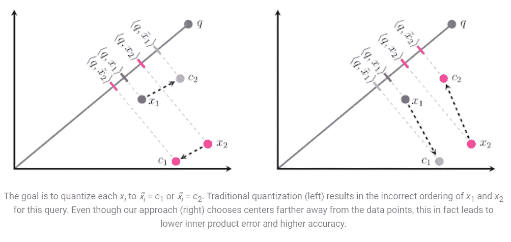

# ScaNN:更快的向量相似性搜索

> 原文：<https://medium.com/analytics-vidhya/scann-faster-vector-similarity-search-69af769ad474?source=collection_archive---------3----------------------->


研究永远是人类生活的一部分，每当有人遇到阻碍或困难时，他们总会寻找解决方法。如今，随着世界的发展，计算机技术发展得令人难以置信，但我们将永远寻找高效和优化的方法。最近 TensorFlow 发布了 ScaNN，这是一个快速高效的向量相似性搜索库，可以托管在您的机器上。已经证明，在相同的准确度下，它比大多数相似性搜索库的性能高出 2 倍。请在他们的博客上读一读

**概述:**

ScaNN 使用不同的方法处理数据中嵌入的量化，而不是通常的直接量化数据集中数据点的方法。例如:假设 *x1* 和 *x2* 是数据库中的两组嵌入，我们想要从 *x1* 和 *x2 之一中找到与 *q* 最相似的向量。*传统方法通过计算 *c1* 和 *c2* 在 *q、*上的投影(内积),发现*C1*和*C2*是 *x1* 和 *x2* 的量化版本，但是利用[扫描**扫描**扫描](https://pypi.org/project/scann/)试图计算它们在 *q* 的垂直向量上的投影，从而已经证明减少了延迟并提高了相似性得分的准确性。下面的图像描述了相同的。



正如你在上面看到的，我们左边的方法(传统的)实际上离 q 更远，即(x2 实际上比 x1 更类似于 q，但是它计算出相反的 q.c2 > q.c1)，而我们右边的方法( **ScaNN** )计算得更快更精确，即(x2 比 x1 更类似于 q，所以 q.x2 < q.x1)。请多读读上面的博客，以便更好地理解它。

**要点记住:**

让我们尝试一些场景，我们可以使用 ScaNN 来加快和优化我们的搜索解决方案，并与其他库进行比较。

使用 ScaNN 库创建搜索器时，请记住这些要点。

*   如果我们有更少的数据点，我们应该尝试使用暴力评分方法，而不是不对称散列方法
*   要创建的叶子数量接近数据点数量的平方根
*   训练样本大小应该总是大于创建的叶/簇的数量

更多优化指针可用 [*此处*](https://github.com/google-research/google-research/blob/master/scann/docs/algorithms.md) *。*

**实现:**

对于这个例子，我采用了在 Kaggle 开源的 FIFA 20 数据集。这个例子的目的是找到与被查询的特定玩家相似的玩家集合。我做了简单的预处理，如特征选择、文本分析，并将特征集缩小到相关的数量。让我们看看如何使用 ScaNN 和 sklearn 度量中的余弦相似性来实现类似的玩家搜索解决方案。数据集如下图所示。

*   在搜索器中使用数据集之前对其进行规范化。
*   按照上面定义的参数构建搜索器

在我们的例子中，因为玩家的数量大约是 18000，所以叶子的数量大约是 135，要搜索的叶子应该少于 135，并且在每个叶子中创建的训练样本也应该少于 18000。要将所有内容放入搜索器功能中，我们需要执行以下操作:

此外，下面的代码片段涵盖了使用 sklearn 的实现。

**结果:**

*   **ScaNN 结果:**玩家姓名和相似度得分以及所用时间相同。

布卡约·萨卡人:

```
Wall time: 803 µs9896       bukayo saka  1.000000
14031      aitor lorea  0.997321
5872    héctor fertoli  0.997269
8875       jacob brown  0.997254
1622   justin kluivert  0.997196
5743   tomás chancalay  0.997161
10078      hilary gong  0.997085
13294    leo bengtsson  0.997068
13278  jerome sinclair  0.997060
999      matías vargas  0.996918
```

约翰·斯通斯:

```
Wall time: 725 µs172           john stones  1.000000
56      marcos marquinhos  0.998611
774           nico elvedi  0.998170
1305          rob holding  0.997904
246      presnel kimpembe  0.997853
4914        kévin n'doram  0.997837
84        clément lenglet  0.997836
755           declan rice  0.997756
2268       alexander hack  0.997624
414   andreas christensen  0.997615
```

麦克托米内:

```
Wall time: 434 µs1028     scott mctominay  1.000000
1961  younousse sankharé  0.998196
601         tomáš souček  0.998192
1808       lukas lerager  0.998001
996         marko grujić  0.997909
2582      diego gonzález  0.997841
2286         lucas silva  0.997767
79         rodrigo rodri  0.997743
338             emre can  0.997738
818       soualiho meïté  0.997732
```

*   **使用 Sklearn**

布卡约·萨卡人

```
Wall time: 4.4 s2431       bojan jokič  0.842173
1724   tomasz kędziora  0.842173
1808     lukas lerager  0.842173
1802  nicolás castillo  0.842173
1799   nicolae stanciu  0.842173
1793     robin quaison  0.842173
1791  dimitrios pelkas  0.842173
1790         tom rogić  0.842173
7616      池忠国 zhongguo  0.842173
1761     ryan christie  0.842173
```

约翰·斯通斯

```
Wall time: 4.36 s2431       bojan jokič  0.842173
1724   tomasz kędziora  0.842173
1808     lukas lerager  0.842173
1802  nicolás castillo  0.842173
1799   nicolae stanciu  0.842173
1793     robin quaison  0.842173
1791  dimitrios pelkas  0.842173
1790         tom rogić  0.842173
7616      池忠国 zhongguo  0.842173
1761     ryan christie  0.842173
```

从上述结果的比较中我们可以看出，就结果的精确度和获得所需结果的低延迟而言，ScaNN 是一种有效的工具。两种方法的差异在 10 的数量级，甚至结果的精度似乎也支持 ScaNN 实现。如果需要的话，在你的任务中试试 ScaNN，因为它是向量相似性搜索的一个很好的工具。如果你喜欢，请鼓掌。感谢您的宝贵支持，再见，下次再见。