# 扫描私有和公共 Github 库—white source renew

> 原文：<https://medium.com/analytics-vidhya/scanning-private-and-public-github-repositories-whitesource-renovate-e8036fbe8002?source=collection_archive---------12----------------------->

> 随着越来越多的人意识到开源的好处，越来越多的人在他们的应用程序中使用开源库和组件。使用一段代码或一个开源库可以大大加快开发过程。然而，需要考虑的风险包括依赖性和安全性问题。

# WhiteSource 更新 Github 应用程序

> 安装翻新 Github 应用程序:

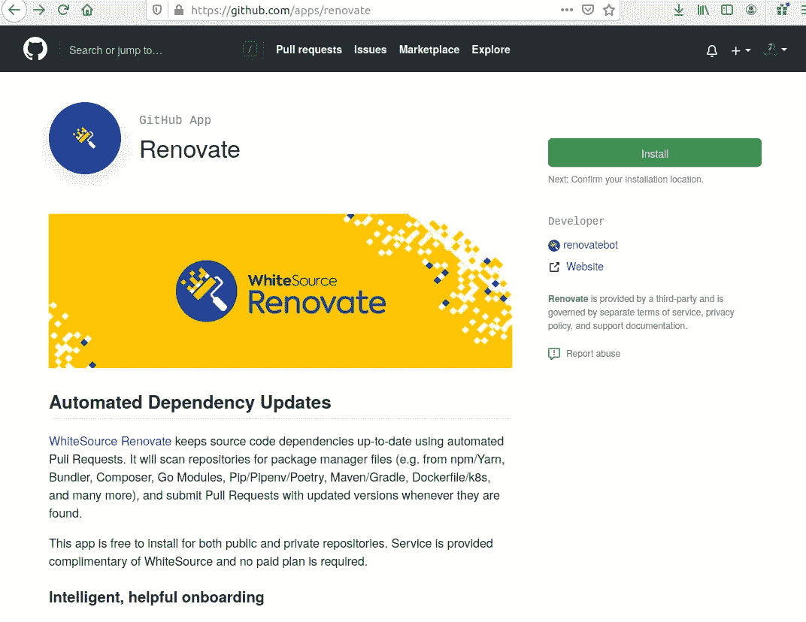

作者图片

> 注册翻新机器人:

作者图片

> 授予访问权限并合并此 PR 以在您的 Github 存储库上启用 white source renew bot:

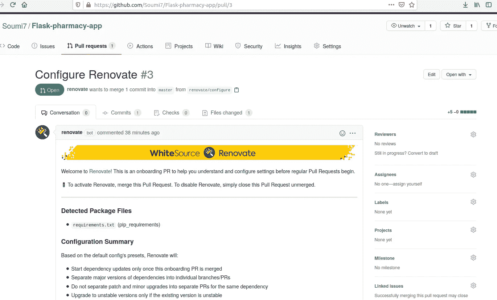

作者图片

> 一旦您接受它，PRs 将由 white source renew Bot 自动创建。

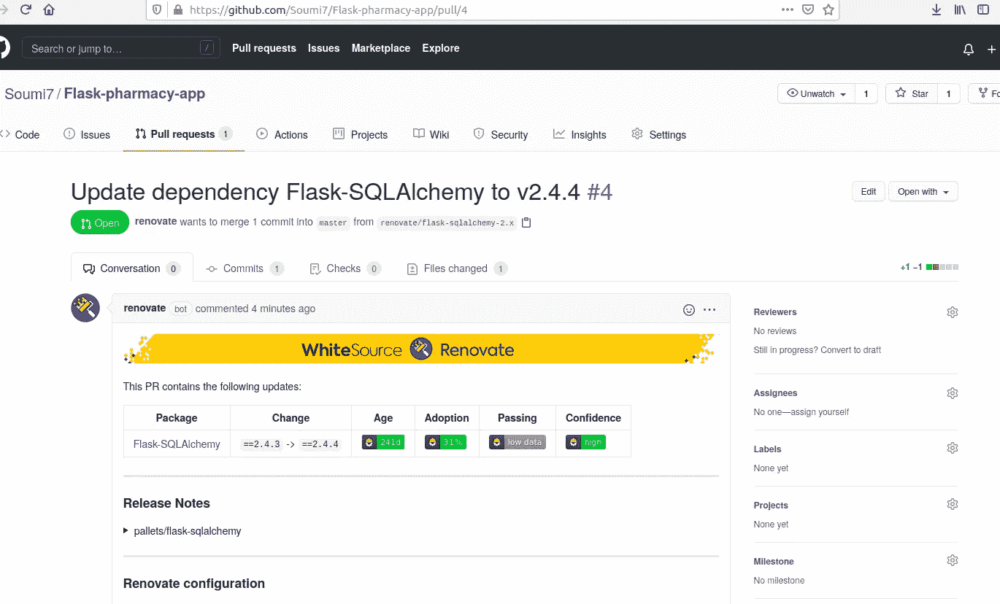

作者图片

> 在我们合并之前，预计会有多少个 PRs，以及漏洞的数量:

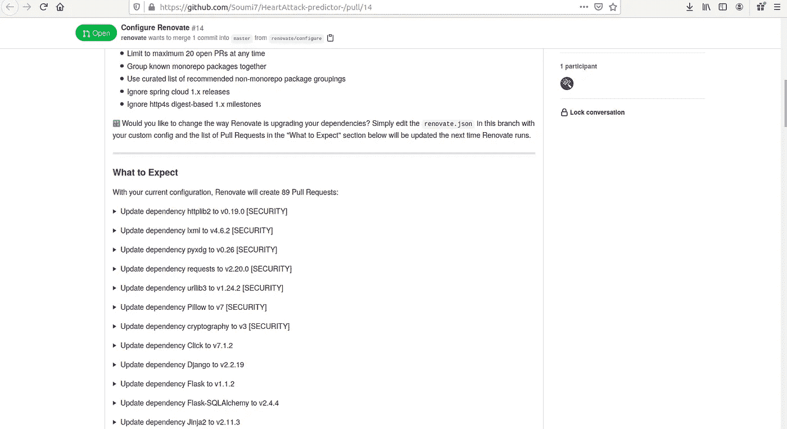

作者图片

> 合并 PR:

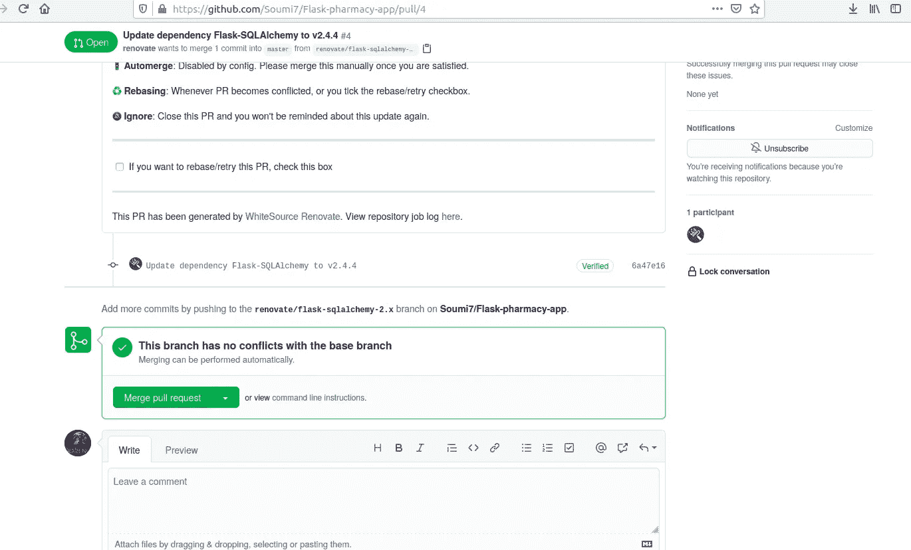

作者图片

> 您将能够在 renew 仪表板上看到所有的 github 库:

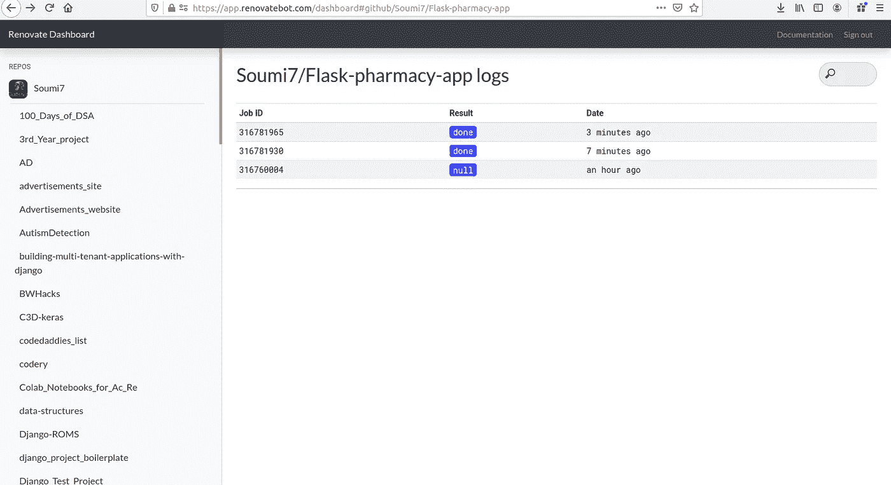

作者图片

> 您将看到用于修复开源漏洞的新 PRs 出现在存储库的“拉请求”部分:

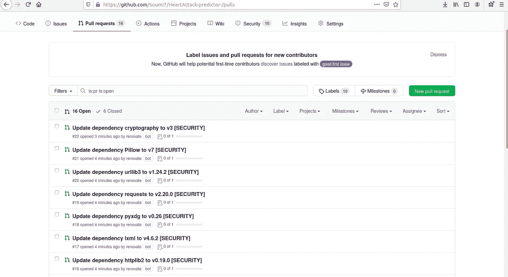

作者图片

> 下面是由 renew bot 打开的一个 PRs:

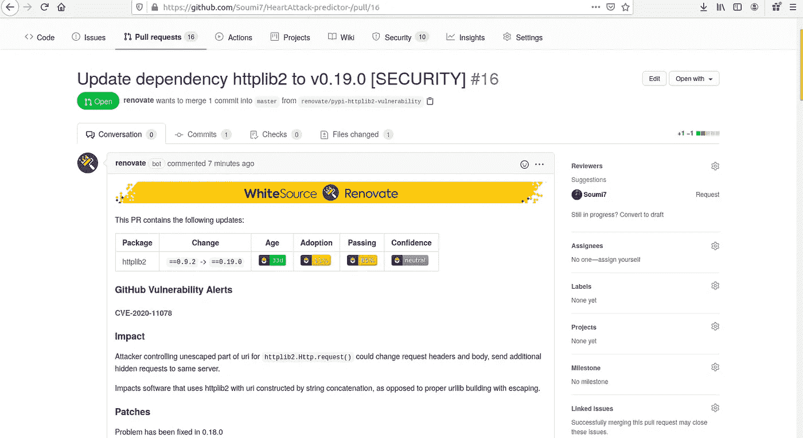

作者图片

> 提供了有关更新和修补程序影响的信息。还建议了变通方法。

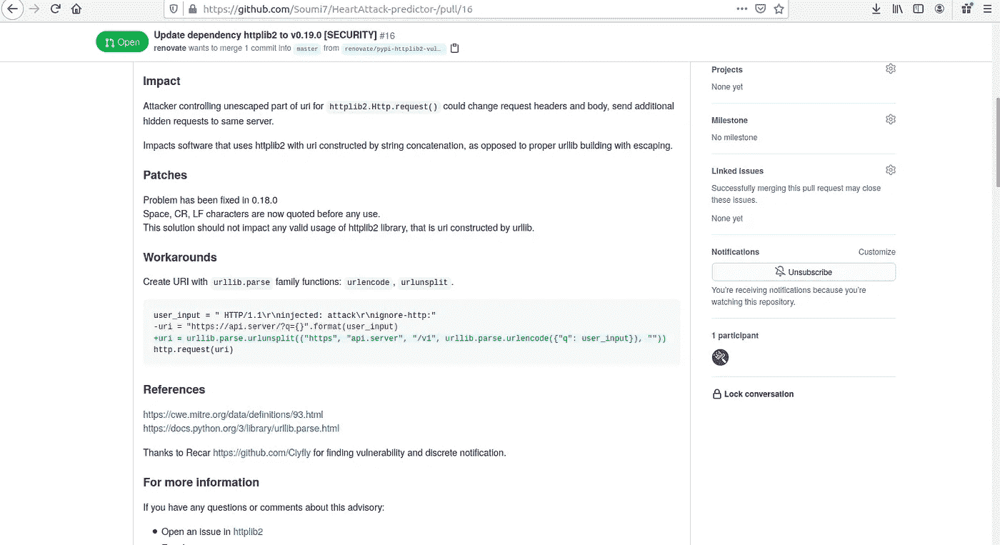

作者图片

> 它描述了漏洞:

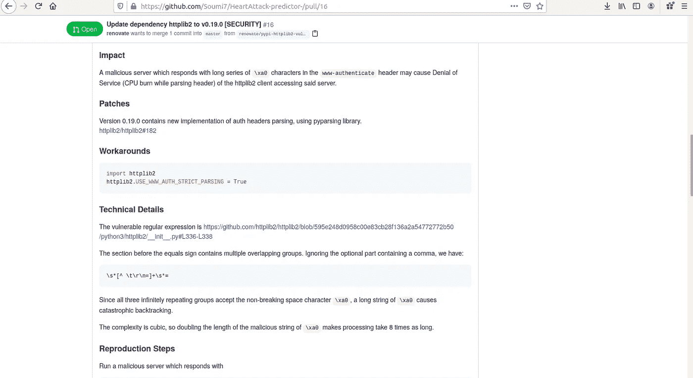

作者图片

> 提供了一段代码来重现该问题并检查:

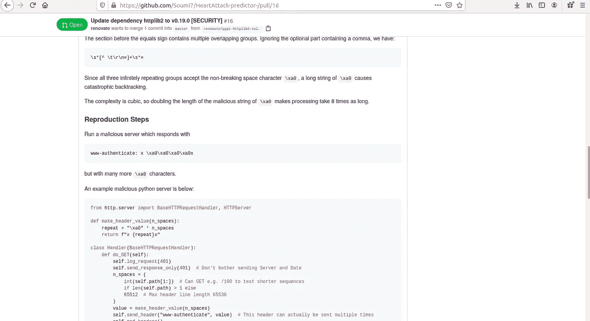

作者图片

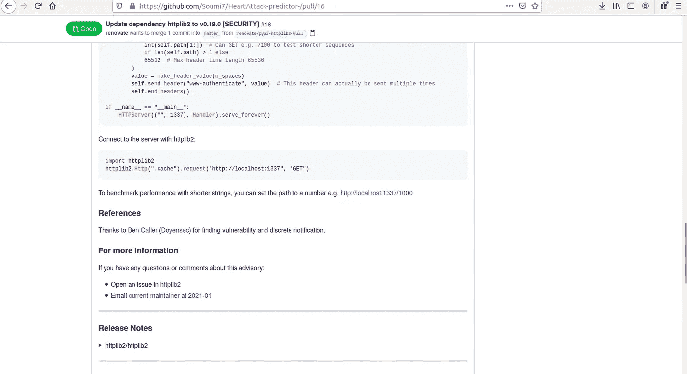

作者图片

> 合并此 PR 以解决问题！

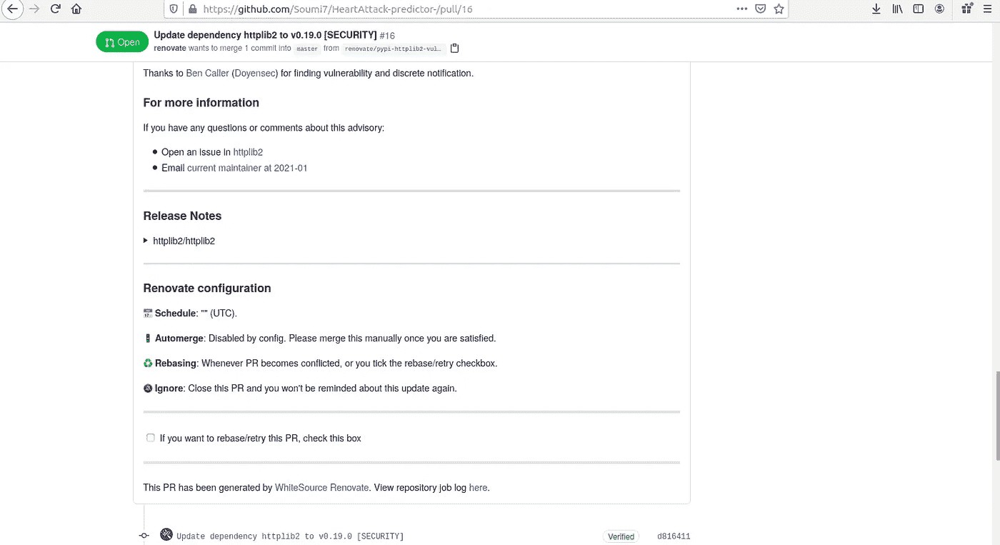

作者图片

> 同样，所有其他依赖和安全问题将被确定，并修复它们的公共关系将由 white source renew Bot 自动生成！太酷了！