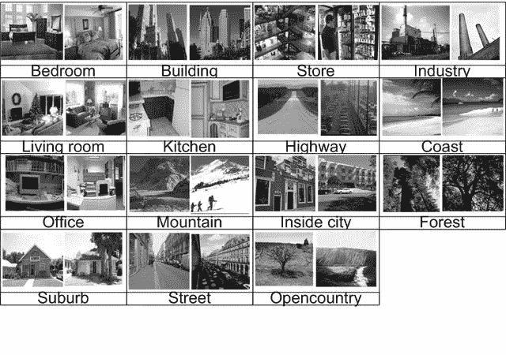

# 基于迁移学习的场景 15 图像分类问题

> 原文：<https://medium.com/analytics-vidhya/scene-15-image-classification-problem-with-transfer-learning-231962b85c6e?source=collection_archive---------6----------------------->

图像分类是将图像分类到不同类别的过程。图像分类是深度学习最重要的应用之一。迁移学习是解决图像分类问题的一种高效技术。基本上，在迁移学习中，我们必须使用“ImageNet”数据集权重来提高预测精度。为了证明我的观点，我使用了 scene-15 数据集。你可以在这里找到这个数据集。

# 场景 15



来自 scene-15 数据集的一些图片

如上所示，Scene-15 数据集包含 15 个不同类别的不同图片。在 15 个不同的类中总共有 4485 个图像可用，其中我们将使用 100 个图像进行训练，其余的用于测试。我们有 1500 张图片用于训练，2985 张图片用于测试。

让我们首先导入库。

```
# importing libraries***import pandas as pd
import numpy as np
import os
import cv2
import random
import keras
import matplotlib.pyplot as plt******from scipy import misc
from plot_keras_history import plot_history
from keras import Model
from keras.applications.resnet50 import preprocess_input
from keras.applications import ResNet152V2
from keras.preprocessing.image import img_to_array, load_img
from keras.layers import ZeroPadding2D
from keras.models import Sequential
from keras.layers import Dense, Conv2D, MaxPooling2D,Dropout, Flatten, BatchNormalization, Concatenate, AveragePooling2D
from keras.callbacks import EarlyStopping, LearningRateScheduler***
```

# 拆分数据

在训练和测试中分割数据是很重要的。但是这里我们有 15 个不同的文件夹可用，所以首先尝试将数据拆分到 train/test 文件夹中。以下代码将有助于将函数拆分到指定位置的 Train 和 Test 文件夹中。

```
# function to split images into train&test***def create_train_test(data_dir, class_folder):
    directory = data_dir + "/" + class_folder + "/"
    data = os.listdir(directory)
    random.shuffle(data)
    train = data[:100]  # random 100 images (random.shuffle) for train
    test = data[100:]  # rest for test******return train, test***# Getting available features***class_folder = []
path = "C:/Users/Cobra/Python Learning/Lakehead Assignments/Assignent_2_(part-1)/15-Scene/"******for category in sorted(os.listdir(path)):
    class_folder.append(category)***# splitting images into train & test
# Remember we just split the image into train & test (without preprocessing)**train_set = []
test_set = []****data_dir = 'give data dir path'****for class_name in class_folder:
 train, test = create_train_test(data_dir, class_name)
 train_data = [class_name, train]
 test_data = [class_name, test]
 train_set.append(train_data)
 test_set.append(test_data)
train_set = np.array(train_set)
test_set = np.array(test_set)**
```

创建训练和测试图像数据后，我们必须将它们存储在不同的地方以备将来使用。

```
# Create directory to store train and test folder**dir_create = “give dir path”
output_directory = os.mkdir(os.path.join(dir_create, ‘15-Scene_output’))**
```

现在，让我们创建一个函数，将图像写入到上面创建的文件夹中。

```
# Function to create train and test folder in given directory
# data_dir = Original dataset path
# output_path = Path where we want to create folder
# output_directory = output directory name
# folder_name = folder name like. Train/Test
# dataset = train_set/test_set**def write_img_to_folder(data_dir, output_path, output_directory, folder_name,
 dataset):****new_folder_path = os.path.join(output_directory, folder_name)
 make_directory = os.mkdir(new_folder_path)****for data in dataset:
 class_name = data[0]
 data_files = data[1]
 data_path = os.path.join(
 output_path + ‘/’ + str(output_directory) + ‘/’ + str(folder_name),
 class_name)
 category_dire = os.mkdir(data_path)
 for filename in data_files:
 img = cv2.imread(data_dir + ‘/’ + class_name + ‘/’ + filename, 0)
 cv2.imwrite(os.path.join(data_path, filename), img)****output_path = os.getcwd()**# Train/Test folder using write_img_to_folder function**train_folder = write_img_to_folder(data_dir, output_path,'Train', train_set)
test_folder = write_img_to_folder(data_dir, output_path,'Test', test_set)**
```

# 加载数据

现在，我们的数据集可以使用了。我们需要从存储的路径中加载图像，并将它们转换成一个数组来执行图像分类。所以，让我们从将图像转换成数组开始。

```
# Function to load image and convert into array**def convert_img_to_array(dir_path):
    X = []
    y = []
    one_hot_lookups = np.eye(15)
    for category in sorted(os.listdir(dir_path)):
        for file in os.listdir(dir_path + category):** **img = load_img(dir_path + category + '/' + file,
                       target_size=(224, 224))**  # Load image
            **img = img_to_array(img)** # Convert image to array
            **img = preprocess_input(img)**  # Preprocessing on the image
            **X.append(img)**  # Append image to X_train
            **y.append(np.reshape(one_hot_lookups[int(category)],
                                  [15]))**  # Append category to y_train
    **return X,y**
```

在创建了从给定路径加载图像并将其转换为数组的函数之后，我们需要生成 x_train，y_train 和 x_test，y_test 数据。

```
**def load_data():
    train_dir_path = "Give train dir path"
    X_train,y_train = convert_img_to_array(train_dir_path)

    test_dir_path = "Give test dir path"
    X_test, y_test = convert_img_to_array(test_dir_path)

    X_train = np.asarray(X_train)
    X_test = np.asarray(X_test)
    y_train = np.asarray(y_train)
    y_test = np.asarray(y_test)

    X_train /= np.std(X_train, axis = 0)
    X_test /= np.std(X_test, axis = 0)

    return ((X_train, y_train), (X_test, y_test))****(x_train, y_train), (x_test, y_test) = load_data()**
```

# 创建迁移学习模型

在生成模型之前，有一些事情需要明确。第一个是什么是迁移学习，简而言之，迁移学习是一种使用其他预训练模型的权重以获得更高准确性的技术。这里，我们使用“ImageNet”预训练权重，该数据集有 1000 个类。第二件事是，我们需要添加一些额外的层，以获得所需的输出。我们只有 15 个类，因此，为了解决最终节点，我们在模型中添加了一些额外的层。这里，我们使用 ResNet152V2 预训练模型进行迁移学习。让我们开始程序。

```
**def transfer_model(weights, input_shape, num_output):**
    **transfer_model = ResNet152V2(weights=weights, include_top=False,                              input_shape=input_shape,pooling='max',classifier_activation='softmax')**
    **inp = transfer_model.input****new_classification_layer = Dense(num_output, activation='softmax')** # make a new softmax layer with 257 neurons**out = new_classification_layer(transfer_model.layers[-1].output)** # connect our new layer to the second to last layer in ResNet152V2, and make a reference to it**final_model = keras.Model(inp, out)** # create a new network between inp and out

 **   return final_model****transfer_model = transfer_model(weights='imagenet',input_shape=(224,224,3), num_output=15)****transfer_model.summary()**
```

从上面的代码中，我们将得到下面的输出。


注意:这只是具有 15 个输出节点的模型的结尾。

# 模型的编制

创建模型后，需要在拟合数据集之前进行编译。所以，我们先来编译一下模型。

```
**def compile_model(model):
    lr_schedule = keras.optimizers.schedules.ExponentialDecay(
    initial_learning_rate=0.01, decay_steps=1000, decay_rate=0.9)**# Optimizer for the model
 **optimizer = keras.optimizers.SGD(learning_rate=lr_schedule)**# Creating the log file
    **model.compile(loss='categorical_crossentropy',
              optimizer=optimizer,
              metrics=['accuracy'])
    return model****final_model = compile_model(final_model)**
```

# 拟合数据

编译模型后，我们需要用训练和测试数据来拟合模型。

```
**accuracy = []
losses = []****for i in range(3):
    keras.backend.clear_session()

    model = transfer_model

    model = compile_model(model)
    model_history = train_model(model, x_train, y_train, x_test, y_test)
    loss, acc = model.evaluate(x_test, y_test, verbose=1)

    plot_history(model_history.history)
    plt.show()

    print(f"\n")
    print(f"------------------------------------------------------")
    print(f"\n")
    accuracy.append(acc)
    losses.append(loss)**
```

在这里，我已经运行了整个模型 3 次，以达到最佳的平均精度。通过实现这段代码，我能够达到 89.53%的准确率。

谢谢你。

请随时到 jivaniutsav007@gmail.com 找我。