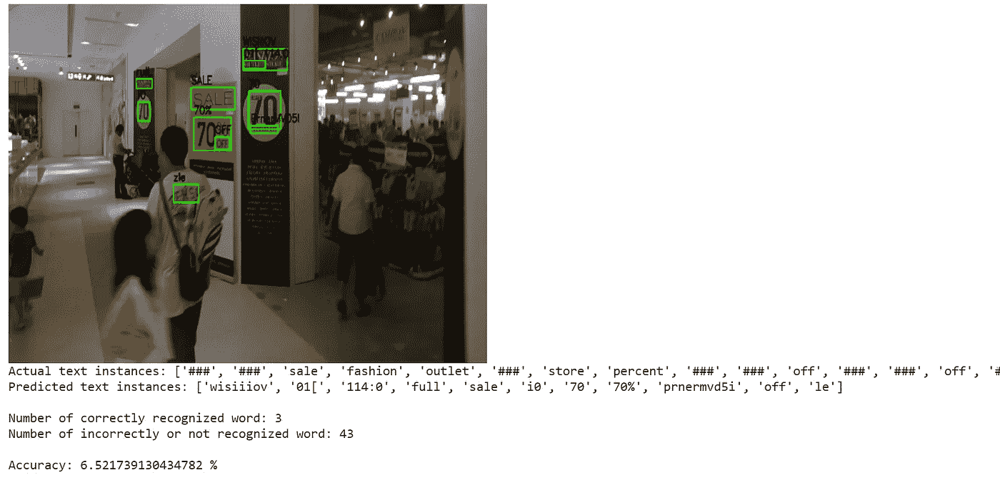

# 文本检测、识别和翻译

> 原文：<https://medium.com/analytics-vidhya/scene-text-detection-recognition-and-translation-ad20c31e869e?source=collection_archive---------0----------------------->

用于文本检测的 ICDAR-2015 图像

# 目录:-

1.  问题介绍。
2.  商业问题的深度学习公式。
3.  业务限制。
4.  数据的来源。
5.  探索性数据分析。
6.  最终创建数据，以便使用机器学习和深度学习模型。
7.  用于检测和识别的模型。
8.  文本翻译。
9.  使用最佳模型的最终管道。
10.  使用烧瓶部署
11.  未来的工作。
12.  Github 和 LinkedIn 个人资料。
13.  参考文献。

# **1)简介**

由于自然图像中的文本阅读在文档分析、场景理解、机器人导航和图像检索中的大量实际应用，它已经在计算机视觉领域吸引了越来越多的关注。尽管以前的工作在文本检测和文本识别方面都取得了显著的进展，但是由于文本模式的巨大变化和高度复杂的背景，这仍然是一个挑战。

场景文本阅读最常见的方式是将其分为文本检测和文本识别，作为两个独立的任务来处理。基于深度学习的方法在这两个领域都占据了主导地位。

# 2)业务问题的深度学习公式

文本检测:文本检测是一种技术，其中图像将被提供给模型，文本区域通过在其周围绘制边界框来检测。

文本识别:在文本检测之后是文本识别，其中检测到的文本区域被进一步处理，以便识别什么是文本。

文本翻译:在我的博客中，识别出的英语文本被翻译成印地语。

为了执行上述任务，在每个阶段使用不同的深度学习模型，我们将在本博客稍后讨论。

# 3)业务限制

图像可能模糊、有噪声、质量差，或者具有复杂背景的多方向(旋转/弯曲)图像。这使得难以检测文本区域。

如果部署模型来实时检测、识别和翻译图像中的文本，低延迟是必不可少的。

# 4)数据的来源

1.数据由 ICDAR 2015 提供。它是 ICDAR 2015 鲁棒阅读竞赛的挑战 4，常用于面向场景的文本检测和定位。这个数据集包括 1000 个使用可穿戴相机的训练图像。对于文本识别任务，它提供了 3 个特定的单词列表:

*   每张图片 100 个单词，包括图片中出现的单词和干扰词。
*   出现在训练集中的所有单词(3 个字符或更长的单词，仅包含字母)的词汇表。
*   1000 个文本文件与单词水平本地化和转录地面真相。

ICDAR-2015

2.ICDAR 2013 由 229 幅训练图像组成。与上面不同的是，它由水平文本组成。

ICDAR-2013

所有上述数据仅由英语文本组成。它们中的大多数是水平方向的，而一些具有多方向的文本区域。

# 5)探索性数据分析

## ICDAR-2013–15

函数加载边界框，并将其绘制在 ICDAR _ 2013–15 图像的文本区域周围。

ICDAR-2013 的输出图像

1.  以上图片来自 ICDAR 2013，由 229 张训练图片组成。
2.  它由水平文本组成。
3.  它只包含英文文本。

## ICDAR-2015

类似地，使用源 ICDAR-2015 以与上述相同的方式编写另一个函数，并获得图像。

ICDAR-2015

1.  以上图片来自 ICDAR 2015 数据附带场景文字。
2.  这里的文本只有一种语言，即英语，但是文本区域是多方向的，其中一些也是模糊的。

## 图像的大小

1.  图像的大小与 ICDAR 2015 附带场景文本的大小相同，为 1280 x 720。

IC Dar _ 2013–15 _ focused _ Scene _ Text 数据的图像大小不同。

使用上述代码打印前 10 幅图像的高度和宽度。

# 6)最终创建数据，以便使用深度学习模型。

每个数据帧包含:

1.  图像的路径
2.  地面实况; 真值（机器学习）
3.  边界框的坐标。
4.  矩形的方向和矩形的中心。
5.  标签用于表示哪个图像属于哪个数据集。所以必须在训练测试分割中平均分割数据。df_2013 的标签为 1，df_2015 的标签为 2

数据框已创建

# 7)用于检测和识别的模型

*   MSER(最大稳定极值区域):

MSER 是一种图像中斑点检测的方法。MSER 算法从图像中提取多个共变区域，称为 mser:MSER 是图像的一些灰度级集合的稳定连通分量。它可以用来异步检测文本。

ICDAR-2013 图片上的 MSER

ICDAR-2015 图片上的 MSER

上述内容在文本检测方面做得不太好。尽管它对水平文本数据非常有效。

*   东方和 Pytesseract 模型

EAST(高效精确的场景文本检测器):

这是一个基于这篇[论文](https://arxiv.org/abs/1704.03155v2)的非常健壮的文本检测深度学习方法。值得一提的是，这只是一种文本检测方法。它可以找到水平和旋转的边界框。它可以与任何文本识别方法结合使用。

本文中的文本检测流水线排除了冗余和中间步骤，只有两个阶段。

人们利用全卷积网络直接产生字或文本行级预测。产生的预测可以是旋转的矩形或四边形，通过非最大值抑制步骤进一步处理，以产生最终输出。

东方模型

EAST 可以检测图像和视频中的文本。正如论文中提到的，它在 720p 图像上以 13FPS 的速度近乎实时地运行，具有很高的文本检测准确性。这项技术的另一个好处是它的实现在 OpenCV 3.4.2 和 OpenCV 4 中可用。我们将看到这个 EAST 模型与文本识别一起运行。

文本识别的 Pytesseract 模型；

Pytesseract 是 Tesseract-OCR 引擎的包装器。它作为 tesseract 的独立调用脚本也很有用，因为它可以读取 Pillow 和 Leptonica 图像库支持的所有图像类型，包括 jpeg、png、gif、bmp、tiff 等。

使用 East 和 Pytesseract 后 ICDAR- 2013 的一些输出图像:

使用 East 和 Pytesseract 后 ICDAR- 2015 的一些输出图像:

上述模型非常适合检测不模糊的水平文本。它在模糊图像的文本识别方面做得并不好。

文本检测对于模糊图像是有益的，它检测模糊的文本区域，但是不能理解文本。

*   简易 OCR:

检测部分采用 CRAFT 算法，识别模型为 CRNN。它由 3 个主要部分组成，特征提取(我们目前使用的是 [Resnet](https://analyticsindiamag.com/guide-to-building-a-resnet-model-with-without-dropout/) )、序列标注()和解码(CTC)。EasyOCR 没有太多的软件依赖，可以直接和它的 API 一起使用。

EasyOCR 可以同时处理多种语言，只要它们相互兼容。

Reader 类是 EasyOCR 的基类，它包含一个语言代码和其他参数的列表，比如默认设置为 True 的 GPU。只需要运行一次就可以加载必要的模型。模型重量可以自动下载，也可以手动下载。

然后是 readtext 方法，这是 Reader 类的主要方法。

输出显示了文本的 4 个边界框坐标(x，y)以及识别的文本和置信度得分。

在代码中，我将语言设置为“en ”,意思是英语。

1.  上述算法在文本检测方面相当好，不仅对于水平文本，而且对于不同方向的文本区域。
2.  文字识别对于清晰的横排文字非常好。在模糊的和多方向的文本区域的情况下，精确度下降。

EasyOCR 在很多方面比 tessera CT(Google 创建的另一个 OCR 引擎，与 python 包 Pytesseract 一起使用)表现更好。它易于使用，只需要几行代码就可以实现，对于大多数经过测试的图像都具有适当的准确性，并且可以扩展到多种语言。

# 8)文本翻译

我正在使用 **englisttohindi** 模块将英语单词翻译成印地语单词。

# 9)使用最佳模型(即 Easy OCR)的最终管道

1.  上述模型使用 easy ocr 进行文本识别和检测，并使用 EngtoHindi python 库将英语单词翻译成印地语单词。
2.  该模型适用于高分辨率(清晰的文本区域)，但不适用于模糊的文本区域。
3.  有些单词被发现有微小的拼写错误

# 10)使用烧瓶展开

上面的管道也是使用 flask 部署的:

# 11)未来的工作

1.  我们可以探索更多，并尝试建立模型，更好地为具有多方向文本区域的模糊图像工作。
2.  此外，我们不仅可以尝试将语言翻译成印地语，还可以翻译成其他流行语言。
3.  尝试建立一个检测任何语言文本区域的模型，而不仅仅是英语。

# 12) Github 和 LinkedIn 个人资料

***完整的教程代码你可以在 github*** [***这里***](https://github.com/Mansisarda1999/Text-Detection-recognition-and-translation) 找到

 [## 曼西·萨尔达-毛拉纳·阿布·卡拉姆·阿扎德技术大学，西孟加拉邦，前称 WBUT …

### 查看曼西·萨尔达在全球最大的职业社区 LinkedIn 上的个人资料。曼西有一份工作列在他们的…

www.linkedin.com](https://www.linkedin.com/in/mansi-sarda-87b76a168/) 

# 13)参考文献

1.  [https://analyticsindiamag . com/hands-on-tutorial-on-easy ocr-for-scene-text-detection-in-images/](https://analyticsindiamag.com/hands-on-tutorial-on-easyocr-for-scene-text-detection-in-images/)
2.  [https://jaafarbenabderrazak-info . medium . com/opencv-east-model-and-tesse ract-for-detection-and-recognition-of-text-in-natural-scene-1fa 48335 C4 D1](https://jaafarbenabderrazak-info.medium.com/opencv-east-model-and-tesseract-for-detection-and-recognition-of-text-in-natural-scene-1fa48335c4d1)
3.  [https://www . geeks forgeeks . org/build-an-application-to-translate-English-to-Hindi-in-python/](https://www.geeksforgeeks.org/build-an-application-to-translate-english-to-hindi-in-python/)
4.  [https://www . geeks forgeeks . org/text-detection-and-extraction-using-opencv-and-ocr/](https://www.geeksforgeeks.org/text-detection-and-extraction-using-opencv-and-ocr/)
5.  [https://github . com/oyyd/frozen _ east _ text _ detection . Pb/blob/master/frozen _ east _ text _ detection . Pb](https://github.com/oyyd/frozen_east_text_detection.pb/blob/master/frozen_east_text_detection.pb)
6.  [https://stack overflow . com/questions/13928155/spell-checker-for-python/48280566 #:~:text = The % 20 best % 20 way % 20 for % 20 spell，The % 20 fast % 20 one % 20 is % 20 sym spell](https://stackoverflow.com/questions/13928155/spell-checker-for-python/48280566#:~:text=The%20best%20way%20for%20spell,The%20fastest%20one%20is%20SymSpell)
7.  [https://www . geeks forgeeks . org/python-opencv-cv2-puttext-method/](https://www.geeksforgeeks.org/python-opencv-cv2-puttext-method/)
8.  [https://www . geeks forgeeks . org/python-opencv-cv2-puttext-method/](https://www.geeksforgeeks.org/python-opencv-cv2-puttext-method/)
9.  [https://www . Applied ai course . com/course/11/Applied-Machine-learning-course](https://www.appliedaicourse.com/course/11/Applied-Machine-learning-course)