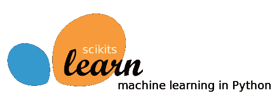
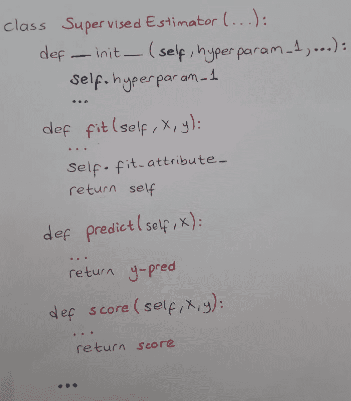
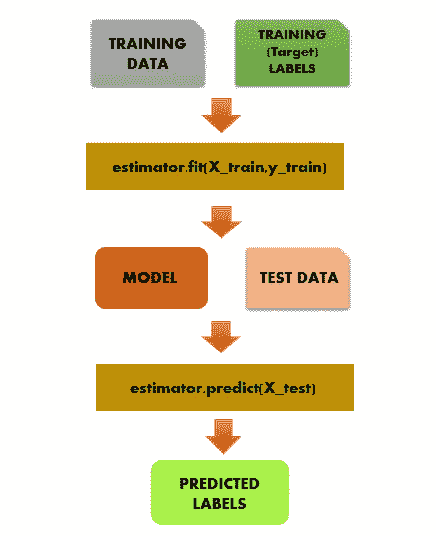

# sci kit-通过简单的解释学习设计

> 原文：<https://medium.com/analytics-vidhya/scikit-learn-design-with-easy-explanation-b3bcb060580?source=collection_archive---------15----------------------->



我想我们都同意 Scikit-learn 是 Python 的主要机器学习库。它实际上是初学者友好的库，因为它的语义接口(API)。这就是为什么许多人仍然在使用和贡献 Scikit-Learn 库的原因。


github.com

Scikit-Learn 库用 Python 的 OOP(面向对象编程)方法设计得非常好。点击查看[的课程。](https://scikit-learn.org/stable/modules/classes.html)

顺便说一下，没有这样的类，但监督学习算法可能有这样的结构:



对不起，我写得不好

那么什么是估计量呢？那些 fit()、predict()和 score()方法呢？我们结账吧。

**Scikit 学习库有三个主要接口(API):**

**估算器**:sci kit-learn 的主核心接口。简而言之，我们说估计器是可以学习并使用 *fit()* 方法估计数据的某些参数的类。所有估计器的超参数都可以通过公共实例变量直接访问。比如随机森林算法就是一个估计量。

```
estimator = estimator.fit(data, targets) #supervised learningorestimator = estimator.fit(data) #unsupervised learning
```

**Transformers** :也可以用 *transform()* 或 *fit_transform()* 方法转换数据的估算器称为 Transformers。

```
new_data = transformer.transform(data)new_data = transformer.fit_transform(data) #fit_transform method is much faster than doing fit() and transform() in order. 
```

**预测值:**有些估计量也可以预测一个值。例如，我们可以通过调用最终模型上的 *predict()* 和 *score()* 函数来预测最终回归模型的数量。

```
prediction = predictor.predict(data)
probability = predictor.predict_proba(data)score = model.score(data)
```

sklearn 库中的 SimpleImputer 类通常用于处理缺失值。这是一个估算器，也是一个转换器的例子。

这是我做的一个监督学习方案。注意， *fit()* 方法在这里有两个参数。



> 估计量和预测量有什么区别？

尽管预测器也是估计器，但它们之间还是有细微的区别。**估计器**通过 *fit()或 fit_transform()* 方法学习训练数据并估计某些参数，而**预测器**通过 *predict()* 方法对未知数据(即测试数据)进行预测以预测一个值。

*感谢阅读。如果您有任何反馈，请告诉我。*

***参考文献*** :

[](https://scikit-learn.org/stable/developers/develop.html) [## 开发 scikit-learn 估算器— scikit-learn 0.24.0 文档

### 无论您是提议在 scikit-learn 中包含一个评估器，还是开发一个与……

scikit-learn.org](https://scikit-learn.org/stable/developers/develop.html) 

*使用 Scikit-Learn、Keras 和 TensorFlow 进行机器实践学习*