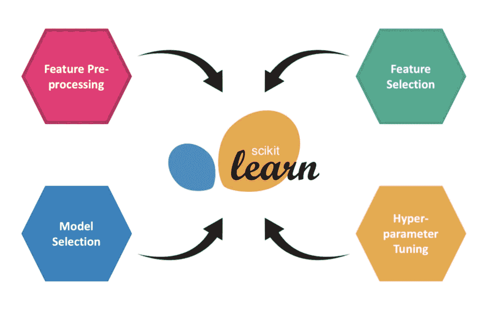

# sci kit-学习管道转换器——转换目标变量的麻烦(第 1 部分)

> 原文：<https://medium.com/analytics-vidhya/scikit-learn-pipeline-transformers-the-hassle-of-transforming-target-variables-part-1-6dfb714e2aad?source=collection_archive---------1----------------------->

在使用 Scikit-Learn 对时间序列预测进行了相当长一段时间的工作后，我遇到了一个与标准化管道的实现相关的主要问题:在生产环境中创建可以将目标变量转换为特征(例如滞后、移动平均)的整个管道。



在对该主题进行了一些广泛而徒劳的研究后，我决定尝试解决这个问题，而不必求助于混乱且有些硬编码的预处理函数，这些函数必须在实际模型之前调用。

本文第 1 部分的想法是介绍我如何使用一个简单而优雅的解决方案来克服这个问题。

## 通常的方法

每当您遇到关于时间序列预测问题的文章或故事时，总会有“转换为监督的”函数，在该函数中，您将传递一个数据帧或数组以及一些参数，以将一维时间序列转换为监督的学习数据集。

下面的例子摘自[机器学习大师](https://machinelearningmastery.com/convert-time-series-supervised-learning-problem-python/)描述了这样一个函数

使用这个函数进行原型设计或测试绝对没有错。主要的缺点是**它不能用在 Sklearn 变压器里面。**

从现在开始，我将假设您知道变压器是如何工作的，并且还知道如果您在管道上链接变压器，唯一要传递的参数是您的 *X* (特性数组)而不是您的目标变量 *y.* 唯一的例外是标签 transformers 或 **TransformedTargetRegressors。**

底线是:你不能使用一个将你的目标变量数组的一部分转换成你的 X 数组的一部分的转换器。你要么改变一个，要么改变另一个。

如果您不确定我在说什么，请自己尝试下面的代码并检查结果:

如果您尝试运行此代码，将会出现以下错误:

```
**TypeError**: unsupported operand type(s) for +: 'int' and 'NoneType'
```

这是因为转换函数的 *y* 参数没有通过管道传递。

正是因为这个原因，您不能让您的数据转换都发生在一个单一的、整洁的管道中，而可以作为工件存储在任何 MLOps 平台上。这里唯一的选择是在创建模型之前进行特征转换。

## 好的，知道了！那么…我们该怎么办？

首先，首先:变压器实际上是做什么的？

根据定义，它在实例化期间接受任意数量的参数，然后接受一个对象，对其进行转换，并返回转换后的对象。通常这些对象是我们的数据帧或 numpy 数组，然而，这里的技巧是理解这些对象实际上可以是任何东西！


考虑到这一点，我们为什么不创建一个包含 X 和 y 的简单对象，并对其进行变换呢？

让我们试试上面的同一个例子，但是使用这个小技巧:

这就对了。现在你有了一个转换器，可以毫不费力地转换 X 和 y。请注意，这种策略可以进一步扩展到极其复杂的管道，并且仍然有效。

如果您需要调试输出数据，并且不希望到处编写打印语句和在转换中设置断点，您甚至可以使用例如列表将中间步骤中的数据分配给对象。

## 结束语

在这个故事中，我们从如何使用特性和目标变量来欺骗 Scikit-Learn 管道来转换我们的数据的基础开始。现在我们有了数据转换管道，这个故事的第 2 部分将演示我们如何将这个对象传递给我们的模型，而不必创建中间步骤，允许我们直接使用`**fit()**`和`**predict()**` 方法。

## 第二部分:

https://Carlos-schwabe-44885 . medium . com/sci kit-learn-pipeline-transformers-the-less-of-transforming-target-variables-part-2-EC 8546 c 33 AC 6