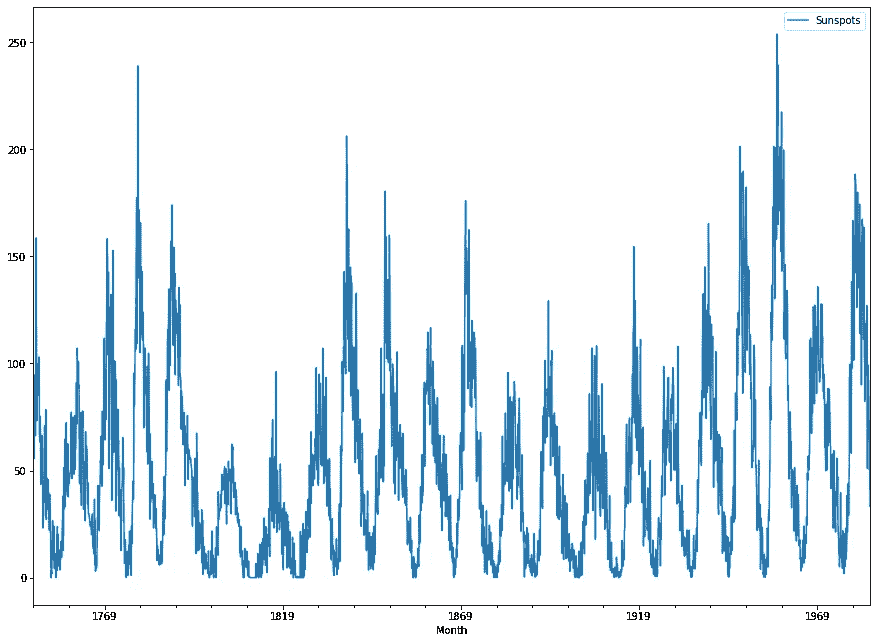
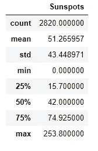
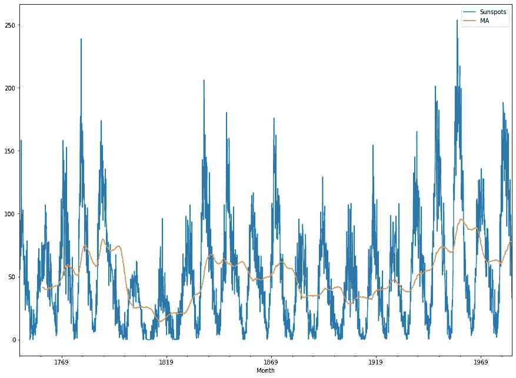
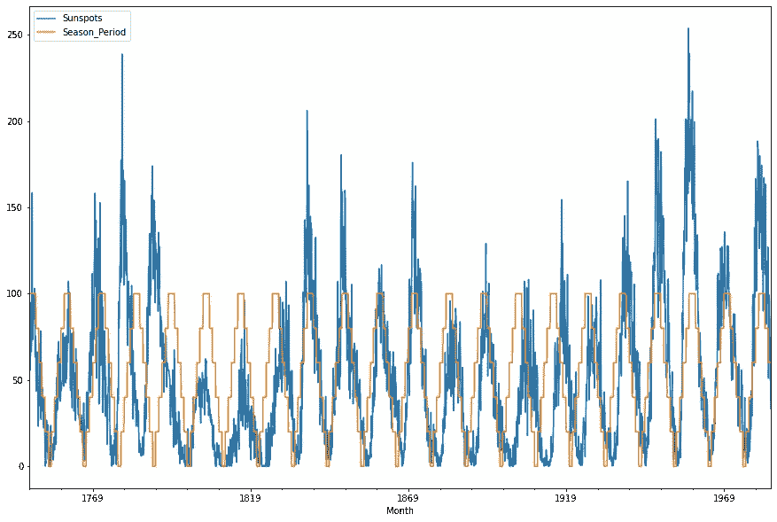
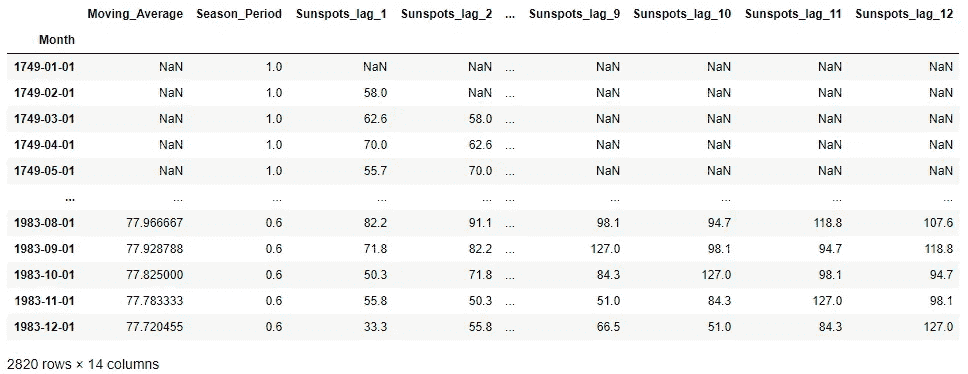
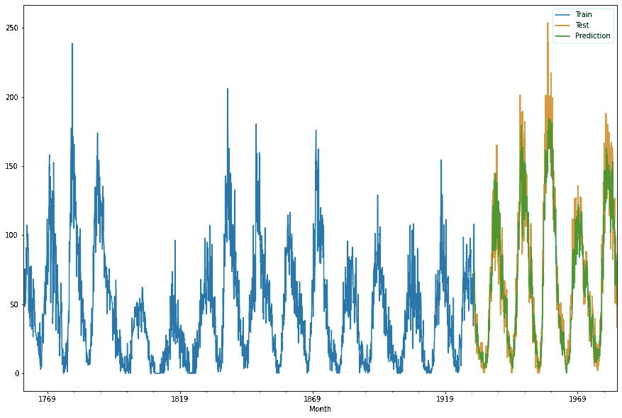

# sci kit-学习管道转换器——转换目标变量的麻烦(第 2 部分)

> 原文：<https://medium.com/analytics-vidhya/scikit-learn-pipeline-transformers-the-hassle-of-transforming-target-variables-part-2-ec8546c33ac6?source=collection_archive---------3----------------------->

在本文的第 1 部分中，我们学习了如何使用 Scikit-Learn Pipelines transformers 从我们的目标变量创建特性。第二部分更侧重于这种管道的实际实现以及一个简单的 ML 模型。


作为一个例子，我们将使用一个简单的单变量数据集，称为[月黑子](https://raw.githubusercontent.com/jbrownlee/Datasets/master/monthly-sunspots.csv)，我希望你记住，这里我只做一些简单的转换，出于教学的原因，因此我不会进入 EDA 的细节，只是一些基本的时间序列建模概念。

所以，让我们开始吧！

## 1.我们的转变

首先，对于我们简单的 ML 模型，我们需要定义我们想要从数据集创建什么特征。如果您以前从未看过这些数据，让我快速展示一下，并展示一下我们将要做的一些基本功能。



历史时间序列



数据集描述

因此，在这里我们可以注意到，我们有一个很好的季节性定义，但是，我们也有一个季节性成分的幅度显着变化。出于这个原因，太阳黑子的 11 年移动平均值(近似太阳的长期周期)是很有趣的。

对历史数据使用移动平均线时必须非常小心，如果在计算移动平均线之前没有移动目标变量，将会导致 ***数据泄漏，*因为某个点的移动平均线考虑了该点本身。**

结果看起来像这样:



在这种情况下，另一个非常好的特征是我们处于季节周期的哪个部分。然而，这一特征并不特别容易提取，因为周期并不正好是 11 年。出于这个原因，我们将采取一种更天真的方法，仅仅因为这种检测本身就是一个主题。在本例中，我们将提取它作为当前年份 1750(第一个峰值)除以 11 年的余数，将其置于 0 的中心，并将其归一化(类似于从 0 到 1 的 saw 函数)



下一个特性将是简单的滞后目标特性(在这个例子中我们将使用 12 个滞后)，因为我们将使用我在第 1 部分中介绍的函数的一个微小变化:

这个函数的作用很简单:获取一个序列并移动它，将其记录在一个名为 <variable>_lag 的新列中</variable>

现在我们有了转换集:

**1-移动平均线:**最近 11 年周期(132 个月)的移动平均线。它将被称为我们的*毫安 _ 变压器*

**2-季节性周期:**变量范围从 0 到 1，取决于我们离理论周期峰值有多近。这将是*季 _ 变形金刚*

**3-Lags:** 来自我们的时间序列的 12 个先前观察值，将被称为 *Lag_Transformer*

## 2.我们的数据对象

如前一篇文章所示，我们需要一个可以存储两者的对象:我们的特性数据框架和我们的目标值系列。这里我们将使用我们之前使用的同一个对象， **Hacky_Object，**但是有一点小小的变化，我们也将在这里存储目标变量的名称，因为我们处理的是数据帧而不是数组。

```
class Hacky_Object():
    def __init__(self,X=None,y=None,target=None):
        #store X and Y
        self.X=X
        self.y=y
        self.target=target
```

很好，现在让我们创建一些代码来加载我们的数据集，索引它并把它放在我们的 Hacky_Object 上

## 3.我们的变形金刚

好了，现在我们需要一些转换器来接收我们的对象并进行我们需要的转换。为此，我们将使用 sklearn 中的基类创建上面提到的 3 个变形金刚。

我将对我们上次使用的转换器做一点小小的改变，我将为每个转换器添加一个调试属性，以使我们的生活更容易，以防我们需要跟踪出错的特定转换。

## *如果你正在处理非常大的数据集，这可能会给你的内存分配带来一点麻烦…*

为了保持代码的简单性和可读性，我们的转换器将直接调用一个函数，其中的代码将只用于执行以下操作:

获取数据对象属性->运行一个函数来转换它->将结果赋回对象

因此，首先，让我们定义我们的辅助转换函数:

有了这些定义的函数，我们就可以创建我们的转换器，直接调用它们。

注意，我们可以使用一个`FunctionTransformer()`来构建我们的管道，但是我将使用定制的转换器来保持数据血统并提供一些灵活性。

好了，现在我们把它们放在一起，运行一个简单的管道转换来查看结果(如果您已经加载了您的数据对象，您可以运行下面的代码片段)

```
from sklearn.pipeline import Pipeline#Build Pipeline
My_Pipeline=Pipeline([
('MovingAverage',MA_Transformer(months=12*11)),                ('Season',Season_Transformer(start_year=1750,seasonal_period=11)),
('Lags',Lag_Transformer(lag=12))])#Transform your dataData_Obj=My_Pipeline.transform(Data_Obj)
Data_Obj.X.head(50)
```

如果运行该命令，您将得到与此非常相似的结果:



如我们所见，数据帧上有几个 NaN 值。不幸的是，并不是所有的型号都能处理这个问题。我们将创建另一个非常简单的转换器来删除 X 和 y 的所有 NaN 值。

现在，我们有了完整的预处理流水线。下一步是创建一个接受我们的数据对象作为输入的模型。

## 4.我们的模型

这是我们将遇到十字路口的代码点。在这一点上，你们中的一些人可能更喜欢简单地将转换后的 X*和 y*分配给新的独立变量，并在那里使用标准建模。

我将展示的是一个简单的技巧，使用 Sk-learn 基本估计器 mixin 来使我们的简明数据对象适合您想要的任何模型。

## 小观察:为了简单起见，我们的模型将只实现 fit 和 predict 方法，但是您可以继续对其他方法进行同样的操作。

现在，我们创建一个简单的模型类，它接受我们的数据对象。需要注意的是，我将手动进行训练和测试分割，但是您总是可以使用定制的转换器来完成。

正如你所看到的，我们所做的唯一的事情就是把我们分开的 X 和 y 输入到模型中。好处是我们可以将它整齐地放入我们的管道中。

您也可以使用相同的方法进行网格搜索，因为网格搜索类实际上是一个估计器。如果您要实现网格搜索，请确保在管道末端将其作为您的模型传递，不要在网格搜索中包装您的管道，因为这将导致数据折叠由于滞后和移动平均转换器而不完整。

现在的最后一步是创建适合模型的代码并预测值。

如前所述，我在管道外分离了训练和测试数据，但是，您可以创建一个转换器来完成这项工作。

如果您运行此代码并检查预测值，您应该会得到类似如下的结果:



如您所见，预测实际上相当不错，但请记住，我们是在 1 个观察值的预测范围内进行预测。指标如下所示:

**R2 —火车:** 0.902 | | | **梅—火车:** 8.809 | | | **RMSE —火车:** 11.88

**R2 —检验:** 0.876 | | | **梅—检验:** 13.96 | | | **RMSE —检验:** 19.25

我们可以注意到，即使在很少的特征工程和绝对没有超参数调整的情况下，我们也获得了非常好的预测，甚至可以与相同数据集的 RNN ka ggle 基准相比(从 MAE 的 12 到 18，取决于神经网络架构)。

## 5.最后的想法

有了本文和本文第 1 部分中展示的所有内容，您现在有能力创建任意复杂的涉及目标变量转换的管道，更重要的是，您现在能够将所有内容组装到一个管道中以供将来使用。

在可追溯性和可维护性至关重要的 MLOps 环境中，这种管道标准化非常重要。您可以进一步扩展这个概念，并创建标准的数据转换库来与您的组织共享。

这里最后一个想法，甚至作为对周围新数据科学家的建议，是关于预测结果的:

预测结果在神经网络基准值范围内，但是我们使用了一个非常简单的梯度推进回归器，没有超参数调整，我可以说即使是线性回归也可以获得类似的结果。

这是一个非常明确的提醒，一个我在 ML 项目中一直牢记在心的提醒:你的模型结果更依赖于你如何执行你的特征工程，而不是模型本身。机器学习模型就像非常熟练的语言学家，可以破译任何语言的任何文本。然而，如果你递给他们一堆潦草的字迹或模糊的文字，那就没有什么用了。请，**不要跳过 EDA** ，一个彻底的 EDA 和特征工程过程占一个好模型 90%的结果。

故事笔记本链接:【https://github.com/carlos-schwabe/Medium_Pipelines 