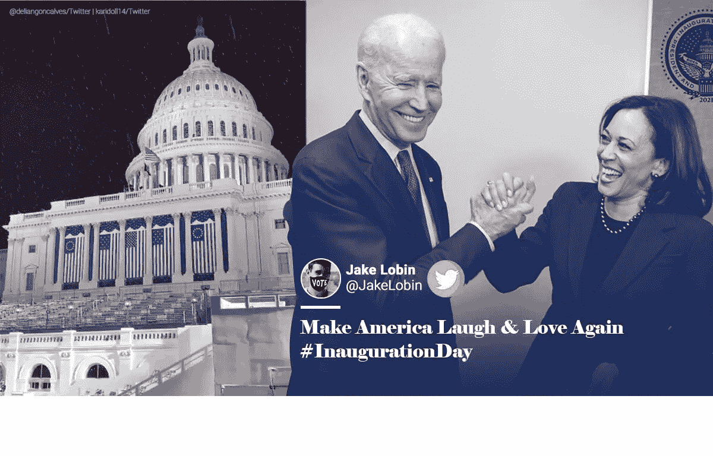
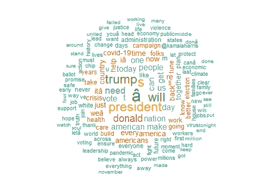
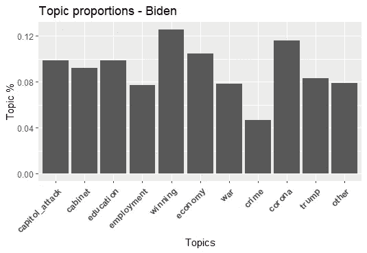

# 抓取和分析 R 中的 tweets

> 原文：<https://medium.com/analytics-vidhya/scraping-and-analyzing-tweets-in-r-62582e2f4543?source=collection_archive---------2----------------------->

## 学习从 twitter 上抓取数据，并用 R

2021 年 1 月是美国政治史上的一个重要月份，原因有很多。首先，因为乔·拜登被宣布赢得 2020 年美国总统大选。二是因为数百名特朗普支持者冲击国会大厦，以示对唐纳德·特朗普的支持。第三，因为 Covid 疫苗接种于 1 月份开始推广。在所有这些事件中，全球政治领导人都发布了大量关于周围发生的事件的推文。



在这个分析项目中，让我们试着从 twitter 上抓取 Joe Biden 上个月的推文，并通过将它们分成不同的主题来进行主题建模。

## 步骤 1:从 Twitter 获取 API 访问权限

为了从 twitter 上抓取数据，您首先需要在这里创建一个 twitter 开发者帐户。一旦完成，你就获得了访问推文的授权码。同样的详细说明可以在[这里](https://cran.r-project.org/web/packages/rtweet/vignettes/auth.html)找到。

```
my_authorization <- rtweet::create_token(app = "your app name",
 consumer_key = "your consumer key",
 consumer_secret = "your consumer secret", access_token="your access token", access_secret = "Your access secret")
```

## 第二步:抓取推文

使用上面生成的授权代码，我们从 Jo Biden 的 twitter 帐户中抓取推文，并保存在一个. csv 文件中。

```
biden_tweets <- rtweet::get_timeline(c("joebiden"), n = 3000, parse=T, token=my_authorization)
rtweet::write_as_csv(biden_tweets, "biden_tweets.csv", prepend_ids = TRUE, na = "", fileEncoding = "UTF-8")
```

我们可以检查一下。csv 文件，看到有 3000 行(由我们指定)和 90 个不同的列，如日期，推文创建，推文文本，标签，转发次数等细节。

## 第三步:分析推文

然后使用 readtext 库中的 readtext 函数读取 csv 文件。Readtext 库使导入各种格式的文本文件变得更加容易，并返回一个易于操作的数据框。

```
bidenTexts <- readtext::readtext("biden_tweets.csv", text_field = "text")
dim(bidenTexts)
```

现在让我们检索 5 条最受欢迎且转发次数最多的推文。

```
head(bidenTexts[order(-bidenTexts$retweet_count), 'text' ],5)
```

我们得到以下答案:-

[1]“美国，我很荣幸你们选择我来领导我们伟大的国家。\ n \我们面前的工作将是艰难的，但我向你们保证:我将是所有美国人的总统——无论你们是否投票给我。\ n \ nI 我会保持你对我的信任。【https://t.co/moA9qhmjn8】
【2】【我们做到了， [@JoeBiden](http://twitter.com/JoeBiden) 。https://t.co/oCgeylsjB4 美国新的一天开始了。本周国会大厦遇袭后，我想对我的美国同胞和世界各地的朋友们说。[https://t.co/blOy35LWJ5](https://t.co/blOy35LWJ5)
【5】“我不敢相信我不得不这么说，但是请不要喝漂白剂。"

类似地，我们可以分析数据帧来检索被标记为最大次数收藏的推文。

```
head(bidenTexts[order(-bidenTexts$favorite_count), 'text'], 5)
```

[1]“这是美国新的一天。”“美国，我很荣幸你选择我来领导我们伟大的国家。\ n \我们面前的工作将是艰难的，但我向你们保证:我将是所有美国人的总统——无论你们是否投票给我。\ n \ nI 我会保持你对我的信任。[https://t.co/moA9qhmjn8](https://t.co/moA9qhmjn8)
【3】“保持信念，伙计们。我们会赢的。
[4]“唐纳德·川普是我们有史以来最糟糕的总统。”
【5】“美国回来了。"

## 第四步:找到最常用的单词和话题

我们首先为推文创建一个语料库。corpus 函数将每条 tweet 转换成文档，并具有文档中标记的数量、类型、用户 id、文本宽度等特征。我们可以使用 summary 命令获得所有特性的列表。

```
#create a corpus
bidenCorpus<-quanteda::corpus(bidenTexts)
summary(bidenCorpus)
dfmbiden <- dfm(bidenCorpus, remove = c(stopwords("english")),
                remove_punct = TRUE, remove_numbers = TRUE,    remove_symbol = TRUE,tolower=T)
```

然后，我们使用 dfm 函数将语料库转换为文档特征矩阵，该矩阵表示文档的特征计数。在文档特征矩阵中，语料库被转换成稀疏矩阵，该稀疏矩阵具有与语料库中的文档一样多的行以及与语料库中的单词一样多的特征。如果某个单词出现在文档中，则用它在文档中出现的次数来表示，否则为 0。在这样做的同时，我们也删除了停用词，如“如果”，“安”等，并删除了符号，数字和标点符号。

为了查看拜登在他的推文中使用最多的词，我们可以使用库 quanteda 中的 textplot_wordcloud 函数绘制一个词云。

```
set.seed(111)
quanteda::textplot_wordcloud(dfmbiden, max_words = 150, color = RColorBrewer::brewer.pal(8, "Dark2"))
```



乔·拜登推文中最常用词的词云

现在让我们尝试做主题建模，将推文分成不同的主题。为此，我们首先为每个主题定义一个包含示例单词的字典。我们为此分析定义了 10 个主题。不属于这些主题的推文将被划分为“其他”。

```
dict <- dictionary(list(capitol_attack = c("attack", "responsibility", "capitol", "shame", "storming"),
        cabinet = c("cabinet", "minister", "advisory"),
        education = c("school", "education"),
        employment = c("job", "right", "wage","employment"),
        winning = c("victory", "win", "thank", "america","great", "back", "proud"),
        economy = c("poverty","crisis", "society", "job*", "rent", "relief" ),
        war = c("war", "soldier*", "nuclear"),
        crime = c("crime*", "murder", "killer", "violence"),
        corona = c("covid-19", "corona", "pandemic", "virus", "mask", "vaccine"),
        trump = c("trump", "donald","president", "law" )))
```

我们现在使用库 seededlda 中的 textmodel_seededlda()来实现半监督潜在 Dirichlet 分配(seeded-LDA)。不用深入算法的细节，知道这个算法把文本分成预定义的主题就够了。我们通过将 seeded_lda 模型拟合到上面定义的 dfm 来做到这一点。然后，我们可以检查每个主题的热门词汇。

```
slda <- textmodel_seededlda(dfmbiden_tfidf, dict, residual = TRUE)
topwords_biden <- as.data.frame(seededlda::terms(slda, 20))
```

现在，我们将这样识别的主题存储到数据框的“主题”列中。之后，我们将语料库中每个主题的频率列表，并为其创建一个比例表。

```
bidenTweets$topic <- seededlda::topics(slda)#tabulate frequencies of each topic in your corpus:
topics_table <-ftable(bidenTweets$topic)
topicsprop_table <- as.data.frame(prop.table(topics_table))
```

最后，我们需要做的是根据比例表中的频率来绘制主题。

```
ggplot(data=topicsprop_table, aes(x=Var1, y=Freq)) + 
  geom_bar(stat = "identity") +
  labs (x= "Topics", y = "Topic %")+
  labs(title = "Topic proportions - Biden") +
  theme(axis.text.x = element_text(face="bold", 
                                   size=10, angle=45,hjust = 1))
```



乔·拜登推文的主题比例

我们可以从上面的条形图中看到，在乔·拜登 1 月份发布的 3000 条推文中，最多的(13%)是关于他赢得选举的，其次是新冠肺炎(11%)和经济(9%)。

在这篇文章中，我们学会了从 twitter 应用程序中抓取推文，并根据它们被转发或成为最爱的次数来分析它们。我们还学习了绘制单词云和主题建模。这篇文章的详细代码可以在这个[链接](https://github.com/hgarg01/biden_tweets)上找到。

如果你喜欢这篇文章，请不要忘记鼓掌并关注。