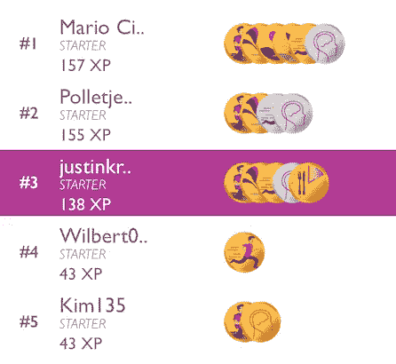
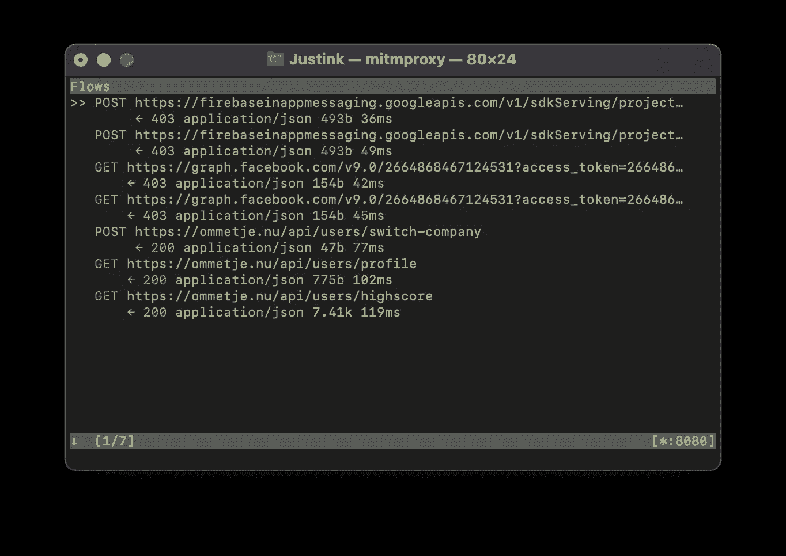
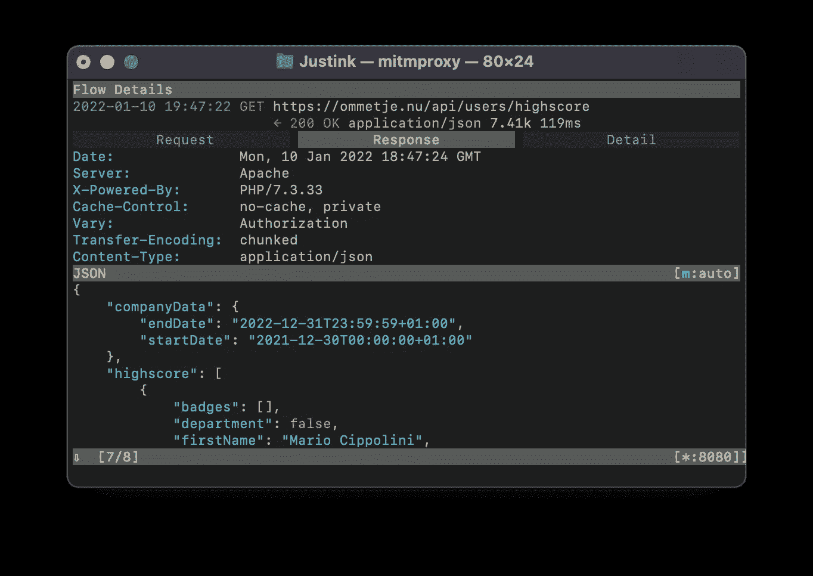
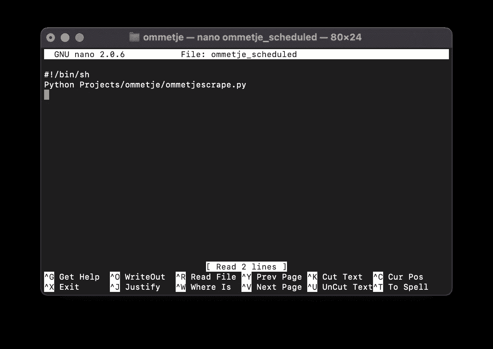
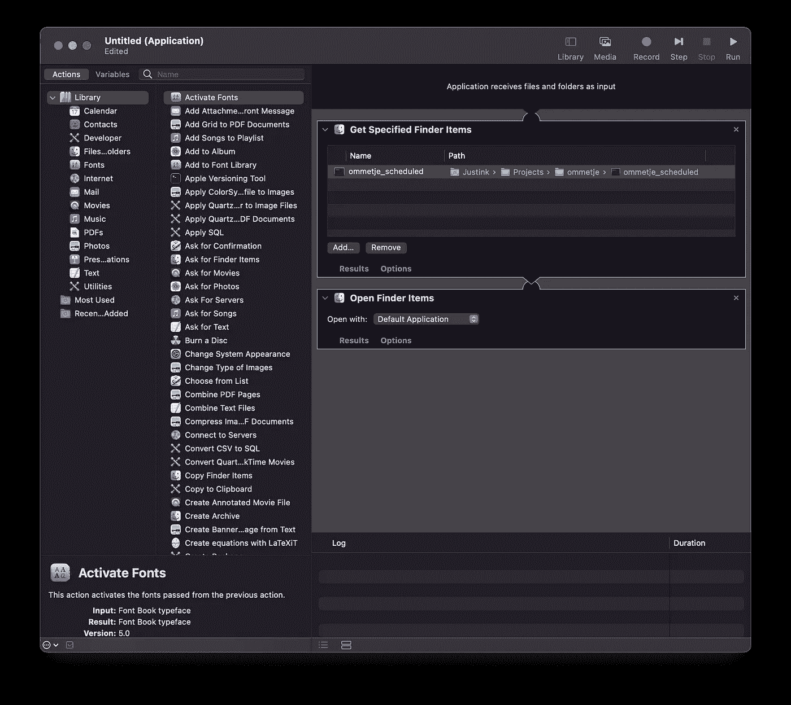
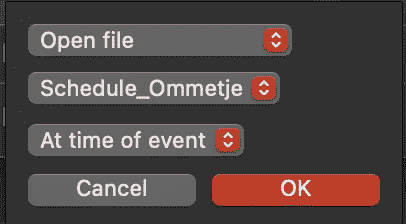

# 抓取应用程序并通过邮件自动传输数据:Python 学习之旅

> 原文：<https://medium.com/analytics-vidhya/scraping-apps-and-automatically-transfer-the-data-by-mail-a-python-learning-journey-11e15127608c?source=collection_archive---------2----------------------->

## “Ommetje-app”如何教会我自动化某些任务的第一步


肖恩·奥尔登多夫在 [Unsplash](https://unsplash.com?utm_source=medium&utm_medium=referral) 上拍摄的照片

想象你想以一个好的开始开始 2022 年，所以你决定今年一定要坚持你的健康意图。你在手机上安装了一个活动追踪器，每周你都想在邮箱里更新你的进展情况。或者想象另一种情况，你的国家有一位了不起的神经心理学教授，他开发了一种刺激人们更经常走路的应用程序，你想跟踪你的行走活动。这听起来可能像是人为编造的场景，但在荷兰，我们确实有这样一位教授，名叫埃里克·舍德，他绝对值得谷歌搜索一下！他在激励人们拥有更积极的生活方式方面做得很好，并与荷兰大脑基金会一起开发了“Ommetje-app”。通过使用这款应用程序，人们可以通过散步至少 20 分钟(荷兰语称为 *ommetje* )来获得积分，并在不同的团队中相互竞争。我们和我的同事一起参加这样的工作竞赛，我们的队长必须每周向组织报告我们的分数。提取分数，将它们相加得到一个总的团队分数，通过邮件发送信息……不同的部分可能在一个自动化的过程中被组装起来！嗯，这其实是我学习之旅的起点。让我们一起探索吧！

好吧，首先一个小小的免责声明:在我开始这个项目之前，我没有使用 Python 或任何其他编程语言自动化任务的经验。所以，不要期待高水平的专家指导！但无论如何，我希望通过带你一起走我的学习之旅，为你提供一些有用的提示和技巧。我认为非常有益的是首先将问题公式化，并将其分成子问题:

1.  从 Ommetjes-app 中提取分数；
2.  将分数格式化成文本消息；
3.  通过邮件发送短信；
4.  安排流程，以便自动执行步骤 1-3。

在接下来的部分中，我们将一个接一个地探索这些步骤。

## 1.从 Ommetjes-app 中提取分数

在我们深入研究从 Ommetjes-app 中提取数据所需的步骤之前，我认为最好先了解一下应用程序的外观。在这里你可以看到我们团队分数的截图，都设计得很漂亮，有昵称，不同的分数(XP)和几个不同成就的奖牌。



对于我们的项目，我们特别感兴趣的是昵称和相应的 XP-score，这是我们希望从应用程序中提取的功能。要做到这一点，我们必须拦截我们的应用程序和互联网之间的数据流量，`mitmproxy`是一个非常好的工具。Gaurav Sharma 已经写了一个关于如何做到这一点的[惊人教程](/testvagrant/intercept-ios-android-network-calls-using-mitmproxy-4d3c94831f62) (Android 和 iOS)，但我将在这里为苹果用户总结这些步骤:

1.  [Mac]在终端安装 mitm proxy:`brew install mitmproxy`
2.  [Mac]查找您网络的 IP 地址:**系统偏好设置→网络→ Wi-Fi →高级… → TCP/IP →** IPv4 地址
3.  [iPhone]设置您的 iPhone: **设置→Wi-Fi→**[点击已连接网络旁边的蓝色(I)]**→**[向下滚动到 HTTP-PROXY] **→配置代理服务器→手动**
4.  【iPhone】服务器:*来自步骤 3 的 IPv4 地址*
    端口: *8080*
5.  [Mac]在终端中打开 mitm proxy:`mitmproxy`
6.  [iPhone]进入 *mitm.it* ，选择苹果，安装证书
7.  【iPhone】**设置→通用→ VPN →** 安装并认证【mitmproxy】
8.  [iPhone] **设置→通用→关于→证书信任设置→** 打开 mitmproxy 按钮，瞧！

哦耶，我们现在*几乎*可以去截取我们想要的数据了！是的，几乎…但是坚持住，因为我们只需要进行一些额外的小步骤！我们在终端输入`mitmproxy`，打开手机上的 app。如果在前面的步骤中一切正常，现在我们将看到代理拦截的所有流量:



最后一行(`GET https://ommetje.nu/api/users/highscore`)是我们想要跳转的一行，因为那是我们数据存储的地方。现在，只需点击它，在*响应*下，我们实际上会看到昵称和分数，这正是我们正在寻找的！



为了将信息转换成 Python 可以处理的格式，我们将其转换成 Python 请求:

1.  按下`w`，用`export.clip curl @focus`替换`save.file @focus path`。点击[Enter]将会把 curl 复制到你的剪贴板上
2.  转到一个 curl 转换器(例如，[https://curlconverter.com](https://curlconverter.com))将复制的 curl 转换成 Python 请求
3.  将 Python 请求复制到您喜欢的 Python IDE 中

所有步骤成功完成？干得好！大量的工作已经完成，我们现在准备做真正酷的东西，所以坚持住！^^

## 2.将分数格式化成短信

好了，让我们从一些好消息开始这一部分:过程中最乏味的部分已经被覆盖，所以我们可以切换到一些实际的 Pyton 编程。我们要做的第一件事是导入我们需要的库，从 request-object 中提取文本，将其转换为一个`BeautifulSoup()`对象，并将数据加载为 json 格式。也有其他可能的格式，但我发现这是最容易使用的，因为它有类似字典的结构。下面是相应的 Python 代码:

现在我们有了 json 格式的数据，我们首先确定竞争者的数量，然后创建存储昵称和 XP 分数的列表，最后将整个事情格式化成一个漂亮的数据帧。我们通过计算团队总分来结束。

唯一剩下的事情就是创建一条我们可以通过电子邮件发送的文本消息。有几种方法可以做到这一点——我的方法可能不是最美观的——但是当你使用 HTML 时，确保最终的消息以`<body>`开始，以`</body>`结束。也可以使用`<br>`跳到下一行。

事实上，这就是我们自动化流程的第二步！

## 3.通过邮件发送短信

现在你可能想休息一下，但是我的建议是再坚持一会儿，因为这一步只需要一些复制-粘贴-插入操作。下面代码的一些说明性注释:我们从导入几个基本库开始，创建一个与我们的电子邮件服务器的连接，然后添加我们想要写的电子邮件，最后发送邮件。

现在你可以喝咖啡了。☕️

## 4.安排流程

好吧，如果你已经走到了最后一步，你绝对值得喝那杯咖啡，所以我希望它尝起来很棒！它甚至可能被证明非常方便，因为我们真的可以使用咖啡因来帮助我们完成本教程的最后一部分:实际的自动化步骤。当使用`crontab`时，这应该不会太难，但是我有一些安全问题，为此我决定走一条替代路线。因此，你可以在这里停下来，跟随例如来自 [Gavin Wiener](https://medium.com/u/5f5a32d9aade?source=post_page-----11e15127608c--------------------------------) 的[这篇教程](https://gavinwiener.medium.com/how-to-schedule-a-python-script-cron-job-dea6cbf69f4e)，或者你可以继续阅读 Yaniss Illoul 的[实现摘要。选择权在你，但现在可能有趣的是——虽然我将为 Mac 用户描述步骤——后者也适合 Windows 用户。说到这里，让我们看看如何让调度任务工作起来。第一步是将我们的 Python 脚本转换成可执行文件(。这可以通过终端中的几行代码很容易地完成:](https://martechwithme.com/schedule-python-scripts-windows-mac/)

1.  导航到您想要存储可执行文件的文件夹，并输入`nano [insert file name]`。确保不要在文件名中添加任何文件扩展名！
2.  将下面两行代码添加到空文件中:

```
#!/bin/sh
Python [insert path_to_Python_file]
```

它应该是这样的:



3.当你保存了文件并回到终端时，只需输入`chmod 755 [insert path to newly created file]`并点击【回车】。

我们现在有了一个可执行文件，但不幸的是，在我们可以按计划实际执行这个文件之前，还需要一些额外的步骤。这里要做的基本事情是转换我们的。exe 到我们使用 Automator 的应用程序:

1.  [Cmd] + [Space]，键入 *Automator* 并点击[Enter]
2.  **新建文档→应用程序→** 将*获取指定的 Finder 项*和*打开 Finder 项*拖动到右侧面板
3.  在*获取指定的 Finder 项目*面板中，点击**添加**，导航到您的可执行文件并添加。结果应该是这样的:



4.保存文件([Cmd] + [s])，您的应用程序就创建好了！现在我们有了一个应用程序，剩下唯一要做的事情就是按计划运行它，为此我们可以使用日历应用程序。因此，在 Mac 上打开日历应用程序，创建一个新的 iCloud 议程项目(为了清晰起见，创建一个单独的日历可能会很有用。进入**文件→新日历→【插入日历名称】**

5.设置您希望执行文件的日期和时间，并以所需的频率重复议程项目。例如，我想在两个月的时间里，每周五下午 3 点发送一封电子邮件。这里没什么特别的，诀窍在于设置提醒:**提醒→自定义→** *打开文件* **→** 【选择创建的应用】。结果是:



就是这样！您的 Mac 现在将在您选择的预定日期和时间执行 Python 脚本！我意识到在整个过程中涉及到很多步骤，但是我希望我的一些学习经验——我发现很有启发性——也能对你有用。很有可能，它甚至会帮助你坚持你的 2022 健康目标，这将是一个不错的奖励，但如果没有:不要责怪你自己，因为不到 10%的人能够习惯他们的新习惯。2022 快乐！

*资源:*

[1][https://medium . com/test vague/intercept-IOs-Android-network-calls-using-mitm proxy-4d3c 94831 f62](/testvagrant/intercept-ios-android-network-calls-using-mitmproxy-4d3c94831f62)
【2】[https://www.youtube.com/watch?v=LbPKgknr8m8](https://www.youtube.com/watch?v=LbPKgknr8m8)
【3】[https://martechwithme . com/convert-python-script-app-windows-MAC/# formac](https://martechwithme.com/convert-python-script-app-windows-mac/#formac)
【4】[https://martechwithme . com/https](https://martechwithme.com/schedule-python-scripts-windows-mac/#formac)