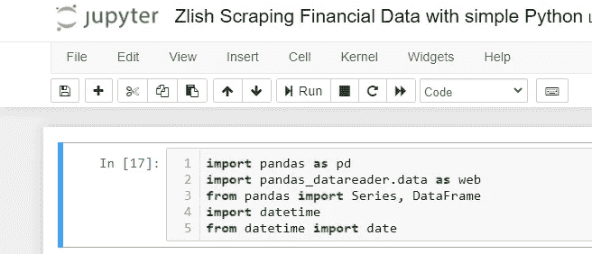
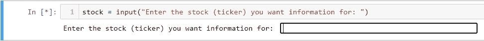
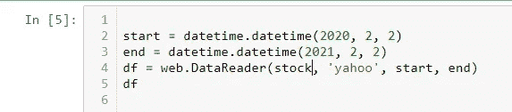
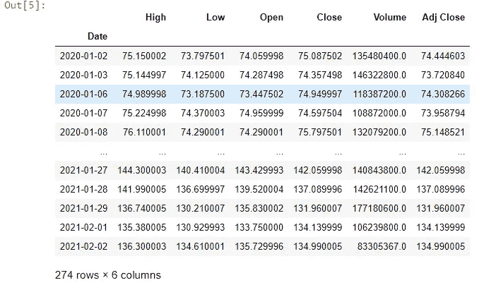
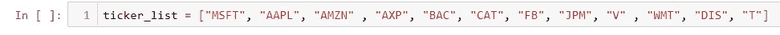
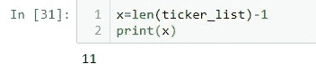
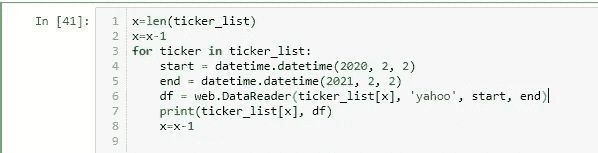
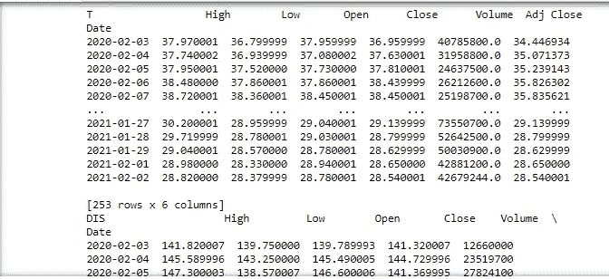
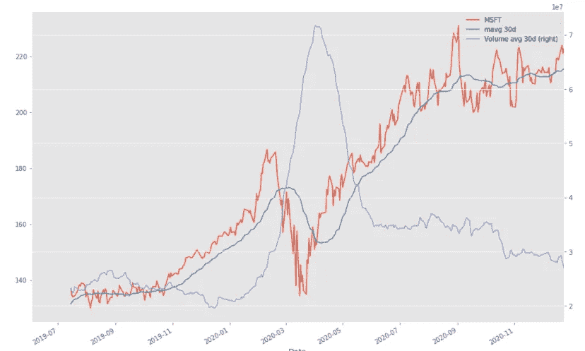

# 用简单的 python 抓取金融数据

> 原文：<https://medium.com/analytics-vidhya/scraping-financial-data-with-simple-python-d331081cdc0?source=collection_archive---------6----------------------->

我一生都对股票市场着迷。从《华尔街之狼》中的大量金融分析到荒淫无度，我已经被迷上了。另一方面，编码和数据科学并没有被描绘得那么迷人。然而，随着我开始学习数据科学的基础知识，我意识到了两者之间潜在的协同作用。这是一个简短的故事，讲述了我如何决定在几乎没有编码经验的情况下开始自动化我的尽职调查，以及如何开始的指南。

虽然电影中的恶作剧令人捧腹，魅力四射，但理解基本面、情绪分析和美联储政策的影响是明智投资的关键。我花了很多时间手动浏览图表、资产负债表和金融新闻，试图做出明智的投资决策。在一个特别无聊的研究早晨之后，我决定尝试用 python 来自动化我的部分过程。

**入门:**

使用 python 实现自动化的第一步是设置您的编码环境。我使用 Jupyter Notebook，这是一个开源的 web 应用程序，它允许您用各种语言创建执行环境。我们将使用 python。对于我们稍后将使用的数据分析和操作来说，它简单而神奇。

首先，您需要点击“新建”并使用 Python 3 创建一个新的笔记本。创建新笔记本并命名后，就可以开始编码了！

**写代码:**

我们将需要几个模块和软件包来自动找到我们在线寻找的信息。首先，我们需要 pandas，这是一个构建在 python 库之上的数据操作和分析工具。此外，我们需要 pandas_datareader 来收集我们正在寻找的股票信息。在本例中，我们将收集日期、最高价、最低价、收盘价、成交量和调整后的收盘价值，并将它们存储在数据框中。

此外，为了修改我们想要的时间范围，我们将导入 datetime，并从 datetime 导入 date。这些将帮助我们为我们的分析创建时间框架，并提高程序的自动化程度。

导入必要的模块

太好了！现在我们已经有了必要的模块，我们可以开始编写代码来提取所需的财务数据。我将采用一种基本的方法来提取数据，并详细说明如何一次搜索多只股票，以及如何存储收集到的数据。

选一只股票，任何股票。以苹果公司为例。一个简单的输入语句将用于为我们的数据读取器模块声明变量“股票”为“AAPL”。输入必须是股票代码，而不是完整的公司名称。

声明变量“股票”

现在我们知道了要查看哪只股票，并且变量已经声明，我们可以继续获取数据了。我们将使用 pandas_datareader 从 yahoo finance 收集数据，并将其存储在数据框或 df 中。数据帧是二维且大小可变的表格数据结构。换句话说，它有行和列，大小可以改变。如果你不熟悉，可以考虑 excel 中的表格。我们要用到的 DataReader 函数有四个输入。股票代码、数据的来源以及我们想要的开始和结束日期。我将获取苹果公司去年的价格和销量数据。为此，我将使用 datetime 声明开始和结束变量。df 将苹果的价格数据存储在一个数据帧中，通过在下面一行写 df，df 将被显示。

获取去年 AAPL 价格数据的代码

产生的数据框将显示以下内容:

去年 AAPL 价格数据的 df

你有它！去年苹果股票的价格数据。现在你可能会说，你可以点击雅虎财经上的下载按钮，得到一个包含相同信息的 excel 表格。你是对的！

那么我为什么要这么做呢？

通过在代码中添加一些更简单的元素，我们可以一次自动完成股票列表的下载过程。此外，通过对 datetime 使用 today()函数，我们可以创建自定义的时间框架，并在不修改代码的情况下更新数据。最后，我们可以使用熊猫的一些功能来分析和操作我们的财务数据。通过这样做，我们可以创建算法和函数来洞察交易模式和预测未来价格。最终我们可以完全自动化我们的交易！对于初学编码的人来说，这似乎有些超前，所以让我们开始从多只股票中获取数据，并以此为基础进行构建！

**一次收集多只股票的信息:**

如果您是编程新手，我们将使用一个简单的 for 循环来遍历股票列表，以便一次性获得所有的价格信息。首先用 python 创建一个你想分析的股票列表。请记住，我们需要的是股票代号，而不是公司名称。

股票列表示例

在 python 中有很多方法可以遍历一个列表。我将使用列表的长度和一个 for 循环来获得想要的结果。通过使用 len()函数，我可以获得列表中的股票数量。python 中的列表从 0 开始，所以我将从列表长度中减去 1，以获得列表中股票的正确数量。我们将声明一个变量 x 来存储列表的长度。您可以通过执行以下操作来实现这一点:

使用 len()函数获取列表中的项目数

现在我们准备添加 for 循环来遍历我们的股票列表，并自动获取价格数据。对于列表中的每一项，我们的循环将从相应的股票中提取价格数据，然后移动到下一项。使用上面声明的变量 x，我们可以打印每只股票的数据。对于循环的每一次迭代，我们将从 x 中减去 1 以得到每个行业股票。参见下面的代码:

For 循环遍历股票列表

这个循环将遍历您定制的股票列表，并打印每只股票的报价和价格信息。下面是输出的一个例子。

for 循环的输出

我们走吧！我们现在可以一次收集一组股票的价格信息！这不仅使解析价格信息变得更容易，而且，只要多一点代码，我们就可以将这些信息写入 Excel，创建图表，执行数据操作，并创建算法来为我们自动交易！

感谢您的阅读，请继续关注，阅读更多关于使用 python 自动化财务分析的内容。在我的下一篇文章中，我将解释如何使用 datetime 操作时间框架，将数据写入 excel，计算移动平均值，创建图表并进一步自动化财务分析。

下次的预演！