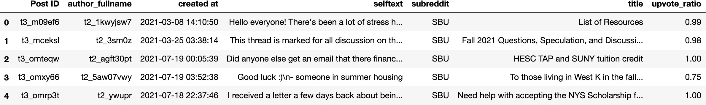
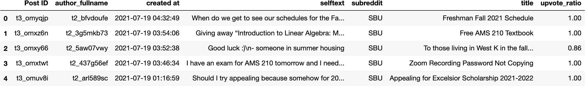

# 使用 Reddit API 抓取 Reddit 数据

> 原文：<https://medium.com/analytics-vidhya/scraping-reddit-data-using-reddit-api-3eba4bd7a56a?source=collection_archive---------3----------------------->

## 在本文中，我们将从石溪大学子网站收集**热门帖子** & **新帖**。


大声喊出来[布雷特·乔丹](https://unsplash.com/@brett_jordan)

**首先，**

*   参观 https://www.reddit.com/prefs/apps
*   滚动到按钮并点击:**创建应用**按钮
*   接下来，根据您的需要填写任何所需的名称和描述，然后单击'**创建应用'**
*   获取“密钥”和“个人使用脚本”信息。
*   然后，我们继续下面的 python 代码。

秘密= 12345。个人使用脚本= 'abcde '

```
secret_key = '12345'
client_id = 'abcde'# pip install requests
import requests
```

**使用客户端 id 和密钥获得授权**

```
auth = requests.auth.HTTPBasicAuth(client_id,secret_key)
```

现在，我们需要登录，以便获取信息。初始化字典以存储登录信息，指定我们将使用用户名和密码登录。

```
login_data = {
    'grant_type' : 'password',
    'username' : 'XYZ',
    'password' : 'MNO'
}
```

**接下来，我们需要确定 API 的版本**

```
headers = {'User-Agent': 'MyAPI/0.0.1'}
```

在这里，我们可以发送一个对 OAuth 令牌的请求，当使用 API 时，我们将在我们的头中使用它

```
response = requests.post('https://www.reddit.com/api/v1/access_token',auth=auth,data=login_data, headers=headers)
response.json()token = response.json()['access_token']headers = {**headers, **{'Authorization': f'bearer {token}'}}
headers
```

## 最后，有了这个，我们可以访问 Reddit API 中的每个端点。

让我们分别从 SBU subreddit 查看热门帖子和新帖子，并收集 50 个帖子信息

```
res_hot = requests.get('https://oauth.reddit.com/r/SBU/hot',headers=headers,params={'limit':'50'})
res_new = res = requests.get('https://oauth.reddit.com/r/SBU/new',headers=headers,params={'limit':'50'})
```

用这个来看看这些讨厌的数据，因为文章长度的原因，我没有展示结果

```
res_hot.json()# Moving on to the next procedure...# pip install pandas
import pandas as pd
from datetime import datetimepost = res_hot.json()['data']['children'][0]
[i for i in post['data'].keys()]# Following is the items we can access:['approved_at_utc',
 'subreddit',
 'selftext',
 'author_fullname',
 'saved', .
   .
   . 'subreddit_subscribers',
 'created_utc',
 'num_crossposts',
 'media',
 'is_video']
```

# 检查此子编辑中的新帖子

```
df_hot_posts = pd.DataFrame()
for post in res_hot.json()['data']['children']:
    df_hot_posts = df_hot_posts.append(
                           {'subreddit' : post['data']['subreddit'],
                 'author_fullname': post['data']['author_fullname'],
   'created at': datetime.utcfromtimestamp(post['data']['created']),
                                     'title': post['data']['title'],
                               'selftext': post['data']['selftext'],
                       'upvote_ratio': post['data']['upvote_ratio'],
                      'Post ID':post['kind']+'_'+post['data']['id']
                            }, ignore_index=True)
```

用这个检查所有的标题

```
[[i] for i in df_hot_posts['title']]# next..df_hot_posts.head()
```



# 检查此子编辑中的新帖子

```
df_new_posts = pd.DataFrame()
for post in res_new.json()['data']['children']:
    df_new_posts = df_new_posts.append(
                           {'subreddit' : post['data']['subreddit'],
                 'author_fullname': post['data']['author_fullname'],
   'created at': datetime.utcfromtimestamp(post['data']['created']),
                                     'title': post['data']['title'],
                               'selftext': post['data']['selftext'],
                       'upvote_ratio': post['data']['upvote_ratio'],
                      'Post ID':post['kind']+'_'+post['data']['id']
                            }, ignore_index=True)df_new_posts.head()
```



看看所有的标题

```
[ [i] for i in df_new_posts['title']]
```

# 以 CSV 格式存储数据

```
pwd()'/Users/nilsonchapagain/Desktop/Blogs'df_hot_posts.to_csv('/Users/nilsonchapagain/Desktop/Blogs/data/sbu_hot_post.csv', index=False)df_new_posts.to_csv('/Users/nilsonchapagain/Desktop/Blogs/data/sbu_new_post.csv', index=False)
```

## 谢谢你看我的帖子。我希望你学到了一些东西*🙌 🎉