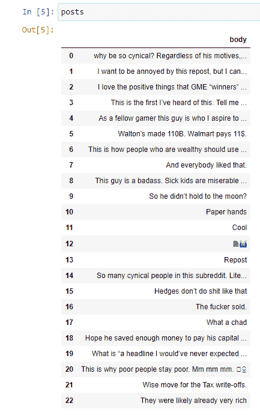
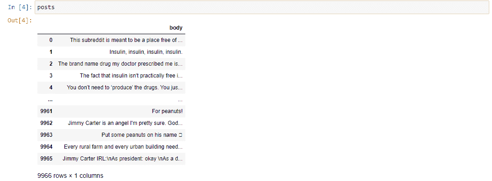

# 使用 Python Reddit API 包装器抓取 Reddit(PRAW)

> 原文：<https://medium.com/analytics-vidhya/scraping-reddit-using-python-reddit-api-wrapper-praw-5c275e34a8f4?source=collection_archive---------4----------------------->

用 Python 刮 Reddit

**内容:** 1。简介
2。创建 Reddit API 账户
3。刮 Reddit 帖子
4。抓取 Reddit 子编辑
5。清理数据

**简介:** 随着数据的急剧增长，从脸书、Twitter 和 Reddit 等多个来源搜集、收集、积累和许多其他同样有意义的各种信息只会变得更好。考虑到这一点，Reddit 很久以前就有了一个 API，叫做 Python Reddit API Wrapper，是 PRAW 的缩写，使用 Python(我知道这个名字里已经有了！)来抓取数据。在本文中，我将使用代码片段展示如何抓取帖子和整个子编辑。

**创建 Reddit API 帐户:** 首先需要一个 Reddit 帐户，所以如果你还没有，你需要在继续之前创建它。为了使用 PRAW，你必须首先注册 Reddit API，这可以通过下面的[链接](https://www.reddit.com/wiki/api)来完成。这非常简单，与注册 Twitter API 没有太大区别。完成这个过程后，调用 API 需要三个东西，它们是客户端 ID、客户端密码和用户代理。稍后将解释如何使用它们。

**抓取 Reddit 帖子:** 既然所有先决条件都已满足，抓取 Reddit 应该很容易。有两个图书馆将用于这个练习:PRAW 和熊猫。PRAW 用来访问 Reddit，熊猫用来将数据制成表格并在以后进行清理。所以现在我们首先导入库。

接下来，我们需要创建 Reddit 对象，我们将在其中插入注册 Reddit API 时创建的凭证。

现在我们有了一个可以调用 API 的对象。接下来，我们需要选择一个职位刮。为了这篇文章的目的，我已经选择了一个合适的职位。在这种情况下，要做的是获取所述帖子的完整 URL。然后我们创建一个 submission 对象，URL 作为参数传入其中。

接下来是好玩的部分！下面的部分是我们使用 PRAW 对象检索数据的地方。首先，我们创建一个名为 posts 的列表来存储所有检索到的文章。接下来，我们创建一个 for 循环来检查注释。在这个片段中，如下所示，我们在提交的评论中检索顶级评论。我没有检索第一条评论(也恰好是最上面的评论)的原因是，在这个特定的例子中，因为这个 subreddit 有一个 bot，它通常会占用那个位置，而不是我们应该抓取的东西(然后这又取决于您)。内部是一个嵌套的 if 循环，用于检查锚定的注释是顶级注释还是 MoreComments 对象，这意味着它是否有更多的注释。如果是这样，那么将评论的正文附加到帖子中。接下来，在 for 循环完成后，文章列表被更改为 pandas 数据框。其中有一列名为“正文”的所有帖子。

运行前面的代码后，应该会显示如下内容。如图所示的 body 列有从文章中提取的评论，左边基本上是索引。

显示检索到的注释的表格

现在我们有了这篇文章中所有的顶级评论。

这是完整的脚本。关于最后几行，我稍后会解释如何做一些简单的清理。

**抓取 Reddit 子编辑:** 之前我们已经收集了单个帖子中的评论，接下来我们将处理如何抓取子编辑中的所有顶级评论。如果你不考虑时间因素的话，这应该和刮一个单独的帖子没什么不同。我们将遵循之前完成的大部分步骤，但稍作调整。

我们仍将重新创建前两个步骤，即导入库和创建 subreddit 对象。

接下来，我们将尝试访问一个子编辑中的所有提交，并获得所有顶级评论。首先，还有一个名为 posts 的列表。选择 subreddit 时，我们将它作为“Reddit . subreddit(" INSERTSUBREDDIT ")”中传递的值插入第二行。在这种情况下，我们直接遍历通过访问 subreddit 检索到的所有提交。为了删除尽可能多的注释，我们添加了“.”。top("all ")"到子编辑以获得最多投票的帖子。接下来，是一个遍历锚定提交中所有评论的 for 循环。如果这个评论有更多的评论，那么就把它添加到帖子列表中，然后在它结束的时候把帖子变成熊猫数据框。

接下来，让我们看看我们得到了什么。

从子编辑内的所有提交中检索的注释

**清理数据:**
最后但并非最不重要的是数据清理。与真实数据一样，它经常会陷入不完整或错误数据的泥潭。特别是，我们应该对 Reddit 数据做的一件事是替换移除和删除的评论以及它们的索引。

接下来，我们删除选定的索引并替换它们。