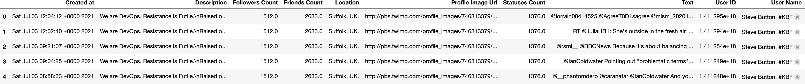
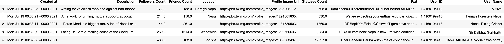

# 使用“tweepy”和 Twitter API 抓取 Twitter 数据

> 原文：<https://medium.com/analytics-vidhya/scraping-twitter-data-using-tweepy-8005d7b517a3?source=collection_archive---------0----------------------->

## 在本文中，我们将收集最近 150 篇石溪大学 Twitter 帖子和查询“Nepal”的 Twitter 搜索结果，并将结果存储在一个数据帧中，然后存储到一个 CSV 文件中。


卢克·切瑟在 [Unsplash](https://unsplash.com/s/photos/twitter-posts?utm_source=unsplash&utm_medium=referral&utm_content=creditCopyText) 上的照片

## 首先，

**获得开发者访问权限，并记录您的令牌和密钥:**

我们需要访问 Twitter API，以便从 Twitter 收集我们需要的数据。为此，您需要获得访问权限，这可以通过在 Twitter 开发者门户中创建一个应用程序来完成。好吧，既然你试图获得 Twitter 数据，你知道你应该有一个 Twitter 账户。

1.  访问[开发者的 Twitter 网站](https://developer.twitter.com/en/apply-for-access)并申请一个开发者账户。申请获得批准需要几个小时到一天的时间。
2.  一旦获得批准，您可以按照此处的说明[在开发环境中创建应用程序，但如果您环顾四周，可以非常直观地环顾四周并点击，现在我们可以访问 API 了。](https://developer.twitter.com/en/docs/apps/overview)
3.  为了访问 API，你需要 4 个不同的令牌——秘密密钥，你可以在你的开发者环境中的项目和应用部分的“密钥和令牌”标签中找到。

## 从开发人员门户收集这些信息

API 密钥:“ABCD”

API 密钥:“MNOP”

访问令牌:“XYZ”

访问令牌密码:“PQR”

**步骤 1:** 安装&导入必要的库和包

```
# pip install tweepy
# pip install pandasimport tweepy
from tweepy import OAuthHandler
import pandas as pd
import time
```

**步骤 2:** 使用 Twitter 开发者应用程序中的信息并收集数据

```
consumer_key = "ABCD"
consumer_secret = "MNOP"
access_token = "XYZ"
access_token_secret = "PQR"auth = tweepy.OAuthHandler(consumer_key, consumer_secret)
auth.set_access_token(access_token, access_token_secret)
api = tweepy.API(auth, wait_on_rate_limit=True)
```

# 首先，让我们收集用户名搜索的数据

让我们为本教程收集 150 个帖子信息

```
username = 'sbu'
count = 150
```

创建用于存储推文信息的数据框

```
df_user_tweets = pd.DataFrame()try:     
    # Creation of query method using appropriate parameters
    tweets =    tweepy.Cursor(api.user_timeline,id=username).items(count)

    # Pulling information from tweets iterable object and adding relevant tweet information in our data frame
    for tweet in tweets:
        df_user_tweets = df_user_tweets.append(
                          {'Created at' : tweet._json['created_at'],
                                       'User ID': tweet._json['id'],
                              'User Name': tweet.user._json['name'],
                                        'Text': tweet._json['text'],
                     'Description': tweet.user._json['description'],
                           'Location': tweet.user._json['location'],
             'Followers Count': tweet.user._json['followers_count'],
                 'Friends Count': tweet.user._json['friends_count'],
               'Statuses Count': tweet.user._json['statuses_count'],
         'Profile Image Url': tweet.user._json['profile_image_url'],
                         }, ignore_index=True)
except BaseException as e:
    print('failed on_status,',str(e))
    time.sleep(3)
```

**第三步:结果**

```
df_user_tweets.shape(150, 10)df_user_tweets.head()
```



# 接下来，让我们在某些文本搜索上抓取推文

**再次，我们重复步骤 2 &步骤 3**

为推文信息创建数据框

```
df_query_based_tweets = pd.DataFrame()text_query = 'nepal'

try:
    # Creation of query method using appropriate parameters
    tweets = tweepy.Cursor(api.search,q=text_query).items(count)

    # Pulling information from tweets iterable object and adding relevant tweet information in our data frame
    for tweet in tweets:
        df_query_based_tweets = df_query_based_tweets.append(
                          {'Created at' : tweet._json['created_at'],
                                       'User ID': tweet._json['id'],
                              'User Name': tweet.user._json['name'],
                                        'Text': tweet._json['text'],
                     'Description': tweet.user._json['description'],
                           'Location': tweet.user._json['location'],
             'Followers Count': tweet.user._json['followers_count'],
                 'Friends Count': tweet.user._json['friends_count'],
               'Statuses Count': tweet.user._json['statuses_count'],
         'Profile Image Url': tweet.user._json['profile_image_url'],
                         }, ignore_index=True)
except BaseException as e:
    print('failed on_status,',str(e))
    time.sleep(3)
```

**结果:**

```
df_query_based_tweets.shape(150, 10)df_query_based_tweets.head()
```



如果你对从 Twitter API 获取其他信息感兴趣，那么你可以点击查看

# 将数据存储在 CSV 文件中

我正在以 CSV 格式存储用户“SBU”和查询搜索“尼泊尔”的结果的最近 150 条 tweet 数据。

```
df_user_tweets.to_csv('/Users/nilsonchapagain/Desktop/Blogs/data/sbu_twitter_posts.csv', index=False)df_query_based_tweets.to_csv('/Users/nilsonchapagain/Desktop/Blogs/data/nepal_twitter_news.csv', index=False)
```

## 谢谢你看我的帖子。我希望你学到了一些有用的东西*🙌 🎉