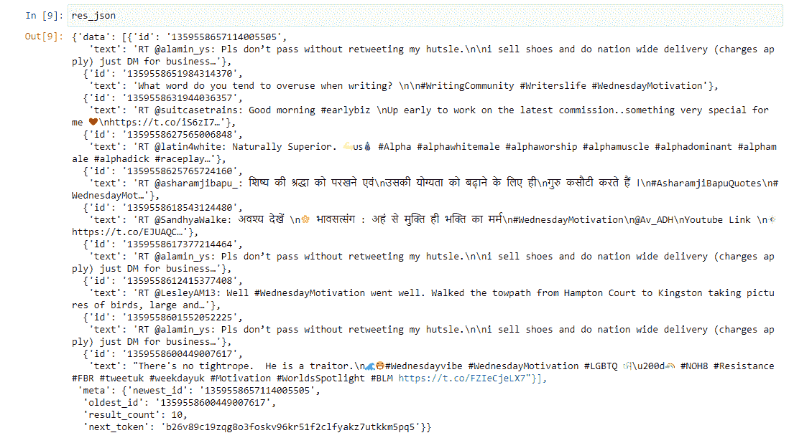
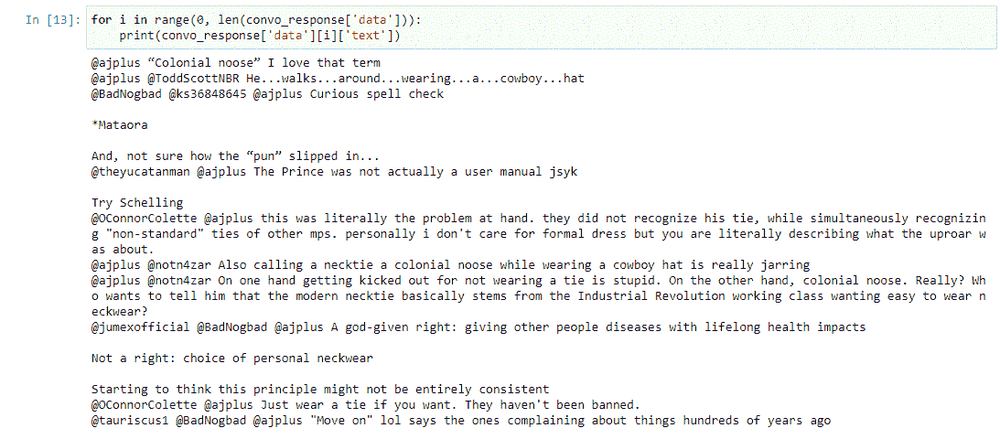

# 使用 Twitter API 抓取 Twitter 标签和 Tweet 对话

> 原文：<https://medium.com/analytics-vidhya/scraping-twitter-hashtags-and-tweet-conversations-using-twitter-api-bb696caf7429?source=collection_archive---------4----------------------->

**内容:** 1。简介
2。创建 Twitter API 开发者账户
3。刮掉标签
4。抓取推文对话

**简介:** 在很大程度上，当任何人都是任何人时，当想到数据和搜集数据时，Twitter 通常会出现在脑海中。如果你正在读这篇文章，我敢肯定你不需要我来告诉你 twitter 在原始数据等方面是多么巨大的财富。我也不会用统计数据(尽管它们非常令人兴奋，但不是今天的主题)或引用行业领袖的话来轰炸你。现在让我们向前迈一步，看看这是怎么回事。

Twitter API 是您和上述数据缓存之间的看门人。它可以帮助你检索推文，获得用户，媒体，以及其他令人兴奋的事情。除此之外，您还可以使用 API 在 Twitter 上发布或执行操作。目前，有两个受支持的 Twitter API 版本和 4 个主要的访问层。出于本文的目的，我们所有的例子都是使用 v2 完成的。

**创建 Twitter API 开发者账户:**

为了查询 Twitter API，必须首先创建一个帐户，然后等待案例被批准。根据我的个人经验，这可能需要一些时间，甚至需要来回发送几封电子邮件，直到获得批准，所以如果你希望这在一夜之间甚至立即完成，那么你就不走运了。然而，记住这一点，请不要感到气馁，如果你知道你要求 Twitter API 做什么，并遵循明确的指示，一切都应该是好的。更多信息可在[这里](https://developer.twitter.com/en/docs/twitter-api/getting-started/guide)找到。一旦所有这些都完成了，你需要做的就是**三件事:**承载令牌、访问令牌和访问秘密。确保你手头有这三个。

我目前有一个标准的免费帐户层，所以通过 API 检索的数据量会有一个限制。更多信息请点击查看[。](https://developer.twitter.com/en/docs/twitter-api/rate-limits)

**Scrape Hashtag:** 此时，我们应该准备好使用 Twitter API 了。首先，我们将导入所需的库。我们将导入 python 请求库，这将允许我们进行 GET 请求，还有 JSON 库。

接下来，我们将存储不记名令牌(在成功创建开发人员帐户后，您已经被分配到这里)。我们需要这个来验证我们的请求。

接下来，我们将使用访问 Twitter API 所需的 URL 地址。请注意，第三个“/”后面是数字 2，这表示我们正在使用 v2。该 URL 也称为最近搜索查询。正如你从上面的片段中看到的，在 URL 后面有一个名为“query”的参数，我们将在这里插入我们的 hashtag。为了这个练习的目的，我选择了一个在我写这篇文章的那天比较流行的标签。我们称之为“twitter_params”。选择的标签是“星期三动机”。在您自己的实现中，您可以用另一个 hashtag 替换它，如果它是应用程序的一部分，可以从一个参数中获取它，或者简单地让它保持原样。接下来，我们将把 hashtag 添加到最终版本的 URL 主体中。

现在我们已经有了发送到 Twitter API 的 URL，现在让它运行起来吧！现在我们将创建 headers 变量来添加到请求头中。第 7 行的下一个是请求，参数是不言自明的，但我还是会这样做。第一个是 GET 请求，第二个是 URL，最后是头。最后，将响应转换成 JSON 主体，使其可读。

如果我们打印出结果，应该会得到类似上面的结果。只是重申一下，因为我有自由层，如果你也有，结果本身可能不同，但大小和结构相同。

**抓取 Tweet 对话:** 之前，我们通过最近的搜索查询，以相关标签为参数，从 Twitter 上抓取了一个标签。在这一部分，我们将尝试抓取一条推文的对话——换句话说，获取对一条特定推文的所有回复。

如果你理解了上一节，这一节应该很相似。除了参数，URL 是相同的。在这种情况下，查询是“conversation_id ”,我们在 URL 中添加 tweet ID。

例如，这里有一条最近发布的推文的链接:

我们从 URL 中需要的是最后的大数字。

除了参数的变化之外，遵循与前面相同的步骤，结果应该如下所示。

