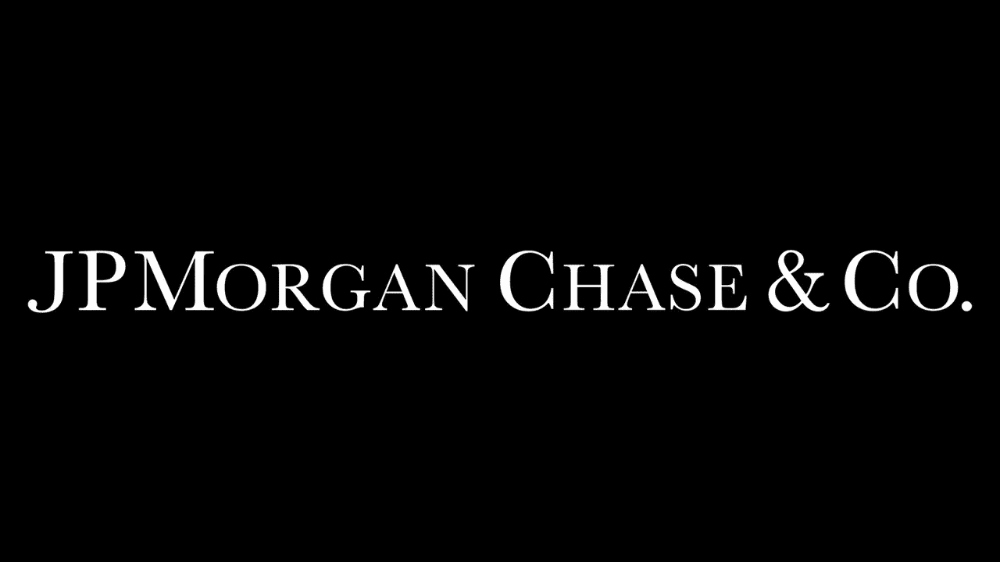
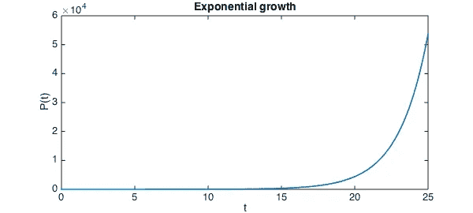

# 摩根大通公司的 SDE(校外)

> 原文：<https://medium.com/analytics-vidhya/sde-at-jp-morgan-chase-co-off-campus-583e61cdbd10?source=collection_archive---------5----------------------->

## 分享经验|编码| SDE | JPMC

## 我的旅程&获得 JPMC offer 的经历

在 2021 年，我收到了来自 **Tekion Corp、Freecharge、JPMC、**和一些**初创公司**的软件工程师职位的邀请，我认为我只是运气好，在我没有准备的几轮面试中，我内心的信心开始建立，尽管我成功了。我的准备过程是在实际公司数百小时的面试中磨练出来的。

## 旅行

这一切都始于 2020 年 2 月，在我第一次被 SAP 实验室拒绝之后，然后不放弃的渴望开始了，我真的不知道人们如何通过面试，他们写的代码有多干净，他们如何能够建立逻辑和思维过程。我曾在多家公司遭到拒绝，这实际上帮助我了解了自己的失败之处。我独自一人在旅途中，没有任何指导，还必须为目前的组织工作，所以对我来说，很难有时间做所有的事情，但是的，“一致性、决心、希望和耐心”让我一直在身边。

通过这次旅行，我学到的一件事是**我们应该忠于自己**。如果我们不熟悉任何一种完全没问题的话题，最好解决这个问题并着手去做。我也这样做了，我写下了所有我不擅长的题目，并开始改正它们。我每天浏览不同的文章，开始自言自语以缓解沟通障碍，浏览大量视频，这些视频教会我从自我介绍到面试中什么是我，什么是不该提的。我记得我曾经每天申请 15-20 家公司，但很少收到回复。

## 面试的时候

在 JPMC，我总共参加了 5 轮面试，其中 4 轮是技术面试，1 轮是包括管理在内的技术面试。在所有的 4 轮中，这是一个大杂烩，我的意思是问题与 DS Algo(数组、字符串、树、DFS/BFS、递归、链表、基于数学的编码)相关，OOP 的概念、谜题、系统设计、概率、数据库相关，以及对简历中提到的项目的讨论。最后一轮，面试官问我(关于递归的中级 Leetcode 问题，一些行为，以及与我的成就相关的管理问题)。在所有几轮面试中，我都喜欢解决问题，我觉得面试官更想知道我是如何思考的，我的思维过程是什么，我是如何解决问题的，而不是寻找实际的结果。

准备和面试软件工程师的工作是非常累人的，因为你的进步遵循一条指数结果曲线——你暂时看不到结果，你将面临许多拒绝，这令人沮丧。但是你的知识和经验是复合的，随着你的前进，你会到达一个转折点，在那里你会迅速提高，并开始持续地完成面试。

感谢支持我的家人和朋友:)嗯！学习之旅并没有就此结束，还有很多东西需要学习和探索。

## 编码快乐！|不断学习和探索

浏览我以前的文章( [*h*](/analytics-vidhya/acing-the-coding-interview-preparation-and-questions-roadmap-97496b94d76e) ere)，在那里我分享了重要的问题、文章、链接、视频、路线图等等，这些对那些正在寻找 SWE 工作的人真的很有帮助。