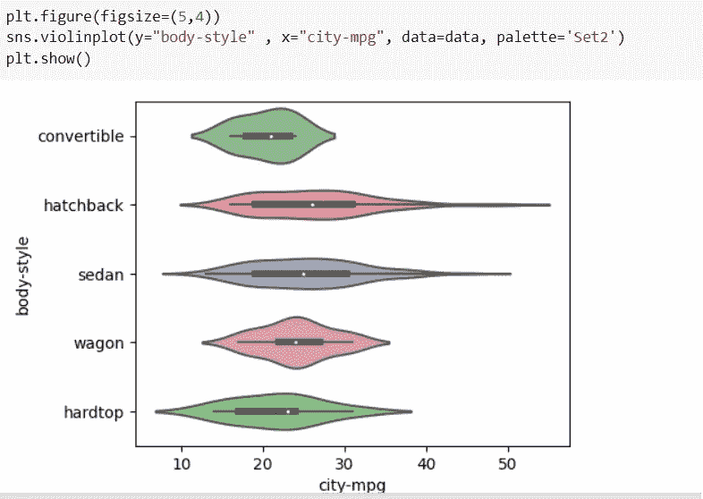
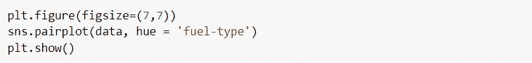

# Seaborn:数据可视化库

> 原文：<https://medium.com/analytics-vidhya/seaborn-data-visualization-library-142ac64d5560?source=collection_archive---------3----------------------->

数据可视化通过将数据整理成更容易理解的形式，突出趋势和异常值，有助于讲述故事。


在这篇博客中，我们将使用 *matplotlib* 的一些函数来了解 *seaborn* 。

**安装 Matplotlib 和 Seaborn**

```
pip install matplotlib
pip install seaborn
```

**导入 Matplotlib & Seaborn**

```
import matplotlib.pyplot as plt
import seaborn as sns
```

**读取数据集**

这里，我们将使用取自 Kaggle 的“汽车”数据集。要下载数据集，请点击[此处](https://www.kaggle.com/toramky/automobile-dataset)。

要加载数据集，您需要使用以下命令安装 pandas 库:

```
import pandas as pd
```


# **线条图**

绘制正弦和余弦函数:


**改变图形尺寸:**


**恢复默认 matplotlib 设置**


**显示标记(圆点)**


使用 matplotlib 设置标题、xlabel 和 ylabel


**将 x 轴旋转 90 度**


**使用'*色调'*** 对地块进行分组


**设置绘图的线宽、线型和颜色**

让我们在轴距和发动机尺寸之间画一个线图


**使用调色板:**


**创建调色板**


# 散点图

在散点图中，每个观察值显示为 x 和 y 值处的点。它用于可视化二元分布。散点图表示变量之间的关系。


# **联合剧情**

联合绘图显示了两个变量之间的关系以及边缘的 1D 剖面。


# 条形图

条形图显示数字变量和分类变量之间的关系。它默认显示平均值。


**排序条形图**

使用参数' *order* ，我们可以对不同的条形进行排序。


**水平条形图:**

要绘制水平条形图，我们只需要交换 x 和 y 值。


# **盘点剧情**

计数图有点像某个分类区域的直方图或条形图。它显示了基于某个类别的某个项目出现的次数。


**排序顺序**

使用'*命令*变元


**添加色调**


# **方框图**

箱形图显示最小值、第一个四分位数、中值、第三个四分位数和最大值。为四分位数范围(Q3 - Q1)画一个方框。一条线穿过中线。


***添加色相、调色板和顺序***


# 小提琴情节

violin plot 用于绘制数字数据。它类似于箱线图，只是它们也显示数据的概率密度。



# **猫情节**

猫图用于绘制分类变量。它使用不同的图显示数字变量和分类变量之间的关系。

下面给出的代码将根据“col”参数(燃料类型)中给出的分类变量划分数据点。


下面给出的代码将根据燃料类型划分数据点，并绘制计数图。


*使用“col_wrap”来限制一行中的绘图数量。*


# **距离图**


# 直方图

在直方图中，y 轴表示每列数据中出现的次数或百分比。


**绘制数据集中所有数值变量的直方图:**


# kde 图


# **配对图**

配对图允许我们看到单个变量的分布和两个变量之间的关系。



# **回归图**

回归图在两个参数之间创建一条回归线，并帮助可视化它们的线性关系。


# **热图**


要了解更多关于 matplotlib 和 seaborn 的信息，请参考官方文档- [seaborn](https://seaborn.pydata.org/) 和 [matplotlib](https://matplotlib.org/) 。

如果你喜欢这个博客，那么看看我以前的一些博客:

1.  [熊猫](https://khushijain2810.medium.com/pandas-python-data-analysis-library-1d061c982fc8)
2.  [Numpy](https://khushijain2810.medium.com/numpy-day-3-at-internity-foundation-efcef826e549)

快乐学习！！