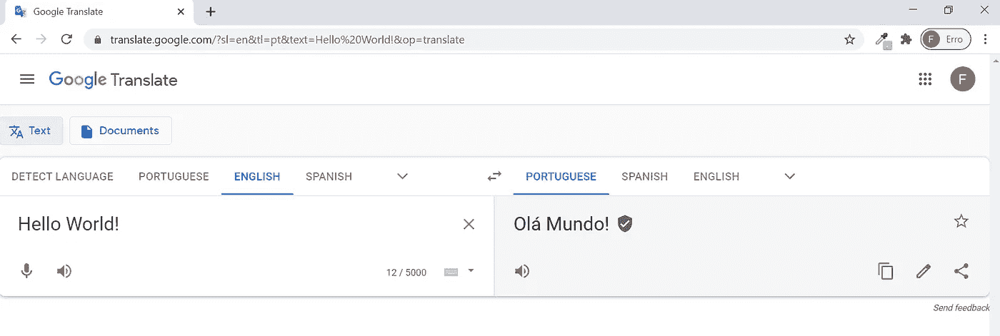

# 使用基本 Python 在 Google Translate 中实现搜索自动化

> 原文：<https://medium.com/analytics-vidhya/search-automation-in-google-translate-using-basic-python-aafde8040ec7?source=collection_archive---------13----------------------->

链接到这篇文章[葡萄牙语翻译在这里](https://fabriciusbr.medium.com/automatiza%C3%A7%C3%A3o-de-pesquisas-no-google-tradutor-com-python-b%C3%A1sico-3ce938f3a8f3)

**简介**

最近，当我需要编写 Python 代码将文本翻译成外语时，我求助于 Googletrans 库，它非常容易使用，由 Google Translate API 提供，没有任何限制。然而，这个库在过去的几个月里出现了一个严重的错误(你可以[在这个链接](http://github.com/ssut/py-googletrans/issues/234)上查看关于这个主题的更多信息)，这使得现在无法使用这样的库。

尽管有其他 Python 包选项可以满足同样的需求，但我决定将这个小小的挫折作为一个学习机会。由于 Googletrans 不能正常工作，是否有可能编写一个网络抓取迷你程序，以便直接在 Google Translate 网站上自动搜索翻译？我很高兴地发现，这个问题的答案是肯定的，并且这种努力只使用内置模块 webbrowser 的 open 函数是可能的。

因此，这篇文章展示了我的这个 web 抓取工作的最终结果，它受到了伟大著作*的第 12 章中介绍的 *mapIt.py* 程序的启发* ( [链接到此处的完整文本](http://automatetheboringstuff.com/2e/chapter12))。其作者 Al Sweigart 提出了一个非常简单的解决方案来自动搜索谷歌地图上的地址。当然，由于我已经阅读了这本书并实践了它的例子(也由于我以前对 Googletrans 库的熟悉)，发现 Google Translate URL 模式并因此编写自己的代码相对容易。

**如何使用网络浏览器库翻译文本**

我们将访问谷歌翻译网站([https://translate.google.com/](https://translate.google.com/))来做一个从英语到葡萄牙语的简短翻译。接下来，我们将分析网页提供的信息，尤其是网站翻译我们的文本后呈现的新 URL:

这里，一个(不那么)重要的警告:在“你好，世界！”出于教学目的，有意撤回该声明(尽管仍有关于是否需要使用该声明的讨论，如此处的[所示](http://english.stackexchange.com/questions/74985/should-the-beginners-program-read-hello-world#:~:text=In the typical example you,and the thing being greeted)

从上面复制的屏幕中可以看到，URL 后面有四个参数，由三个&符号分隔:

sl=en

&

tl=pt

&

text=Hello%20World！

&

op =翻译

另外，请注意第一个参数前的问号。

很有可能的是，首字母缩略词 *sl* 和 *tl* 分别表示源语言和目标语言。另一方面，*en*(*sl*参数值)是英语缩写，而 *pt* 是葡萄牙语的缩写。*文本*参数值包含要翻译的文本。最后， *op* (这可能意味着“操作”)将*翻译为其值。*

在分析 URL 结构时要考虑的另一个方面是单词“Hello”和“World！”之间的空格。可以注意到，它被序列%20 所取代。事实上，这不是唯一一个在 Google 翻译 URL 中使用时以特殊方式翻译的字符。此外，例如，逗号在 URL 中由序列%2C 转录，这使得逗号后跟空格被表示为%2C%20。你可以在翻译中尝试其他特殊字符，以检查它们是否被翻译。

我们现在准备分析下面的初始代码:

如前所述，代码的简单性是显而易见的:它仅由一个表示最终 URL 的 f 字符串组成，并在正确的位置插入了参数值。在这个序列中，这个 URL 由 webbrowser 模块中的 open 函数访问。

然而，当我们运行上面的代码时，会出现一些小问题，尤其是在 Google Translate 网站上，诗句中的文本格式无法复制到目标文本中。发生这种情况是因为当我们不对源文本进行处理而只是在 URL 中直接使用它时，换行字符(著名的\n)不会被自动识别。在这种情况下，只有空格会被转换。

为了解决这个问题，我创建了一个小的自定义函数，用 URL 中相应的符号替换某些字符。添加了此函数的完整代码如下所示:

**用来自. txt 文件的输入概括代码**

现在，让我们将代码的主体变成一个名为 open_google_trans 的函数，它将接收 *sl* 、 *st* 和 *text* 参数。我们还将在文件末尾添加 *dunder 名称*、 *dunder 主*代码:

就目前而言，我们将在代码中进行的最后一项修改是添加一个功能，允许我们上传一个包含待翻译文本的. txt 文件。为了做到这一点，我们将使用 textToTranslate.txt 文件，[,该文件可从我在 Github](https://raw.githubusercontent.com/fabricius1/Google-Translate-Automation/master/textToTranslate.txt) 上的存储库中获得。这里的想法是将《罗密欧与朱丽叶》戏剧的原始序言翻译成七种语言:葡萄牙语(pt)、西班牙语(es)、世界语(eo)、拉丁语(la)、土耳其语(tr)、韩语(ko)和日语(ja)。对于这些语言中的每一种，将在浏览器中打开一个不同的选项卡，其中包含目标语言的相应翻译。

对于其他语言代码，您可以访问 https://cloud.google.com/translate/docs/languages[网站](https://cloud.google.com/translate/docs/languages)

您可以下载。txt 文件直接下载到您的机器上，或者您仍然可以修改来自 Requests 库的几行代码，这将直接从我在 onGitHub 上的存储库中下载文件。我将使用请求库(通过 *pip install requests* 很容易安装)在代码中添加这种修改。我还修改了代码来翻译。txt 文件翻译成上述七种语言，每个新的翻译之间有 5 秒钟的停顿。程序的最终版本如下所示。

这里有一个关于代码限制的重要观察:Google Translate 将源语言文本限制为 5k 个字符。因此，如果需要翻译较大的文本，就应该为这一特定目的修改代码。

最后，我想在这里做一个额外的代码注释。应该注意的是，如果用户有能力的话，Google Translate 提供的翻译应该由用户来审阅。事实上，不同语言的翻译质量差异很大。例如，关于拉丁语，翻译通常会带来严重的甚至是基本的问题，以至于在我看来，应该避免使用该语言的谷歌服务。作为巴西一所联邦大学的前拉丁语教授，我见过不止一个容易受骗的学生在试图给我提供一个不连贯的翻译作为他/她的作业时遇到麻烦，这个翻译是直接从谷歌翻译复制的。事实上，这些事件已经过去十年了，谷歌的拉丁语翻译仍然有很大的改进空间…

在我的下一篇文章中，我将探索如何使用 Selenium 库保存 Google Translate 生成的翻译。

非常感谢您阅读我的文章。

*快乐编码*！

附注(2021 年 3 月 23 日):我今天刚刚发现 googletrans 发布了一个针对 *AttributeError 的临时修复程序:“NoneType”对象没有属性“group”*。这是个好消息！我在这里测试过，效果很好。为了使用它，您需要卸载当前的 googletrans 版本，并安装带有临时补丁的特定版本，如下所示:

您可以在 Github 链接中找到更多相关信息:

https://github.com/ssut/py-googletrans/issues/280