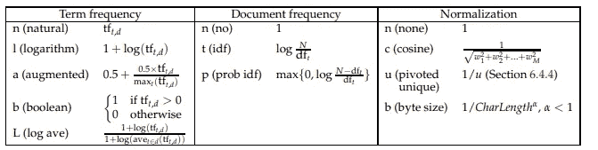

# 从零开始用 Python 开发搜索引擎

> 原文：<https://medium.com/analytics-vidhya/search-engine-in-python-from-scratch-c3f7cc453250?source=collection_archive---------0----------------------->


来源:-[https://www.pinterest.com/pin/847450854860596454/?amp _ CLIENT _ ID = CLIENT _ ID(_)&mweb _ un auth _ ID =&simplified = true](https://www.pinterest.com/pin/847450854860596454/?amp_client_id=CLIENT_ID(_)&mweb_unauth_id=&simplified=true)

在这篇文章中，我将从头开始讲述使用维基百科转储(大约 84GB 大小)构建搜索引擎的所有细节。我将逐步介绍创建数据的主索引和辅助索引的过程，以及如何实现搜索功能，以便在最短的时间内输出结果。我将这篇文章分成两部分，即需求，维基转储细节，索引和搜索。所以系好安全带，让我们开始吧。

# 1.要求

> Python3
> 
> NLTK 停用词
> 
> PyStemmer

# 2.维基转储详细信息

为了创建搜索引擎，在这篇文章中，我将提到英语的**维基百科**转储，其大小大约为 **84GB** 。人们可以从下面给出的链接下载数据

> [https://dumps . wikimedia . org/enw iki/2021 07 20/enw iki-2021 07 20-pages-articles-multi stream . XML . bz2](https://dumps.wikimedia.org/enwiki/20210720/enwiki-20210720-pages-articles-multistream.xml.bz2)

您需要下载并解压缩下载的转储文件。或者，您也可以处理压缩数据。我会解释所有关于提取转储的事情。

# 3.为 Wiki 转储创建索引

## (I)解析 XML 转储

首先，您需要解析 XML 并获得必要的数据。为此，python 中有几个可用的解析器。其中一些是

> 萨克斯管
> 
> Etree
> 
> 数字正射影像图

这里我将使用 SAX 解析器来解析 XML。您也可以尝试不同的其他解析器。在下面的要点中，我展示了如何使用 SAX 解析器来解析数据。

在上面的代码中，我只使用了 XML 中的两个字段，即标题和文本。我从变量 num_pages 中给出我自己的 id。我是如何使用标题和正文的，在下面的不同部分有解释。

## (二)如何预处理文本

这是一项基本任务，因为这一步将确保我们不会向索引中添加不必要的术语。否则会吹大指数大小。主要是，我会删除停用词，标记文本，删除 HTML 标签，删除非 ASCII 字符等。如下面的代码所示。

## ㈢提取不同的领域

我们可以在不同的字段上进行查询搜索。我将使用六个字段:标题、正文、类别、信息框、链接和参考。用户可以使用这些字段搜索通用查询或特定于字段的查询。

## ㈣建立一个中间指数

直接创建最终索引将是一项繁重的任务，并且还会占用大量内存。因此，我们将首先在数据节上创建一个中间索引，然后执行最后的合并来生成最终索引。我们将使用 SPIMI 方法。你可以通过下面的链接了解更多。

[](https://nlp.stanford.edu/IR-book/html/htmledition/single-pass-in-memory-indexing-1.html) [## 单遍内存索引

### 下一步:分布式索引运行:索引构造上一步:阻塞的基于排序的索引内容索引阻塞…

nlp.stanford.edu](https://nlp.stanford.edu/IR-book/html/htmledition/single-pass-in-memory-indexing-1.html) 

下面的代码显示了如何创建一个中间索引。

在这里，我逐个处理文本，将其添加到字典中，然后写入中间文件。索引文件的格式现在看起来是这样的

```
apple-2314:t3b6i2r1;6432:t5c8b3i1;
```

在上面的例子中，“*苹果*”是一个令牌。然后在连字符后，每一对用“**隔开；**”。“ **:** 前的第一个值代表文档的 docID，然后对应的字符串和值代表频率。

> 《出埃及记》:- t3b6i2r1 表示 token 在标题中出现 3 次，在正文中出现 6 次，在信息框中出现 2 次，在引用中出现 1 次。

## ㈣合并中间索引

现在当我们写完中间索引。我们需要合并索引，因为在某些情况下，令牌会将其信息分割到多个文件中。我们需要合并它来创建最终的索引。下面的代码可以做到这一点

最终索引的格式如下例所示:-

```
apple-2141:5;1232:1;5432:78;
```

在上面的例子中，“*苹果*”是一个令牌。然后在连字符后，每对用“**隔开；**”。“ **:** ”前的第一个值表示文档的 docID，第二个值表示字段文件中特定标记的标记频率。与中间索引不同，最终文件是按字段分开的文件。

通过这种方式，最终的索引将类似于上面的示例。如果你想看完整的代码，你可以访问这篇博客最后给出的 Github 代码链接，也可以尝试不同的方法。

## ㈤二级索引

您可以根据需要创建辅助索引。这将有助于通过在二级索引中保存标记信息来进行快速搜索。我将使用以下格式的二级索引。人们也可以尝试其他可能的形式。

```
apple-563-1-3-4--2-4-6-
```

按照上面的格式，*‘苹果’*将是令牌。那么值 563 将表示苹果在整个维基百科转储中的频率。此后，数字 1 将指示该令牌存在于哪个文件号中。令牌可以出现在任何字段中。数字 1 表示如果令牌出现在该字段中，它将只出现在该字段的特定文件编号中。之后，所有其他值都是可选的。我将详细介绍下面的字段值:-

如上所述，我将使用字段标题，正文，类别，信息框，链接，参考。因此'-'之间的值将表示最终索引文件中的行号。下面的例子说明了这一点

```
'apple-563-1-3-4--2-4-6-'.split('-') ---> ['apple', '563', '1', '3', '4', '', '2', '4', '6', '']
```

这里，第四个元素(‘3’)表示‘apple’出现在标题文件的文件号 1 的第 3 行。类似地，“4”将表明它将出现在主体文件的第 4 行；它不会出现在类别文件中，因为它是一个空字符串(")，它出现在 infobox 文件的第 2 行，链接文件的第 4 行，以及引用文件的第 6 行。所有文件共有的一点是，如果令牌出现在任何字段中，它将只出现在特定的文件编号中，而不会出现在其他地方。

# 4.实现搜索功能

搜索功能需要的一个关键是实现排名功能，根据文档的相关性对文档进行排名。但在此之前，还需要一些其他的东西，我将在下面解释:-

## (I)预处理查询

预处理将与我们在索引阶段所做的相同。所有步骤将与初始步骤相同。然后我们将得到最终的预处理查询。

## ㈡确定查询类型

这是模式有用的步骤之一，因为它将指导我们是否需要简单查询或字段查询或两者都需要。所以基本上一个查询可以有三种类型:-

```
Type 1:- world war II
Type 2:- t:world cup i:2012
Type 3:- Sachin Tendulkar t:world cup i:2012
```

我们可以使用下面的代码来识别查询的类型

## ㈢排名功能

排名功能用于获得排名结果。这样相关结果就在最上面了。通常，tf-idf 是对文档进行排名的度量。

那么什么是 tf-idf 呢？它由两个术语 **TF** 和 **IDF 组成。**

**TF(词频):-** 它告诉我们一个词在文档中出现的频率。

**IDF(逆文档频率):-** 在文档中，出现的词很多，频率很大。但是这种高频率降低了该单词与该文档的相关性。因此，为了降低大频率字的影响，使用 IDF。它基本上是文档总数除以该文档的单词频率的对数。

所以最终的 tf-idf 值是 tf 和 idf 值的乘积。

```
tf-idf = tf * idf
```

## tf-idf 的变体



来源:-[https://nlp.stanford.edu/IR-book/pdf/06vect.pdf](https://nlp.stanford.edu/IR-book/pdf/06vect.pdf)

可以使用上面给出的任何一种 tf-idf 变体。这取决于他们的实施和选择。

所以，现在就从我这方面来说。如果你想看完整的代码，你可以访问下面的链接

[](https://github.com/DhavalTaunk08/Wiki-Search-Engine) [## GitHub-dhavaltaunk 08/Wiki-搜索引擎

### 在 GitHub 上创建一个帐户，为 DhavalTaunk08/Wiki 搜索引擎的开发做出贡献。

github.com](https://github.com/DhavalTaunk08/Wiki-Search-Engine) 

如果你想了解更多关于机器学习、深度学习的内容，请访问下面的链接

[](/@taunkdhaval08) [## Dhaval Taunk 培养基

### 在我最近的一篇博客文章《如何在文本分类任务中微调 bert》中，我解释了如何针对一个问题来微调 BERT

medium.com](/@taunkdhaval08) 

快乐阅读……