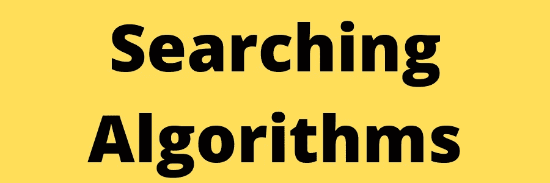

# 搜索算法

> 原文：<https://medium.com/analytics-vidhya/searching-algorithms-f98e0d3fa966?source=collection_archive---------7----------------------->



​

**搜索算法**是计算中的一个基本步骤，通过逐步方法在数据集合中定位特定数据。

# 什么是搜索算法？

根据维基百科，搜索算法是-

> 解决搜索问题的任何算法，即检索存储在某种数据结构中的信息，或在问题域的搜索空间中计算的具有离散或连续值的信息。

它们被设计成从存储元素的任何数据结构中检查或检索元素。他们在搜索空间中搜索目标(关键字)。

# 搜索算法的类型

在这篇文章中，我们主要讨论两个重要的算法-

1.  **线性或顺序搜索**
2.  **二分搜索法**

让我们用例子、代码实现和时间复杂度分析来详细讨论这两个。

# 线性或顺序搜索

该算法的工作方式是从一端开始依次遍历整个数组或列表，直到找到目标元素。如果找到该元素，则返回其索引，否则为-1。

现在让我们举个例子，试着去理解:

```
arr = [2, 12, 15, 11, 7, 19, 45]
```

假设要搜索的目标元素是`7`。

# 方法:

*   从索引 0 开始，将每个元素与目标进行比较
*   如果发现目标等于元素，则返回其索引
*   如果没有找到目标，返回-1

# 代码实现

**在 Java 中**

```
package algorithms.searching;public class LinearSearch {
    public static void main(String[] args) {
        int[] nums = {2, 12, 15, 11, 7, 19, 45};
        int target = 7;
        System.out.println(search(nums, target)); } static int search(int[] nums, int target) {
        for (int index = 0; index < nums.length; index++) {
            if (nums[index] == target) {
                return index;
            }
        }
        return -1;
    }
}
```

**在 Python 中**

```
def search(nums, target):
    for i in range(len(nums)):
        if nums[i] == target:
            return i
    return -1if __name__ == '__main__':
    nums = [2, 12, 15, 11, 7, 19, 45]
    target = 7
    print(search(nums, target))
```

# 时间复杂性分析

*   **最佳情况:**当目标元素是数组的第一个元素时，出现最佳情况。在这种情况下，比较的次数是 1。所以，时间复杂度是`O(1)`。
*   **平均情况:**平均来说，目标元素会在数组中间的某个地方。在这种情况下，比较的次数将是 N/2。所以，时间复杂度将是`O(N)`(常量被忽略)。
*   **最坏情况**:当目标元素是数组中的最后一个元素或者不在数组中时，出现最坏情况。在这种情况下，我们必须遍历整个数组，因此比较的次数将是 n。因此，时间复杂度将是`O(N)`。

# 二进位检索

这种类型的搜索算法用于在排序数组中查找包含**的特定值的位置。二分搜索法算法的工作原理是分治法，它被认为是最好的搜索算法，因为它的搜索速度更快。**

现在让我们以一个排序数组为例，试着去理解:

```
arr = [2, 12, 15, 17, 27, 29, 45]
```

假设要搜索的目标元素是 1 个`7`。

# 方法

*   将目标元素与数组的中间元素进行比较。
*   如果目标元素大于中间的元素，则在右半部分继续搜索。
*   否则，如果目标元素小于中间值，则在左半部分继续搜索。
*   重复这个过程，直到中间元素等于目标元素，或者目标元素不在数组中
*   如果找到目标元素，则返回其索引，否则返回-1。

# 代码实现

**在 Java 里**

```
package algorithms.searching;public class BinarySearch {
    public static void main(String[] args) {
        int[] nums = {2, 12, 15, 17, 27, 29, 45};
        int target = 17;
        System.out.println(search(nums, target));
    } static int search(int[] nums, int target) {
        int start = 0;
        int end = nums.length - 1; while (start <= end) {
            int mid = start + (end - start) / 2; if (nums[mid] > target)
                end = mid - 1;
            else if (nums[mid] < target)
                start = mid + 1;
            else
                return mid;
        }
        return -1;
    }
}
```

**在 Python 中**

```
def search(nums, target):
    start = 0
    end = len(nums)-1 while start <= end:
        mid = start + (end-start)//2 if nums[mid] > target:
            end = mid-1
        elif nums[mid] < target:
            start = mid+1
        else:
            return mid return -1 if __name__ == '__main__':
    nums = [2, 12, 15, 17, 27, 29, 45]
    target = 17
    print(search(nums, target))
```

# 时间复杂性分析

*   **最佳情况:**当目标元素是数组的中间元素时，出现最佳情况。在这种情况下，比较的次数是 1。所以，时间复杂度是`O(1)`。
*   **平均情况:**平均来说，目标元素会在数组的某个地方。所以，时间复杂度将是`O(logN)`
*   **最坏情况:**最坏情况发生在目标元素不在列表中或者远离中间元素的时候。所以，时间复杂度将是`O(logN)`

**计算时间复杂度:**

*   假设二分搜索法的迭代在 **k** 次迭代后终止。
*   在每次迭代中，数组被除以二。所以我们假设在任何迭代中数组的长度是 **N**
*   在**迭代 1 时，**

`Length of array = N`

*   在**迭代 2** 时，

`Length of array = N/2`

*   在**迭代 3** 时，

`Length of array = (N/2)/2 = N/2^2`

*   在**迭代 k** 时，

`Length of array = N/2^k`

*   同样，我们知道经过 k 次除法运算后，数组的**长度变为 1**
*   数组长度=**n/2^k = 1**=>**n = 2^k**
*   在两侧应用对数函数:
*   = >**log2(n)= log2(2^k)**=>**log2(n)= k log2(2)**
*   由于 **(loga (a) = 1)**
    因此
*   => **k = log2 (N)**
*   **因此，二分搜索法的时间复杂度为 log2 (N)**

您也可以使用由 [Dipesh Patil](https://www.linkedin.com/in/dipesh-patil/) — [算法可视化器](https://dipeshpatil.github.io/algorithms-visualiser/#/searching)构建的简单工具来可视化上述两种算法

# 顺序不可知的二分搜索法

假设，我们必须在一个排序数组中找到一个目标元素。虽然我们知道数组是排序的，但我们不知道它是按升序还是降序排序的。

# 方法

实现类似于二分搜索法，只是我们需要确定数组是按升序还是降序排序，以决定是在数组的左半部分还是右半部分继续搜索。

*   我们首先将目标与中间元素进行比较
*   如果*数组按升序排序，并且目标小于中间元素* **或** *，数组按降序排序，并且目标大于中间元素*，那么我们通过设置`end=mid-1`继续在数组的下半部分搜索。
*   否则，我们通过设置`start=mid+1`在数组的上半部分执行搜索

我们唯一需要做的就是弄清楚数组是按升序排序还是降序排序。通过比较数组的第一个和最后一个元素，我们可以很容易地找到这一点。

```
if arr[0] < arr[arr.length-1]
    array is sorted in ascending order 
else
    array is sorted in descending order
```

# 代码实现

**在 Java 中**

```
package algorithms.searching;public class OrderAgnosticBinarySearch {
    public static void main(String[] args) {
        int[] nums1 = {-1, 2, 4, 6, 7, 8, 12, 15, 19, 32, 45, 67, 99};
        int[] nums2 = {99, 67, 45, 32, 19, 15, 12, 8, 7, 6, 4, 2, -1};
        int target = -1;
        System.out.println(search(nums1, target));
        System.out.println(search(nums2, target));
    } static int search(int[] arr, int target) {
        int start = 0;
        int end = arr.length - 1; boolean isAscending = arr[start] < arr[end]; while (start <= end) {
            int mid = start + (end - start) / 2; if (target == arr[mid])
                return mid; if (isAscending) {
                if (target < arr[mid]) {
                    end = mid - 1;
                } else {
                    start = mid + 1;
                }
            } else {
                if (target < arr[mid]) {
                    start = mid + 1;
                } else {
                    end = mid - 1;
                }
            }
        }
        return -1;
    } }
```

**在 Python 中**

```
def search(nums, target):
    start = 0
    end = len(nums)-1 is_ascending = nums[start] < nums[end] while start <= end:
        mid = start + (end-start)//2 if target == nums[mid]:
            return mid if is_ascending:
            if target < nums[mid]:
                end = mid-1
            else:
                start = mid+1
        else:
            if target < nums[mid]:
                start = mid+1
            else:
                end = mid-1 return -1 if __name__ == '__main__':
    nums1 = [-1, 2, 4, 6, 7, 8, 12, 15, 19, 32, 45, 67, 99]
    nums2 = [99, 67, 45, 32, 19, 15, 12, 8, 7, 6, 4, 2, -1]
    target = -1
    print(search(nums1, target))
    print(search(nums2, target))
```

# 时间复杂性分析

时间复杂度没有变化，因此将与二分搜索法相同。

# 结论

在这篇博客中，我们讨论了两个最重要的搜索算法。这篇博文不能不感谢那个激励了很多学生学习 DSA 的人，那也是免费的——Kunal Kushwaha 和 [**社区教室**](https://www.linkedin.com/company/commclassroom/) 。你也可以在这里访问他的免费 DSA 播放列表。

最初发布在:[https://iread.ga/posts/39/searching-algorithms](https://iread.ga/posts/39/searching-algorithms)我也将很快在 [GeeksforGeeks](https://www.geeksforgeeks.org/) 上发布它。

​