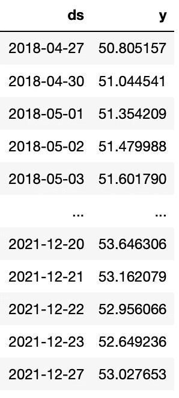

# RSI 的季节性分析

> 原文：<https://medium.com/analytics-vidhya/seasonality-analysis-of-rsi-c624eca9180f?source=collection_archive---------1----------------------->

RSI 是衡量超买和超卖的常用技术指标。范围从 0 到 100。在本文中，我将展示 RSI 的季节性以及如何将其应用于时间序列预测。

这里我用 VGT 的每日收盘价作为例子。VGT 是一种交易所交易基金，跟踪衡量信息技术板块股票投资回报的基准指数的表现。

为了平滑波动，我使用 14 天 RSI 的 20 天移动平均线。


> 看上面 2020 年和 2021 年 RSI 月平均值的图表，它们遵循相似的起伏模式。因此，它似乎有每年的季节性

为了进一步检查 RSI 是否遵循年度模式，我们取不同年份的月平均值，然后用它作为年度模式的近似值。


在大多数时间(尤其是最近的时间)，它符合每年的起伏模式，尽管在数据开始时有一些差异。这意味着可能有其他季节性周期影响 RSI。结果是多重季节性的结合。

我们可以使用 python 函数`sm.tsa.seasonal_decompose`通过统计检验来验证季节性。

```
import statsmodels.api as sm
from statsmodels.tsa.stattools import adfullerres = sm.tsa.seasonal_decompose(Y_true,period=12)
r = res.resid
r = r[~np.isnan(r)]
result = adfuller(r)
print(‘ADF Statistic: %f’ % result[0])
print(‘p-value: %f’ % result[1])
print(‘Critical Values:’)
for key, value in result[4].items():
    print(‘\t%s: %.3f’ % (key, value))
```

上面的代码是将 RSI 时间序列数据按指定周期(12 个月)进行分解，然后对残差进行 Adfuller 检验，检查残差是否平稳。如果残差是稳定的，这意味着 RSI 数据在统计上显示出很强的季节性。

p 值可以决定残差是否平稳，越接近 0，表明平稳性的证据越强。我们比较了(1)期= 12 个月和(2)期= 6 个月的结果。

```
12-month period: p-value = 1.219e-076-month period : p-value = 1.888e-08
```

> 我们得到了一个更小的 6 个月的 p 值。因此，我们可以说 RSI 数据显示了半年的季节性。

季节性可以帮助我们预测时间序列数据。[脸书预言家](https://facebook.github.io/prophet/docs/quick_start.html#python-api)是能够预测具有指定季节性的时间序列数据的软件包之一。

要使用 prophet，我们需要将数据格式化为两列:`ds`和`y`



```
dfph = df[[‘ds’,’y’]]
m = Prophet(yearly_seasonality=True)
m.add_seasonality(name=’half_year’, period=182,fourier_order=5)
m.add_country_holidays(country_name=’US’)
m.fit(dfph)
future = m.make_future_dataframe(periods=182)
forecast = m.predict(future)
fig1 = m.plot(forecast)
```

然后，我们通过启用年度季节性并添加半年季节性(182 天)来创建 Prophet 模型。我们还需要为我们指定节假日，因为节假日没有交易数据。

在训练数据`m.fit`之后，我们可以预测未来 182 天的 RSI。


预测(蓝线)非常吻合，看起来也很合理。

随着 RSI 预测的增强，我们可以应用我以前文章中的交易策略。我用 100 天来进行回溯测试。

**没有时间序列预测的简单 RSI 策略**

```
Hit ratio       =  43.14 %
Net profit      =  $ -42.01
Expectancy      =  $ -0.82 per trade
Profit factor   =  0.67
Total Return    =  -42.01 %Trades = 51
```

**用时间序列预测季节性**

```
Hit ratio       =  25.0 %
Net profit      =  $ 32.65
Expectancy      =  $ 8.16 per trade
Profit factor   =  3.53
Total Return    =  32.65 %Trades = 4
```

该策略产生的交易信号较少，但利润较高。这意味着时间序列预测有助于消除虚假信号。

代码可以在 Git ( [rsi_backtest.py](https://github.com/iwasnothing/ts-prediction-rsi/blob/main/rsi_backtest.py) )中找到。