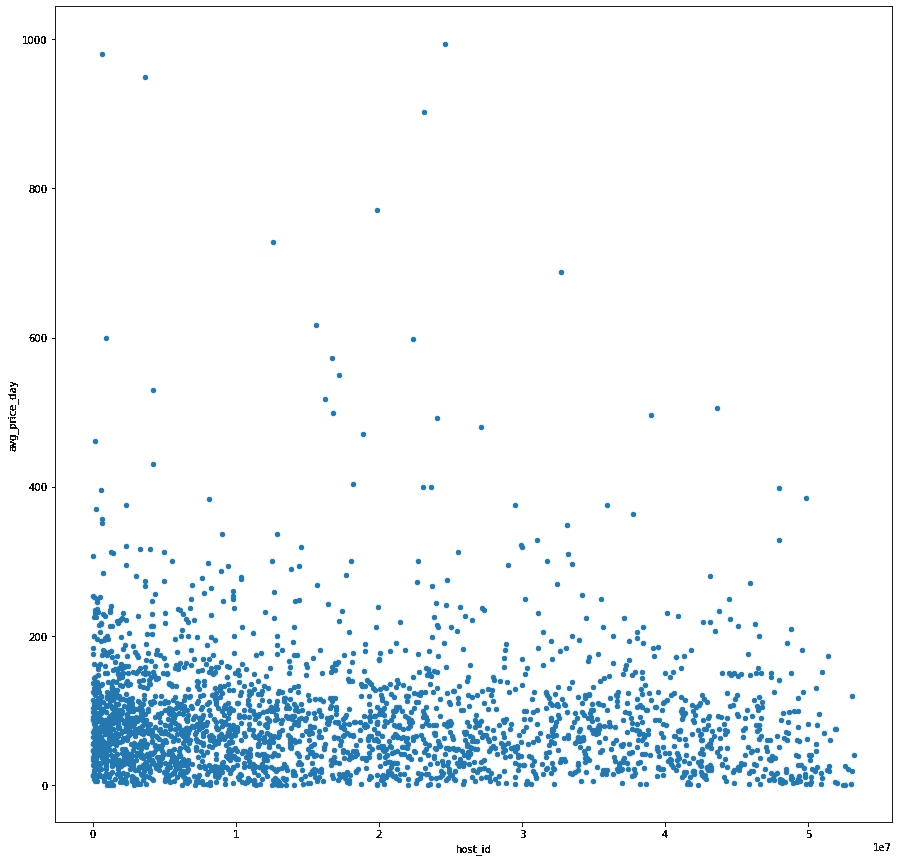

# 西雅图 Airbnb Udacity 项目

> 原文：<https://medium.com/analytics-vidhya/seattle-airbnb-udacity-project-2d1e583e8155?source=collection_archive---------11----------------------->

## *2016–2017 年西雅图 Airbnb 市场分析*

# 介绍

自 2008 年以来，客人和主人都使用 Airbnb 以一种更独特、更个性化的方式旅行。作为 Airbnb inside 计划的一部分，该数据集描述了华盛顿州西雅图的寄宿家庭的列表活动。

对于这个 Udacity 数据科学家 Nanodegree first 项目，我们使用西雅图 Airbnb 数据来分析以下三个业务问题:

1.  Airbnb 主机赚多少钱？
2.  什么时候是最好的租赁时间？
3.  在哪里租最好？

Airbnb 提供给我们的数据是三个数据集:

1.  一个日历数据集，我们可以看到某个列表可用或不可用的日期和相应的价格。
2.  一个列表数据集，包含每个列表的信息，如评论、位置、邻居、资产摘要等。
3.  包含每个猜测的评论信息的评论数据集。

# 问题 Airbnb 的主机赚多少钱？

一个至关重要的问题是，我们能在 Airbnb 上赚多少钱。

有几种方法可以考虑 Airbnb 的盈利能力。在这里我们将分析:

1.  在 Airbnb 上租房每年赚的钱
2.  你的平均收入。

为了分析第一点，我们有下面的图表。

正如我们所见，许多房东每年从 Airbnb 获得的收入不到 5 万美元。因此，根据房主的居住地和个人情况(家庭等)，这可能是他们的主要收入。然而，这可能有风险，但那是另一种分析。对于大多数人来说，这将是一个很好的第二收入，如果他们有第二套房子出租的话。

其次，我们可以分析每天的平均收入。

正如我们所看到的，大多数业主每天挣不到 150 美元，每月挣不到 4500 美元。如前所述，Airbnb 似乎是一个非常好的第二收入来源，但不是主要的资金来源

最后，我们可能会认为拥有更多上市资产的人往往会赚得更多，但如果我们计算收入和上市资产数量之间的相关性，我们可以看到并没有如此明确的相关性。

例如，下面这些人年收入超过 45000 美元，但他们平均拥有 3 处房产，其中许多人只有一处。

而有 46 个列表的主机比其他主机赚得少一点。

总而言之，你不需要拥有多处房产就能在 Airbnb 获得好的收益，因为大多数房东只有一处房产。此外，该平台似乎是一个赚取额外收入的好方法。

# **问题 2:什么时候租房最好？**

大多数主人和用户可能会问自己，一年中什么时候在西雅图租 Airbnb 最方便。

在这个分析中，我们将关注两个主要特征:价格和当年那个月出租的房产数量。这是因为我们希望获得最佳的资金价值，并且有不同的选项可供选择。

如果我们绘制这两个变量，我们可以看到，在夏季(从 6 月到 8 月)价格最高，但在另一个月，有较少的属性。

然而，我们可以看到，在年底(从 11 月到 12 月)和 2 月和 3 月，可用的房产数量比夏季高。

此外，我们可以看到，平均价格低于 6 月至 9 月期间的价格。

最后，在这个简单的图表中，我们可以看到，一般来说，当上市数量减少时，价格就会上涨，而当上市数量增加时，价格就会上涨。

总之，我们可以得出这样的结论:最好的租房时间是从一月到四月，那时房价仍然很低，但是有很多选择。

# 问题 3:哪些区域最适合出租？

度假时最常问的一个问题是在哪个区域租房。

为了回答这个问题，我们将使用列表数据集中的数据。

对于这种情况，我们将分析两个主要变量:

1.  价格
2.  位置审查分数

因为我们只对下一个假期的最佳租赁区域感兴趣，所以我们可以使用排名前 20 的社区来查看价格和分数

如我们所见，排名前 20 的社区得分都很高。然而，价格各不相同。这可能是因为不同用户认为在一个好的位置导入什么。也许有些离成本很近，有些离市中心很近，或者有些离夜生活更近。所有这些都是很好的问题，可以用更多关于西雅图市的数据进行更深入的分析。

总之，就金钱和分数的关系而言，最方便的地方是洛克希尔。

# **结论**

正如我们可以看到的，关于 Airbnb 的数据，我们可以问自己许多问题，其中一些可能有逻辑结论，而另一些有时没有，正如我们在问题 1 中看到的那样。

 [## 立即订阅！✉️

### 不要错过任何出版物📝

patonv.medium.com](https://patonv.medium.com/subscribe)