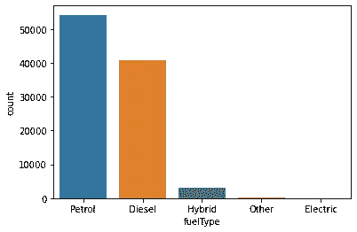

# 基于集成学习的二手车价格预测

> 原文：<https://medium.com/analytics-vidhya/second-hand-car-price-prediction-using-ensemble-learning-786066faa35e?source=collection_archive---------16----------------------->


[Jaimy Willemse 的图片来自 Unslpash](https://unsplash.com/photos/PYhkuv03zz4)

# 介绍

无论是为了学习而买车，还是把现有的车卖给知道价格合理的人，都是有益的。这个 [app](https://my-ml-apps.herokuapp.com/) 会帮你预测车子的二手价格。在这篇博客中，我们将看到我是如何为此目的创建一个 ML 模型的。本项目数据集取自 Kaggle.com。所以在此之前，让我们开始这个博客。

## 导入库

让我们导入所有必需的库。

## 读取数据

为了创建模型，我们需要数据，因此让我们创建一个数据框架来存储我们的数据。在我们的数据集中，我们有 **12 个 csv** 文件，所以与其把它们分开，不如把它们组合起来。

```
Files
['audi.csv',
 'bmw.csv',
 'cclass.csv',
 'focus.csv',
 'ford.csv',
 'hyundi.csv',
 'merc.csv',
 'skoda.csv',
 'toyota.csv',
 'vauxhall.csv',
 'vw.csv']
```


## 处理分类数据

我们需要数字数据来训练我们的模型。为了做到这一点，我们有几个选择，如 getdummies，OneHotEncoder，LabelEncoder。所以这些编码器将分类值编码成数值。它以升序对数据进行编码。但是当我们部署我们的模型时，我们将只获得 1 条记录的输入，因此它将把所有内容编码为 0。因此，我们将需要一个正确的映射键，即实际值和值，即编码值。以下代码用于将每个分类数据转换为基于数值的值。

**公司**

这个属性告诉汽车是哪个公司的。将公司数据转换成数字数据并存储到字典中。

```
{'Audi': '0', 'BMW': '1', 'Mercedes': '2', 'Ford': '3', 'Hyundai': '4', 'Skoda': '5', 'Toyota': '6', 'Vauxhall': '7', 'Volkswagen': '8'}
```

**型号**

这个属性告诉汽车是哪个型号的。将模型数据转换为数字数据并存储到字典中。

```
{' A1': '0', ' A6': '1', ' A4': '2', ' A3': '3', ' Q3': '4', ' Q5': '5', ' A5': '6', ' S4': '7', ' Q2': '8', ' A7': '9', ' TT': '10', ' Q7': '11', ' RS6': '12', ' RS3': '13', ' A8': '14', ' Q8': '15', ' RS4': '16', ' RS5': '17', ' R8': '18', ' SQ5': '19', ' S8': '20', ' SQ7': '21', ' S3': '22', ' S5': '23', ' A2': '24', ' RS7': '25', ' 5 Series': '26', ' 6 Series': '27', ' 1 Series': '28', ' 7 Series': '29', ' 2 Series': '30', ' 4 Series': '31', ' X3': '32', ' 3 Series': '33', ' X5': '34', ' X4': '35', ' i3': '36', ' X1': '37', ' M4': '38', ' X2': '39', ' X6': '40', ' 8 Series': '41', ' Z4': '42', ' X7': '43', ' M5': '44', ' i8': '45', ' M2': '46', ' M3': '47', ' M6': '48', '4 Series': '49', ' Z3': '50', ' C Class': '51', ' Focus': '52', ' Fiesta': '53', ' Puma': '54', ' Kuga': '55', ' EcoSport': '56', ' C-MAX': '57', ' Mondeo': '58', ' Ka+': '59', ' Tourneo Custom': '60', ' S-MAX': '61', ' B-MAX': '62', ' Edge': '63', ' Tourneo Connect': '64', ' Grand C-MAX': '65', ' KA': '66', ' Galaxy': '67', ' Mustang': '68', ' Grand Tourneo Connect': '69', ' Fusion': '70', ' Ranger': '71', ' Streetka': '72', ' Escort': '73', ' Transit Tourneo': '74', ' I20': '75', ' Tucson': '76', ' I10': '77', ' IX35': '78', ' I30': '79', ' I40': '80', ' Ioniq': '81', ' Kona': '82', ' Veloster': '83', ' I800': '84', ' IX20': '85', ' Santa Fe': '86', ' Accent': '87', ' Terracan': '88', ' Getz': '89', ' Amica': '90', ' SLK': '91', ' S Class': '92', ' SL CLASS': '93', ' G Class': '94', ' GLE Class': '95', ' GLA Class': '96', ' A Class': '97', ' B Class': '98', ' GLC Class': '99', ' E Class': '100', ' GL Class': '101', ' CLS Class': '102', ' CLC Class': '103', ' CLA Class': '104', ' V Class': '105', ' M Class': '106', ' CL Class': '107', ' GLS Class': '108', ' GLB Class': '109', ' X-CLASS': '110', '180': '111', ' CLK': '112', ' R Class': '113', '230': '114', '220': '115', '200': '116', ' Octavia': '117', ' Citigo': '118', ' Yeti Outdoor': '119', ' Superb': '120', ' Kodiaq': '121', ' Rapid': '122', ' Karoq': '123', ' Fabia': '124', ' Yeti': '125', ' Scala': '126', ' Roomster': '127', ' Kamiq': '128', ' GT86': '129', ' Corolla': '130', ' RAV4': '131', ' Yaris': '132', ' Auris': '133', ' Aygo': '134', ' C-HR': '135', ' Prius': '136', ' Avensis': '137', ' Verso': '138', ' Hilux': '139', ' PROACE VERSO': '140', ' Land Cruiser': '141', ' Supra': '142', ' Camry': '143', ' Verso-S': '144', ' IQ': '145', ' Urban Cruiser': '146', ' Corsa': '147', ' Astra': '148', ' Viva': '149', ' Mokka': '150', ' Mokka X': '151', ' Crossland X': '152', ' Zafira': '153', ' Meriva': '154', ' Zafira Tourer': '155', ' Adam': '156', ' Grandland X': '157', ' Antara': '158', ' Insignia': '159', ' Ampera': '160', ' GTC': '161', ' Combo Life': '162', ' Vivaro': '163', ' Cascada': '164', ' Kadjar': '165', ' Agila': '166', ' Tigra': '167', ' Vectra': '168', ' T-Roc': '169', ' Golf': '170', ' Passat': '171', ' T-Cross': '172', ' Polo': '173', ' Tiguan': '174', ' Sharan': '175', ' Up': '176', ' Scirocco': '177', ' Beetle': '178', ' Caddy Maxi Life': '179', ' Caravelle': '180', ' Touareg': '181', ' Arteon': '182', ' Touran': '183', ' Golf SV': '184', ' Amarok': '185', ' Tiguan Allspace': '186', ' Shuttle': '187', ' Jetta': '188', ' CC': '189', ' California': '190', ' Caddy Life': '191', ' Caddy': '192', ' Caddy Maxi': '193', ' Eos': '194', ' Fox': '195'}
```

**传输**

这个属性告诉我们它有什么样的齿轮传动。下面的代码片段将值及其映射存储到字典中。

**燃料类型**

## 电子设计自动化(Electronic Design Automation)

**统计概述**


数据集的描述

```
<class 'pandas.core.frame.DataFrame'>
RangeIndex: 108540 entries, 0 to 108539
Data columns (total 11 columns):
 #   Column        Non-Null Count   Dtype  
---  ------        --------------   -----  
 0   model         108540 non-null  object 
 1   year          108540 non-null  int64  
 2   price         108540 non-null  int64  
 3   transmission  108540 non-null  object 
 4   mileage       108540 non-null  int64  
 5   fuelType      108540 non-null  object 
 6   tax           94327 non-null   float64
 7   mpg           99187 non-null   float64
 8   engineSize    108540 non-null  float64
 9   company       108540 non-null  object 
 10  tax(£)        4860 non-null    float64
dtypes: float64(4), int64(3), object(4)
memory usage: 9.1+ MB
```

汽车数量:108540
重复值数量:2273

空值:

```
model                0
year                 0
price                0
transmission         0
mileage              0
fuelType             0
tax              13329
mpg               8555
engineSize           0
company              0
tax(£)          101493
```

**删除重复值和空值**

```
0
```

**型号**

这个属性告诉我们汽车的型号名称。

```
Number of unique values
196
Value Counts
 Fiesta     6496
 Focus      4982
 Golf       4791
 C Class    3945
 Corsa      3272
            ... 
200            1
 A2            1
 Accent        1
180            1
 Amica         1
```


型号计数


模型与价格的关系

**年份**

这个属性告诉我们这辆车是哪一年制造的。让我们看看它对价格的影响。

```
Number of unique values :: 29
```


年计数图


年份与价格的关系


年份分布


带价格的注册图

我们可以从这些地块上看出我们当年对价格有影响。汽车价格随着生产年份的增加而增加。

**传输**

这个属性告诉我们变速器汽车的齿轮类型。让我们看看它是如何影响价格的。

```
Number of unique values: 4
Unique values: ['Manual', 'Automatic', 'Semi-Auto', 'Other']
Value counts:
Manual       55758
Semi-Auto    22313
Automatic    20127
Other           10
```


传输计数图


传输与价格的关系

自动和半自动的价格比其他两类要高。

**里程**

这个属性告诉我们，一辆汽车就燃料供给能行驶多少英里/公里。

```
Number of unique values: 42313
```


里程分布


里程与价格的关系

**燃料类型**

这个属性告诉我们汽车使用哪种燃料。让我们看看它是否影响价格。

```
Number of unique value: 5
Unique value: ['Petrol', 'Diesel', 'Hybrid', 'Other', 'Electric']
Value count:
Petrol      54206
Diesel      40661
Hybrid       3087
Other         248
Electric        6
```



燃料计数图


燃料与价格的关系

**发动机尺寸**

这个属性告诉我们汽车发动机的大小。让我们看看它是如何影响汽车价格的。

```
Number of unique values: 42
```


发动机尺寸计数图


发动机尺寸与价格的关系

**价格**

这是我们的目标属性。就是二手车的价格。


价格分布


价格箱线图

**数据清理**

我们的数据集中没有删除异常值的原因包括各种公司数据集，其中型号和公司名称是导致异常值的主要因素之一

## 特征工程

使用之前创建的字典对我们的分类数据进行编码。

在第二行，我们选择数据类型为 objects 的列名。然后遍历列名并相应地存储值。


编码数据帧

```
Converting str values to int: cars[cols]=cars[cols].astype(int)
```


相关热图

**选择测试**


特征和分数

在这里，所有功能或多或少都会影响价格。每一个功能都与价格有着很好的相关性，这是我们不能忽视的。正如它所显示的，所有这些特性都会影响价格，并且非常重要。当我用所有功能试错时，我给出了最大 R2 分数。因此，选择所有特征。

**MinMaxScaller**

```
cols=[‘engineSize’,’mileage’]
```

使用 MinMaxScaler 转换同一范围内的值

## 建模

让我们将数据分成训练样本和测试样本。

> 注意:我们的评估指标是 R 的平方，即 R2。R2 是模型表示度量，它告诉我们的回归模型有多好。范围从-1 到 1，其中 1 表示非常好，而-1 表示不好。

**RandomForestRegressor**

RandomForestRegressor 是用于基于回归的任务的集成算法。这里我们也在做一些超参数调整。

```
MAE 1425.9924792171153
R2 0.9282483356510569
```

嗯，92%的 R2 分数令人印象深刻。现在让我们尝试使用 Xboost 回归器。

**xgboost 回归器**

这是一种梯度推进算法，其中 XGBRegressor 用于基于回归的任务。

```
MAE 1322.161939034648
R2 0.9394056654633186
```

从 RandomForestRegressor 和 XGBRegressor 的比较中我们可以看出，XGBRegressor 的性能稍好一些。因此，我选择它作为我的最终模型，并保存它。

## **保存模型**

在训练完模型之后，让我们保存它。

**保存编码器**

## 结论

我希望这个博客对你有所帮助，并让你学到一些新东西。你可以在这里找到这个问题的答案。你可以在这里查看它的演示。喜欢这个帖子表示支持。你可以把你在这里发现的任何问题或者任何需要改进的地方写下来。我很乐意从中学习一两件事。
在那之前，再见。