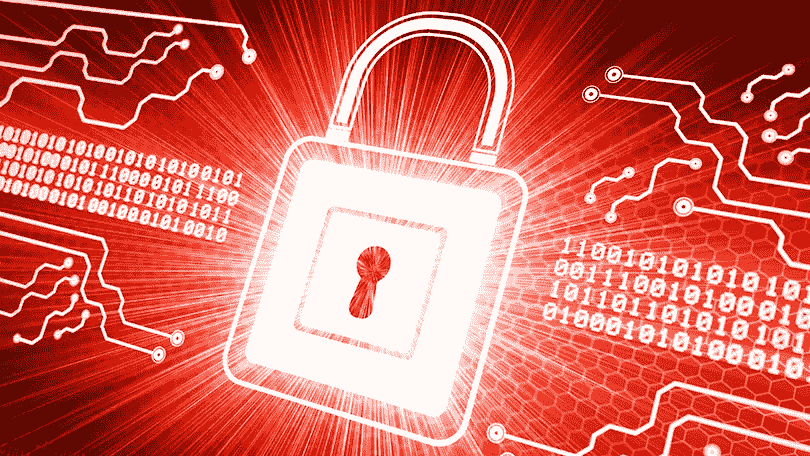

# 保护大数据

> 原文：<https://medium.com/analytics-vidhya/securing-big-data-c8424d444cdf?source=collection_archive---------14----------------------->

安全性通常被认为是第二优先或次要的，但有时缺乏安全性会导致价值或声誉的损失。目标公司是一家因第三方供应商缺乏安全性而受到攻击的公司。这一切都是从一封钓鱼邮件开始的，其中一名员工访问了这封邮件，并从邮件中安装了一个机器人变种。这导致在服务器上安装了恶意软件，并访问了所有人的数据。超过 4000 万张信用卡和价值 7 亿英镑个人信息被盗。这种攻击主要是由于第三方系统缺乏安全性以及缺乏对网络的监控，因为攻击者能够进入不同的系统并获取信息。

所以安全和保障。安全更多的是实现安全的前提。安全通常是保护环境免受 IT 行业的负面影响，而安全处理的是保护数据免受威胁。谈到威胁，有 4 个主要的重要攻击者

*   ***-****经典罪犯他们经常与金钱打交道他们钻营以获取金钱*
*   ****黑客行动主义者***——他们为一项政治事业而来，出名的是匿名帮派*
*   ****政府***——他们既为政治而黑客，又从他们的信息流中获得洞察力并计划攻击它*
*   ****脚本小子***——他们更像是那种无缘无故做黑客的年轻人。他们经常为了实验的目的而这样做。*

*因此，为了保护这些数据，我们有 3 个 IT 安全目标*

*   *机密性-只有授权的人才能使用数据*
*   *完整性-数据不得被授权用户以外的任何人篡改。*
*   *可用性—数据必须始终可供授权用户访问*

*除了这三点，我们还有 ***隐私*** 数据是可信的，并且只用于好的目的。*

****下一个问题是如何保护这些系统？****

*   ****风险分析:****

*1) ***了解公司资产及其价值****

*-您从客户那里获得了哪些数据？*

*-数据的重要性/价值是什么？*

*2) ***了解威胁和漏洞****

*如果中情局的线索受到影响会怎样？*

*-风险在系统中发生的概率是多少？*

*-威胁*概率=风险*

*3) ***将风险分析作为提高安全性的基础****

*首先了解这些安全要求有助于我们提供安全措施以及所需的技术。因此，风险和成本之间一直存在权衡。重要的是要明白这不是一次性投资，因为总是有新的威胁、价值和可能性。*

****安全挑战:****

*1)数据量大*

*2)数据分析应实时进行*

*3)异构数据*

*4)处理和存储发生在公共云中*

****措施种类****

*   *预防措施—防止/阻止未经授权的访问*
*   *检测措施—分析正在进行的或已完成的攻击分析它们并提出解决方案*
*   *分析方法——阐明规则和标准，即明确 T&C*

*100%的安全是不可能的。我们可以做些事情来减少攻击媒介。认为技术措施足以提供高安全性总是一种误解。虽然这是正确的，但我们也必须有组织和行政程序。让我们举一个例子，如果你想从技术上设置哪些数据应该被访问，哪些不应该，那么我们首先必须知道谁可以访问以及如何访问？了解哪些数据是重要的，哪些数据可以开放，哪些数据我们根本不需要，这一点总是很重要，因此在了解这些之后，我们可以将组织和管理团队结合起来，以获得更好的结果*

****行政措施:****

*1)我们首先需要哪些技术措施、行动和机制？*

*2)谁负责设置和执行此操作？*

****定律:****

*   ****ISO/ISMS IEC 27001 和信息安全管理体系*** 这有助于为组织和行政部门提供一种结构化的方法*
*   ****IEC 62443*** —工业自动化与控制系统。这些法律提供了详细的安全准则和措施*

*以防止数据被窃取、截取或操纵。我们经常使用一种称为加密的技术，它不是一个独立的工具，但通常被视为数据安全的一个过程。在大数据环境中，加密有两个目的*

*1)通信数据*

*2)存储数据*

****访问控制:****

****认证***——验证某个自称的人*

****授权*** -建立是用户被允许访问某个资源或平台*

*两种访问控制措施:*

*= >数据和用户 id 角色*

*= >用户 id/角色和真实人物*

*组合不同的授权和身份验证方案以获得最佳效果。*

***审计**有助于纠正规划和配置设置，同时 pen 测试可发现并消除弱点。*

*大数据专项审计:*

*它检查与系统的一致性*

*1) ***PIA 的*** —隐私影响评估*

*2) ***DPIA 的*** —数据保护影响评估—根据 GDPR(一般数据保护权利)关注隐私*

****侦探手段:=>****

*它们不会干扰实际的系统*

*1)实现了哪些方法？(建议)来自政府*

*2)方法是否按计划实施？*

****侦探措施:= >主动****

*渗透测试。在这种情况下，外部人员试图扮演攻击者的角色，并在道德基础上找到可能的违规行为，以此作为提高安全性的措施。*

*从而导致系统安全性被*

*1)投诉*

*2)最先进的*

*3)有效*

> ****什么是 GDPR？****
> 
> *《通用数据保护条例》( GDPR)是一项欧盟立法，旨在让欧盟居民能够更好地控制自己的数据。根据这项法规，处理欧盟居民数据的组织必须遵守数据和隐私规则。*
> 
> *GDPR 包含 60 个开头条款，但没有作为国家法律实施。它说，各成员国有酌处权/自由引入国家规定，以通过国家法律的方式协调或进一步澄清某一特定规则*
> 
> *有许多法律对 GDPR 进行了补充，如规范隐私和电子通信的电子隐私条例，它取代了 2002 年关于电子通信中数据保护的指令。GDPR 的货币费用因成员国而异。*
> 
> *该 GDPR 基本上取代了之前的数据保护指令 95/46/EC，该指令没有考虑大数据和云应用的数据保护，因为在 1995 年这些技术还不存在。*
> 
> *新 GDPR 专注于*
> 
> *-加强数据主体的权利(数据便携性权利)*
> 
> *-对儿童的特别保护(16 岁儿童的数据访问权在父母同意的情况下授予)*
> 
> *-设计隐私和默认隐私*
> 
> *-数据保护影响评估*
> 
> *-扩大领土适用范围*
> 
> *-违规罚款更高(2000 万欧元或全球年营业额的 4%，以较高者为准)*

****最佳访问控制实践:****

*需要知道原则=最低用户权限*

1.  *安全风险是更新，因为更新对保护系统更重要*

*它始于*

*   *操作系统*
*   *数据库系统*
*   *应用系统(例如 Web 服务器、Hadoop 大数据系统)*

> *什么是 Hadoop？*
> 
> *Hadoop 是一个开源软件框架，用于在商用硬件集群上存储数据和运行应用程序。它为任何类型的数据提供大容量存储、巨大的处理能力以及处理几乎无限的并发任务或工作的能力。*

*2.数据来源*

*数据分析使用大数据来获得更好的洞察力，我们必须知道如何使用垃圾输入和垃圾输出原则来使用值得信赖的数据。获取细节的数据是否可信，因为数据会导致非常关键的决策。*

*3.保护大数据系统/复杂系统，维护它们，直到为时不晚*

*4.设计安全+隐私的系统*

*5.GDPR 权利通过设计更新隐私/通过设计更新安全。*

*需要数据保护来确保个人关于大数据应用程序如何处理他们的权利得到保护。现在，一个简单的谷歌搜索引擎可以显示我们搜索了什么，我们的兴趣，位置，我们通过电子邮件与谁分享东西等等。因此，这些数据更多的只是资金转移。大数据很难理解和分析哪些数据应该公开，哪些不应该公开。*

*所以我们拥有的数据与这个人的真实身份相关联。那么应该怎么做才能让数据不暗示对人的真实识别呢？然后，这个过程被称为数据屏蔽，它删除或匿名的数据链接到真实的人，如他们的名字。*

*所以有两种 ***数据屏蔽*** 技术*

*   ****匿名化:*** 基本上删除数据，就像如果你告诉产品反馈，我们会删除名字，这样说的人就不会被知道，我们也没有办法得到真实的人。因此，当隐藏了高度机密的信息时，或者当组合的信息簇会导致机密数据时，就使用它*
*   ****伪名化:*** 基本上就是用某种模式或者数字来替代真实数据。如银行账号、电话号码等。关键是它可以通过联系人的属性来揭示人的身份。保持高度相关的信息可见*

*K-匿名性使得链接更加困难。k-匿名中的数字 k 是表中具有相同身份的个体的最小数量，因此不能被区分。*

*尽管有数据屏蔽技术，但确定何时使用还是很重要的。因此，在医疗报告中，如果你隐瞒疾病或年龄，这些数据将毫无用处。在这里，假名化被用来隐藏他们的社会 ID，帐号等。*

*差异隐私允许在不丢失洞察力和不泄露私人信息的情况下对数据进行分析。它保证在发送查询时不会危及个人隐私。*

*例如:在健康数据中，如果他们有患者记录，他们的疾病编码为 1 和 0，他们有兴趣分析大多数人都会得的所有疾病，另一家公司也有兴趣获得数据，那么患者的姓名必须匿名。他们不应该隐瞒疾病，因为没有有用的信息*

*它适用于大数据系统。不同的保密方法有*

*   **用于查询-应答系统的拉普拉斯机制**
*   *****收集用户数据的随机响应*****
*   *****使用数据库的指数机制*****

*****大数据加密*****

*****同态*** 加密提供了在数据被加密时对其执行操作的能力，这允许进行数据处理，而不需要提供完全访问，但由于以下原因，它缺乏实际的实现**

*   **高计算要求**
*   **将同态元素组织成单个同态数据，这使其成为复杂的数据**

**安全多方计算是指四到五家公司希望分析销售和增长情况，但他们彼此不信任，或者从商业角度来说，他们不相信利益相关者，但我们必须以某种方式从中获得一些东西，于是出现了这种多方技术**

**一个经典的例子是百万富翁，当我们想找出谁是最富有的，如果他们分享他们的工资，我们可以计算和说，但通常很难实现，因为**

*   **第三方不存在**
*   **数据泄露/损坏的风险很高**

**有一些方法可以克服这些情况，即零证据信息。这些机器已经安装好了，所以数据不会泄露给任何人。**

**这些协议是**

1.  *****输入隐私***——关于输入数据的隐私信息，除了函数输出所透露的信息之外，无法推断出更多的信息**

****2*2。正确性*** -函数总是计算正确-不诚实的一方不能强迫诚实的一方输出不正确的结果。**

**但缺点是它很复杂，需要花费大量的时间来使系统响应特定的查询，并且必须进行大量的高级计算。**

**这些是大数据安全面临的一些挑战利弊，如果您想了解更多信息，请参加 coursera 的 ***保护隐私和大数据课程。关注@analysta02 了解更多网络安全信息。*****

**安全快乐！**