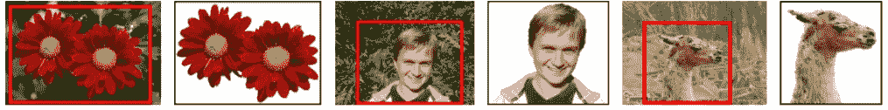
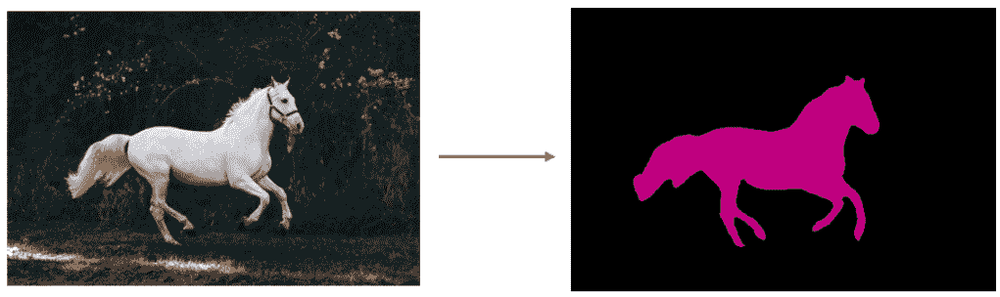

# 分段:抓取切割算法

> 原文：<https://medium.com/analytics-vidhya/segmentation-84d8fba92dc0?source=collection_archive---------1----------------------->

图 1:抓取切割的三个例子

描述你将如何处理细分问题的一步一步的过程。也就是说，我们希望移除包含任意对象的任意照片的背景。

**什么是细分:**

基于相似性属性将图像划分成不同的区域。简单来说，分割用于对象检测。它有很多种类型，我们提出了图割图像分割的 grab cut 算法。

**抓取切割算法:**

传统的图像分割工具要么使用纹理(颜色)信息，例如魔棒，要么使用边缘(对比度)信息，例如智能剪刀。

抓取切割是一种基于图切割的图像分割方法。该算法使用高斯混合模型来估计目标物体和背景的颜色分布。

**工作:**

*   用户输入矩形。矩形之外的一切都将被视为确定的背景。矩形之内的一切都是未知的。类似地，任何指定前景和背景的用户输入都被认为是硬标签，这意味着它们在这个过程中不会改变。
*   计算机根据我们提供的数据进行初始标记。它标记前景和背景像素(或硬标记)
*   现在高斯混合模型(GMM)被用来模拟前景和背景。
*   根据我们提供的数据，GMM 学习并创造了新的像素分布。也就是说，未知像素被标记为可能的前景或可能的背景，这取决于它们在颜色统计方面与其他硬标记像素的关系(就像聚类一样)。
*   从这种像素分布构建图形。图表中的节点是像素。添加了另外两个节点，源节点和接收器节点。每个前景像素连接到源节点，每个背景像素连接到汇节点。
*   将像素连接到源节点/末端节点的边的权重由像素是前景/背景的概率来定义。像素之间的权重由边缘信息或像素相似性来定义。如果像素颜色差异较大，它们之间的边缘将获得较低的权重。
*   然后使用最小割算法分割图形。它将图切割成两个分离的源节点和具有最小成本函数的汇节点。成本函数是被切割边的所有权重的总和。剪切后，连接到源节点的所有像素变成前景，连接到接收器节点的像素变成背景。
*   这个过程一直持续到分类收敛。

OpenCV 有函数，用的是 cv.grabCut()。

我希望你们喜欢读它。

**感谢您阅读本文！！！**

快乐学习📝

— — — — — — — — — — — — — — — — — — — — — — — — — — — — — —

参考:

[1]罗泽尔、卡斯滕、弗拉基米尔·科尔莫戈罗夫和安德鲁·布雷克。使用迭代图切割的“GrabCut”交互式前景提取美国计算机学会制图汇刊(TOG) 23，第 3 期(2004):309–314。

[2]https://docs . opencv . org/3.4/D8/d83/tutorial _ py _ grab cut . html

[3]曾、东东、、、迈克尔·戈塞勒和阿尔扬·库伊佩尔。“实时语义分割的背景减法。”IEEE Access 7(2019):153869–153884。

[4]https://www . bogotobogo . com/Python/OpenCV _ Python/Python _ OpenCV 3 _ Image _ Segmentation _ by _ Foreground _ Extraction _ grab cut _ Algorithm _ based _ on _ Graph _ cuts . PHP

— — — — — — — — — — — — — — — — — — — — — — — — — — — — — — — -

在 LinkedIn 上关注我:[https://www.linkedin.com/in/anushka-singh-1b9850153/](https://www.linkedin.com/in/anushka-singh-1b9850153/)