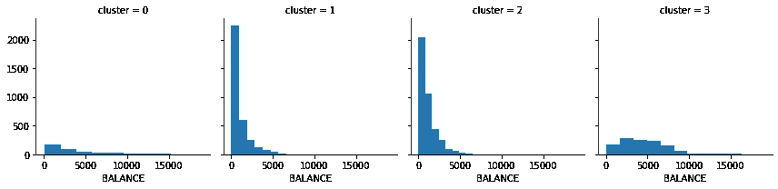

# 基于 K-均值聚类的分割分析

> 原文：<https://medium.com/analytics-vidhya/segmentation-analysis-with-kmeans-clustering-93d05565a9f8?source=collection_archive---------11----------------------->

来源:bluetext.com

聚类是将相似的客户放入互斥的组中的过程；这些组被称为“段”，而分组的行为被称为分段。细分使企业能够识别他们所服务的客户/市场的不同类型和偏好。这是制定高效营销、产品和商业战略的关键信息。

集群的一些常见应用包括:

*   识别购买模式
*   给新客户的建议
*   欺诈检测
*   识别客户群
*   保险事故
*   自动分类内容
*   识别生物联系的遗传标记
*   表征患者行为
*   离群点检测
*   汇总生成
*   探索性数据分析

在这篇文章中，你将学习如何使用 Kaggle 的[信用卡数据集](https://www.kaggle.com/arjunbhasin2013/ccdata)进行客户细分分析。目标是开发客户细分，以确定营销策略。我们得到了 9000 名活跃信用卡持有者的数据，每个人有 18 个行为变量。

这是对数据集中给出的变量的描述:

来源:www.kaggle.com

我们将用来执行分段分析的算法是 K 均值聚类。K-Means 是一种基于分区的算法，在中型/大型数据集上表现良好。该算法是一种无监督学习算法，利用数据中的相似性来创建无标签的组。分割指的是分成不重叠的 k 个子集。目标是使每个分类中的数据尽可能相似，同时使每个分类尽可能不同于其他分类。从技术角度来说，我们寻求最小化集群内的距离，同时最大化集群间的差异。

我们可以使用各种距离度量来最小化簇内距离和最大化簇间距离，例如欧几里德、余弦相似度等。度量标准的选择在很大程度上取决于您的领域问题，最好对多维数据集的要素进行归一化。其他类型的聚类算法包括层次聚类和基于密度的聚类。

## **K-表示步骤:**

*   分配 k 个质心-质心用于表示簇的“中心”
*   计算每个物体到每个质心的距离
*   将最靠近质心的数据点分配到一个聚类中
*   重新计算 k 个质心的位置以最小化簇内距离和最大化簇间距离
*   重复这些步骤，直到质心不再改变

现在，我们将构建程序。首先，我们将导入必要的库并定义一些辅助函数。(提示:设计助手功能来自于计划阶段，但也来自于在开始构建时识别模式和重构代码)

## **检查数据类型**

# **检查缺失值**

我们可以看到 MINIMUM_PAYMENTS 和 CREDIT_LIMIT 字段缺少值。

我们将研究这些值，以了解它们的分布情况，并决定如何处理它们。

## **探索带有缺失值的数据**

如您所见，它们都有显著的异常值。用中位数或平均值进行估算会导致我们的数据出现偏差。我们将利用回归和我们在开始时定义的帮助函数

接下来，我们将使用我们定义的另一个辅助函数来可视化异常值和所有特征的总体分布。

我们的许多要素在其分布中存在显著差异，下一步将是在我们的要素缩放步骤中对数据集进行归一化。我们将通过使用我们定义的另一个助手函数来实现 StandardScaler()

*简要概述:标准缩放器移除平均值并缩放至单位方差。其计算方式为:*

***Z=(x-u)/s***

*   *x =特征值*
*   *u =平均值*
*   *s =标准偏差*

现在我们已经完成了一些基本的 EDA 和预处理，我们将建立我们的模型。我们要做的第一件事是选择集群的数量。

## **选择集群数量**

常见的技术是对不同的 K 值进行聚类。然后，我们确定不同类型 K 的误差变化。增加 K 值总是会减少误差，但是，这不是我们想要建立模型的方式；最终，k 等于数据集中的数据点数。

我们可以将不同 k 的不同错误分数可视化，并选择“拐点”作为我们选择的 k 的数量。

拐点是 k 值急剧下降的地方。

基于可视化，我们将选择 4 来表示 k 簇。首先，我们将执行主成分分析。

## **主成分分析**

PCA 是一种常用于大型数据集的降维方法。PCA 将一个大的变量集转换成较小的变量集，同时保留原始信息。

精度和降维带来的简单性之间存在固有的权衡。

## **聚类解释**

这是每个分类的第一个要素的片段，为每个要素生成一个可视化。这将告诉您所有 4 个集群的平衡变量的特征。要查看每个特性的完整可视化，请在此处查看[源代码](https://colab.research.google.com/drive/13elIO8mlMAV-_4G4WAZgq-MKr73wiX2w?usp=sharing)

## **集群可视化**

现在，我们将最终从整个数据集可视化我们的集群。

要查看整个项目，请在这里查看[源代码](https://colab.research.google.com/drive/13elIO8mlMAV-_4G4WAZgq-MKr73wiX2w?usp=sharing)。