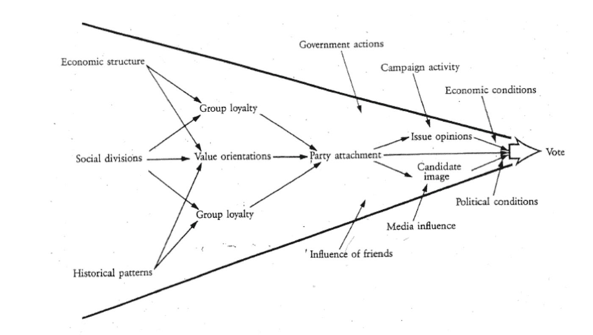
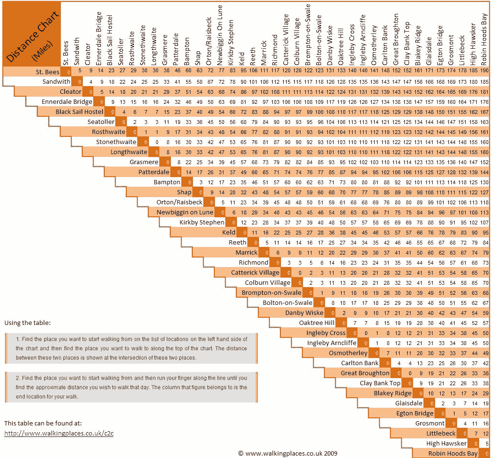
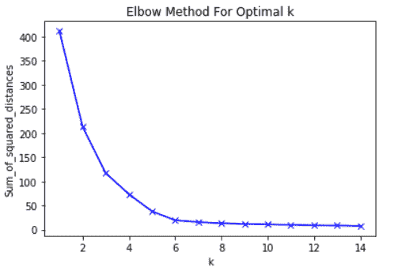
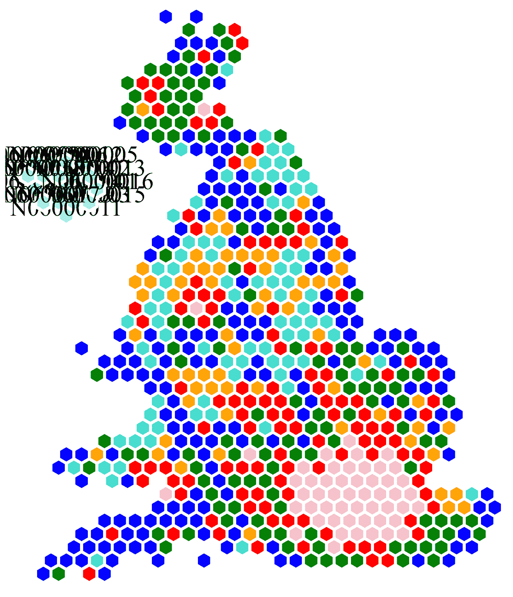

# 使用无监督随机森林、Boruta 和 K-均值聚类分割英国选区

> 原文：<https://medium.com/analytics-vidhya/segmenting-uk-constituencies-using-unsupervised-random-forest-boruta-and-k-means-clustering-2d21f6c3b368?source=collection_archive---------9----------------------->

## 具有特征选择、特征减少和聚类的逐步机器学习


帕克·约翰逊在 [Unsplash](https://unsplash.com?utm_source=medium&utm_medium=referral) 上拍摄的照片

从十几岁开始，我就发现选举政治很迷人，并开始阅读[英国民调报告](https://ukpollingreport.co.uk/)。这是我攻读国际公共政策硕士学位的动力，也是我在我工作的地方工作的原因。我最喜欢选举和民意调查的是它提供的分析机会，以及更好地理解人们为什么做出这样的决定。

这篇文章着眼于使用一些关于选区级别投票和人口统计数据的机器学习，看看是否可以以一种比刻板化整个国家地区更好的方式对选区进行分组，这些地区内部的差异在很大程度上被忽略了(咳咳——红墙！).在本文中，我将使用标准 K-Means 聚类对选区进行分组，使用无监督随机森林进行特征约简，使用 Boruta 进行特征选择。

# 数据

幸运的是，除了 Zoopla 这样的商业来源之外，英国还拥有非常高质量的人口统计数据，这些数据来自备受尊敬的机构，如英国国家统计局和英国议会两院。通过这些来源，可以获得关于职业、以前的投票模式、贫困、房价、教育、年龄、健康、人口密度和当地生活设施的选区级数据。

一个人的投票选择是多方面的。下面的漏斗是一个广泛使用的表示，显示了有多少不同的事情影响一个人的决定。



投票选择的漏斗由[道尔顿(1988)](https://books.google.co.uk/books/about/Citizen_Politics_in_Western_Democracies.html?id=6MOGAAAAMAAJ)

随着时间的推移，这些事情会发生变化，它们在推动投票选择方面的重要性也会发生变化。因此，虽然下面的工作能够准确地确定在 2019 年大选中决定投票选择的重要因素，但假设未来选举保持不变是错误的(尽管目前这些变化很慢)。

# 特征选择。让我们把这个放下来！

由于有大量的选区级功能，其中许多功能可能对投票选择影响很小或没有影响。因此，将它们包括在兰登森林模型中不会提高甚至可能降低模型的准确性。因此，首先应用一些特征选择是很重要的。

Boruta 就是这样一种特征选择算法，它可以很好地处理随机森林模型。这篇链接文章比我更好地解释了 Boruta，但简而言之，它通过随机选择真实特征并对照真实特征进行测试来创建“影子特征”，以查看哪个在预测投票份额方面表现更好。如果真实特征在预测性方面始终优于随机特征，那么它们被认为对预测投票选择很重要。

运行 Boruta 的代码只有几行，如下所示:

```
library(boruta)# Set a pseudo-random seed for replicabilityset.seed(111)# Run the Boruta algorithm on the data where first_party is the percentage of votes for the winning partyboruta.bank_train <- Boruta(first_party~., data = uk_const_boruta, doTrace = 2)# Print a summary of feature importancesboruta.bank_train$ImpHistory
```

下表显示了运行 Boruta 算法后选择的特征列表，这些特征被确定为最佳预测投票份额。对于任何关注 2019 年大选的人来说，他们似乎通过了[视力测试](https://en.wikipedia.org/wiki/Visual_inspection)。

有替代 Boruta 的特征选择算法。一种这样的方法是[最大关联—最小冗余(MRMR)](https://towardsdatascience.com/mrmr-explained-exactly-how-you-wished-someone-explained-to-you-9cf4ed27458b) 。这种技术对 Boruta 进行了改进，它认识到一些特征在解释能力方面存在重叠(例如，20-29 岁的人比 70-79 岁的人有更多的学位，但年龄和教育都是投票选择的重要决定因素)，因此确定了什么样的特征组合作为一个整体最具预测性，而不是仅单独采用最具预测性的特征。可惜我是做了这个工作之后才知道这个技术的！

# 用多种特征聚集事物

我听过的对集群的最好的简单英语描述是一个连锁餐厅决定在哪里开新餐厅的例子。基于预先计算的度量，所有项目彼此之间都有一定的“距离”，在本例中是物理距离。给定一定数量的组，一种算法会计算出如何将这些组组合在一起，以最小化组中所有点之间的总距离。如果你是开了 3 家新外卖店的 Morleys 的老板，并且拥有该地区所有鸡肉爱好者的 GPS 坐标，你就可以找到放置外卖的最佳地点。

聚类算法，如 K-Means，在距离上工作得很好，但是如果你有许多特征，而测量它们内部和之间的距离是困难的，你如何将它们分组在一起？

## 进入无人监督的随机森林

[随机森林](https://www.stat.berkeley.edu/~breiman/RandomForests/cc_home.htm)是一个非常流行的机器学习算法。它通常以受监督的方式用于分类和回归任务。作为一个懒惰的数据科学家，我爱随机森林！它需要更少的功能工程，如对数和幂变换，并且可以很好地处理分类变量，而不必对它们进行热编码。

其无人监管的形式不太为人所知，但在这方面是非常宝贵的。像博鲁塔一样，[无监督随机森林](http://gradientdescending.com/unsupervised-random-forest-example/)也与真实选区的“随机影子版本”进行比较，以确定和量化不同的特征组合如何组合在一起，以及它们彼此相距多远。该算法的宝贵输出是每个选区之间的距离网格，这是聚类算法的完美输入。



地图中常见的距离网格示例([步行地点](http://walkingplaces.co.uk/c2c))

同样，代码很简单。一行运行随机森林算法，一行检索距离矩阵。

```
library(RandomForest)# Run Random Forest Algorithm, ensuring a proximity matrix is createdurf_model <- randomForest(x = uk_const_urf, mtry = 5, ntree = 2000, proximity = TRUE) #Retrieve the proximity matrix from the resulting modelproxim <- urf_model$proximity
```

## 现在让我们分组

现在我们有了一个包含每个选区之间的“距离”的网格，我们现在可以开始对它们进行细分。互联网上有许多不同的聚类算法，但为此我将使用最基本和最常用的算法之一， [K-Means 聚类](https://www.analyticsvidhya.com/blog/2019/08/comprehensive-guide-k-means-clustering/)。

在这种情况下使用 K-Means 有两个原因。首先，我想确保每个选区都包含在一个细分市场中，其次，我想要一个对技术不太精通的人来说容易解释的算法。

K-Means 聚类的第一步是确定最佳分段数。确定这一点的经典方法是[肘法](https://www.scikit-yb.org/en/latest/api/cluster/elbow.html)。该方法的工作原理是使用不同数量的分段(在本例中为 1–10)运行 K-Means 算法，并选择每个组中所有点之间的距离平方和开始趋于稳定的数字，如下图所示(其中 6 是分段的最佳数量)。



肘法图([剑桥火花](https://blog.cambridgespark.com/how-to-determine-the-optimal-number-of-clusters-for-k-means-clustering-14f27070048f)

这方面的代码可以在下面找到。

```
library(factoextra)# function to compute total within-cluster sum of squaresfviz_nbclust(proxim_df, pam, method = "wss", k.max = 40) + theme_minimal() + ggtitle("the Elbow Method")
```

基于对预测 2019 年投票份额最重要的特征，将 6 个区段确定为最佳区段数，运行 K-Means 算法创建 6 个不同的选区组。

```
library(cluster)# Calculate segments and assign to each constituencypam.rf <- pam(proxim, 6)pred <- cbind(pam.rf$clustering, uk_const_tidy$first_party)table(pred[,2], pred[,1]) uk_const_tidy <- uk_const_tidy %>% left_join(select(uk_const_data, age, PCON14CD), by = c("const_code" = "PCON14CD")) Clusters <- as.factor(pam.rf$cluster)Party <- uk_const_tidy$first_party
```

# 结果呢

下面的十六进制地图显示了每一个选区，并根据它所在的区域进行了着色。由于数据不足，北爱尔兰选区被忽略。



英国选区的十六进制地图，用线段着色(原始地图来自 [ODI Leeds](https://odileeds.org/projects/hexmaps/constituencies/)

对我来说，这张地图上有几样东西很突出。首先，整个伦敦本质上属于自己的群体。只有布里斯托尔、曼彻斯特、剑桥和爱丁堡的 4 个选区具有相似的特征。

第二件突出的事情是沿海社区的相似性，不管它们在这个国家的什么地方。从 Land's End 到 John O' Groats，这些选区都整齐地归入第 5 部分。值得注意的是，数据中没有任何地理特征，所以基于人口统计，这些都是相似的。

在此之后，很明显，全国各地城市通勤带的选区有类似的共享特征，如第 1 部分所示。最后，有趣的是，东南部的富裕郡和家乡郡与苏格兰的许多选区有很多相似之处。一些我没有预料到的事情。

我已经把代码(R)放在我的 [Github](https://github.com/jpetcon/data_hobbies/tree/main/unsupervised_random_forest_clustering) 上了，所以欢迎你来玩一玩，看看你能看到什么，但希望这是对机器学习和选举之间交换的有趣洞察。