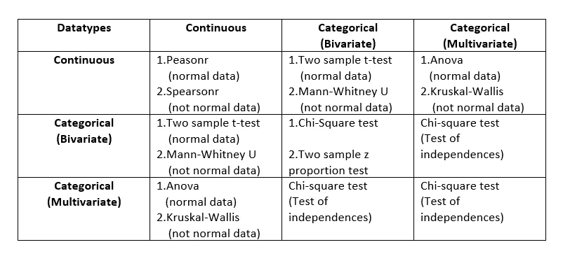
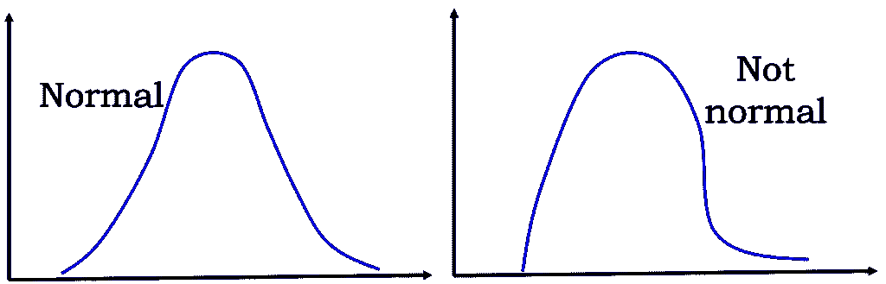

# 为我们的需求选择正确的统计测试。

> 原文：<https://medium.com/analytics-vidhya/selecting-the-right-statistical-test-for-our-requirement-d3c607b01600?source=collection_archive---------9----------------------->

做统计测试的目的是什么？

统计测试提供了一种对过程进行定量决策的机制，它允许我们理解和解释大量信息，并提供数字证据以从测试结果中得出有效的结论。使用统计分析，**我们可以确定一个假设被接受或拒绝的可能性**。大多数统计检验都是在假设基础人群的测量值服从某种已知分布的情况下进行的。进行统计测试的原因是**为基于预测函数的数据**找到解决方案。

**执行统计测试的步骤:**

1.框架假说。

2.统计测试的标识。

3.寻找检验统计量(stats 值)和概率值(p 值)。

4.解释测试结果。

**框架假设:** —假设是在没有看到数据的情况下做出的。假设的类型 a)零假设(ho) b)交替假设(ha/h1)。**假设检验提供了一种在一定置信水平内拒绝无效假设的方法**。但我们拒绝零假设的原因是，如果我们接受零假设，独立特征对目标变量的预测没有任何影响。另一种假设认为存在差异。

**统计检验的识别**

这是为我们的变量选择正确的统计检验的最重要的一步。

显著性水平是什么？

默认显著性水平( **α** )为 0.05，表示得出旨在量化证据反对特定假设为真的结论的风险为 5%。

如果 p 值> α(接受 Ho)

如果 p 值< α(拒绝 Ho)

统计检验

你如何找到你的数据的正态性？

我们可以借助夏皮罗-维尔克检验或雅克-贝拉检验进行检验。如果 p 值小于显著性水平，则拒绝 h0，否则选择 ha/h1。

在进行非参数测试时，会做出某些假设。当数据不是正态分布时，进行非参数检验。

Ho: skew=0 (or) p 值>显著性水平(数据正常)

哈(或)h1:歪斜！=0(或)p 值≤显著性水平(数据不正常)

解读测试结果

如果选择了**替代假设**，那么它将有助于预测输出。

哈 H1: variable_1(mu1)！=变量 _2(mu2)

(或)

p 值≤显著性水平

如果选择了一个**零假设**,那么它在预测输出时就没有用了

Ho:变量 _1(mu1) =变量 _2(mu2)

(或)

p 值>显著性水平

**脚注**

是的，在进入机器学习算法之前，做统计分析很重要。

希望你获得了一些有用的见解。

感谢阅读。:)

而且，💙如果这是一本好书。尽情享受吧！