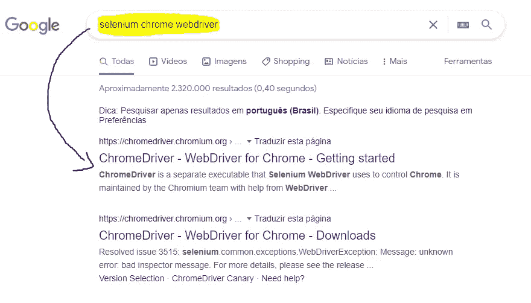

# Selenium 和 beautiful soup web scraping:Linkedin 职位描述

> 原文：<https://medium.com/analytics-vidhya/selenium-and-beautifulsoup-webscraping-linkedin-job-description-f4ed2be1455c?source=collection_archive---------2----------------------->


> *项目链接:*[*【https://github.com/saulotp/linkedin-job-description-scrap】*](https://github.com/saulotp/linkedin-job-description-scrap)
> 
> **本文由**[**Gabriella Ramos**](https://medium.com/u/965b00ed091c?source=post_page-----f4ed2be1455c--------------------------------)**更新，可在此阅读**[](/@gabbyramosbr2/selenium-and-beautifulsoup-webscraping-linkedin-job-description-updated-b23c7eeedd2e)****。****
> 
> **我们一起努力让这个项目再次成功。这篇文章的某些部分不再起作用了，但是在 github 中你可以检查更新的代码。更多信息请访问 [**更新文章**](/@gabbyramosbr2/selenium-and-beautifulsoup-webscraping-linkedin-job-description-updated-b23c7eeedd2e) **！****

**对于我们这些数据科学专业的学生来说，一项重要的技能就是从网站上获取数据。也称为网页抓取，这个过程使用的代码行将访问选定的网页，并删除所有类型的数据你想要的。**

**在这个项目中，我们将访问 LinkedIn 网页，发送登录凭据，访问数据科学家的工作，取消工作要求，并绘制一个 wordcloud，向我们显示公司最需要的要求。知道了这些要求，我们的学习就可以集中在最重要的课题上。**

> **这个项目既可以让我练习 python 技巧，也可以帮助任何对学习 web scrap 艺术感兴趣的人。**

**为了简化抓取过程，我们将使用两个 python 库:
-Selenium
-beautiful soup**

# **硒**

**Selenium 是一个强大的 python 框架，它允许我们用很少的代码实现 web 浏览器自动化。要安装 Selenium，请在您的终端上编写以下命令:**

```
pip install selenium
```

**Selenium 需要一个“网络驱动程序”才能工作。比如谷歌的“selenium chrome web driver download”(为你想用的浏览器换 chrome)，下载文件放在你 python 脚本的同一个目录下。在我的例子中，我用的是谷歌浏览器，但是你可以对其他浏览器做同样的操作。**

********

**在下载正确的文件之前，请检查您的浏览器版本。**

# **美丽的声音**

**我们将使用 Beautfulsoup 从网站上获取数据(文本，表格，图像等)。要安装的命令:**

```
**pip** install **beautifulsoup4**
```

**当网站中有 javascript 函数时，这个工具就不能简单地工作了。这就是为什么我们将使用 Selenium + BeautifulSoup，第一个将操作输入、点击、滚动，第二个将获得我们想要的所有数据。**

**现在，我们准备开始我们的代码。首先，我们将导入将要使用的 python 库:**

**下面的代码是为了创建我们的变量，你可以删除例子，并写下你的登录邮箱和密码，这一步是必要的硒能够进入网站。您可以更改“位置”,这将使脚本搜索您想要的工作，在这种情况下，我写了“数据科学家”,对于“本地”,我选择了巴西，如下例所示。**

**准备好变量后，我们可以开始让浏览器工作了:**

**为了让 selenium 打开浏览器，首先我们把之前下载的文件放入一个变量中，然后执行命令:**

```
# select web driver file
driver_path = "chromedriver.exe"# select your browser (Chrome in this case), and it will open
driver = webdriver.Chrome(executable_path=driver_path)
```

**要使用 selenium 打开网站，只需编写以下命令:**

```
driver.get('website link')
```

**当我编写这个脚本时，运行时出现了很多错误，我根据问题做了一些修改。首先是加载页面的时间，脚本试图在页面完全加载之前搜索登录和密码输入。在这种情况下，脚本停止运行，并显示一个错误:您告诉我发送您的登录名和密码的这些输入不存在。下面的代码强制脚本等待 x 秒，直到执行下一步。在我的情况下，两秒钟就足以完全加载网页。这个问题发生在算法的其他部分，那么每次你看到 time.sleep(x)命令，那是因为同样的问题发生了。**

```
time.sleep(x)
```

**另一个给我带来一些错误信息的情况是 selenium 以低分辨率打开浏览器窗口。这样，一些页面完全改变了它们的功能，改变了布局，隐藏了文本、按钮等等。下面的代码行避免了这种错误:**

```
driver.set_window_size(1024, 600)driver.maximize_window()
```

# **用硒定位元素**

**文档[此处](https://selenium-python.readthedocs.io/locating-elements.html)**

> **找到页面元素需要一些 HTML 结构的基础知识。**

**Linkedin 登录页面很简单，我们必须找到电子邮件和密码输入，发送凭证 e 点击登录按钮。**

****

**如果我们右键单击电子邮件输入并选择检查，右侧将出现一个窗口:**

****

**这个窗口向我们显示了浏览器需要读取的 HTML 结构，因此，我们可以看到整个页面和您的功能。
突出显示的 HTML 代码是我们的登录输入:**

****

```
<input id="username" name="session_key" type="text" aria-describedby="error-for-username" required="" validation="email|tel" class="" autofocus="" aria-label="Email or Phone">
```

**为了用 selenium 定位元素，我们有一些命令选项:**

*   **按标识查找元素**
*   **按名称查找元素**
*   **通过 xpath 查找元素**
*   **通过链接文本查找元素**
*   **查找元素部分链接文本**
*   **按标签名查找元素**
*   **按类名查找元素**
*   **通过 css 选择器查找元素**

**在这种情况下，HTML 代码向我们显示了登录输入的“id”(下面突出显示):**

```
<input **id="username"** name="session_key" type="text" aria-describedby="error-for-username" required="" validation="email|tel" class="" autofocus="" aria-label="Email or Phone">
```

**然后，我们可以使用命令选择登录输入元素:**

```
driver.find_element_by_id('username')
```

**输入被选中后，我们可以发送我们的登录之前存储在变量'电子邮件'**

```
driver.find_element_by_id('username').send_keys(email)
```

**使用这个命令，selenium 将搜索输入内容，并编写您的电子邮件。密码输入也是如此。毕竟，只要向 selenium 发送命令，按下键盘上的“return ”,我们就完成了！**

```
driver.find_element_by_id('username').send_keys(Keys.RETURN)
```

**登录后，我们可以打开作业页面:**

```
# Opening jobs webpagedriver.get(f"https://www.linkedin.com/jobs/search/?currentJobId=2662929045&geoId=106057199&keywords={position}&location={local}")# waiting 
loadtime.sleep(2)
```

# **获取数据**

**Linkedin 向我们展示了 40 个工作页面的模式，然后我们可以创建一个将运行 40 次的循环。因此，脚本将获得所有页面的工作描述。**

****

```
# loop that will run 40 times (for 40 pages)
for i in range(1,41):
```

**在这个脚本部分，我发现了另一个问题，每页显示的作业数量是不同的，在某些情况下，它可能会出现 25，其他人 13 或 17，没有任何模式。因此，在打开 jobs 页面后，首先需要计算出现了多少个作业，然后根据页面上出现的作业数运行一个循环。否则，脚本会出错，因为它会试图查找页面上不存在的元素，例如，页面显示了 20 个作业，但我们的循环出现了 25 次，当循环到达第 21 步时，它会出错并停止所有操作。**

```
# here we create a list with jobs that is showing
jobs_lists = driver.find_element_by_class_name('jobs-search-results__list')# and here we select each job to count
jobs = jobs_lists.find_elements_by_class_name(‘jobs-search-results__list-item’)# thus we can only len(jobs) to find how many jobs are showing to us # in each page
```

**在这之后，我们可以创建另一个循环来精确地运行作业计数值，selenium 可以单击每个作业来获得所有的作业描述。Beautfulsoup 将获得所有描述文本，然后，我们可以将所有数据存储在一个列表中。**

```
for job in range(1, len(jobs)+1):
      # job click        
      driver.find_element_by_xpath(
      f'/html/body/div[5]/div[3]/div[3]/div[2]/div/section[1]/       
      div/div/ul/l i[{job}]/div/div/div[1]/div[2]/div[1]/a').click()

      # select job description        
      job_desc = driver.find_element_by_class_name('jobs- 
      search__right-rail') # get text        
      soup = BeautifulSoup(job_desc.get_attribute('outerHTML'),
      'html.parser') # add text to list        
      disc_list.append(soup.text)
```

# **清理数据**

**在脚本得到所有的描述工作后，我们将把所有的数据放在一个数据框中，并开始“清理”我们不会使用的无用数据。**

**在这种情况下，我们得到了英语和葡萄牙语的作业，因此，使用正则表达式，我们可以选择直到特定字符串的所有文本，例如:**

```
[...] "Most companies try to meet expectations, dunnhumby exists to defy them. Using big data, deep expertise and AI-driven platforms to decode the 21st century human experience – then redefine it in meaningful and surprising ways that put customers first. Across digital, mobile and retail. For brands like Tesco, Coca-Cola, Procter & Gamble and PepsiCo.

We’re looking for Senior Applied Data Scientist who expects more from their career. It’s a chance to apply your expertise to distil complex problems into compelling insights using the best of machine learning and human creativity to deliver effective and impactful solutions for clients. Joining our advanced data science team, you’ll investigate, develop, implement and deploy a range of complex applications and components while working alongside super-smart colleagues challenging and rewriting the rules, not just following them.

What We Expect From You:
-Degree in a relevant subject
-Programming skills (Hadoop, Spark, SQL, Python)
-Prototyping
-Statistical Modelling
-Analytical Techniques and Technology
-Quality Assurance and TestingWe won’t just meet your expectations. We’ll defy them. So you’ll enjoy the comprehensive rewards package you’d expect from a leading technology company. But also, a degree of personal flexibility you might not." [...]
```

**根据上面的描述，我们希望尽可能删除最大的无用信息，然后我们可以找到一个词作为触发器，表示从这一点开始，将显示有问题的工作的要求。在这种情况下，我们可以看到，在单词“Expect”之后，需求就显示给我们了。然后，我们可以使用以下逻辑:“Python，阅读工作描述，当你看到单词“Expect”时，删除之前阅读的所有内容。**

```
df = df.replace(['^.*?Expect','', regex=True)
```

**在我们的示例中应用这段代码，输出将是:**

```
Expect From You:
-Degree in a relevant subject
-Programming skills (Hadoop, Spark, SQL, Python)
-Prototyping
-Statistical Modelling
-Analytical Techniques and Technology
-Quality Assurance and TestingWe won’t just meet your expectations. We’ll defy them. So you’ll enjoy the comprehensive rewards package you’d expect from a leading technology company. But also, a degree of personal flexibility you might not." [...]
```

**好多了，对吧？我们清除了很多无用的单词。但列出的工作在描述中没有模式，那么我们必须列出使用最多的词，如资格，要求，经验，寻找，和其他。如果你用其他语言搜索，你需要为每种语言写更多的单词。**

# **词云**

**DataFrame 已清理！我们现在能做什么？我们的单词云包含了最相关的单词。**

**上面的代码将构建我们的单词云，变量“badwords”是上一步难以清除的剩余单词，与我们的最终情节无关。**

**最后，我们的 word cloud 绘制并导出我们的数据到一个 csv 文件。**

****

**上图向我们展示了数据科学家必须具备的一些技能，如:**

*   **机器学习的知识，**
*   **python，**
*   **数据分析，**
*   **发展，**
*   **代码，**
*   **框架，**
*   **商业，**
*   **SQL，**
*   **AWS，**
*   **和其他人。**

**我们做到了！无红利**

**我希望这篇文章对你的艰难旅程有所帮助。如果您有任何关于此主题的更正、建议或信息，请随时联系我:**

**saulodetp@gmail.com**

**再见。**

> ****本文由** [**加布里埃拉·拉莫斯**](https://medium.com/u/965b00ed091c?source=post_page-----f4ed2be1455c--------------------------------) **更新，可在此处阅读**[](/@gabbyramosbr2/selenium-and-beautifulsoup-webscraping-linkedin-job-description-updated-b23c7eeedd2e)****。******
> 
> ****我们一起努力让这个项目再次成功。这篇文章的某些部分已经不起作用了，但是在 github 中你可以查看更新的代码。欲了解更多信息，请访问更新的文章！****
> 
> *****项目链接:*[*https://github.com/saulotp/linkedin-job-description-scrap*](https://github.com/saulotp/linkedin-job-description-scrap)****