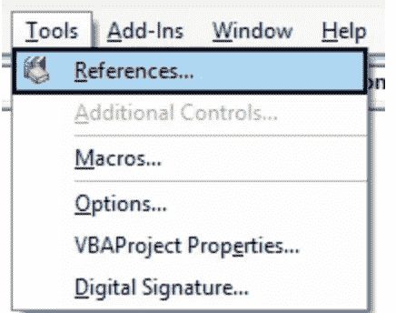
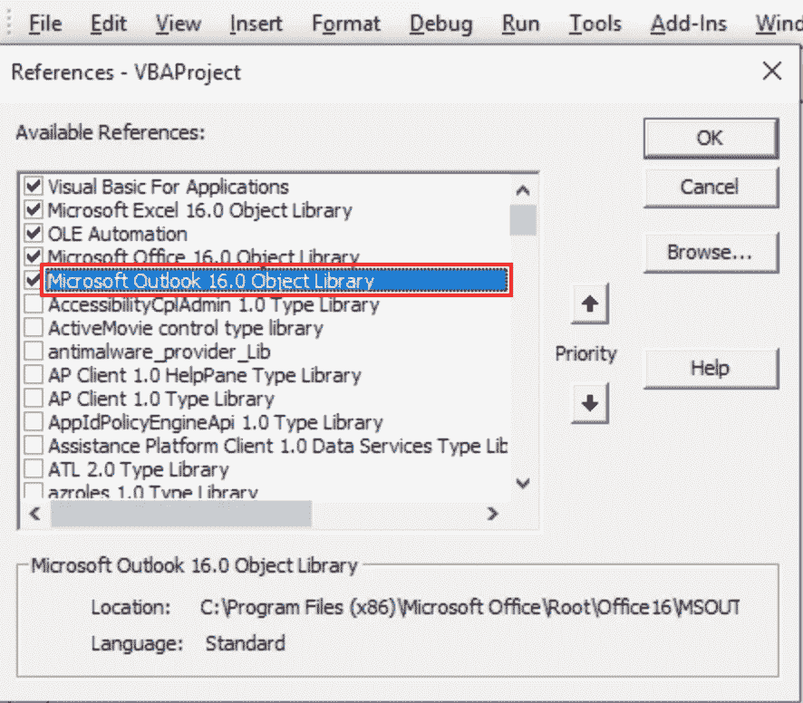

# 使用 Python 和 VBA 发送自动 outlook 电子邮件

> 原文：<https://medium.com/analytics-vidhya/send-an-outlook-email-on-your-python-script-using-vba-c0709faec301?source=collection_archive---------22----------------------->

发送 outlook 电子邮件的简单技巧，无需编写任何协议。


Solen Feyissa 在 [Unsplash](https://unsplash.com/s/photos/email?utm_source=unsplash&utm_medium=referral&utm_content=creditCopyText) 上拍摄的照片

## 为什么我不用任何强大的 python 库？

我决定写这个故事，因为我面临这样一种情况:我使用 python 脚本来分析一家制造公司的销售成本，并且需要通过邮件与同事分享分析结果。我开始在 google 上查找哪个库可以处理我代码中的这一简单步骤，并很快意识到我必须考虑库所使用的协议的有效性。
是的，我使用的是自带安全功能的专业 outlook 账户。当然，我找到的所有解决方案都是基于我的脚本向我的 outlook 函数发出的特定协议请求(通常是 smtp)。当然，公司的安全工具会产生一个“拒绝访问”的答案。

但是在我的代码中，我已经能够与另一个 Microsoft office 应用程序进行交互:Excel。事实上，我不得不将我的分析结果上传到一个 Excel 报告中并与他人分享。我甚至不得不启动一个宏来进行额外的操作。

嗯…如果我可以找到一种有效的方法，使用 VBA 宏通过邮件共享该报告，然后在我的 python 脚本中包含一行代码来运行该宏，会怎么样呢？

我不太喜欢 VBA，尤其是 Excel。但我不得不承认，这种语言的美妙之处在于，我们可以轻松地引用其他微软对象，如 PowerPoint、Word 和 Outlook。

## VBA 电码

首先，我们在 Visual Basic 编辑器中选择 outlook 对象。点击“工具/参考”



图片来自作者

并选择 outlook 对象。这基本上是我们将在代码中调用的对象。



图片来自作者

代码本身非常简单:

```
Sub Emails()

  Dim App As Outlook.Application
  Dim Mail As Outlook.MailItem

  Set App = New Outlook.Application
  Set Mail = OutlookApp.CreateItem(olMailItem)

  With Mail
    .BodyFormat = olFormatHTML
    .Display
    .HTMLBody = "Dear colleagues" & "<br>" & "<br>" & "Please find the attached file" 
    .To = "receiver email"
    .CC = "cc receiver email"
    .BCC = "bcc receiver email"
    .Subject = "Cost of sales report"
    .Attachments = ThisWorkbook
    .Send
  End With

End Sub
```

以下是一些解释:

*Sub Emails/End Sub* :创建 Sub 过程的常用方式。
*Dim App as Outlook。应用程序*:创建变量 Outlook 应用程序
*Dim Mail as Outlook。MailItem* :创建将要发送的变量 email。
*设置 App* =新展望。应用:我们打开 app
*设置邮件* = OutlookApp。CreateItem(olMailItem):我们创建一个新的电子邮件

然后使用变量“Mail ”,我们使用代码中提到的对象来设置电子邮件。我猜没什么复杂的，除了代码中的“
”。如果你对 HTML 没有信心，它只是一种打破界限的方式，在“亲爱的…”和信息的其余部分之间创造一个空间。

此外，关于附件，我把它放在这里“这个工作簿”,但你也可以创建另一个变量，它的路径指向另一个文件，并把它放在附件中。

## 在 Python 中运行宏

首先，如果您想要更详细的 python 和 Excel 交互项目，我可以向您推荐我的一篇文章，其中我介绍了用 Python 刷新 Excel 报表的简单方法(包括宏运行):

[](https://towardsdatascience.com/spice-up-your-excel-with-python-621c9693c027) [## 使用 python 为您的 excel 增添趣味

### 熟悉 python，让您的 Excel 报表更上一层楼。

towardsdatascience.com](https://towardsdatascience.com/spice-up-your-excel-with-python-621c9693c027) 

所以，基本上当我使用 excel 时，我会使用 xlwings，这是我最喜欢的库:

```
import xlwings as xw
```

这里我将为工作簿报告设置一个变量(注意:xlsb 而不是 xlsx，因为它是一个启用宏的文件)。

```
wb = xw.Book(r"path to your report.xlsb")
```

然后另一个变量“app”来存储工作簿中的应用程序，在“macro_vba”中我放了宏“Emails”。最后，我运行“宏 _vba”

```
app = wb.app
macro_vba = app.macro("'Dashboard.XLSB'!refresh") 
macro_vba()
```

## 结论

我希望你喜欢这个简单的技巧。这篇文章的目的是与你分享 2 个技巧，一个在 VBA 发送电子邮件，另一个在 python 中运行你的宏。这也是向你展示有时候在编码中，最简单的方法并不一定是最直接的。