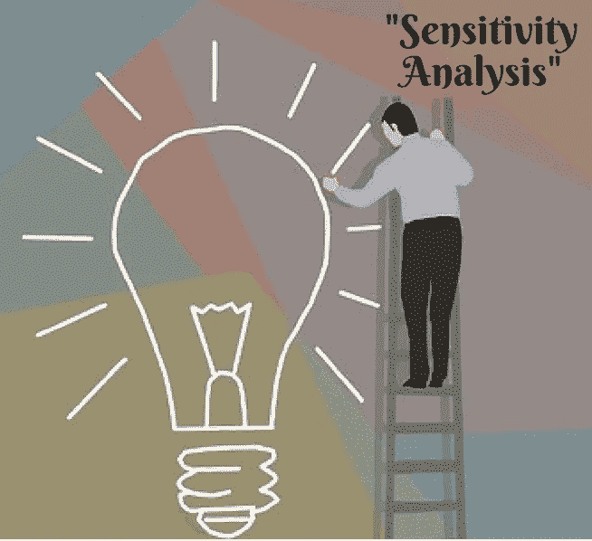
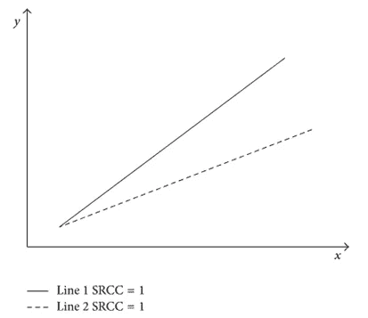
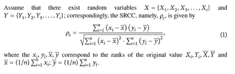

# 灵敏度分析:优化(第一部分)

> 原文：<https://medium.com/analytics-vidhya/sensitivity-analysis-optimization-part1-4b19b6f40a20?source=collection_archive---------6----------------------->

# 优化算法中灵敏度分析的目的:

敏感性分析用于确定在给定的一组假设条件下，自变量的值将如何影响特定的因变量。它的使用将取决于特定范围内的一个或多个输入变量，如利率变化对债券价格的影响。敏感性分析研究数学模型中各种不确定性来源如何影响模型的整体不确定性。

它也被称为假设分析。它可以用于任何活动或系统。它被用于商业世界和经济领域。一般来说，敏感性分析被广泛应用于各个领域，从生物学、地理学到经济学和工程学。

在解决最优化问题时，灵敏度分析有多种帮助方式。

敏感性分析确定在一组预先定义的假设条件下，独立变量的不同值如何影响特定的因变量。

它被用来预测上市公司的股价或利率如何影响债券价格。

它允许使用真实的历史数据进行预测。

这包括分析以下方面的变化:

1)目标函数系数(OFC)

2)约束的右侧(RHS)值

# 目标函数系数(OFC):

当我们解决一个线性规划，然后希望解决另一个问题，同样的约束，但略有不同的目标函数。当我们改变目标函数时，有两种情况需要考虑。第一种情况是非基本变量的变化，该变量在解中取值为零。如果一个非基本变量的系数减小，你的解会怎么样？例如，假设上述目标函数中 x1 的系数从 2 减少到 1。

# 约束的右侧(RHS)值:

双重价格反映了可用资源数量变化的影响。当我们在非约束性约束条件下改变资源量时，那么增加永远不会改变你的解决方案。少量的减少也不会改变什么，但是如果你减少足够的资源量来使约束具有约束力，你的解决方案可能会改变。

敏感性分析的工作原理很简单，改变模型，观察行为。

影响灵敏度分析的参数有:

1.  **实验设计:——**它包括要改变的参数组合。这包括检查在给定的时间点需要改变哪些参数和多少参数，在实验前赋值，研究相关性:正或负，并相应地为组合赋值。
2.  **改变什么:**模型中可以选择改变的不同参数可以是:
    1)活动的数量
    2)与假设的风险和预期利润相关的目标
    3)技术参数
    4)约束的数量及其限制
3.  **观察什么:** 1)根据策略的目标值
    2)决策变量的值
    3)所采用的两种策略之间的目标函数值。

# 敏感性分析的好处和局限性:-

敏感性分析为决策者提供了许多好处。

首先，它是对所有变量的深入研究。因为更深入，预测可能要可靠得多。

其次，它允许决策者确定他们未来可以在哪些方面进行改进。

最后，它允许对公司、经济或他们的投资做出正确的决定。

使用这样的模型有几个缺点。结果都是基于假设，因为变量都是基于历史数据。这意味着它并不完全准确，因此在将分析应用于未来预测时，可能会有误差。

# 可以应用灵敏度分析的优化算法类别:

1.  强度帕累托进化算法(SPEA):

进化算法是一种基于生物进化思想的随机探索优化算法，被广泛应用于 MOOP 寻找全局最优解

基于遗传算法的基本概念，人们提出了许多算法，如向量求值遗传算法(VEGA)。

*   多目标遗传算法(MOGA)
    非支配排序遗传算法(NSGA)
    小生境帕累托遗传算法(NPGA)
    强度帕累托进化算法(SPEA)
    非支配排序遗传算法 II (NSGA II)
    基于帕累托包络的选择算法(PESA)
    帕累托存档进化策略(PAES)
    微型遗传算法(微型遗传算法)

上述方法的核心是遗传算法，差异主要是选择机制和适应度评价。

1.**强度帕累托进化算法(SPEA)**

进化算法是一种基于生物进化思想的随机探索优化算法，应用非常广泛，非常适合 MOOP 寻找全局最优解。

模拟自然选择和适者生存的遗传算法是进化算法的一个典型例子。

**2。** **斯皮尔曼等级相关系数(SRCC)**

如文献中所述，相关系数可用于敏感性分析。相关评价方法有固定变量距离的不同线性相关系数和固定变量阶数的不同秩相关系数，也称为序贯相关系数。

在目前的调查中，斯皮尔曼等级相关系数(SRCC)被使用。SRCC 的概念是从皮尔逊积差相关系数(PMCC)继承来的。在统计学中，它们经常被用作分析输入变量 X 和输出变量 Y 之间相关性的工具。对于 PMCC，X-Y 对也必须遵循正态分布。然而，这种假设对于每一代优化变量都是不可行的。SRCC 获得的相关系数是基于参数等级，而不是 PMCC 的原始值。该操作也被描述为秩变换。

根据 SRCC 特性，两条斜率不同的直线灵敏度相同，如图所示。

基于优化方法 SPEA 和灵敏度分析方法 SRCC 的改进，提出了一种新的 SRCC-SPEA 综合算法。

与传统的进化算法 SPEA 相比，SRCC-SPEA 的特点可以概括如下:

**基于敏感性分析的结果；SRCC-SPEA 算法还有效地提高了敏感变量的生存能力，这可以通过改变进化参数来实现。**

**3。** **等级相关系数**

如文献中所述，相关系数可用于敏感性分析。

相关评价方法有固定变距的线性相关系数和固定变阶的秩相关系数，也称为序贯相关系数。

秩被定义为原始参数的递增(或递减)排序值。

如果两个参数具有相同的排序值，将采用平均值。表 1 给出了一个简单的排序示例。

