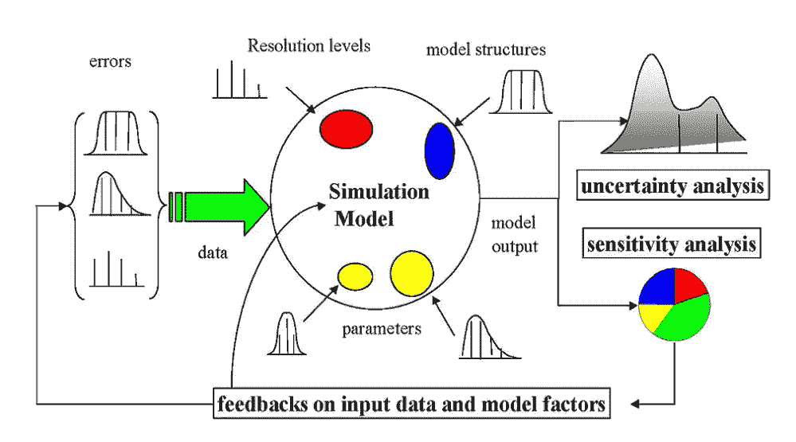
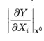
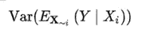
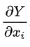
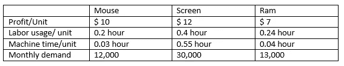
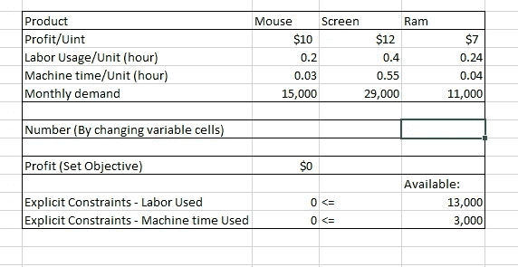
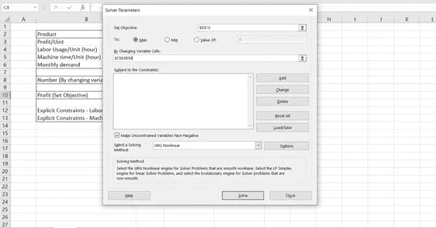
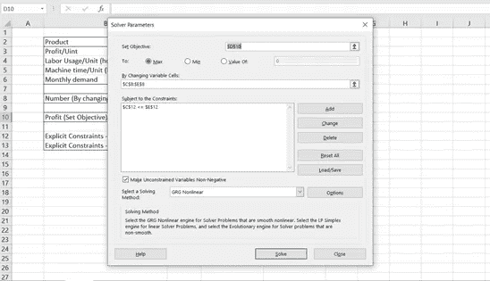
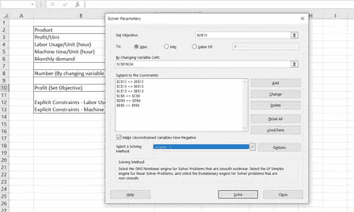
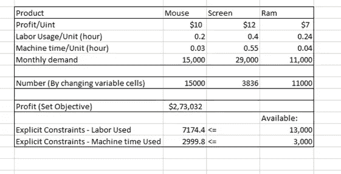

# 灵敏度分析:优化(第二部分)

> 原文：<https://medium.com/analytics-vidhya/sensitivity-analysis-optimization-part2-fae0bb025a60?source=collection_archive---------20----------------------->

这是第 1 部分的继续，你可以在这里找到第 1 部分。

我们可以开始讨论用于敏感性分析的工具。

有各种各样的方法来表演敏感性分析。此外，它们还可以通过敏感度度量来区分，比如支持方差分解、偏导数或基本效应。

照片来自[维基百科](https://en.wikipedia.org/wiki/Sensitivity_analysis)

各种类型的“核心方法”是通过计算的各种敏感性测量来区分的。这些类别可以重叠。

# 一次一个(燕麦):

最简单也是最常见的方法是一次改变一个因素，看看这会对输出产生什么影响。OAT 包括:

1.  移动一个输入变量，将其他变量保持在基线值
2.  将变量返回到其标称值，然后以相同的方式对每个其他输入重复。

然后通过偏导数或线性回归监测输出的变化来测量灵敏度。这似乎是一种逻辑方法，因为在输出中观察到的任何变化将明确地归因于单个变量的变化。

尽管这种方法很简单，但是它没有完全探索输入空间，因为它没有考虑输入变量的同时变化。这意味着 OAT 方法不能检测输入变量之间交互的存在。

# 基于导数的局部方法:

基于局部导数的方法包括获取输出 Y 相对于输入因子 Xi 的偏导数:

其中，下标 x0 表示在输入空间中的某个固定点处进行求导。

与 OAT 类似，局部方法不试图完全探索输入空间，因为它们检查小的扰动，通常一次一个变量。

# 回归分析:

敏感性分析背景下的回归分析包括对模型响应进行回归拟合，并使用标准化回归系数作为敏感性的直接度量。回归需要与信息成线性关系，否则很难解释标准化系数。因此，一旦模型响应是线性的，这种技术是最适合的。多变量分析区域单元的优点是简单明了且机器价值低。

# 基于方差的方法:

基于方差的方法是一类概率方法，它将输入和输出不确定性量化为概率分布，并将输出方差分解为可归因于输入变量和变量组合的部分。因此，输出对输入变量的敏感性由输入引起的输出变化量来衡量。这些可以表示为条件期望，即，考虑一个模型 Y = f(X)对于 X = {X1，X2，… Xk}，第 I 个变量 Xi 的灵敏度的度量被给出为:

其中“Var”和“E”分别表示方差和期望值操作符，X ~I 表示除 Xi 之外的所有输入变量的集合。

# 响应面的变差函数分析(VARS):

以前的灵敏度分析方法的一个主要缺点是，它们都没有考虑模型 Y=f(X)的响应面/输出在参数空间中的空间有序结构。通过利用方向变异函数和协方差函数的概念，响应面变异函数分析(VARS)通过识别与 Y 值的空间连续相关结构来解决这一弱点，因此也识别与值的空间连续相关结构

# 筛选:

筛查是一种基于抽样的技术。这里的目的不是精确量化敏感性，而是定义哪些输入变量对高维模型中的输出不确定性有显著影响。基本效应法是最广泛使用的筛选技术之一。

# 散点图:

在对模型的输入分布进行采样后，作为一种简单但有用的方法，将其放入输出变量与单个输入变量的散点图中。这种方法的优点是能够处理“提供的数据”，即随机定位的数据点的集合，并提供清晰的灵敏度视觉指示。

# 用于解释灵敏度报告的 Excel 求解器:

灵敏度报告包括传统的灵敏度分析信息，如线性和非线性规划问题的双值和范围信息。线性规划问题的降低成本和非线性问题的降低梯度是变量的对偶值。

# 让我们举个例子来更深入地理解它:

问题陈述:—假设一家台式机/笔记本电脑制造厂生产鼠标、屏幕和内存。下表给出了单位利润、单位人工用量、月需求和单位机器时间用量。

每个月总共有 13，000 个人工小时和 3，000 个机器小时可用。制造商如何最大化其每月从工厂获得的利润贡献？

为了解决上述问题，我们需要通过以下步骤开发一个 LP 模型:

1)识别并标记决策变量

在我们的例子中，我们需要确定每个月要生产多少鼠标、屏幕和内存。
A —每月生产的鼠标数量
B —每月生产的屏幕数量
C —每月生产的 ram 数量

2)确定目标并使用决策变量为目标函数写一个表达式。

利润最大化，其中利润= 10A + 12B +7C

3)确定显式约束，并为每个约束写一个函数表达式。

*   显式约束是那些在问题陈述中明确给出的约束。

工时常数:0.2A + 0.4B + 0.24C <= 13000
机器时间常数:0.03A + 0.55B + 0.04C < = 29000

4)确定隐含约束。

*   问题陈述中没有明确给出隐式约束。它们通常与决策变量的“自然”或“常识”限制有关。

鼠标 0 <= A <= 12000
屏幕 0<= B<= 30000
Ram 0<= C<= 13000

画一个有三个变量的 LP 图并不容易。因此，我用 Excel 规划求解解决了这个问题。

5)将我们的问题放入工作表单元格中

*   我们可以提取信息并将信息放入工作表单元格中，因为 Excel 只能对工作表单元格进行操作。

范围 C3:E6 包括关于我们的问题的基本信息。单元格 C8、D8、E8 分别表示每月要生产的鼠标、屏幕和 Ram 的数量。因为这些数字将被决定，因此范围 C8:E8 在此刻将被保留为空白。单元格 C10 被填入公式“=$C$3*$C$8+$D$3*$D$8+$E$3*$E$8”来计算利润。

我们将在单元格 C12(" = SUMPRODUCT $ 4:$ E $ 4，$C$8: $E$8)")和 C13 ("=SUMPRODUCT ($C$5: $E$5，$C$8:$E$8)")中使用 sum product 函数来计算将要使用的人工和机器时间。

让我们单击分析组中的规划求解，打开规划求解参数对话框。在“设置目标”字段中填写“$C$10”，在“通过更改可变单元格”字段中填写“$C$8: $E$8”。

现在是在规划求解参数对话框中添加约束的时候了。要添加约束，我们需要单击添加打开添加约束对话框。在提示的对话框中，填写我们的第一个显式约束条件—使用的劳动力必须小于或等于 13，000。然后单击“确定”完成。

使用相同的方法添加我们在第 4 节中讨论的第二个显式约束和隐式约束——每种产品的产量应该小于或等于该产品的需求。

单击求解按钮后，求解器将返回解(见图 3.4)。您可以看到单元格 C8:E8 不再是空白的。单元格 C10、C12 和 C13 中的值不再是 0。

我们得到了一个解决方案，通过生产大约 15，000 个鼠标、29，000 个屏幕和 11，000 个内存，我们可以获得最大利润。最大利润将是 273，032 美元。单击“确定”后，解决方案将保存在工作表中。

**参考资料:** [**维基百科**](https://en.wikipedia.org/wiki/Sensitivity_analysis#Sensitivity_analysis_methods) ， [**科学指导**](https://www.sciencedirect.com/topics/computer-science/sensitivity-analysis) ， [**Utdallas**](https://personal.utdallas.edu/~scniu/OPRE-6201/documents/LP12-Sensitivity-Analysis.pdf) ，[**corporatefinanciinstitute**](https://corporatefinanceinstitute.com/resources/knowledge/modeling/what-is-sensitivity-analysis/)**。**