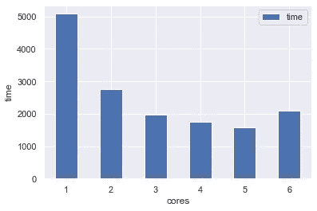
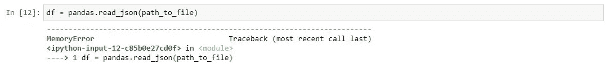
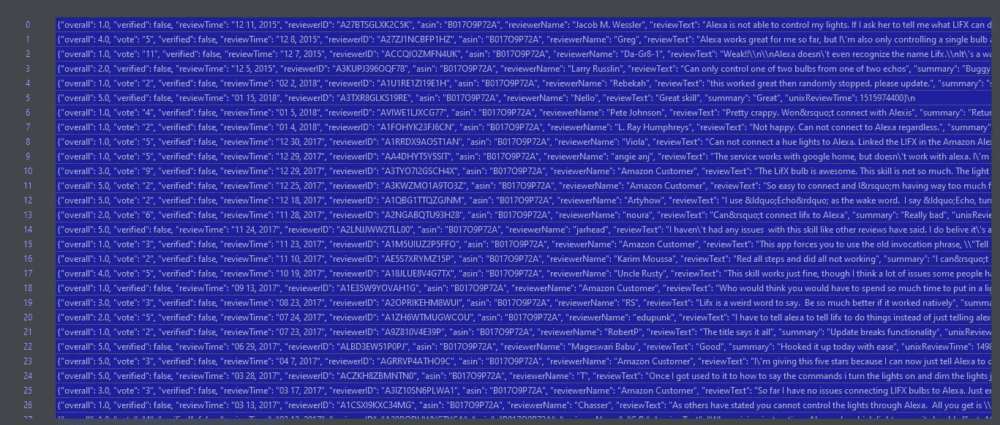

# 情感分析、数据处理

> 原文：<https://medium.com/analytics-vidhya/sentiment-analysis-data-processing-part-1-c4387a8f3bc2?source=collection_archive---------19----------------------->

为情绪分析项目准备数据


## 介绍

情感分析是理解机器学习如何工作的一种简单方法。想象一下，你有一句话“非常感谢你帮助我”，对你来说这显然是肯定的句子，但对机器来说就没那么简单了。这就是为什么我们必须使用神经网络架构。

您可以在媒体上的其他文章中找到许多关于这方面的信息。比如这里的或者这里的。我不想从每篇文章中重复同样的短语。相反，我想把重点放在更技术性的方面。

## 一些技术演讲——正确使用你的硬件

在我们开始之前，我们必须说一件事。数据科学的关键是正确使用所有工具。也就是说，如果你有一个超过 *1* 核心的 CPU，利用这个优势。请注意，使用更多的核心可以快速提高程序的速度。当然，我们需要小心处理这件事。更多的内核意味着需要更多的内存。这是我们世界的另一个关键，优化。

不幸的是，没有很好的建议如何做到这一点。试错法等待着我们，然而我在这里，帮助你做出更好的决定。

## 使用多核值得吗？

嗯，在我们的项目中，我们使用了一个巨大的数据集来训练，超过 120 GB 的数据。这个值会减少，因为我们会删除不必要的数据，但仍然是巨大的。这就是为什么我们应该考虑多重处理的原因。



每个内核上的数据处理相同— 6 核 CPU

假设您有一组数据要处理。您可以运行脚本并等待它完成，但是您也可以实现多处理并利用处理器的优势。你有 8 核 CPU 吗？伟大的使用整个 8 核，脚本将执行得更快。这不是很明显吗？

在我的目的中，我将使用 5 个内核。只是因为我有一个 6 核 CPU，这将是最快的选择。

## 库和设置

让我们来谈谈工作环境。我用的是 python 3.8，带最新的熊猫库和一些内置库。

[来源](https://github.com/wiktorowski-dev/Sentiment-Analysis/tree/main)

## 下载文件(检查数据集)并解压缩

我们开始吧。首先，我们必须下载数据集。我发现了一个包含大量数据的很棒的文件，我数了一下，大约有 2.3 亿行。可以从这里下载:[【数据下载链接】](https://nijianmo.github.io/amazon/index.html)。在我们的项目中，我们将使用“原始评论数据(34gb) —所有 2.331 亿条评论”。

为了解压这个文件，我使用了外部软件。在我看来，不值得编写一个脚本来解压单个文件。

## 数据分离

由于我们已经压缩了文件，请确保您的磁盘上有足够的空间来存储解压缩的文件，因为该文件大约重 120 GB。

让我们试着打开它。



存储器错误

我们这里有“MemoryError”，这个文件太大了，无法一次处理。使用数据集有几种可能性。我决定简化这种情况，我使用清晰的 python 代码，没有任何花哨的库，它对我来说工作得很好。我们如何定义文件的大小？最简单的方法之一是按行数保存文件。

听起来很棒，不是吗？我们可以在内存中处理它，处理它，保存它并获取另一个文件。然而，你还记得我们说过的多重处理吗？使用 5 核要快得多，更准确地说，几乎快了 *70%* ！

有什么问题？假设您正在处理 2 GB 大小的文件，并希望打开其中的六个。差不多是 12 GB 的 ram。如果你有足够的内存去做，那就去做吧。不幸的是，我只有 16 GB 的内存。这就是为什么我决定在 120 万行上操作。它允许我在出现任何意外错误之前保护这一点。

[来源](https://github.com/wiktorowski-dev/Sentiment-Analysis/tree/main)

输出中的每个文件大约重 0.6 GB，在我的例子中，这个值足以在 RAM 中处理它。如果您对此有问题，请根据您的需要减少变量。如果你需要更多的磁盘空间，你可以直接删除这个大文件。

输出文件如下所示:



## 数据转换

你还记得我说过的关于使用内核的话吗？这里我们有一个理想的目的来检验一下。正如我们在这段代码中看到的，我添加了几行代码，它们负责多重处理。

[信号源](https://github.com/wiktorowski-dev/Sentiment-Analysis/tree/main)

然而，在我们使用多重处理之前，我们必须讨论一下函数是如何构建的。

下一步我们要做的是将数据集直接转换到数据框中。这是为什么呢？数据框更易于使用。

好了，现在你可以打开文件了，我们可以开始处理了。如果我们看一下数据，我们会发现有许多符合。json 格式。所以，让我们用 python 将这些数据解包为`dictionary`格式。之后，我们可以从之前创建的变量创建数据框。

[来源](https://github.com/wiktorowski-dev/Sentiment-Analysis/tree/main)

## 数据过滤

这整个数据包含许多混乱和不必要的列。在我们的例子中，我们只关注分数和文本。其余的数据我们可以从文件中删除。它会给我们更多的磁盘空间。我将使用熊猫的过滤函数来做这件事。

[来源](https://github.com/wiktorowski-dev/Sentiment-Analysis/tree/main)

此时，我们也有很好的机会来重命名列。例如“情感”和“文本”。

[来源](https://github.com/wiktorowski-dev/Sentiment-Analysis/tree/main)

此外，此时我们可以声明句子的最大长度。神经网络有一些限制，例如静态输入层大小。这就是为什么我决定将输入层设置为 *100* 。这允许我们删除所有大于 100 个单词的句子。如果你什么都不懂，没关系。在下一篇文章中，我将更多地解释这个话题。在这里，我们将重点放在清理用于情感分析的数据上。

[来源](https://github.com/wiktorowski-dev/Sentiment-Analysis/tree/main)

然而，在长度切割器之前，我们可以使用正则表达式来删除句子中不必要的数据。这有点复杂，但是为了简化，我们可以想象我们不需要 URL、标签等等。在我们的句子中。如果我们把这些乱七八糟的东西从句子中去掉，我们就可以减少每个句子中的单词量，因此，我们能够获得更多的数据。

[来源](https://github.com/wiktorowski-dev/Sentiment-Analysis/tree/main)

## 数据分离

现在我们可以替换情感栏中的值，为什么？因为在我们的目的中，我们必须把积极的价值和消极的价值分开。为此，我们可以假设大于 3 的值为正，小于 3 的值为负。同样，我们必须丢弃等于 3 的量，因为我们不是检查中性类型的句子。

[来源](https://github.com/wiktorowski-dev/Sentiment-Analysis/tree/main)

启动这个脚本后，我们必须等待一段时间，直到程序结束。在脚本完成后，我们可以观察到存储使用减少了。从将近 120 GB 的数据中，我们得到了 26 GB。你能看出有多少数据是无用的吗？这太疯狂了。

这是这一步的代码

[来源](https://github.com/wiktorowski-dev/Sentiment-Analysis/tree/main)

## 数据重复消除器

就我们所做的而言，可能看起来我们已经完成了，但并不完全是这样。你问为什么？你确定文件之间没有重复的行吗？为了确信这一点，让我们来看看。

我们将专注于最适合我的方法。我们可以遍历每个文件，检查前一个文件中重复的行。在这一点上，我们不能使用多重处理，因为它可能会导致文件的 I/O 问题。这对我们意味着什么？由于我们不使用多重处理，我们不需要这个小文件。我们可以继续增加文件大小，您将使用多大的文件取决于您有多少 ram。在我的情况下，我想在我的全 RAM 大小上操作。在试错法中我得出结论，最好的方法是将输出文件设置为 8 百万行。这里重要的一点是保持文件尽可能大。你可能会问为什么？文件上的 I/O 花费了大量时间，在某些情况下，脚本可能会持续 5 天。这种情况下时间太长了，我们必须找到更好的方法。我决定增加文件大小，以减少 I/O 操作的数量。实现这个后，脚本将在 4 小时内完成。这快了 30 倍。

此外，我们会将正面文件与负面文件分开，因为这将使未来的步骤更容易。

[来源](https://github.com/wiktorowski-dev/Sentiment-Analysis/tree/main)

完成这一步后，我们有几个大文件。为此，我创建了一个为我们处理任务的类。

类[来源](https://github.com/wiktorowski-dev/Sentiment-Analysis/tree/main)

这里你可以看到调整文件大小的声明函数的例子。

```
input_file_name - declaration of input files name: 'file_{}',
output_file_name - declaration of output files name: 'file_o_{}',
max_length_of_single_output - maximum length of single file,
max_amount_output_of_files - maximum files in output,
total_length_of_output - maximum sum of length of all files,
auto_file_remover - automatically remove files after read them,
auto_detect_files_in_dir - automatically detect files in directory,
files_in_folder - if auto_detect_files_in_dir is True, this is optional
```

## 文件隔离

就我们而言，我们实际上有很好的分离数据，但在神经网络中，我们也应该尽可能保持数据的高质量。这意味着我们必须标准化数据集。这就是为什么我们要看一下正负数据集的长度。我们希望它们尽可能保持相同的大小。如果我们看一下数据，我们可以很容易地检查哪个数据更大。显然正面的要大得多。在这种情况下，我们必须准备负数据集并对它们进行计数，之后我们可以从`ReSizerFiles`类中声明一个函数`re_sizer`来从正文件中准备相似的数据集。

负文件大小调整，[来源](https://github.com/wiktorowski-dev/Sentiment-Analysis/tree/main)

这里有一些函数来计算文件的大小和数量。

[来源](https://github.com/wiktorowski-dev/Sentiment-Analysis/tree/main)

[来源](https://github.com/wiktorowski-dev/Sentiment-Analysis/tree/main)

最后，我们可以声明正文件 resizer。

[来源](https://github.com/wiktorowski-dev/Sentiment-Analysis/tree/main)

## 结论

情感分析是我们这个时代的一大亮点。它现在对我们有很大的影响，而且在未来会越来越大。你不能忘记，建立神经网络的一部分是数据准备。在现实世界中，获得干净的、准备好的、高价值的数据从来都不是一件美好的事情。我们的工作是验证整个信息，我们得到的信息，并对它们进行处理。

作为数据科学家，我们也处理数据采集。如果你愿意，我可以准备一篇如何从网站上收集数据的文章，向你展示节省数据、时间和更多的最佳方法。

如果您能在这里留下您的反馈，我将不胜感激。请注意，这不是这些文章系列的最后一部分。在本文的下一部分，我们将讨论矢量化。我希望你在这里学到更多关于数据处理的信息。非常感谢您阅读本文。我希望很快见到你:)


[Github](https://github.com/wiktorowski-dev/)

[*我的网站【点击】*](https://wiktorowski.dev/)[*本项目在 github 上【点击】*](https://github.com/wiktorowski-dev/Sentiment-Analysis/tree/main)