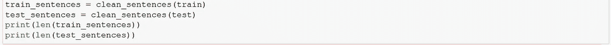
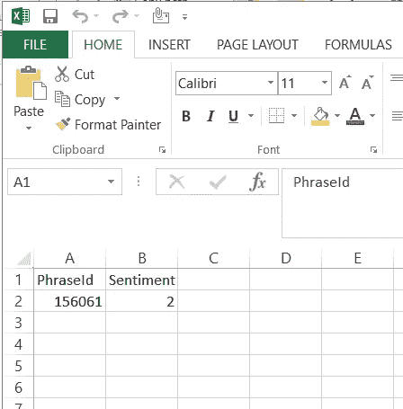

# 情感分析——如何评估电影评论的评分

> 原文：<https://medium.com/analytics-vidhya/sentiment-analysis-how-to-estimate-the-rating-from-movie-review-62044a49c52?source=collection_archive---------25----------------------->

## 对一篇文章中表达的观点进行计算机识别和分类的过程

提交的电影评论的预测评级示例

## 我 **简介**:

你上一次看电影并提交评论是什么时候？或者在一家不错的餐厅享用了一顿丰盛的晚餐并提交了反馈？这个怎么样？您提交您的评估，评级就会以电子方式生成。酷吧！

欢迎来到自然语言处理(NLP)领域，更具体地说是“情感分析”。情感分析又称为**意见挖掘**或**情感 AI** ，是指利用自然语言处理、文本分析来系统地识别、提取、量化主观信息[1]。在本文中，我们将尝试实现同样的目标，即从提交的评论中生成电影评级。

## 先决条件:

1.  情感分析的理论知识和概念，如 RNN，LSTM，GRU，词嵌入等。所有这些都包含在吴恩达的[序列模型](https://www.coursera.org/learn/nlp-sequence-models#syllabus)的奇妙历程中
2.  Python +任意代码编辑器的知识(这里我们会用到 Jupyter 笔记本)

## 编码:

假设关于主题的先决知识，我们的动机是首先在具有短语/单个单词(size=#100000)和相应情感(评级)的字典上训练模型。训练后，我们将使用评论中提交的新的未见过的短语/单词来测试它，并观察它给出的评级！就这么简单。我将尝试描述一步一步的编码。
首先，让我们创建一个新的 Jupyter 笔记本文件。在我们的文件所在的根目录下，创建一个名为“input”的文件夹。现在下载培训数据和文件。即 train.tsv，test.tsv .和 sampleSubmission.csv 是我们的输出文件。我们的文件夹结构如下所示。
-sentient analysis . py
-input
-train . tsv
-test . tsv
-sample submission . CSV

让我们开始编码。首先，我们将导入所需的库。

自然语言工具包，或更常见的 NLTK，是一套用于用 Python 编程语言编写的英语的符号和统计自然语言处理的库和程序。TQDM 是一个进度条库，对嵌套循环和 Jupyter/IPython 笔记本有很好的支持。

如果您观察这里的输出(这是我们的训练数据)，评论句子被分解为每个名为短语的单词，用 PhraseId 表示，情感被分配给每个单词。对训练数据中的所有复习句子都这样做。这构成了我们的字典。下面的函数将迭代地获取每个短语，它将删除 html 内容，删除非字母字符，标记句子，将每个单词按其词条分类，然后在名为“reviews”的列表中返回结果

接下来，检索训练集和测试集的干净评论

使用下面的代码，我们将输出值按类的数量进行分类。

我们已经为训练准备好了所有的数据。让我们分成训练组和验证组。

此外，我们将在清理评论列表中获得唯一单词的数量和评论的最大长度。它是初始化 Keras 的标记器和后续填充所需要的。

下面是 Keras 和 convert to sequences 的实际标记器。这将参数作为要转换为序列的文本列表。并返回—序列列表(每个文本输入一个)。

接下来进行填充，以均衡所有输入评论的长度。LSTM 网络要求所有输入长度相同。因此，小于最大长度的评论将在末尾使用额外的零来表示相等。这是填料。

为了防止过度拟合，我们将使用提前停止作为模型拟合函数调用中的回调。我们来定义一下。

让我们使用 LSTM 定义模型，即 Keras。此外，我们将使用多层感知器(MLP)进行多类 softmax 分类。这个体系结构是专门为处理序列数据而设计的。它非常适合许多 NLP 任务，如标记和文本分类。它将文本视为一个序列，而不是一堆单词或语法。

让我们在训练好的模型上做预测。并提交输出。

在这里，我们已经创建了一个示例输出，用于根据测试数据编写我们的预测。这是我们的样本输出。这个文件代表了我们的输出应该是什么样子。

最后，我们将把实际输出写入 output.csv 文件。

**结论**:

我们已经观察到，使用 NLP 方法，情感预测是相当准确的。模型训练依赖于训练字典。准确度取决于时期数、丢失率、批量大小、层数、优化器、单词长度。因此，最佳精度来自某个组合，人们可能会尝试看看这个组合是什么。在我们的例子中，使用 128 层 LSTM 模型、50%的漏失和 Adam 优化器获得了最佳精度。

感谢您朗读这篇文章。希望有帮助。
你可以在这个[链接](https://github.com/darshanadakane/sentimentAnalysis_usingPython)找到 Github 回购。

**参考文献:**

[1]情绪分析，[维基百科](https://en.wikipedia.org/wiki/Sentiment_analysis)

[2] [RNN 模式](https://www.youtube.com/watch?v=DqqWTubHEaA&list=PLZnyIsit9AM7yeTZuBmezKNc6hFHUPImh&index=3)吴恩达 l

[3] [RNN 建筑事务所](https://www.youtube.com/watch?v=Fnk4Z-muD5A&list=PLZnyIsit9AM7yeTZuBmezKNc6hFHUPImh&index=5)，吴恩达

[GRU](https://www.youtube.com/watch?v=PjMcA_NlB_8&list=PLZnyIsit9AM7yeTZuBmezKNc6hFHUPImh&index=9)