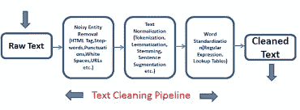
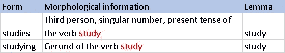
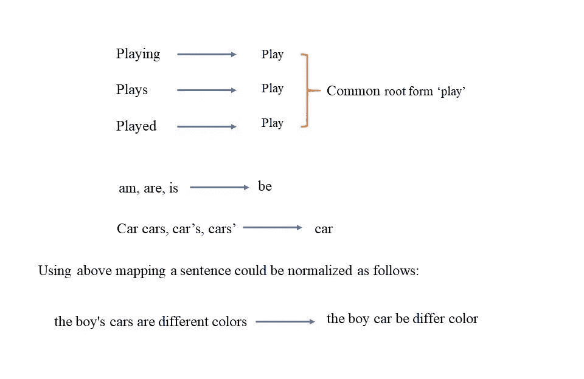
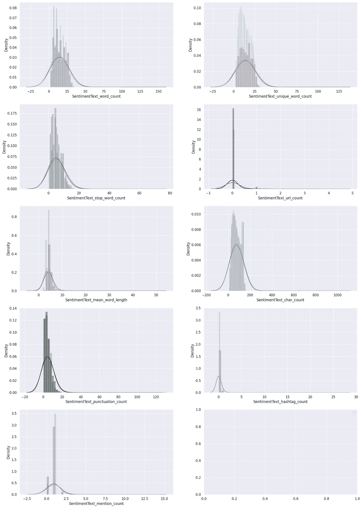
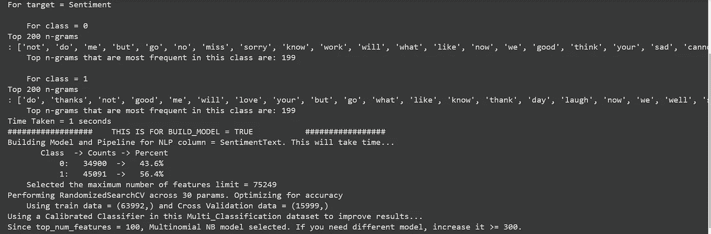

# 使用 AutoML 的五步情感分析

> 原文：<https://medium.com/analytics-vidhya/sentiment-analysis-in-five-steps-using-automl-d16feeab2a36?source=collection_archive---------6----------------------->

# 自动机器学习

**自动化机器学习** ( **AutoML** )是将机器学习应用于现实世界问题的任务自动化的过程。AutoML 涵盖了从原始数据集到可部署的机器学习模型的完整管道。AutoML 是作为一种基于人工智能的解决方案提出来的，以应对应用机器学习的日益增长的挑战。AutoML 的高度自动化允许非专家利用机器学习模型和技术，而不需要他们成为机器学习专家。端到端应用机器学习的自动化过程还提供了产生更简单的解决方案、更快地创建这些解决方案以及通常优于手工设计模型的模型的优势。AutoML 已用于比较预测模型中每个因素的相对重要性。

多年来，研究人员通过开发 AutoKeras、AutoSklearn 等工具，甚至是 WEKA 和 H2o 等无编码平台，开发出了自动化流程的方法。

一个这样的自动化领域是自然语言处理领域。随着 AutoNLP 的发展，现在用很少的基本代码行建立一个类似情感分析的模型并获得良好的输出是非常容易的。有了这样的自动化，它允许每个人都成为机器学习社区的一部分，而不是将机器学习仅限于开发人员和工程师。

在本文中，我们将学习[经典 NPL](/p/d16feeab2a36#5ba8) 和 [AutoNLP](/p/d16feeab2a36#94dc) ，并使用 AutoNLP 实现一个带有 twitter 数据集的情感分析模型。

## 如果您已经熟悉 NLP 的基础知识，请转到[部分 2](/p/d16feeab2a36#94dc)

# **第一部分**

**什么是经典 NLP？**

一般来说，在将文本数据输入到我们的模型中时，我们会执行一组过程来清理数据，然后将它们转换成数字格式。在进行自动化之前，我们先讨论其中的一些。

一些文本预处理技术，

*   标记化
*   词汇化
*   删除标点符号和停用词
*   词性标注
*   实体识别

从非结构化文本数据中分析、解释和构建模型是数据科学家工作的重要组成部分。许多深度学习应用程序，如自然语言处理(NLP)，都围绕着文本数据的操作。

例如，你是一家商业公司，推出了一个新网站或基于移动应用的服务。现在，您有了包含您产品的客户评论的数据，并且您希望使用机器学习算法对这些评论进行消费者情绪分析。

然而，为了使这些数据结构化并在算法上可行，我们需要对其进行预处理。

因此，在这里我们将学习文本数据的各种基本预处理技术。我们将与 Python 中的 **spaCy 库**合作，这是众多库(如 **nltk** 、 **gensim** 等)中的一个。)用于文本转换。

**标记化:**

标记化是将文本分割成称为标记的片段的过程，同时忽略标点符号("、"、")等字符。, "!"等。)和空格。spaCy 的功能允许我们通过两种方式来标记文本-

*   单词标记化
*   句子标记化

下面是对我们的文本进行单词标记的示例代码。

# 结果

注意我们是如何得到包含单词和标点符号的记号列表的。在这里，算法将像**和**这样的缩写识别为两个不同的单词；“are”和“‘nt’”。

如果我们愿意，我们也可以获得句子标记化(将文本分成句子)。然而，我们必须在“nlp”模块中包含一个预处理管道，以便它能够区分单词和句子。

下面是对我们的文本进行句子标记的示例代码。

# 结果

标记化是预处理中的一个基本步骤，它有助于区分单词或句子的边界，并为进一步的预处理技术(如词条化等)转换我们的文本。

# 词汇化:

词汇化是自然语言处理中文本预处理的重要步骤。它处理单词的结构或形态分析，并将单词分解成基本形式或“词条”。
例如，词语*行走*、*行走*、*行走*、*行走*表示共同的活动，即*行走*。由于它们有不同的拼写结构，我们的算法很难区别对待它们。因此，这些将在一个引理下处理。

我们可以使用 spaCy 的内置方法对我们的文本进行词条化。

# 结果

你可以清楚地看到，像*运行*这样的词被分解成了它们的词条，即*运行*。词汇化极大地增强了我们的文本，以便更好更快地优化。

# 删除停用词

在处理文本数据时，我们会遇到许多对我们的分析没有太大用处的数据实例，因为它们对我们的数据没有任何意义/相关性。这些可以是代词(像*我*、*你*等。)或者像*是，是，曾经是*等词。

这些字叫做**停止字**。我们可以使用 spaCy 中内置的停用词来过滤我们的文本。

spaCy 的内置停用词表可以被视为如下-

# 结果

现在，我们可以使用 token 对象的“is_stop”属性从示例文本中过滤出停用词。

**结果**

你可以对比一下上面两个列表，注意到诸如 *down，the，with* 和 *my* 都被去掉了。现在，类似地，我们也可以使用字符串对象的“isalpha”方法和列表理解来删除文本中的标点符号。

**结果**

您可以观察到两个列表之间的差异。的确，空间使我们的工作变得相当容易。

# 词性标注

一个单词的**词性**定义了该单词在文档中的功能。例如，在文本*中，Robin 是一个精明的程序员*,“Robin”是一个专有名词，而“精明”是一个形容词。

我们将使用 spacy 的 **en_core_web_sm** 模块进行词性标注。

**结果**

谢谢你在文字处理上陪了我这么久。
相信我，下一部分将会非常简单和强大，所有之前讨论过的步骤都将被自动处理，我们只需要传递原始文本数据。让我们深入了解 AutoNLP:)

# 第 2 部分:什么是 AutoNLP？

使用 AutoML 的概念，AutoNLP 有助于自动化探索性数据分析的过程，如词干化、标记化、词条化等。它还有助于文本处理和为给定数据集选择最佳模型。AutoNLP 是在 AutoVIML 下开发的，auto viml 代表自动变体可解释 ML。AutoNLP 的一些功能包括:

1.  **数据清理:**整个数据集可以发送到模型，而无需执行任何过程，如矢量化。它甚至会自动填充缺失的数据并清理数据。
2.  **使用特征工具库进行特征提取:**特征工具是另一个很棒的库，可以帮助以任何简单的方式进行特征工程和提取。
3.  **模型性能和图形自动生成:**只需设置 verbose，即可显示模型图形和性能。
4.  **特征约简是自动的:**对于庞大的数据集，选择最佳特征和执行 EDA 变得很困难。但这由 AutoNLP 负责。

# AutoNLP 的实施

现在让我们使用 autoNLP 为 twitter 数据集实现一个情感分析模型。如果没有 autoNLP，数据必须首先进行矢量化、词干化和词条化，最后在训练前转换为词云。但是有了 autoNLP，我们只需要简单的五个步骤。

**安装 AutoNLP:**

要安装它，我们可以使用一个简单的 pip 命令。因为 AutoNLP 属于 autoviml，所以我们需要安装它。

**数据***:*[*https://raw . githubusercontent . com/vijayvj 1/Twitter-情操-分析-1/master/train.csv*](https://raw.githubusercontent.com/Vijayvj1/twitter-sentiment-analysis-1/master/train.csv)

安装完成后，我们可以继续为项目下载数据集。我将使用 twitter 数据集，因为我们正在进行情感分析。完成后，让我们装载驱动器并查看我们的数据集。

> 现在，一切就绪，让我们启动自动模式。是的，很简单，只有 5 个步骤..继续数。

**第一步:**

数据导入

**第二步:**

导入库并定义训练测试分割

**第三步:**

定义功能和目标

**第四步:**

自动 NLP

现在你会看到一系列的图表，几分钟后你会看到训练输出。

这些图表详细显示了训练过程中的可视化效果。它显示字数，密度和字符数以及。随着培训的进行，这些图表会发生变化，这是最终的输出。所有的标点符号和标签都会被自动删除，它们的密度也会显示在图表中。

自动 NLP 结果

> 我们需要考虑 n 元语法、超参数优化、特征大小、算法选择等吗..,?没有自动 NLP 会照顾他们..，喝杯咖啡，直到他们结束！

NLP 管道日志

**第五步:**

最后，你可以做预测..是的，完成了！！

# 结论

我们看到了如何使用 AutoNLP 使模型构建变得非常容易，从而执行情感分析。不仅如此，它还自动预处理数据，并为数据集的不同方面提供可视化。因此，自动化使得构建复杂的模型变得容易。

如果你想了解更多关于机器学习的知识，请继续阅读我的博客:

1.  **音频数据增强:**[https://vijay-anandan . medium . com/lets-augment-a-Audio-Data-part-1-5a b5 f 6a 87 BAE](https://vijay-anandan.medium.com/lets-augment-a-audio-data-part-1-5ab5f6a87bae)
2.  **语音数据的情感分析:**[https://vijay-anandan . medium . com/personance-Analysis-of-Voice-Data-64533 a 952617](https://vijay-anandan.medium.com/sentiment-analysis-of-voice-data-64533a952617)
3.  **对极度不平衡的数据集进行重采样:**[https://vijay-anandan . medium . com/how-to-re-sample-an-unbalanced-datasets-8e 413 dabb 21](https://vijay-anandan.medium.com/how-to-resample-an-imbalanced-datasets-8e413dabbc21)
4.  **神经网络在深度学习中到底是如何工作的:**[https://medium . com/analytics-vid hya/How-Do-Neural-Networks-Really-Work-in-the-Deep-Learning-72f 0 e 8 C4 c419](/analytics-vidhya/how-do-neural-networks-really-work-in-the-deep-learning-72f0e8c4c419)

【领英:[https://www.linkedin.com/in/vijay-anadan/](https://www.linkedin.com/in/vijay-anadan/)

 [## Vijay Anandan -助理工程师- Cognizant | LinkedIn

### 好奇心驱动的数据科学家，渴望利用机器学习和数据分析来提取有意义的…

www.linkedin.com](https://www.linkedin.com/in/vijay-anadan/)