# 情感分析，模型学习

> 原文：<https://medium.com/analytics-vidhya/sentiment-analysis-model-learning-5f10d7eda584?source=collection_archive---------2----------------------->

如果你曾经认为机器学习很难，看看这篇文章。


## 介绍

情感分析用于预测文本的喜怒无常的态度。今天，我们将讨论构建神经网络架构，并找到我们目标中的最佳架构。你可能知道，有几类人工神经网络，例如 RNN 和 CNN。这里，我们将关注递归神经网络，它最适合文本操作。

我假设你大概知道，如何加快学习过程。为了实现这个场景，我们使用了 GPU 计算。不幸的是，在我的电脑中，我没有如此强大的 GPU，只有 1660 Ti。还好，但是有一些限制，所以我决定用[*colab*](https://colab.research.google.com/signup)*service*。*为此，我想用全部数据来训练我们的模型。遗憾的是，普通可乐有连续使用 12 小时的限制。考虑到这一点，我决定投资 colab pro。至少只花了 9.99 美元/月。*

## *库和设置*

*学习我将使用的模型的库是 TensorFlow。使用起来非常简单，当然也很有效。从上一篇文章中，你应该熟悉我的矢量化类，如果没有，请仔细阅读。有几个重要的步骤，我们将如何把文本转换成向量。*

## *装置*

*如果您决定在培训中使用自己的 GPU，有几个要求。我已经完成了这个设置，没有发现任何问题(不像 CUDA 的新版本)。*

*   *实际 GPU 驱动(GPU: GTX 1660ti): [链接](https://www.nvidia.com/Download/index.aspx)*
*   *CUDA 10.1 ver 2: [链接](https://developer.nvidia.com/cuda-10.1-download-archive-update2?target_os=Windows&target_arch=x86_64&target_version=10&target_type=exelocal)*
*   *Cudnn: [链接](https://developer.nvidia.com/rdp/cudnn-archive : Download cuDNN v7.6.5 (November 5th, 2019), for CUDA 10.1)*
*   *Tensorflow 2.3.0: [链接](https://www.tensorflow.org/install)*

*不过，如果你想要一步一步的安装说明教程(我个人推荐)。请检查此[条](/analytics-vidhya/install-tensorflow-gpu-cuda-in-windows-10-with-easy-to-follow-instructions-614d79782d26)。*

## *最佳建筑*

*首先，我们应该找到最准确的模型来预测情绪。遗憾的是，这种反复试验的方法花费了一些时间。幸运的是，我已经为你做到了。我测试了十几种架构，选择了最好的一种。下面你可以找到很多准确度和损耗图。在你看我的结论之前，请你自己下结论。用你自己的方式理解这一点非常重要。*

## *简单的建筑*

*如果你以前没有用 TensorFlow 建立过自己的模型，你可能会惊讶于它是多么的简单。TensorFlow 是作为高级 API 构建，它允许我们只使用几行代码就可以准备好模型。这里你有这样一个简单的模型(也是这样一个无效的，由于它的简单性)。*

*如你所见，我们的第一层是`Embedding`。这一层将我们的手套整数转换成手套向量。*

*之后，我们有一些基本的*密集*层和`tanh`激活功能来增加架构的深度。在模型的最后，我们有一个单一的致密层，它负责给我们一个预测的分数。从 0 为负到 1 为正。*

## *架构比较*

*下面是一些精确的示例模型图。在本次培训中，我决定统一超参数:*

```
*- batch size = 64
- epochs = 30
- learning rate = 0.0002
- loss function = mean absolute error
- optimizer = adam*
```

*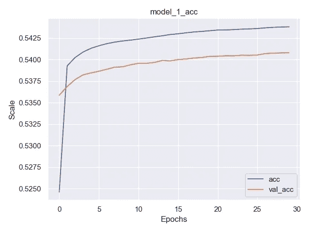**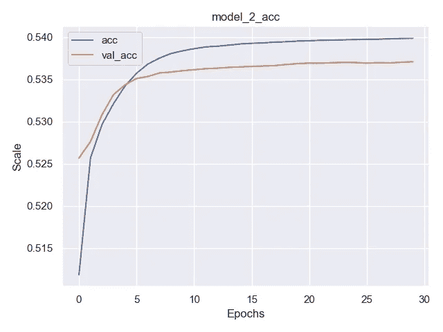**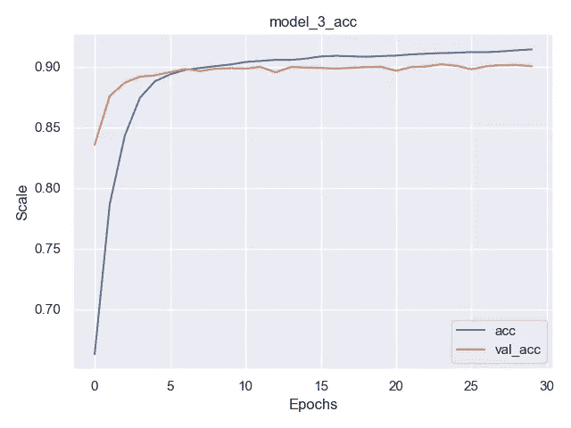*

*图表 1/2/3*

*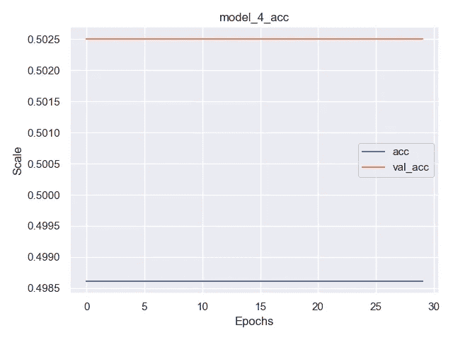**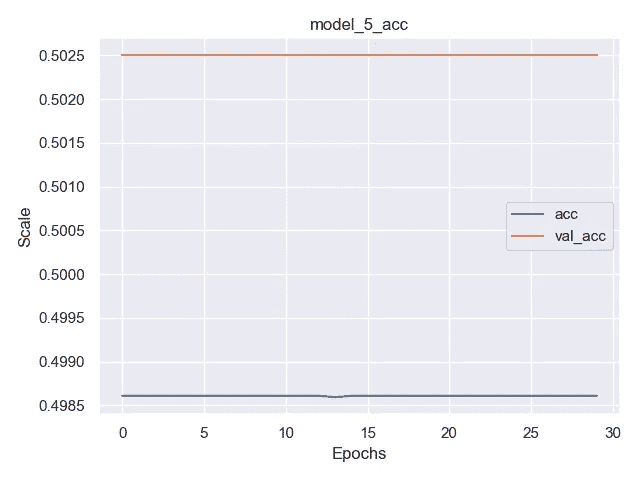**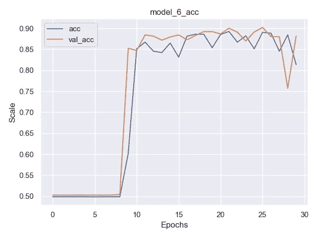*

*图表 4/5/6*

*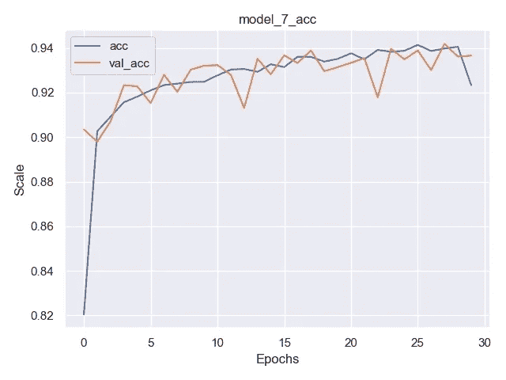**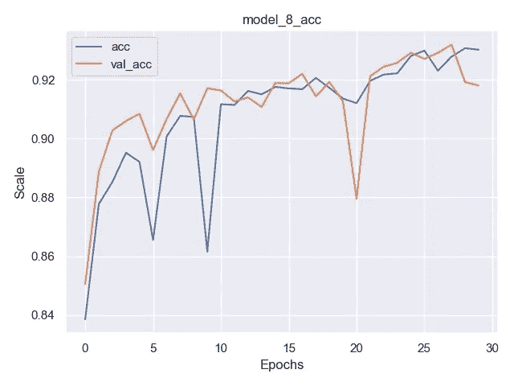**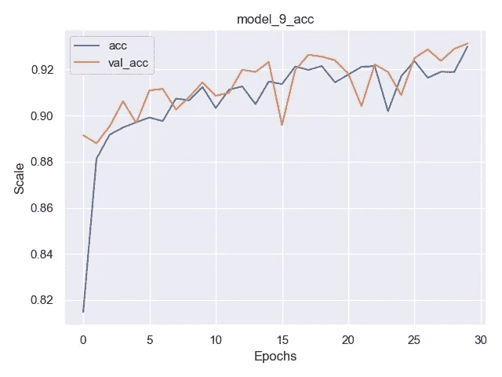*

*图表 7/8/9*

*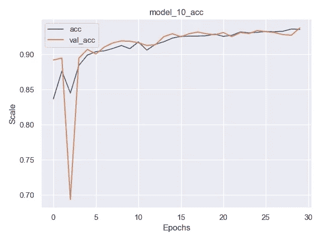**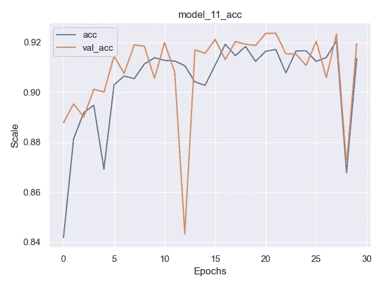**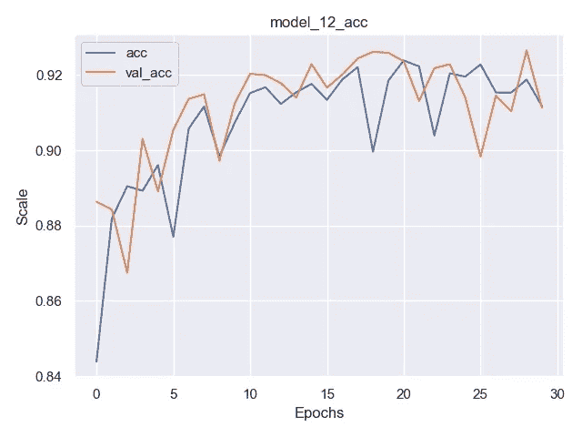*

*2012 年 10 月 11 日图表*

*你可以在 GitHub 项目**上找到的所有模型都添加了链接**。这里我们有一些有希望的图表，例如:`Charts 3/7/9/10`。为了在我们的学习项目中选择最佳模型，我决定在整个单个文件中训练它们，该文件包含 200 万行。在一次训练中，我将使用 75 个时期来有可能做出一个好的模型选择。*

*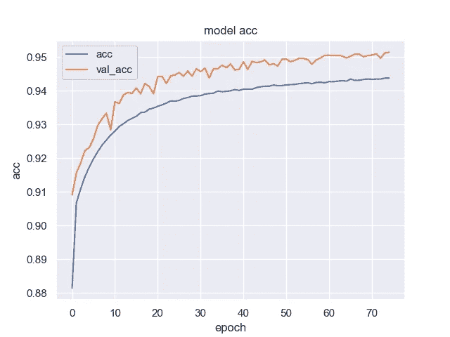**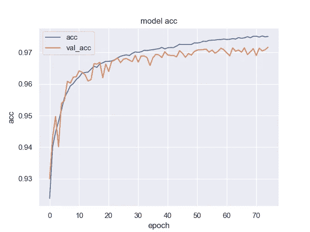*

*图表 3/7*

*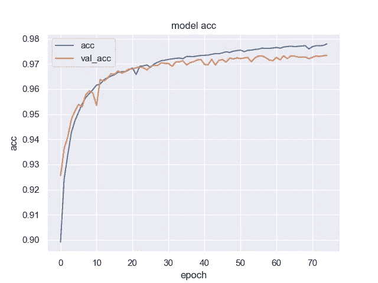**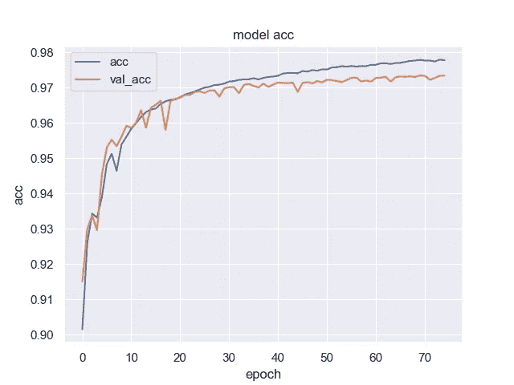*

*图表 9/10*

*正如我们所见，这些模型很有前途。不幸的是，我们不得不拒绝模型 3，它降低了我们的准确性。7/9/10 型号非常相似，但也有一些细微差别。在图表 7 和 10 中，我们可以看到学习过程的一些不稳定性。然而，为了确定，让我们看一下表中 20 个时期附近的值，因为在这个时期之后，模型开始温和地过度拟合，并降低学习曲线。*

*从这些数据中，我们可以很容易地看出不同型号之间的差异。这不是很大的细微差别，但仍然存在。请查看型号 9 的代码。如果你想看到所有的模型，检查我的 GitHub 项目。*

## ***数据预测***

*一旦我们准备好模型。我们应该试着做我们自己的预测。为了简单起见，我决定使用我们之前创建的函数。*

*如我们所见，这里使用的函数与模型学习部分的预处理中的函数相同。第一步是标记我们的文本，然后从手套创建一个向量。有了这些数据，我们可以做出预测。*

*很快，我将在我的网站上推出这一模型，如果你想自己测试，请保持关注或发电子邮件给我***wiktorowski.dev@gmail.com***一旦我将这一模型添加到我的网站上，我会给你发送一个链接:)。*

*然而，现在让我们看看模型产生的一些预测。*

*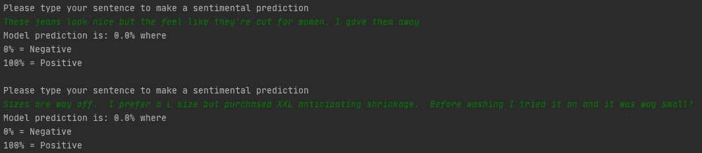*

*否定句*

*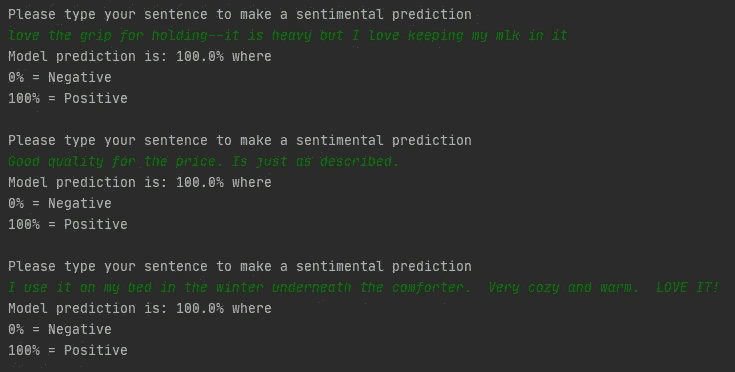*

*肯定句*

*这些预测的数据来自一个数据集，该数据集不是输入学习数据的一部分。*

## *结论*

*在这篇文章中，我们了解了情感分析。我很确定这不会回答你所有的问题，但是我希望，这将帮助你进入主题并创建你自己的第一个模型。即使和我的一样，也没关系。第一步是最重要的:)。*

*在这一点上，我假设我们的模型的预测分数对于情感分析的基本项目是足够的。我知道这是一个需要改进的地方，但是谁知道呢，也许这个系列的第四部分就要来了。*

*一如既往，我会很高兴你的反馈和意见。敬请关注，等待后续文章:)*

**

*[Github](https://github.com/wiktorowski-dev?tab=repositories)*

*[*我的网站*](https://wiktorowski.dev)
[*本项目在 Github 上*](https://github.com/wiktorowski-dev/Sentiment-Analysis-project)*