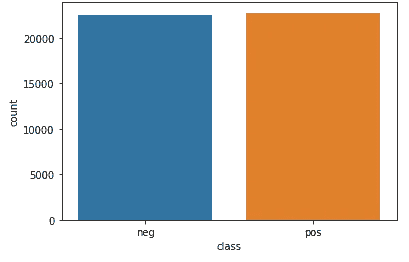
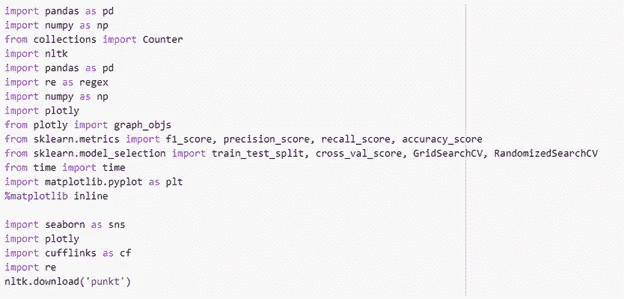

# 阿拉伯文本数据(Tweets)的情感分析

> 原文：<https://medium.com/analytics-vidhya/sentiment-analysis-of-arabic-text-data-tweets-4e96c8da892b?source=collection_archive---------5----------------------->

# 简介:

该公司收集了这个数据集，为该公司正在进行的研究提供阿拉伯情感语料库，以调查阿拉伯情感分析的深度学习方法。

因此，从这个项目中，我得到了一个在情感分析领域工作的机会。还有，对我的创业肯定会有好处。因为在处理顾客的评论时，我们想要解释用户倾向于描绘什么，以便我们可以给他最好的推荐结果。

除此之外，情感分析一直是一个有趣的研究领域。这仍然是一个不断发展的主题，它的功能太复杂了，机器无法理解，比如讽刺、负面情绪、夸张等等。

因为我是这个行业的一员，所以我知道情感分析的潜力。它为行业增加了很多价值。情感分析的结果建立在如此人性化的因素之上，它必将成为未来许多商业决策的主要驱动力之一。

# 业务和数据理解:

该公司收集了这个数据集，为该公司正在进行的研究提供阿拉伯情感语料库，以调查阿拉伯情感分析的深度学习方法。

我们的阿拉伯语推文数据集将推文分为正面和负面两类

你应该做的第一件事就是识别这条推文属于哪种行为。

因此，根据文本内容，它告诉我们推文文本是积极的还是消极的，如果表情和文本有积极的共鸣，那么它就被归类为积极的，否则就是消极的。

在此基础上，公司会把他们分为积极的或消极的，就像我们之前说的，基于文本和嵌入其中的情感。

数据分发。

1.  推文长度:每条推文的字数。

推文的长度。

2 .字数统计:每条推文中的字符数。

字数统计

3.char 数量:每条推文中的句子数量。

字符数

4.句子数量:推文中单词的平均长度。

句子数量

5.平均单词长度:推文中句子的平均长度。

平均单词长度

6.平均句子长度:推文中句子的平均长度。

平均句子长度

**特色工程:**

为了**不**将任何其他算法推到当前数据模型的极限，让我们尝试添加一些可能有助于分类推文的功能。

**功能名称**

1.推文长度

2.。字数统计

3.字符数

4.句子数量

5.平均单词长度

6.平均句子长度。

**解释**

1.每条微博的字数。

2.推文中每个单词的计数。

3.每条推文中的人物数量。

4.每条推文中的句子数量。

5.推文中单词的平均长度。

6.推文中句子的平均长度。

# 使用的 Python 库

使用 *pandas* 、 *gensim* 和 *numpy* 库对数据进行预处理，并使用 *scikit-learn* 构建学习/验证流程。使用 *Seaborn* 创建地块。

# 数据集和输入

输入数据由两个 CSV 文件组成:

1.train.csv (45000 条推文)

2.test.csv (45000 条推文)

一个用于培训，一个用于测试。数据的格式如下(测试数据包含类列):

数据集包含以下属性:

# 训练数据:

这里，' ***类*** '是目标类，给定的' ***Tweets*** '列， ***类*** 定义了给定的用户 Tweets 是*正还是负。*

# 文本数据:

由于 test.csv 文件中充满了空条目，它们将被删除。

# 预处理

数据预处理是一种数据挖掘技术，涉及将原始数据转换成可理解的格式。真实世界的数据通常不完整、不一致和/或缺少某些行为或趋势，并且可能包含许多错误。数据预处理是解决这类问题的一种行之有效的方法。数据预处理为进一步处理准备原始数据。

以下预处理的目的是创建数据的表示。这些步骤将按如下方式执行:

*1。* *清洗*

删除 URL

移除标点符号。

移除加长部分。

删除用户名(提及)

删除特殊字符

删除号码

*2。*文本处理*文本处理*

标记化

*   堵塞。

# 数据清理:

数据清洗是为词袋表示准备数据的关键部分之一。清洁后:

**标记化&词干化**

标记化包括将文本拆分成单词，并将带有空格、标点符号、大小写、重音符号、音调符号等的上下文中的单词拆分成标准化的单词。这一步对于整个流量精度至关重要

词干提取包括准备单词表达式以找到它们的词干。该过程依赖于后缀词典，使得在分析单词的形态之后提取词干成为可能。

根据识别的屈折形式和定义的语言，它从语言的语法和句法规则中计算最相关的词干。

词干有两个主要好处:

由于它侧重于词干，该过程对拼写错误相当宽容。

*   它只需要单词，而不需要它们的上下文。下图[10]是词干示例:

对于文本处理，使用 nltk 库。首先，使用 nlkt.word_tokenize 对推文进行标记化，然后使用 **PorterStemmer** 完成词干化，因为推文 100%是阿拉伯语。

# 单词表

词袋模型(bag-of-words model)是一种从文本中提取特征以用于建模的方法，例如使用机器学习算法。

这种方法非常简单和灵活，可以用多种方式从文档中提取特征。

单词列表(字典)是通过对所有训练数据集中每个唯一单词的出现次数进行简单计数来构建的。

# 结果

# 实验一:逻辑回归

很高兴看到我们可以从这样一个简单的模型中得到什么样的结果。逻辑回归分类器似乎是开始实验的好算法。

该实验将基于 7:3 的训练:测试分层分割。

# 实验 2:朴素贝叶斯分类器:

作为分类的第二次尝试，将使用**朴素贝叶斯分类器**。

看起来并没有更好，也没有比 Logistic 回归分类器更好。

我们可以观察到负类的逻辑回归分类器的低召回水平，这可能是由数据偏斜引起的。

从上述实验中，我们可以得出结论，逻辑回归分类器比其他模型给出更好的结果，因此我们将根据逻辑回归对测试数据进行分类。

# 测试数据分类

找到最佳分类器后，加载测试数据，并为其预测情感。数据将被导出到 CSV 文件格式包含两列:类，推文。有 45000 个已知情感标签分布的测试样本来比较 ur 结果和给定结果。

# 结论

像 Twitter 这样的微博客网站的增加为形成和使用搜索和挖掘情感的方法和技术提供了前所未有的机会。本文提出了一种对阿拉伯语 Twitter 数据进行情感分析的方法。为了解开情绪，我们从推文中提取了相关数据，添加了特征。

然后使用本报告中介绍的模型来计算总体推特情绪。这项工作是探索性的，评估的原型是一个初步的原型。

这些模型表明，文本情感的预测对于机器学习来说是一项重要的任务。为了能够运行一个算法，需要进行大量的预处理。情感分析的主要问题是构建文本的机器表示。许多附加功能是基于常识(单词的长度、字符的数量、句子的数量等)创建的。我认为可以对给定的训练数据集的分类准确性进行轻微的改进，但是由于它包括高度倾斜的数据(少量的负面情况)，差异可能在几个百分点的数量级。可能增强分类结果的事情将是添加许多额外的例子(增加训练数据集)，因为给定的 45275 个例子显然不包括所有使用的单词序列，此外，许多表达情感的信息肯定是缺失的。

# 未来的工作

在分类中，我已经涵盖了大部分的特征，但表达情感的信息却缺失了。

此外，分析用户评论的观点可能是有用的，无论它是好的还是坏的评论。上述方法可用于酒店、航班评论，以向其他用户推荐有关服务。我将尝试将上述系统整合到我的推荐系统中，为用户提供关于航班和酒店的值得信赖的建议。

# 参考

我的作品集:【https://github.com/ibrahimmun96】T2。

**连接:**

LinkedIn: [易卜拉欣·蒙瑟](http://www.linkedin.com/in/ibrahimmunther)。